# 18 Marzo

Argomenti: All-Subset algorithm, Confronto ridge lasso, Coordinate descent algorithm, Forward-stepsize algorithm, Normalizzazione delle feature, Selezione delle Feature, coordinate descent per lasso, lasso, minimizzazione funzione costo lasso
.: Yes

## Selezione delle Feature

La selezione delle `feature` nella regression è una fase molto importante per 2 motivi:

- `efficienza di elaborazione`: se la dimensione di $\bold w$ è elevata la computazione è pesante
- `interpretabilità`: bisogna capire quali caratteristiche sono rilevanti

## All Subset Algorithm

Un approccio consiste nel considerare ogni possibile combinazione delle feature disponibili verificando le prestazioni di ciascuna scelta, questo è quello che fa l’`All-Subset Algorithm`. In pratica si comincia considerando $0$ feature, poi tutte le possibilità per $1$ feature, poi tutte le possibilità per $2$ feature e cosi via, scegliendo ogni volta la migliore combinazione

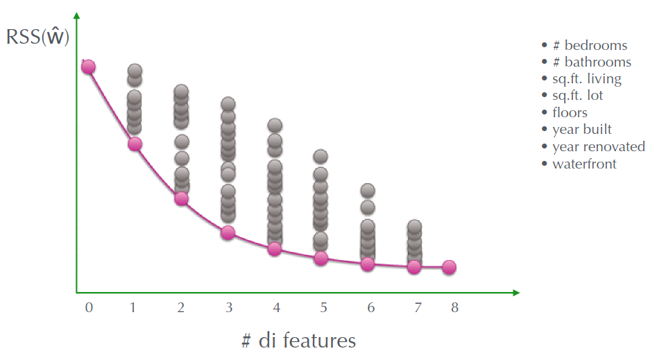

Se si prendono $0$ feature allora $RSS(\widehat{\bold w})$ avrà un certo valore, se invece si prendono in considerazione $1$ feature per volta e si avranno $8$ punti con vari valori di $RSS(\widehat{\bold w})$. Aumentando l’ascissa quindi $2$ feature, quindi tutte le possibili coppie scegliendo sempre il risultato migliore. Si continua avanti fino a 8 perché nell’esempio ci sono 8 feature.

La domanda da porsi adesso è quale configurazione di feature si sceglie, non conviene scegliere il modello con $RSS$ più basso, perché diminuisce all’aumentare della complessità del modello. Le varie possibilità sono la valutazione delle prestazioni sul validation set se ci sono dati sufficienti in caso contrario cross validation oppure utilizzare metriche che penalizzano la `model-complexity`.

$$
y_i =\left(\sum_{i=0}^{D}w_i\phi_i(x_i)\cdot a_i\right)+\epsilon_i
$$

La `complessità computazionale` dell’algoritmo è esponenziale rispetto al numero delle feature, $a_i$ indica se la feature $i$ si trova nella `distance vector` oppure no

$$
\left[1,0,0,0,...,0,0,0\right]
$$

La distance vector lunga $D+1$ dice quali feature sono utilizzate per la $y_i$

## Algoritmi Greedy

Un approccio alternativo è quello di utilizzare algoritmi `greedy` che permettono di ottenere soluzioni quasi ottime con complessità computazionale molto bassa.

## Forward Stepsize Algorithm

Questo algoritmo si distingue dall’algoritmo precedente perché all’aumentare della feature, sceglie solo una nuova feature, conservando quelle scelte nei passi precedenti

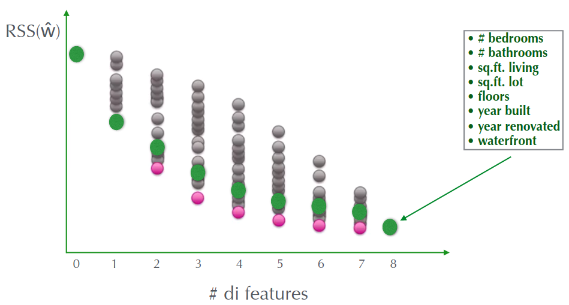

Per n=1 sceglie la migliore, per n=2 aggiunge alla prima già scelta la seconda migliore, per n=3 si aggiunge alla coppia la feature che permette di avere RSS migliore, e cosi via.

In generale è chiaro che il pallino della `FS` è peggiore della `AS`.

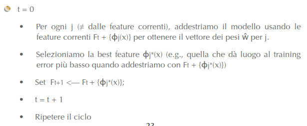

Si considera il dizionario delle feature $\left\{ \Phi_0,\Phi_1,...,\Phi_D\right\}$, si impostano l’insieme delle feature $F$ come $F_0=\oslash$, poi si addestra e si calcola l’errore

La `complessità computazionale` di questo algoritmo è sensibilmente minore della `all-stepsize`, infatti il numero di modelli valutati (con $D$ feature) è il seguente:

- per il primo step si hanno $D$ modelli
- per il secondo step si hanno $D-1$ modelli, perché nel primo step è stato preso una feature

E cosi via fino a che sono stati utilizzati tutte le feature. Il numero massimo di step è uguale quindi a $D$ da cui $O(D^2)$

## LASSO - Least Absolute Shrinkage and Selection Operator

Questo metodo consente di effettuare una feature selection e allo stesso momento di limitare i valori assoluti dei coefficienti $w$. La `lasso-regression` usa la somma dei valori assoluti dei pesi (l1-regularization).

$$
RSS(\bold w)+\lambda\cdot ||\bold w||_1
$$

Questa è la funzione che rappresenta il costo totale nel `lasso`, dove $\lambda$ serve per bilanciare i 2 termini.

- $\lambda=0$: ci si riconduce alla vecchia soluzione, ossia minimizzazione della $RSS(\bold w)$
- $\lambda\to \infty$ : per soluzioni dove $\widehat{\bold w}\neq0$ il costo totale tende a infinito
- $0<\lambda<\infty$ : si ha $0\le||\widehat{\bold w}_{lasso}||_1\le ||\widehat{\bold w}_{LS}||_1$

---

## Confronto tra Ridge e Lasso - 1

Sarebbe utile vedere le differente tra la regressione ridge e la regressione lasso

$$
RSS(\bold w)+\lambda\cdot||\bold w||_2^2
$$

Il costo della ridge è definito in questo modo

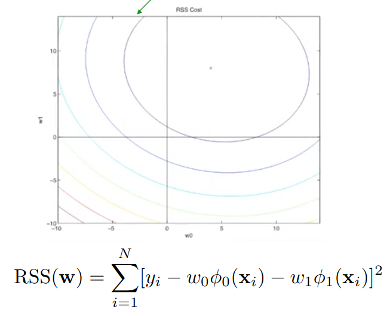

Supponendo che al momento ci sono solo 2 feature, se si andasse a graficare il costo solamente della somma delle differenze al quadrato, si otterrebbero delle ellissi

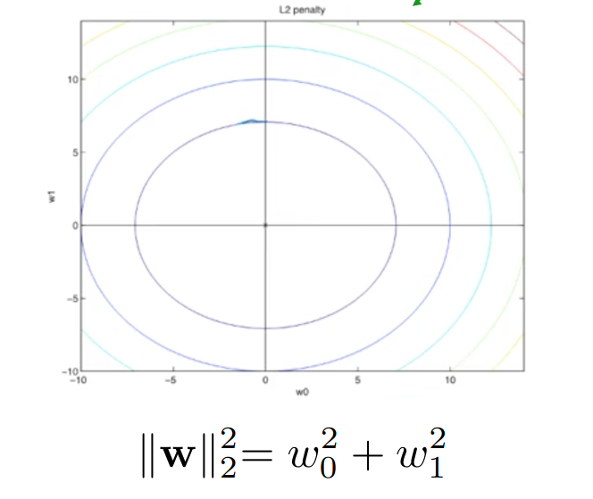

Se invece si graficasse il termine che penalizza la $RSS(\bold w)$ cioè la somma dei quadrati, si otterrebbero delle circonferenze

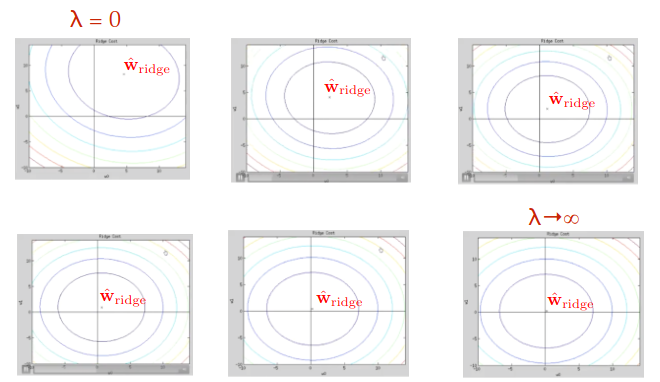

Facendo le simulazioni si ottiene che aumentando $\lambda$ fino a $\infty$, il termine che penalizza la $RSS(\bold w)$ fa vedere che il minimo della funzione si trova in $0$, quindi $\widehat{\bold w}_{ridge}=0$

$$
RSS(\bold w)+\lambda\cdot ||\bold w||_1
$$

Il costo della lasso è definita in questo modo

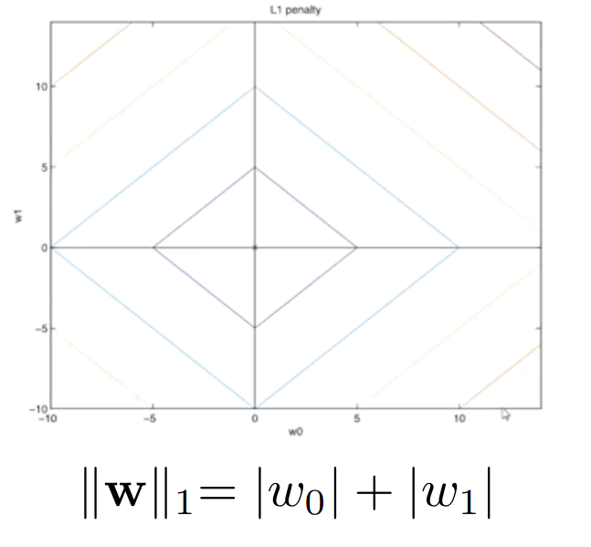

Graficamente bisogna solo andare a vedere il secondo termine perché il primo è uguale al caso della ridge

In questo caso il termine che penalizza è la somma dei valori assoluti, graficamente sono dei diamanti

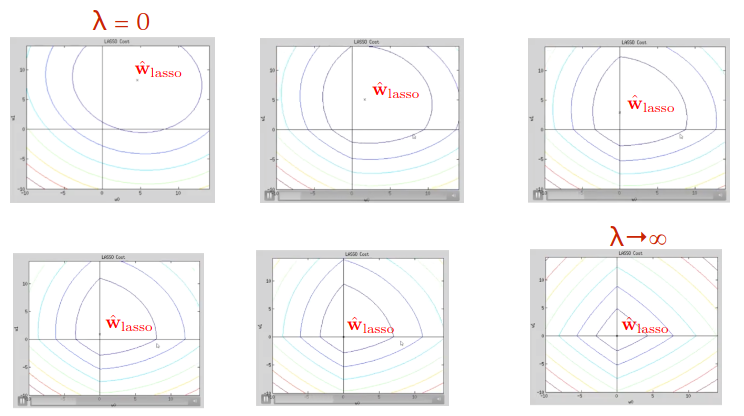

Facendo tendere $\lambda$ a $\infty$, le curve di livello iniziano a diventare dei diamanti e le componenti di $\widehat{\bold w}$ iniziano a diminuire. Rispetto al caso della ridge, il punto minimo prima di arrivare a $\infty$, va in uno dei 2 assi cartesiani questo significa che uno dei pesi si è annullato, mostrando la feature selection del metodo lasso

## Confronto tra Ridge e Lasso - 2

$$
\underset{\bold w}{argmin}\left[RSS(\bold w)+\lambda||\bold w||_2^2\right]\\\space
\underset{\bold w}{argmin}\left[RSS(\bold w)\right], \sum_{j=0}^{D}w_j^2\le s
$$

Si può dimostrare che per ogni valore di $\lambda$, per la ridge esiste un certo valore di $s$ tale che le seguenti 2 equazioni forniscono le stesse stime dei coefficienti $\bold w_{ridge}$

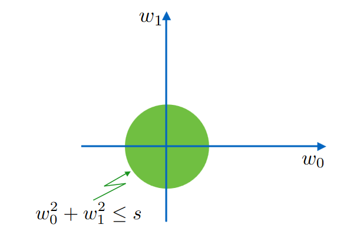

In base all’enunciato precedente per trovare il vettore $\widehat{\bold w}$ si minimizza solamente la funzione $RSS$ muovendosi all’interno dell’area verde

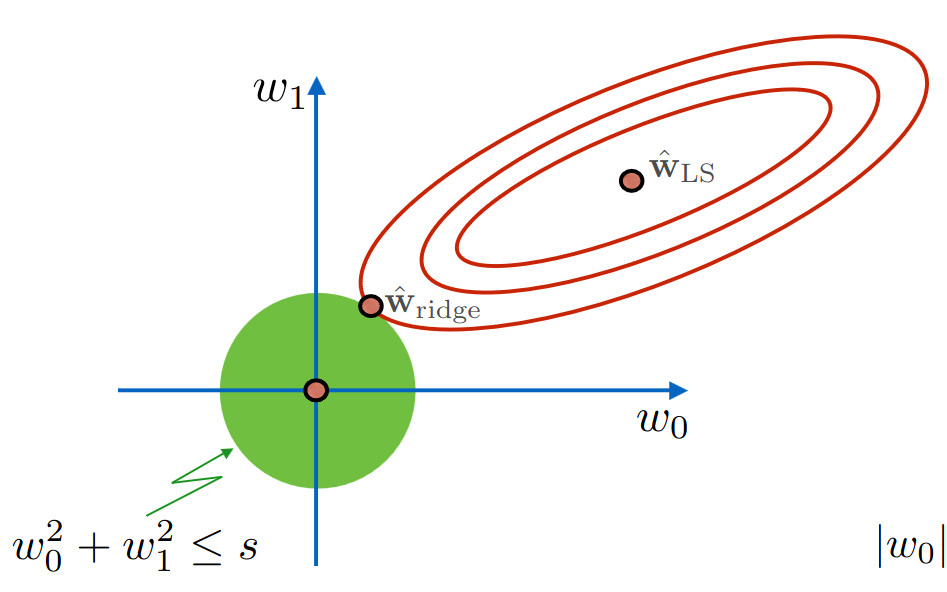

Se si disegnano le curve di livello di $RSS$, il punto $\widehat{\bold w}_{ridge}$ corrisponde al punto minimo di $RSS$. Il punto di minimo della $RSS$ se ci si muovesse all’interno dell’area verde sicuramente non si troverà al minimo proprio perche: $0\le||\widehat{\bold w}||\le||\widehat{\bold w}_{LS}||$

Le stesse considerazioni si possono fare nel caso della `lasso-regression`. Si può dire che se $s$ è sufficientemente grande, le regioni in verde conterranno la soluzione `least-squares`, pertanto le stime della `ridge-regression` e della `lasso-regression` saranno le stesse della least-squares.

## Minimizzazione della funzione di costo Lasso

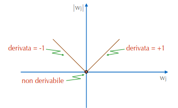

Per la `lasso-regression` ci sono delle difficoltà per il calcolo del gradiente, questo perché nel calcolo della derivata di $|w_j|$ ci sta un punto non derivabile.

Quello che si fa è utilizzare il concetto di `subgradient` per superare la difficoltà appena vista.

## Algoritmo Coordinate Descent

Visto che la funzione `lasso` è convessa ma non differenziabile viene utilizzato l’algoritmo `coordinate-descent`, permettendo di trovare una soluzione chiusa per la regressione lasso in ogni singolo passo, poichè si riduce a un problema di ottimizzazione univariato. Questo è particolarmente utile quando si tratta della penalità lasso, che introduce discontinuità nella funzione di costo.

$$
g(\bold w)=g(w_0,w_1,...,w_D)
$$

Lo scopo è quello di minimizzare una certa funzione mostrata qui accanto.

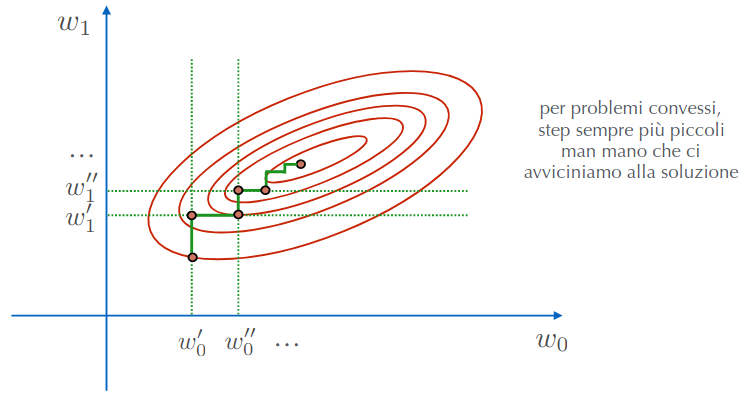

La caratteristica di questo algoritmo è che la minimizzazione avviene lungo una singola dimensione per volta, quello che si fa è scegliere un punto iniziale e trovare il minimo con l’altra coordinata una volta trovata lo si fissa per poi cambiare variabile di “minimizzazione”. Si continua fino ad arrivare al minimo globale

Da notare che con questo approccio non serve definire la `step-size`, perché ci si “muove” per tutti i punti della retta verticale-orizzontale (dipende quale variabile si sta utilizzando al momento) per poi trovare il valore minimo.

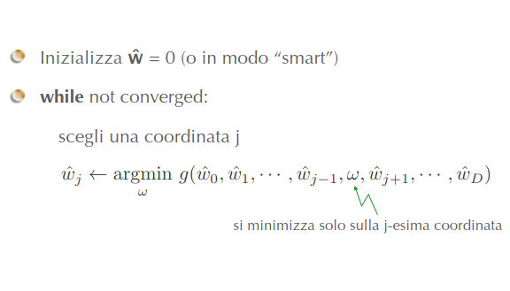

Descrizione dell’algoritmo in modo formale, in questo caso però si hanno più coordinate perché nel caso precedente si avevano 2 variabili. Quello che si fa è usare o random, stochastic oppure round-robin, ecc.

(Per capire quale componente $\widehat{w}_j$ minimizza la funzione $g$ in un dato momento guardare la lezione successiva)

## Normalizzazione delle Feature

L’applicazione dell’algoritmo `coordinate-descent` per il `Lasso` è semplificata se si opera una normalizzazione delle feature. 

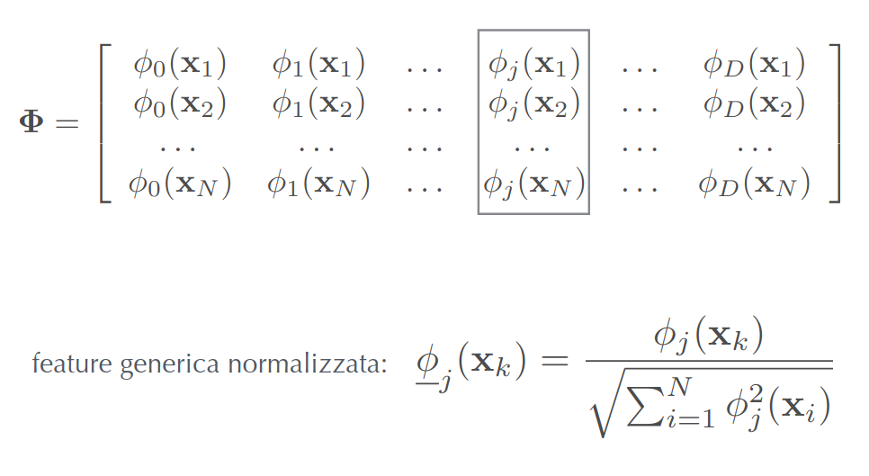

Quello che si fa è che data una certa feature $j$ si può ottenere il valore normalizzato dividendo il valore attuale con la radice quadrata della somma dei quadrati della feature $j$

## Coordinate descent per unregularized regression

$$
RSS(\bold w)=\sum_{i=1}^{N}\left[y_i-\sum_{j=0}^{D}w_j\underline{\phi}_j(\bold x_i)\right]^2
$$

Si riscrive la funzione $RSS$ con le feature normalizzate

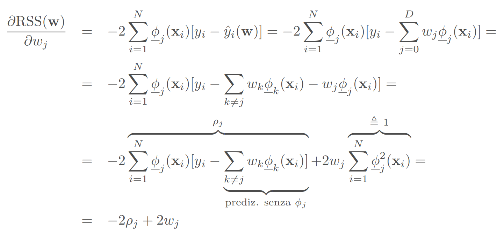

Ci si calcola poi la derivata di $RSS$ rispetto a una variabile $w_j$, da cui si ottiene che per la ricerca del minimo per una coordinata si ha che $\widehat{w}_j=\rho_j$ (perché la derivata viene uguagliata a 0)

Ottenendo che $\rho_j$ ha questa forma:

$$
\rho_j=\sum_{i=1}^{N}\left(\underline{\phi}_j(\bold x_i)\left[y_i-\sum_{k\neq j}w_k\underline{\phi_k}(\bold x_i)\right]\right)=\sum_{i=1}^{N}\underline{\phi}_j(\bold x_i)\left[y_i-\widehat{y}_i(\widehat{\bold w}_{-j})\right]
$$

## Algoritmo Coordinate descent per least squares

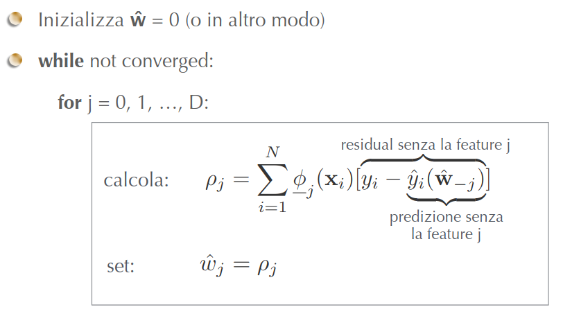

Qui è mostrato l’algoritmo di coordinate descent per `least-squares`.

## Algoritmo Coordinate descent per Lasso

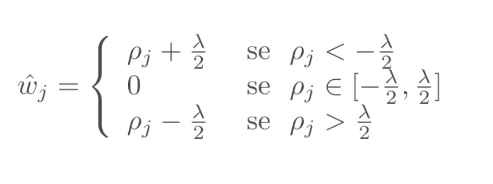

In questo caso l’impostazione per il peso $\widehat{w}_j$ dipende dal valore assunto dal parametro $\lambda$:

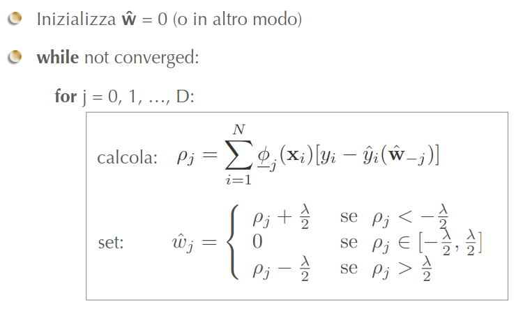

Versione con feature normalizzate

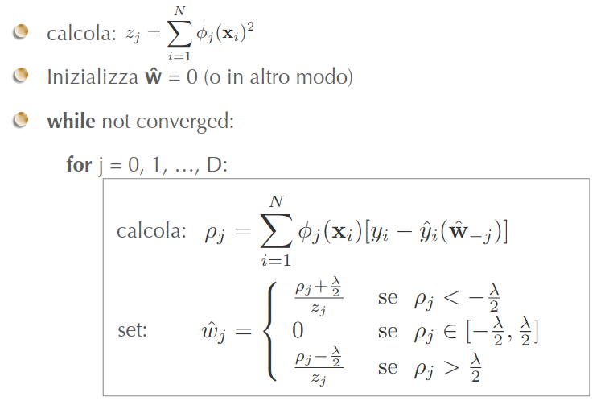

Versione con feature non normalizzate

Il parametro $\lambda$ può essere scelto avvalendosi dell’approccio che usa il validation set, a patto di avere un numero sufficiente di osservazioni, altrimenti si usa la `k-fold` cross validation. 

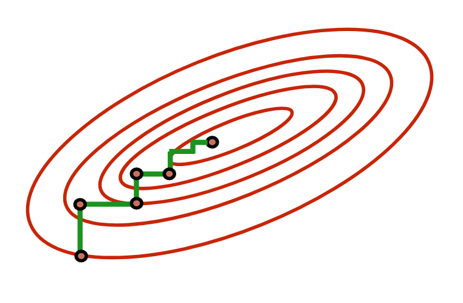

Per problemi convessi, gli step sono sempre più piccoli mano a mano che ci si avvicina al punto di ottimo

Un criterio che si può utilizzare per la convergenza è quello di considerare una misura degli step fatti in un ciclo completo su tutte le feature e fermarsi quando `max-step` è minore di $\epsilon$

## Scelta del parametro $\lambda$

Il parametro $\lambda$ può essere scelto con l’approccio del validation set se si hanno dati sufficienti, altrimenti si usa la `k-fold cross` validation. Una considerazione da fare per l’ultimo metodo è che tende a scegliere il parametro che ottiene la migliore precisione di predizione, favorendo soluzioni con piccoli valori di $\lambda$ anziché soluzioni con maggiore feature selection.