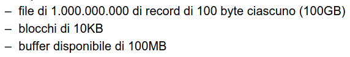
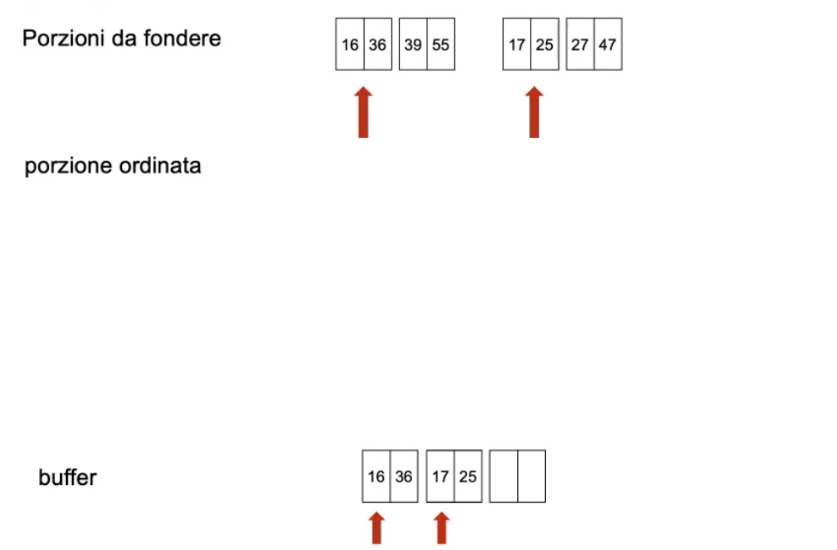
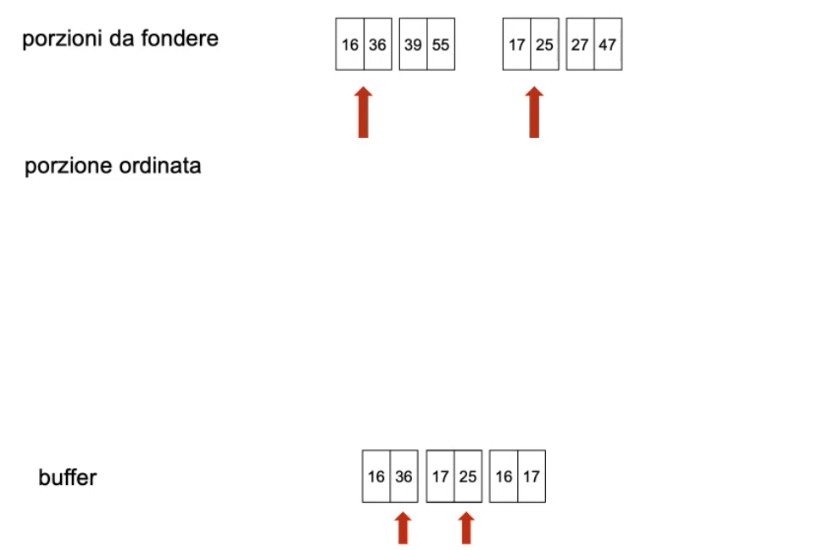
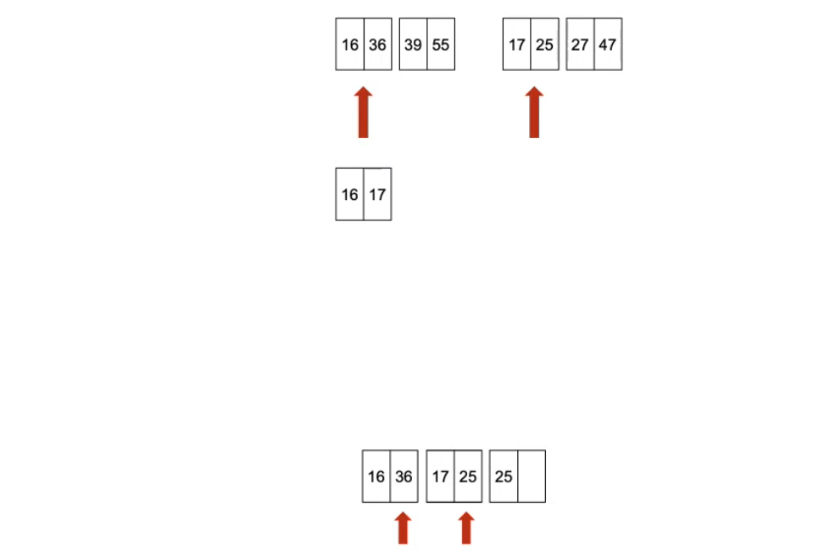
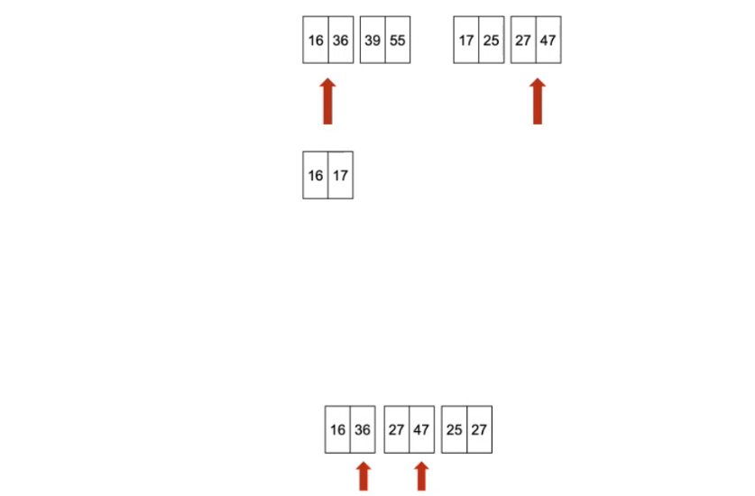
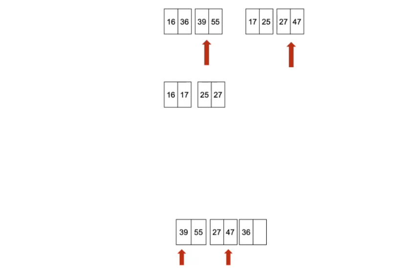
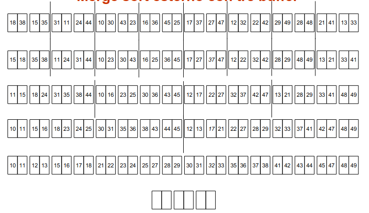
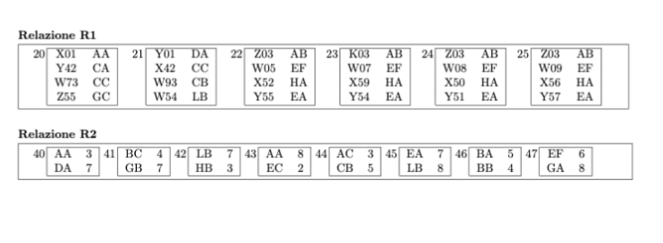
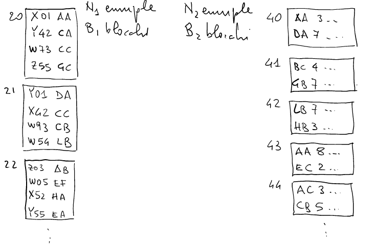

# 18 Marzo

Argomenti: Accesso diretto, Merge sort esterno, Ordinamento, Scansione
.: No

## Esecuzione delle operazioni

I `DMBS` offrono operatori che implementano ciascuno uno o più operatori dell’algebra gli operatori fondamentali sono 4 e sono: `scansione`,`accesso-diretto`,`ordinamento` e `join`.

## Scansione

L’operazione di `scansione` serve sostanzialmente a realizzare l’accesso sequenziale ad un file,relazione e tabella avendo sempre una posizione corrente ed eseguendo le operazioni a partire da questa posizione corrente.

Intuitivamente le funzioni dell’API possono essere: `open`,`next`,`read`,`modify`,`insert`,`delete` e `close`. Il costo è lineare rispetto al numero di blocchi del file.

## Accesso diretto

Può essere eseguito solo se le strutture fisiche lo permettono, ci sono 2 modi per farlo: con gli `indici` e le `strutture hash`.

L’accesso diretto basato su indice è efficiente per ricerche sul campo su cui l’indice è realizzato cioè sulla chiave dell’indice, soprattutto nelle ricerche `puntuali` (ricerca su tutto il campo → ricerca di numero matricola), ricerche `su intervallo` (ricerca non su tutto il campo) purchè l’indice sia `selettivo`.

L’accesso diretto basato su hash è efficiente per interrogazioni che non si basano su intervallo ma solo puntuali.

## Ordinamento

L’`ordinamento` è importante per produrre risultati ordinati, eliminare duplicati, preparare aggregazioni e preparare i join. Questa operazione utilizza significativamente i buffer.

si suppone che si voglia fare un ordinamento di un file grande

L’ordinamento tradizionale di file usa un `merge-sort` esterno in memoria secondaria e “poca” memoria principale

## Esempio con merge-sort (classico) [3 buffer]

Si hanno 2 porzioni da fondere; si prendono i primi blocchi di entrambi le porzioni e lo si mettono nel buffer.

Visto che sono ordinati il valore minimo di questi blocchi è l’elemento affiorante quindi 16 e poi avanzando si ottiene che il valore minimo è 17

(Gli elementi affiorianti si vedono nella “freccia rossa” nel buffer)

A questo punto il buffer è pieno quindi si sovrascrive il primo blocco.

Continuando la visita si ottiene che 25 è il valore minimo e lo si scrive nel terzo buffer. Adesso succede che il secondo buffer è stato completamente utilizzato

Quindi si può prendere il blocco successivo e caricarlo in memoria

L’elemento affiorante tra 27 e 36 è 27 quindi lo si scrive nel buffer

Si aggiunge il terzo buffer nella lista delle posizioni ordinate e poi si sceglie l’elemento affiorante fra 36 e 47 che è 36

il primo buffer è stato completamente utilizzato quindi si libera e viene caricata l’altro blocco

Da qui il ragionamento è semplice

## Esempio con merge-sort (esterno) [3 buffer]

Il `merge-sort` esterno viene di solito presentato “top-down”, utilizzando il ragionamento con il merge sort (classico) si ragiona come se il file fosse composto di tante porzioni.

Quindi si ordinano porzioni via via più lunghe fino ad arrivare all’intero file

## Esempio con merge-sort (esterno) [5 buffer]

Esempio con merge a 4 vie quindi si fondono 4 liste. In pratica si caricano i primi blocchi delle 4 liste nei 4 buffer, usando il quinto buffer per l’ordinamento/merge

## Merge-sort in sintesi

In moltissimi casi basta fare 2 passate, quindi un ordinamento e un passo di merge successivo con un costo pari a 3 volte il numero di blocchi del file avendo a disposizione un numero di pagine di buffer pari almeno alla radice quadrata del numero di blocchi del file.

## Join

L’operazione di `join` è quella più costosa, ci sono vari metodi i più noti sono `nested-loop`,`merge-join` e `hash-join`.

## Nested loop

Si suppone di avere 2 relazioni $R1$ e $R2$, e si suppone di dover fare il join sui campi che hanno gli stessi valori.

Per eseguire il join senza usare gli indici, si leggono tutti i record della prima tabella e per ciascun record della tabella si dovrebbe fare una scansione per la seconda tabella.

$$
B_1+B_1\cdot B_2
$$

Il costo della scansione è la somma di $B_1$ (costo associato alla lettura del primo file) e $B_1\cdot B_2$ cioè il secondo file dovrà essere letto $B_1$ volte

Si può però ridurre il numero di lettura del secondo file cercando di caricare più porzioni possibili del primo file in memoria, cosi da poter fare solamente le scansioni del secondo file, cosi da ridurre il numero di scansioni del secondo file.