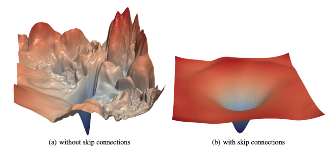
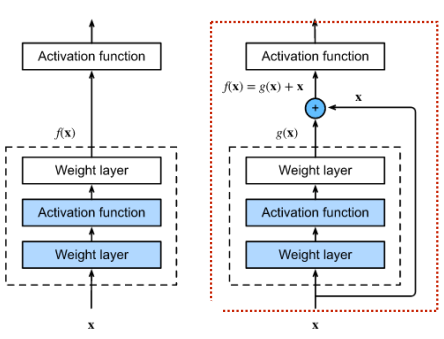
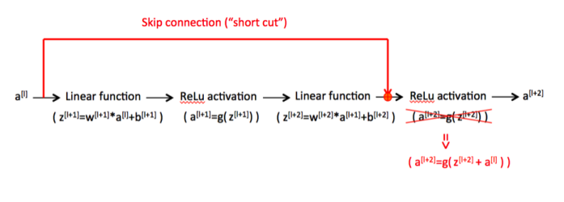
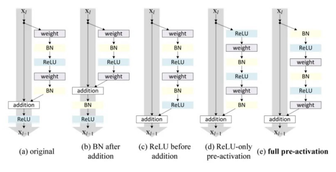
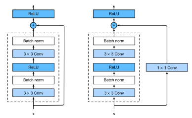
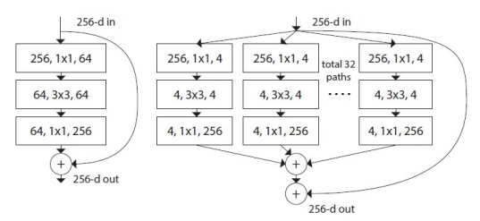
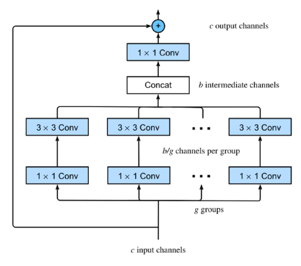
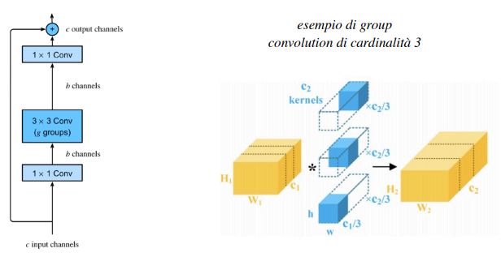

# 18 Ottobre

Tags: Architettura ResNet, ResNeXt, Residual Learning, Residual Network, Skip connections
.: Yes

## Residual Network (ResNet) - 2015

Questo è un tipo di architettura che incrementa la profondità mediante l’uso di `skip-connections` che propagano l’output generato da un certo layer verso un layer non adiacente, posizionato più a valle, generando un `bypass-pathway`, anche i gradienti saranno sottoposti al `bypass-pathway` durante il training.

L’obiettivo è preservare le informazioni e i gradienti che altrimenti andrebbero persi o diluiti attraversando più layers. Inoltre, alcuni layer possono ricevere caratteristiche provenienti da diversi livelli di astrazione e risoluzione, migliorando il potenziale di rappresentazione della rete, generalizzazione e accuratezza.

## Skip connections e learning

L’aumento dell’errore di generalizzazione e riduzione della capacità di generalizzazione modifica la superficie generata dalla loss in modo caotico. Le `skip-connections` hanno il risultato di ridurre l’andamento caotico.

L’uso di queste skip connections permette anche di far viaggiare l’informazione molto avanti nella rete inalterata, soprattutto le reti finali che hanno il maggior rischio di addormentarsi adesso si possono nuovamente riattivare perché hanno di nuovo l’informazione fresca.

## Residual learning e residual block

In questa immagine viene mostrato come la rete a destra propaga $x$, se si aggiunge questo valore tramite la `skip-connection` allora la rete invece di approssimare la funzione $f(x)$ approssima la funzione $f(x)=g(x)+x$. 

Quello che si sta facendo è introdurre un `identity-mapping` che corrisponde ad un operatore lineare quindi non si sta rendendo la rete più complessa

Di seguito sono elencati gli altri vantaggi dell’uso delle residual block:

- permettono di costruire reti profonde
- durante l’addestramento si addestrano i layer nei residual block, oppure si saltano determinati layer permettendo alle diverse parti della rete di essere addestrate a velocità diverse in base al modo in cui l’errore si genera all’indietro nella rete. Quindi è come se si stesse addestrando un insieme di modelli diversi sul training set e aumentare l’accuratezza del modello (questo perché si hanno più percorsi).
- in generale non si conosce il numero ottimale di layer necessari per una rete neurale, aggiungendo le skip-connection è possibile permettere alla rete di saltare l’addestramento per i layer che sono inutili e che soprattutto non aggiungono valore all’accuratezza complessiva. Queste connessioni rendono le reti dinamiche nell’impiegare il numero di layer ottimali.

Dal punto di vista operativo è sufficiente fare `composite-operation`. 

Cioè combinare l’output di un layer con l’output di un layer posizionato più a monte prima di valutare la funzione di attivazione.

Si possono avere molte configurazioni di `residual-block`. 

## Architettura ResNet

Questa architettura utilizza una `conv-layer` 3x3 in modo simile a VGG. 

In questa immagine vengono mostrati 2 tipi di architetture, ma tutte e 2 sono blocchi ResNet che usano 2 3x3-conv layer seguite dalla batch-normalization e funzione di attivazione ReLU.

La seconda versione con la 1x1 conv layer è necessaria per adattare il numero di canali dell’input con quelli ottenuti dopo il blocco.

## ResNet-34

Si indica con `operation` un blocco costituito da una convoluzione batch normalization e attivazione ReLU, con `basic-block` una sequenza di 2 operation e con `bottleneck-block` una sequenza di 3 operation.

Durante l’elaborazione si generano `feature-maps` con maggiore profondità e ridotta dimensionalità corrispondente alle dimensioni spaziali iniziali associate all’input. Perciò il numero di operazioni aumentano, sebbene la configurazione di layer rimane la medesima. Le 1x1 conv-layers e padding sono impiegate per ridimensionare i dati in output.

La riduzione della dimensionalità implica che alcune `skip-connections` ridimensionino il loro input in modo simile. Tali skip connections sono chiamate `projection-shortcut` rispetto a quelle senza ridimensionamento chiamate `identity-shortcut`.

## ResNeXt - 2016

In questa architettura si fa `stacking`, cioè si raggruppano una serie di trasformazioni in parallelo. Ogni trasformazione si specializzerà su caratteristiche distinte e creerà un flusso distinto di informazioni per il blocco successivo.

A differenza dei blocchi inception, dove ogni blocco tratta geometrie diverse di dati, i blocchi `ResNeXt` condividono la stessa configurazione.

Nelle precedenti architetture si incrementava la profondità ora si interviene anche sull’ampiezza.

Dall’immagine si nota che ci sono tanti percorsi per arrivare alla fine, ma questo porterebbero a un esaurimento della memoria durante la fase di addestramento. Per evitare di incrementare il numero di parametri si suddividono i canali in input in $g$ gruppi distinti corrispondenti alla cardinalità (iperparametro).

Ogni gruppo $g$ avrà dimensione $c_i/g$, se in output si ha dimensione $c_o/g$ si avrà che:

- la complessità iniziale $O(c_i\cdot c_o)$ si riduce a $O(g\cdot (c_i/g)\cdot (c_o/g))$ cioè $O((c_i\cdot c_o)/g)$
- il numero di parametri $c_i\cdot c_o$ si riduce a $g$ matrici di ordine $(c_i/g)\cdot (c_o/g)$

La 1x1 conv finale adatta il numero finale di canali in modo da farli coincidere con quelli in input

Non è stato utilizzato una convolution ma i dati sono stati separati e poi elaborati separatamente perché i singoli percorso non si influenzano tra di loro.

Quello che si sta facendo è chiamato `group-convolution`, dove l’input è suddiviso in $g$  input che vengono elaborati ognuno con un filtro distinto

La group convolution fu usata inizialmente da AlexNet per suddividere l’elaborazione su 2 GPU. Rispetto all’impiego di una convoluzione tradizionale e a parità di canali, si riducono notevolmente le operazioni.

## DenseNet - 2016

L’architettura `ResNet` ha molti parametri ed è prona a rappresentare alcune caratteristiche più volte all’interno della rete. L’architettura `DenseNet` considera più output generati dai layer precedenti (non sempre quelle prima ma anche molto prima), questi output poi saranno concatenati permettendo di mantenere distinte le informazioni associate alle caratteristiche associate ad un certo layer.

In modo simile a ResNet nei `Dense-Block` le dimensioni delle feature maps rimangono costanti, mentre il numero di canali cambia da un blocco al successivo.

- I `transition-layer`, cioè i layer per ridurre la risoluzione impiegano 1x1 convolution e 2x2 pooling layers.

## DenseNet - architettura

Poiché ogni layer riceve le `feature-maps` dagli strati precedenti, il numero di canali per layer è più elevato. Per ridurre la complessità e le dimensioni del modello, la sequenza Bn-ReLU-3x3 conv viene preceduta da un bottleneck layer

## Differenze fra le varie architetture

In questa immagine sono mostrate le differenze delle 3 architetture presentate.

DenseNet mostra prestazioni migliori in presenza di meno dati di training poiché sfrutta più informazioni contemporaneamente