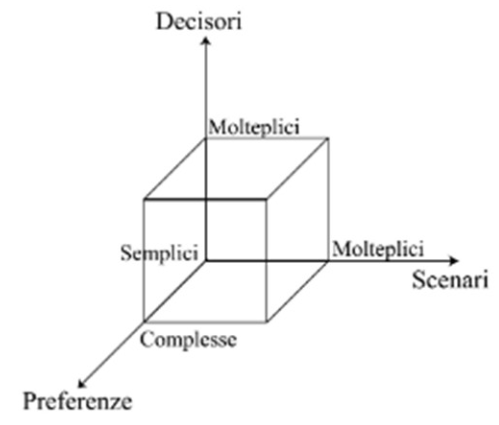
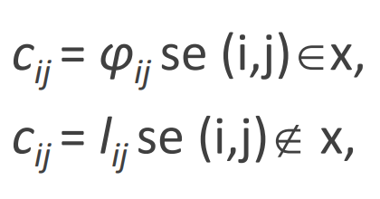

# 19 Dicembre

Argomenti: Ottimizzazione in presenza di scenari multipli
.: Yes

Un problema decisionale richiede di scegliere un’`alternativa` in modo da spingere il sistema in una configurazione il cui impatto sia preferito dai decisori rispetto a quelli delle altre configurazioni, tenendo conto del fatto che la configurazione non dipende solo dall’alternativa scelta, ma anche dagli scenari possibili.

## Una classificazione dei problemi decisionali

I problemi possono essere classificati in funzione di:

- `preferenze complesse`: cioè insufficienti a definire un concetto di ottimo
- `scenari molteplici`: cioè si ha un ambiente incerto
- `decisori molteplici`: cioè si hanno preferenze potenzialmente in conflitto tra loro.

## Definizione formale di un problema decisionale

Un problema decisionale è definito dalla sestupla $P=(X,\Omega,F,f,D,\prod)$ dove:

- $X$: è la `regione ammissibile`, cioè l’insieme delle possibili alternative o soluzioni ammissibili
- $\Omega$: è lo `spazio campionario`, cioè l’insieme dei possibili scenari o esiti
- $F$: è lo `spazio degli indicatori`, cioè l’insieme dei possibili impatti
- $f:X\times\Omega\rightarrow F$: è la `funzione impatto`:
    - ogni coppia $(x,\omega)\in X\times\Omega$ descrive una configurazione del sistema sul quale si intende prendere una decisione;
    - la funzione $f$ associa a ogni configurazione $(x,\omega)$ del sistema un impatto $f(x,\omega)\in F$
    - tale impatto descrive tutte le caratteristiche della configurazione $(x,\omega)$ rilevanti ai fini della decisione
- $D$: è l’`insieme dei decisori`, detti anche attori
- $\prod:D\rightarrow2^{F\times F}$: è una funzione che associa ad ogni decisore $d\in D$ un sottoinsieme di coppie di impatti $\prod(d)\sube F\times F$. Tale sottoinsieme si interpreta come una relazione binaria che rappresenta la preferenza del decisore $d$.

Lo scopo del problema $P$ è individuare una soluzione $x^*\in X$ o un sottoinsieme di soluzioni $X^*\sube X$ che i decisori considerano soddisfacenti sulla base delle loro preferenze fra gli impatti $f(x^*,\omega)$ per $\omega \in \Omega$ e gli altri impatti $f\in F$.

## Modellazione dell’incertezza

La programmazione in `condizioni di incertezza` affronta problemi di decisione nei quali occorre scegliere tra alternative il cui impatto dipende non solo dalle scelte del decisore, ma anche da fattori esterni che non possono essere previsti in modo esatto.

I problemi in condizione di incertezza si dividono in due categorie:

- decisioni in `condizioni di ignoranza`: dello scenario $\omega$ si sa solo che cade in $\Omega$
- decisioni in `condizioni di rischio`: si conosce la probabilità $\pi_{\omega}$ di ciascun scenario $\omega\in \Omega$ ovvero la densità di probabilità $\pi(\omega)$

## Logiche di scelta

La `condizione di ignoranza` è la situazione più critica per un decisore perciò ci serve ridefinire il problema usando dei criteri o logiche di scelta che possono essere:

- `criterio del caso peggiore`: consiste nell’essere pessimista e si assume che per ogni scelta $x$ fatta, il futuro riservi lo scenario che comporta il costo massimo
- `criterio del caso ottimo`: consiste nell’assumere che per ogni scelta $x$ il futuro risponda proponendo lo scenario migliore, quindi il suo costo minimo
- `criterio di Hurwicz`: utilizzato per combinare la previsione di più modelli o algoritmi per ottenere una previsione più precisa. Consiste nel pesare le previsioni di ogni modello al coefficiente di Hurwicz, determinato in base a una misura di fiducia sulla previsione
- `criterio di equiprobabilità`: considera tutti gli scenari e ne combina gli impatti applicando a tutti lo stesso peso
- `criterio del rammarico`: dopo aver calcolato una soluzione ottima, si calcola il rammarico tramite una funzione che offre la perdita subita scegliendo quella soluzione anziché l’alternativa
- `criterio delle eccedenze`: dopo aver calcolato l’alternativa pessima per ogni scenario si valuta l’eccedenza con una funzione che da come output il guadagno ottenuto scegliendo la soluzione anziché l’alternativa.

## Programmazione robusta

La `programmazione robusta` è una tecnica di ottimizzazione utilizzata per risolvere problemi in cui le variabili sono incerte/imprecise, per l’impossibilità di ottenere informazioni precise su tutti i dati di input necessari per risolvere il problema.

I suoi criteri più comuni sono:

- `robustezza assoluta`: che difende dalle situazioni peggiori, ha complessità polinomiale (sarebbe il criterio di caso pessimo)
    
    $$
    \phi_{RA}(x)=\underset{\omega \in \Omega}{max}f(x,\omega)
    $$
    
- `deviazione robusta`: che dice quanto migliorerebbero le prestazioni in valore assoluto se si potesse eliminare la incertezza, ha complessità NP-hard (sarebbe il criterio del rammarico)
    
    $$
    \phi_{DR}(x)=\underset{\omega \in \Omega}{max}\left[f(x,\omega)-\underset{x \in X}{min}f(x,\omega)\right]
    $$
    
- `robustezza relativa`: che dice quanto migliorerebbero le prestazioni in termini relativi se si potesse eliminare l’incertezza (valuta il rapporto tra rammarico e valore ottimo)
    
    $$
    \phi_{RR}(x)=\underset{\omega \in \Omega}{max}\left[\frac{f(x,\omega)-\underset{x \in X}{min}f(x,\omega)}{\underset{x\in X}{min}f(x,\omega)}\right]
    $$
    

In un problema di ottimizzazione, lo scenario è caratterizzato dal fatto che alcuni dati sono ignoti, spesso tali valori sono compresi in intervalli, oppure offrono alternative. A seconda di tali livelli di incertezza si possono presentare problemi più o meno difficili da risolvere. 

## Problema del cammino minimo robusto

L’incertezza sul costo di percorrenza di un arco $(i,j)$ viene descritta a intervalli $c_{ij}\in\left[I_{ij},\phi_{ij}\right]$. La deviazione robusta di un cammino $x$ in uno scenario $\omega$ è il rammarico, cioè la differenza tra il costo $f(x,\omega)$ e il costo $f(x(\omega),\omega)$ del cammino minimo nello scenario $\omega$. 

E’ stato dimostrato che la deviazione robusta è massima nello scenario in cui i costi degli archi sono definiti in questo modo

Anche se l’insieme dei possibili scenari è infinito e continuo, bisogna valutare solo quelli in cui gli archi assumono valori estremi di costo, che sono in numero finito ma esponenziale.

## Programmazione in condizioni di rischio

Rispetto alla programmazione in condizioni di ignoranza, il modello include oltre all’insieme $\Omega$ dei possibili scenari, una formalizzazione della loro probabilità. L’impatto $f(x,\omega)$ associato ad ogni soluzione è una variabile aleatoria che dipende dallo scenario $\omega$ e si suppone che:

- nel caso discreto, sia nota una funzione che assegna a ciascuno scenario un valore di probabilità $\pi_{\omega}$
- nel caso continuo, sia nota una funzione che assegna a ciascuno scenario un valore di densità di probabilità $\pi(\omega)$

Gli approcci principali consistono nel ridurre il problema dell’ottimizzazione di una funzione ausiliaria $u(x)$, facendo sparire la dipendenza dallo scenario $w$. Grazie alle ipotesi più forti, però è possibile costruire criteri di decisione che godono delle proprietà che ci si attende da un approccio razionale.

## Teoria delle decisioni

La teoria delle decisioni tiene conto del fatto che le decisioni in ambiente incerto possono essere distribuite nel tempo su più fasi, e che quindi alcune variabili di decisione possono essere fissate dopo che il valore di alcune variabili esogene si è rilevato. Questo modifica l’ipotesi fatta sinora che prima si dovessero fissare tutte le variabili di decisione e poi venisse rilevato il valore di tutte le variabili esogene.