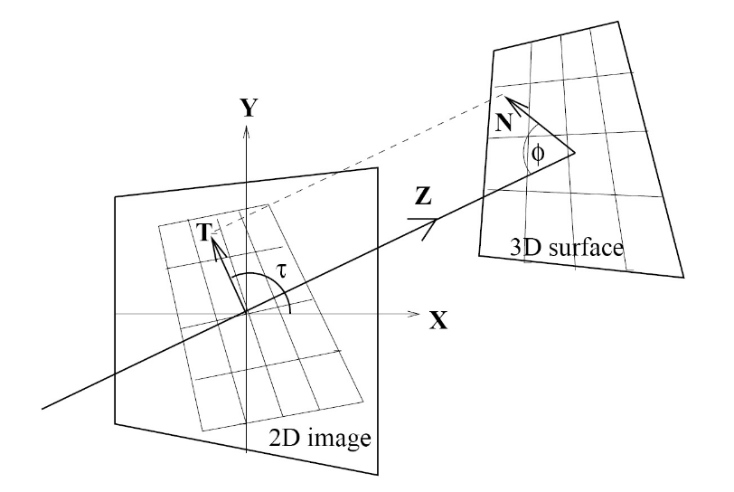
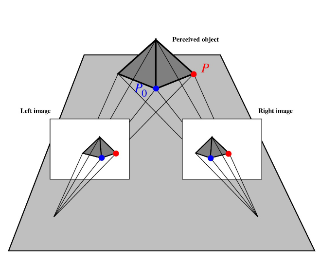
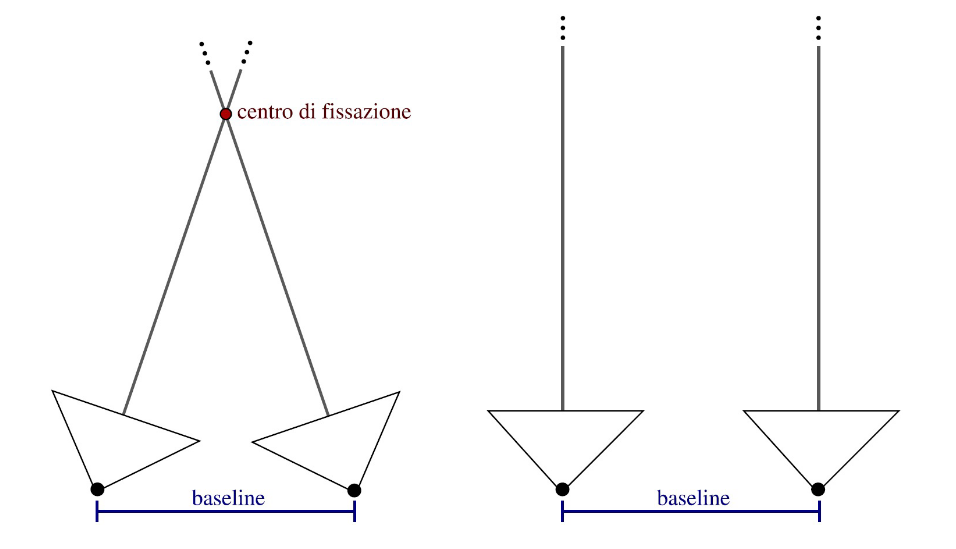

# 19 Gennaio

Argomenti: Depth Estimation, Equazione del flusso ottico, Estrazione di informazione 3D da un'immagine 2D, Matching, Segmentazione dell'immagine a regioni, Stereoscopia binoculare
.: Yes

## Segmentazione dell’immagine a regioni

L’obiettivo è che a partire dai bordi rilevati, di riconoscere delle regioni bidimensionali, quindi fare un `raggruppamento` in base alla somiglianza dei pixel di cui sono composti i bordi rilevati. L’idea di base è che a ogni pixel si possono associare determinate proprietà visive, come luminosità, colore e texture e basandosi su queste informazioni di suddividere l’immagine in insiemi di pixel in modo da soddisfare il più possibile questi vincoli.

Ad esempio si riconduce il problema a un `partizionamento di grafi` dove i nodi corrispondono ai pixel e gli archi ai collegamenti tra pixel (ossia i bordi): il peso $w_{i,j}$ su un arco che collega due pixel $i$ e $j$ dipende dalla somiglianza in termini di luminosità, colore, texture, etc. Il peso è proporzionale alla somiglianza. A grandi linee si deve minimizzare la somma dei pesi delle connessioni tra gruppi diversi e massimizzare quella delle connessioni interne a ogni gruppo.

La segmentazione che si basa solamente su `attributi locali` di basso livello ha un altissima probabilità di commettere molti errori, quindi occorre avere informazioni di alto livello cioè quelli che riguardano i tipi di oggetti che ci si possono aspettare di incontrare nella scena.

## Estrazione di informazione 3D da un’immagine 2D

Il riconoscimento di oggetti è un processo di conversione delle caratteristiche dell’immagine in un modello di oggetti noti e si articola in 3 fasi:

- `segmentazione`: in pratica data la scena si vuole avere come risultato l’insieme degli oggetti distinti presenti nella scena
- `determinazione della posa e orientazione`: per ogni oggetto si vuole sapere dove è posizionato e di quanto è orientato
- `determinazione della forma`: sapendo che esiste un certo tipo di oggetto e si conosce la sua posizione e orientazione si vuole sapere qual è la forma di questo.

La posizione e orientazione sono definiti in termini matematici:

- si conosce la `posizione` prospettica $(x,y)$ del punto $P(x,y,z)$ della scena 3D sul piano dell’immagine 2D ma non si conosce la distanza
- per `orientazione` si possono intendere 2 significati:
    - orientazione dell’oggetto nella sua interezza
    - orientazione della superficie dell’oggetto nel punto P

- $\varphi$: detto `slant` sarebbe l’angolo fra la normale alla superficie $N$ e l’asse $Z$ (variabile angolazione)
- $\tau$: detto `tilt` sarebbe l’angolo fra la proiezione di $N$ sul piano d’immagine e l’asse $X$ (variabile inclinazione)

Quando la camera si muove rispetto a un oggetto cambiano distanza e orientazione ma non la forma; è difficile definire matematicamente il concetto di forma partendo dall’`invarianza` rispetto ad alcune trasformazioni.

Lo stimolo visivo contiene diversi indizi che possono essere utilizzati per recuperare l’informazione 3D e sono `moto`,`stereoscopia binoculare`,`gradiente di texture`,`ombreggiatura` e `contorni`.

## Moto - Equazione del flusso ottico

Le differenze fra fotogrammi consecutivi possono essere un’importante fonte di informazione, se la telecamera si muove rispetto alla scena 3D, il moto apparente che ne risulta prende il nome di `flusso ottico`. In pratica bisogna individuare una corrispondenza con i pixel e vedere quanto quel pixel si sposta nell’immagine successiva.

- Per misurare la somiglianza si può minimizzare la somma delle differenze al quadrato

$$
SSD(D_x,D_y)=\sum_{(x,y)}(I(x,y,t)-I(x+D_x,y+D_y,t+D_t))^2
$$

Da cui si ottiene il flusso ottico in $(x_0,y_0)$ come $(v_x,v_y)=(\frac{D_x}{D_t},\frac{D_y}{D_t})$ dove $(D_x,D_y)$ è il punto che minimizza la $SSD$

- Per misurare la somiglianza si può massimizzare la `cross-correlazione` che funziona al meglio se nella scena sono presenti delle texture, in modo che le finestre contengano una significativa variazione di luminosità fra i pixel

$$
Correlazione(D_x,D_y)=\sum_{(x,y)}I(x,y,t)\cdot I(x+D_x,y+D_y,t+D_t)
$$

In pratica si vuole dire che è possibile scrivere una equazione, in cui sotto ipotesi di lunghezza focale $f=1$ , che lega la velocità traslazionale $T$ e angolare $\omega$ dell’osservatore, il flusso ottico e le posizioni degli oggetti nella scena

## Stereoscopia binoculare

La principale tecnica per la stima della `profondità` prevede l’analisi di due o più immagini della stessa scena riprese nello stesso istante da punti di vista differenti. La `stereovisione` è la capacità di estrarre informazioni su una scena 3D a partire da 2 o più immagini 2D della stessa.

L’idea della `streoscopia binoculare` è simile a quella della parallasse del movimento ma con 2 o più immagini. In 2 immagini separate nello spazio, la proiezione di uno stesso elemento della scena si trova in posizione differente rispetto all’asse $z$ di ogni piano dell’immagine, sovrapponendo le due immagini si ha una `disparità`.

Si devono però considerare 2 casi, se si utilizzano assi focali paralleli si ha un centro di fissazione infinito mentre se si utilizzano assi focali non paralleli il centro di fissazione è finito

La baseline è la distanza dei centri ottici delle 2 camere

Per risolvere un problema di `stereoscopia binoculare` bisogna affrontare 2 problemi:

- `matching`: cioè individuare la corrispondenza fra i punti dell’immagine prodotta da una camera e i punti dell’immagine prodotta dall’altra camera
- `depth estimation`: una volta risolta l’associazione fra punti, occorre ricostruire la posizione nello spazio di quello che si vede

Si vuole calcolare la profondità di $P$ a partire da quello che vedono le camere $C_l$ e $C_r$, in altri termini si cerca la relazione fra i punti proiettati $p_l$ e $p_r$ che sono noti con la distanza $Z$. I triangoli $p_lPp_r$ e $O_lPO_r$ sono simili perché il rapporto base e altezza è uguale quindi si ottiene che: ($x_l$ e $x_r$ sono rispettivamente negativo e positivo)

$$
\frac{T}{Z}=\frac{T+x_l-x_r}{Z-f}
$$

Chiamando `disparità` $d=x_r-x_l$,

$$
Z=\frac{Tf}{d}
$$

Sviluppando la relazione precedente si ottiene questa espressione mostrata di seguito che delle importanti conseguenze

- Il punto $P$ è proiettato in posizioni differenti sui due piani immagine: tale differenza è detta disparità
- La relazione fra $Z$ e $d$ è non lineare
- La profondità di un punto $P$ è inversamente proporzionale alla disparità
- Fissate la lunghezza focale $f$ e la linea di base $T$ la profondità di un punto dipende solo dalla disparità
- Errori nella stima della disparità, in particolare quando essa è molto piccola, si riflettono in grandi errori di stima della profondità

Il `matching` si può risolvere in 2 maniere diverse, si possono utilizzare i valori di luminosità dei pixel oppure utilizzare le mappe di disparità attraverso l’uso della correlazione