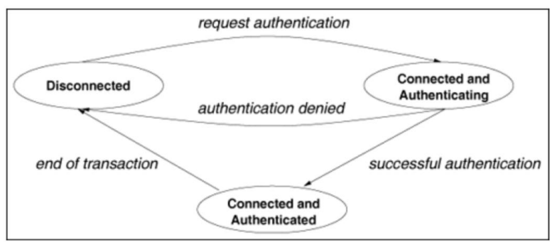
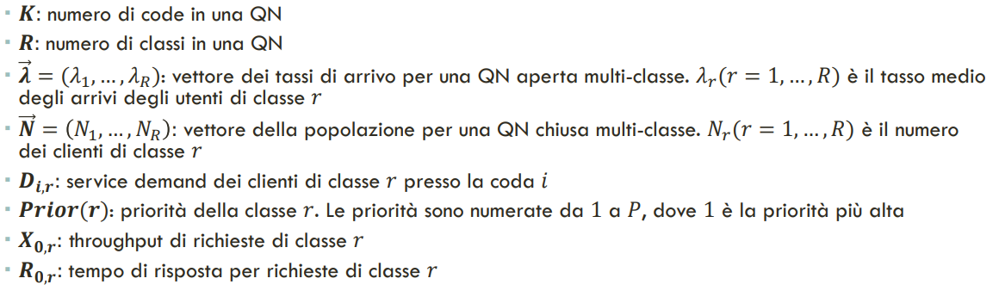
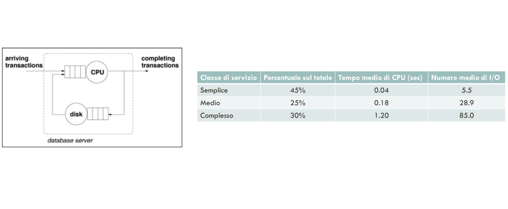
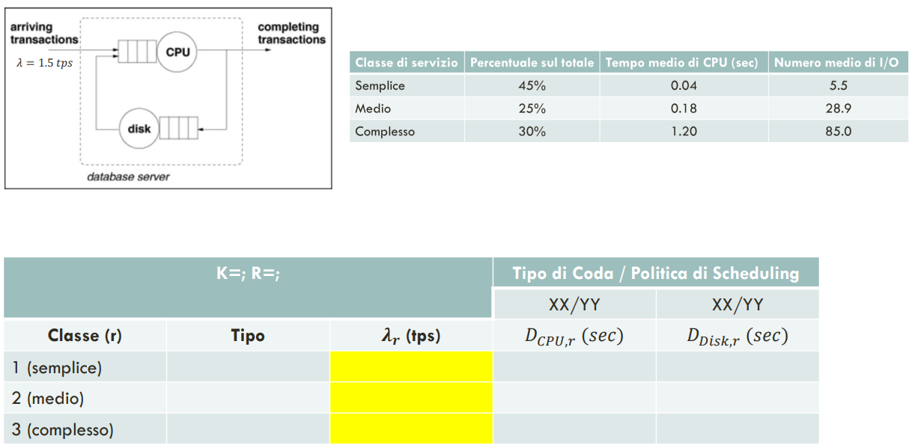
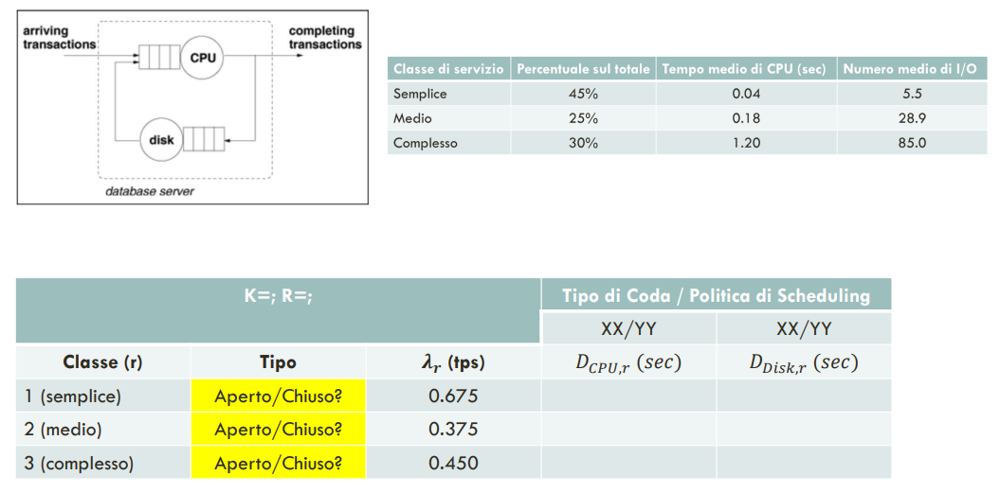
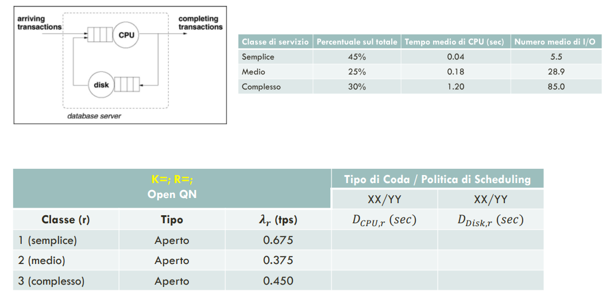
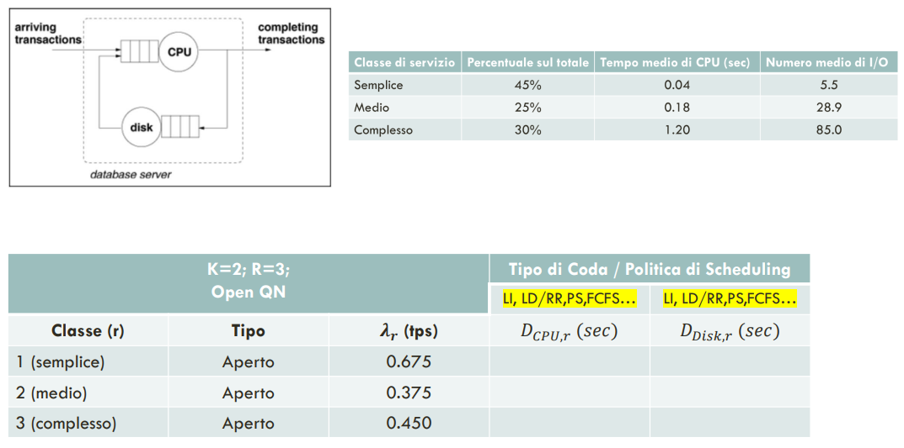
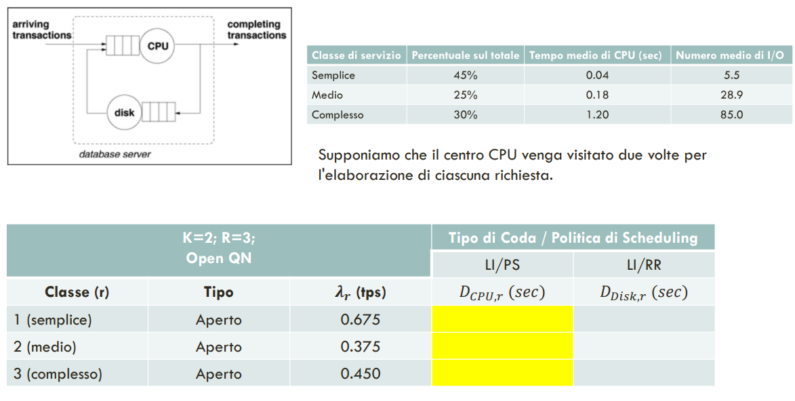
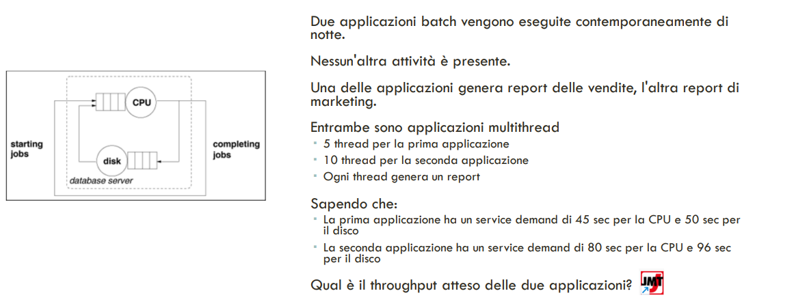

# 19 Maggio 2025

Text: Class Switching, Discipline di Accodamento, Modello QN

## Class switching

C’è la possiblità che determinati workload possano cambiare la loro tipologia nel tempo, cioè supponendo di aver già identificato le classi si potrebbe andare a modellare con un diagramma degli stati c’è una certa probabilità che la richiesta successiva appartenga a una classe diversa rispetto alla richiesta corrente

## Discipline di accodamento

Un altra parte fondamentale per andare a caratterizzare il modello di un sistema sono le discipline con cui si vanno a smaltire le code. In termini di gestione della coda si introduce un nuovo concetto che è il `quanto` di tempo ovvero quanto tempo si può dedicare per il processamento di un job che parte di una coda.

## Modello QN

Una `QN` è una collezione di $K$ code interconnesse dove:

- con coda si identifica la vera e propria fila d’attesa della risorsa che fornisce servizio alal richiesta
- le richieste si muovono da una coda all’altra finche non completano la loro esecuzione
- le richieste possono essere raggruppati in classi e in alcuni casi possono cambiare classe.

I parametri di input ad una cosa sono divisi in 2 categorie principali:

- `intensità di workload`: si hanno 2 tipologie di workload, riferite alle classi aperte e classi chiuse.
- `service-demands`: specificano il tempo medio totale di utlizzo di una data risorsa per l’elaborazione di una data richiesta. Solitamente non dipendono dal carico del sistema, nel caso load-indipendent il service demand è fisso mentre nel load-dependent il servide demand dipende dal troughput del sistema

Le classi di workload possono essere caratterizzate come:

- `transaction`: classe aperta, dove l’intesità è rappresentata da un tasso di arrivi
- `batch`: classe chiusa, dove l’intensità è rappresentata dal numero di clienti di quella classe all’interno della QN
- `interactive`: classe chiusa usata per modellare situazioni in cui le richieste sono inviate da un numero fissato $M$ di macchine client. L’intensità del workload è rappresentata dal numero di terminali $M$ e dal think-time medio $Z$

In questa immagine vengono mostrati le notazioni per esprimere le caratteristiche di una QN.

- $R$ va a caratterizzare il workload
- nel caso di classi aperte allora $\lambda$ viene fornito come input, nel caso di classi chiuse si ha in input $N$
- $D_{i,r}$: (esempio) service demand nel caso in cui la coda CPU per un workload di tipo semplice

---

Si suppone di avere questo modello di sistema composti da CPU e disco

Globalmente si ha $\lambda=1.5tps$, per ottenere le intensita di workload per ogni singola classe si moltiplica $\lambda$ per la percentuale sul totale

Il sistema è aperto

$K$ è il numero di centri appartenenti alla rete di code ed $R$ è il numero di classi che si sta andando a considerare. Quindi $K$ è 2 perchè CPU + disco e $R$ è 3 perche si hanno 3 classi di workload. 

Il tipo di coda è `load-indipendent`

Per calcolare il service demand della CPU è dato: sarebbe il tempo medio di CPU moltiplicato per 2 perche si suppone che il centro CPU venga visitato 2 volte per l’elaborazione di ciascuna richiesta

Supponendo che il tempo medio di esecuzione di I/O sia pari a 0.01 sec:

Il service demand è il tempo medio totale necessario per completare una determinata `richiesta` in un particolare centro. Cioè il tempo sommato di tutte le visite che vengono fatto a questo centro.

---

Questo è un sistema chiuso

Ci sono N=5 numero di job per la prima applicazione e N=10 per la seconda.