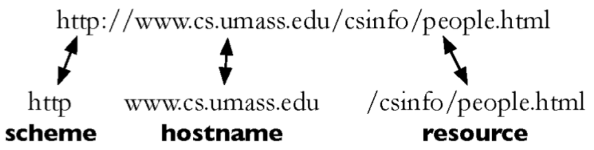
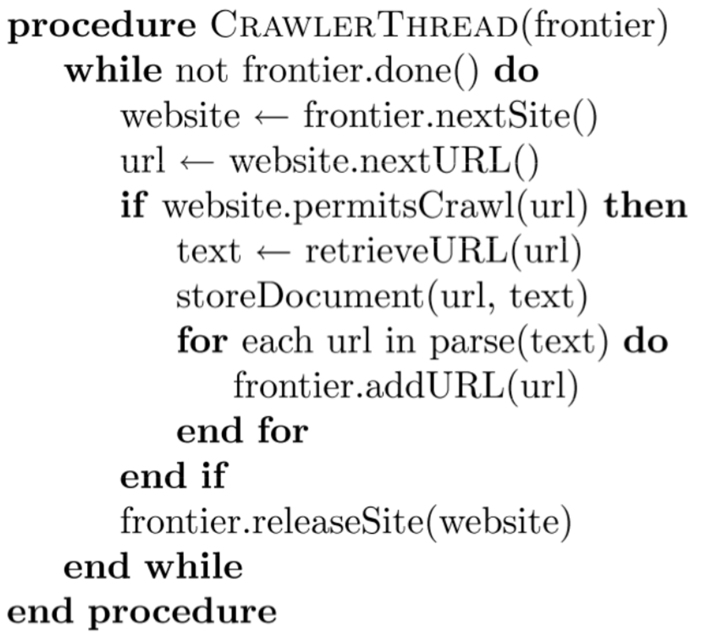
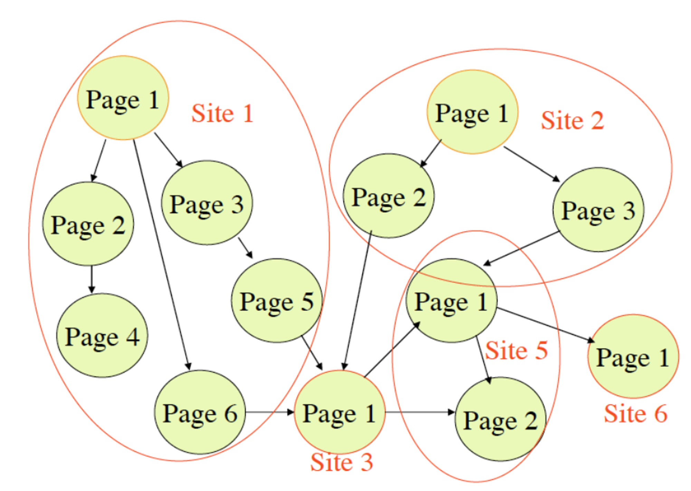
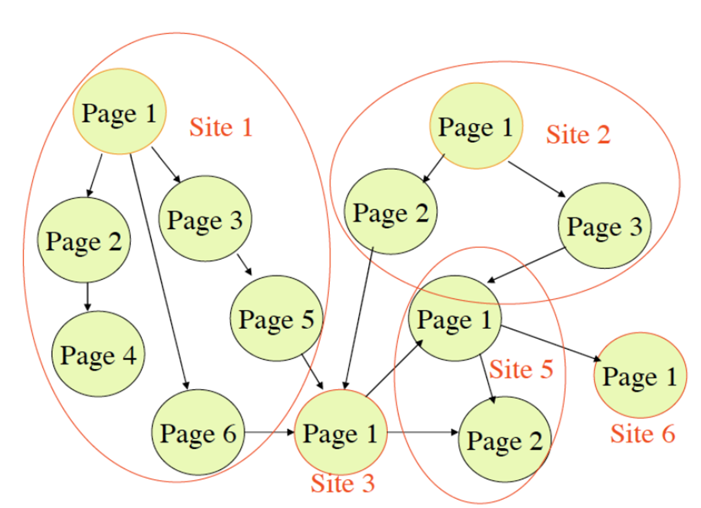
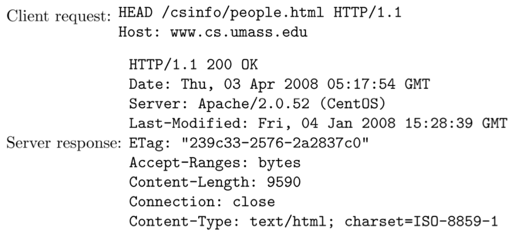
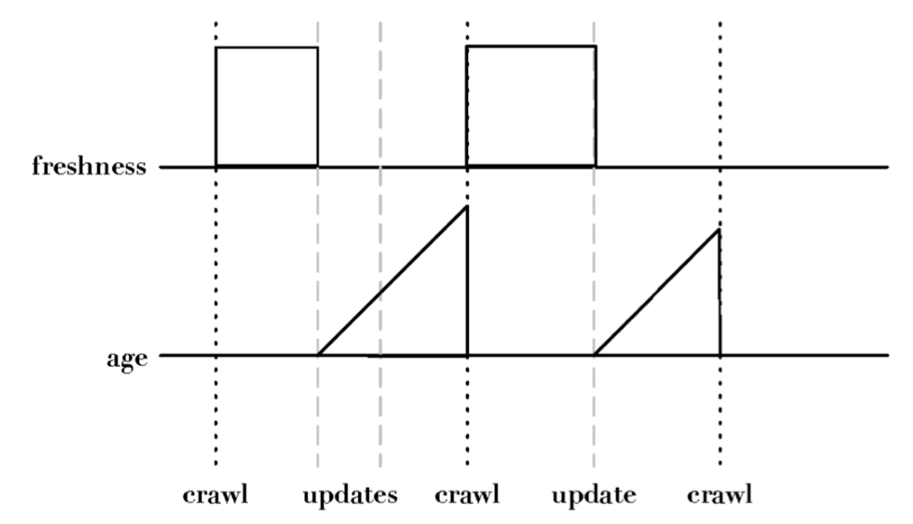
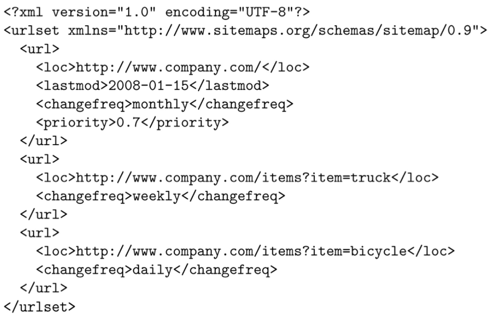

# 19 Marzo

Argomenti: Age, Breadth-first, Depth-first, Desktop crawling, Focused crawling, Freshness, Web Crawler
.: Yes
Description: Text acquisition 1

## Web Crawler

Ci si ricorda che il `crawler` è un componente software che trova e scarica pagine web automaticamente.

ogni pagina ha un suo `URL`, e 3 parti vengono usate per descrivere questo URL

Le pagine web sono memorizzate su dei web server che usano `HTTP` per scambiare informazioni con i software client. I `browser-web` e `crawler-web` sono diversi ma entrambi recuperano le pagine web nello stesso modo. 

I `crawler` si connettono a un server DNS per poter ottenere la pagina richiesta, una volta fatto mandano richieste `HTTP-GET`.

Il crawler parte da un `seed` per iniziare la ricerca e tramite anchor text esplora e naviga i link, quando trova un nuovo link deve capire se è `on-topic` o meno.

I `web-crawler` hanno 2 compiti da effettuare e sono: scaricare pagine e trovare i link URL. All’inizio viene dato un insieme di URL, questi saranno l’insieme chiamato `seed`, e come in algoritmi di visita di un grafo quesi “nodi” iniziali vengono aggiunti alla lista di URL da visitare. I “vicini” vengono ottenuti dai link che sono presenti dalle pagine scaricate e analizzate tramite `parsing` per poi essere aggiunti nella lista di nodi da visitare.

Ci sono 2 modi in cui questo processo termina:

- il primo è quando la lista di URL da visitare è vuota perché andando avanti è possibile che alcuni link non vengano aggiunti alla lista perchè non sono inerenti al topic
- la seconda è quando non si ha più spazio su disco per memorizzare le pagine

Per ridurre i tempi d’attesa nell’ottenere le pagine richieste, si usano più thread per analizare migliaia di pagine alla volta. Il problema è che si potrebbero crare problemi di `flooding` ai siti analizzati, quindi si usano politiche di `politeness`.

Esiste un modo per controllare l’attività dei `crawler`, cioè si crea un file `robots.txt` per definire quali domini non possono essere sottoposti a scansioni

## Processo di crawling

L’ordine con cui gli `URL` sono attraversati è importante, di seguito sono mostrare 2 tecniche per decidere l’ordine di attaversamento:

- `breath-first`: si analizzano prima tutte le pagine che hanno un link nella pagaina corrente. Questa modalità è dataa per siti web che trattano argomenti in relazione tra loro. La copertura è ampia ma superficiale.

La si può pensare come una visita in ampiezza

- `depth-first`: si visita il primo link nella pagina corrente fino all’ultima pagina senza link.

La si può pensare come una visita in profondità

---

## Freshness

Le pagine web sono costantemente aggiunte, modificate e cancellate. I `web-crawler` quindi devono costantenmente rivisitare le pagine che sono state analizzate per capire se c’è stato qualche cambiamento al fine di mantenere la `freshness` della collezione di documenti.

Per rendere facile il controllo dei cambiamenti, si usa una richiesta `HEAD` dal protocollo `HTTP`, che mostra l’ultima modifica della pagina e non la pagina stessa.

L’informazione di interesse si trova nel campo `last-modified`

Non è comunque possibile controllare costantemente tutte le pagine, quindi si controllano solo quelle ritenute importanti e quelle che cambiano frequentemente.

## Age

La `freshness` assume un valore binario che indica se la pagina è stata modificata o meno. Questa metrica può condurre a decisioni sbagliate, quindi si introduce una metrica migliore chiamata `age`, che tiene traccia dell’invecchiamento costante di una pagina.

La `Age` è un valore continuo che cresce con il tempo a differenza della `freshness`.

---

## Focused crawling

I crawler di tipo `focused` hanno come obiettivo quello di scaricare solo le pagine che trattano di un particolare argomento, si basano sul fatto che le pagine su un argomento tendono ad avere link ad altre pagine sullo stesso argomento. 

- Solitamente si usano come `seed` le pagine popolari su un argomento e si seguono i link che generalmente trattano lo stesso argomento; per decidere se una pagina scaricata è `on-topic` o meno i `crawler` usano la classificazione di testi, in caso positivo si inserisce il link in coda.
- L’`anchor-text` nei link in uscita è un indizio importante della `topicality` (rilevanza); durante la visita dei ari link il crawler può tener conto della rilevanza delle pagine scaricate e utilizzarla per decidere se scaricare pagine simili o meno. Combinando l’informazione dell’anchor text e della `topicality` si può determinare quali pagine devono essere successivamente sottoposte a crawling.

Un file `robots.txt` può contenere un riferimento a un `sitemap`, che contengono una lista di URL e relativi metadati. In pratica forniscono al crawler informazioni delle pagine che potrebbero non essere trovate e quando una pagina cambia i suoi contenuti.

I tag da tenere conto sono: `loc`, `lastmod`, `changefreq` e `priority`.

## Desktop crawling

Usato per la ricerca su desktop e la ricerca aziendale. Il `sitemap` del desktop crawler è il file system, che consente di individuare le risorse contenute nella pagina in maniera più semplice rispetto ad un normale crawler. Solitamente i file system più moderni inviano notifiche di variazione direttamente al processo di crawling, ciò permette di avere le informazioni sempre aggiornate.

Il `Desktop Crawling`, a differenza del crawling su web che ha macchine dedicate, usa la CPU e la memoria del sistema, pertanto l’utilizzo di tali risorse deve essere contenuto e non deve appesantire il normale utilizzo della macchina. I sistemi desktop possono avere molteplici utenti con differenti account, è necessario quindi permettere l’accesso ai soli dati accedibili dall’utente corrente.
