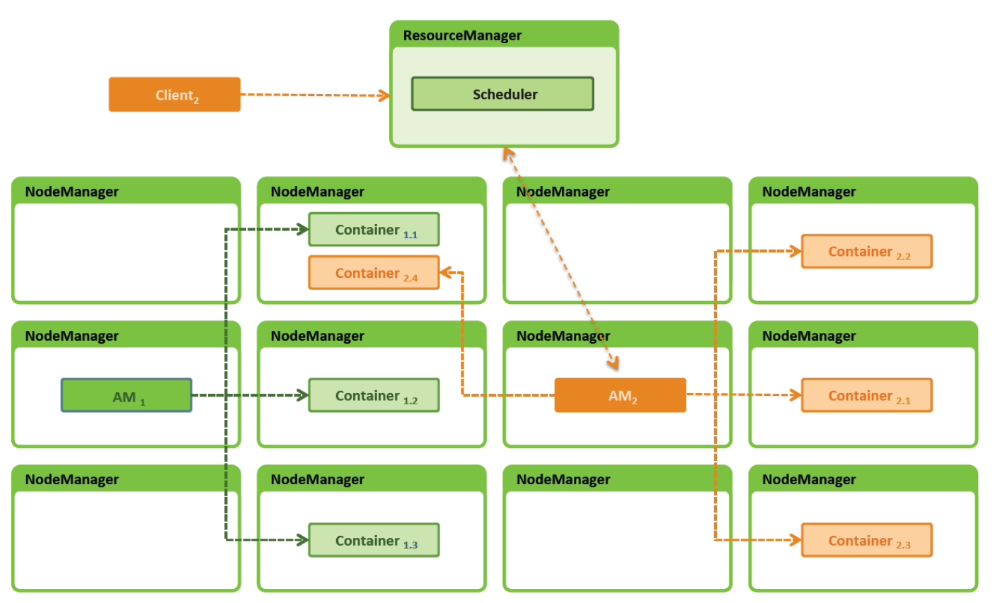
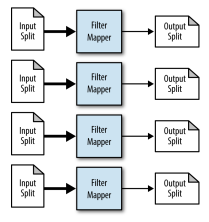
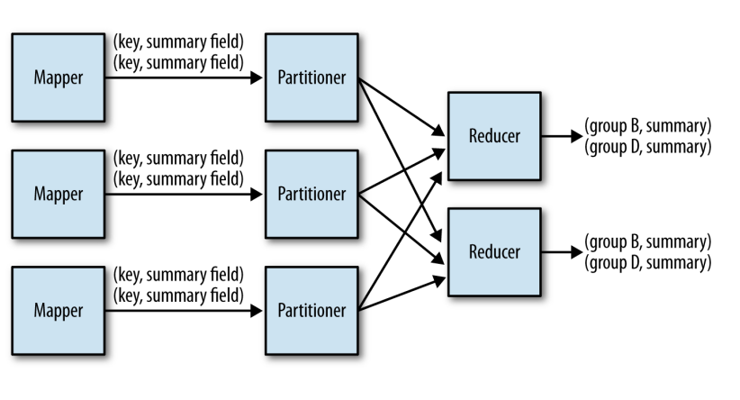
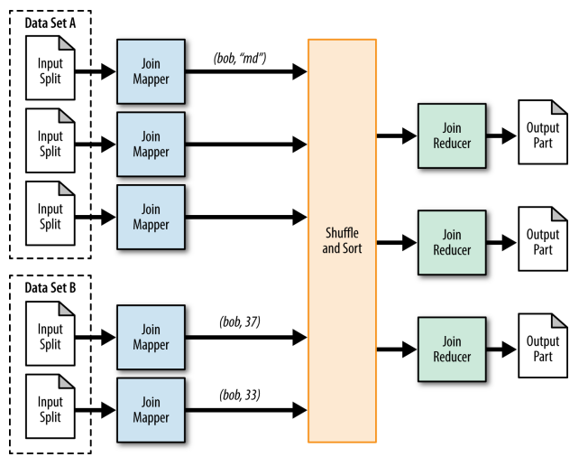
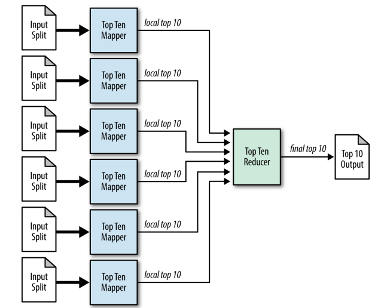
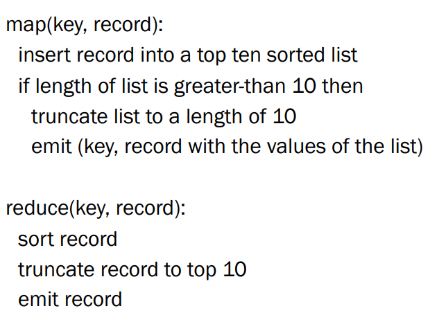

# 19 Marzo

Tags: Distinct Patterns, Filtering Patterns, Join Patterns, Sorting Patterns, Summarization Patterns, Top-K patterns
.: Yes

## Job Run Implementation in YARN 2.x



## Filtering Patterns



L’obiettivo è quello di trovare linee o file o tuple con una particolare caratteristica. Per esempio cercare i log di richieste per `*uniroma3.it/*`, cercare nel web log degli hostname che vengono acceduti da `192.168.127.1` oppure trovare tutti i file che contengono le parole `Apple` e `Jobs`.

- `MAP`: i filtri fanno la maggior parte del lavoro
- `REDUCE`: potrebbe essere solamente l’identificazione dell’oggetto che soddisfa la condizione

```sql
SELECT * FROM table WHERE table.value < x
```

## Summarization Patterns



L’obiettivo è quello di calcolare il massimo, il totale, la media per un set di valori.

- `MAP`: filtra l’input e ottiene una coppia $(k,v)$ dove $v$ è il valore dove si fa summarization
- `REDUCE`: prende in input $(k,[v])$ e applica la summarization a $[v]$

```sql
SELECT col1, MIN(col2), MAX(col2), COUNT(*)
FROM table
GROUP BY col1;
```

## Join Patterns



L’obiettivo è quello di combinare molteplici input in base a valori comuni. Questi valori possono essere uguali oppure rispettare una certa condizione

- `MAP`: generazione di coppie $(k,e)$ per ogni elemento $e$ in input dove $k$ è l’elemento in comune.
- `REDUCE`: genera una sequenza di coppie $(k_i,r_i)$ per ogni $k,[e_1,...,e_k]$ nell’input

## Sorting Patterns

L’obiettivo è quello di ordinare l’input, non serve introdurre un algoritmo perché la funzione di reduce già mette in ordine.

## Top-K Patterns

`Esempio` : Dato un set di record $[Name:n, Age:g, Salary:s]$ bisogna trovare i primi 10 dipendenti più giovani di 30 anni con lo stipendio più alto.




## Distinct Patterns

L’obiettivo è quello di cercare un insieme di valori unici da record simili che potrebbero avere duplicati.

```sql
SELECT DISTINCT * FROM TABLE
```