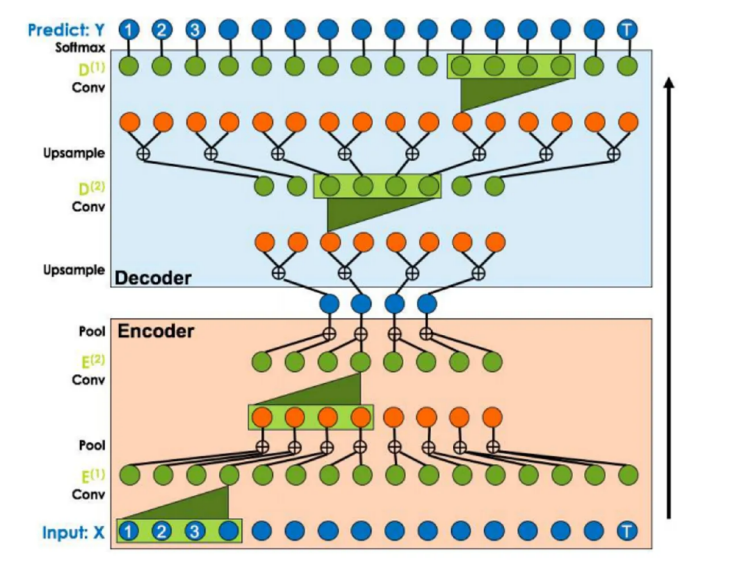
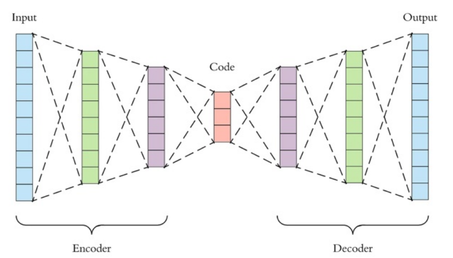
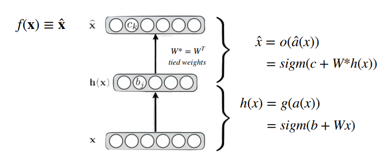
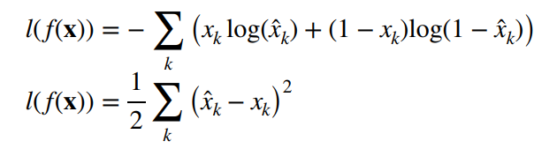
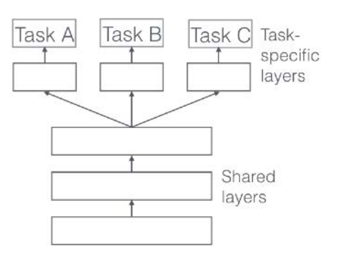
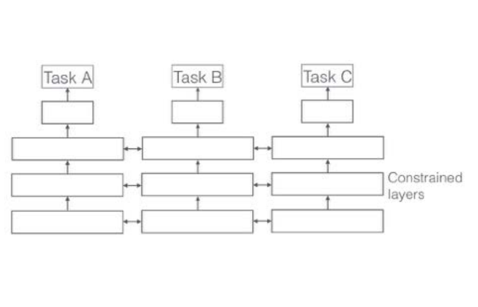

# 19 Novembre

Tags: Approcci Generativi, Autoencoders, Parameter sharing, Stacked Autoencoders, Temporal Convolutional Network, Weight tying
.: No

## Temporal Convolutional Network

Il `TCN` forniscono un approccio per estrarre sia le caratteristiche di basso livello spazio-temporali e sia di utilizzare queste caratteristiche per darle in input a un classificatore che individua le caratteristiche temporali ad alto livello.

Per fare ciò utilizza una gerarchia di convoluzioni 1D e dilated con livelli di pooling, per elaborare informazioni provenienti da fasi temporali sia passate che future. Sono molto meglio delle `RNN` perché si addestrano più velocemente e l’analisi delle time series è migliore.

Tipicamente la `TCN` è un’architettura encoder-decoder,  dove in output si avrà la stessa lunghezza della sequenza in input.

L’output all’istante $t$ è generato convolvendo input campionati prima di $t$

## Approcci generativi

Un modello $G$ è generativo se cerca di apprendere la distribuzione di probabilità $P_L$ da cui vengono campionate le istanze in input. Il modello una volta appresa questa distribuzione di probabilità genera nuove istanze utilizzando $P_L$ stesso.

Ci sono 2 modi con cui $G$ può apprendere $P_L$:

- `implicito`: se la distribuzione $P_L$ viene stimato dalle istanze in input e viene poi utilizzato per campionare nuove istanze (GAN)
- `esplicito`: lo si può immaginare come un approccio parametrico dove si sceglie il tipo di distribuzione e poi si adatta l’input a questa distribuzione.

Questi approcci vengono introdotti perché gli `autoencoder` rientrano in uno dei 2 approcci.

## Autoencoders

Gli `autoencoders` apprendono rappresentazioni latenti senza l’impiego di approcci supervisionati e sono costituiti da 3 componenti:

- `encoder`: comprime l’ingresso e produce una codifica
- `codifica`: viene creata dall’encoder
- `decoder`: ricostruisce l’ingresso a partire dalla codifica prodotta

L’obiettivo principale è ricostruire l’input in modo più fedele possibile. Da notare il fatto che un autoencoder si specializza sulle caratteristiche del dominio su cui viene addestrato quindi non può essere riutilizzata in altri domani.

In questo caso entrambi encoder e decoder sono reti feedforward FC.

La `loss` di ricostruzione valuta la differenza tra output ricostruito e input.

Si può dire che gli autoencoders sono una generalizzazione della PCA; mentre la differenza con la `t-SNE` è che la prima preserva le distanze tra cluster di dati simili mentre un autoencoder minimizza l’errore di ricostruzione.

## Stacked autoencoders e overfitting

La dimensione ottimale dello spazio latente, cioè i nodi che costituiscono il layer di codifica è determinato empiricamente:

- se troppo grande si aumenta il rischio di overfitting
- se troppo piccolo l’output che viene generato mancherà di caratteristiche e correlazioni. Quindi si avrà una loss di ricostruzione alta.

Gli `stacked-autoencoders` sono autoencoders dove encoder e decoder sono organizzati su più layer, spesso in modo speculare.

In questa immagine viene mostrata la formalizzazione degli autoencoders.

La prima è la formula della loss per input binari mentre la seconda per valori reali.

## Parameter sharing e scenari multitask

Il `parameter-sharing` è una tecnica utilizzata nelle reti neurali per affrontare scenari di apprendimento multitask, dove un modello viene addestrato simultaneamente su più compiti correlati. Esistono diversi approcci e determinano come i parametri vengono condivisi tra i diversi compiti per promuovere il riutilizzo delle conoscenze apprese e migliorare la generalizzazione.

Di seguito sono elencati 3 tipi di condivisione dei parametri:

- `hard-parameter sharing`: si condividono i pesi tra più task in modo che ogni peso sia addestrato per minimizzare congiuntamente più loss.

In sostanza si cerca di risolvere tutti i task contemporaneamente con gli stessi parametri, questo perché può succedere che in un task si possono trovare delle caratteristiche per risolverne altri.

I compiti possono beneficiare di rappresentazioni comuni apprese dai dati di altri compiti correlati.

- `soft-parameter sharing`: diversi tasks hanno parametri distinti, ma si aggiunge alla funzione obiettivo la distanza tra gruppi di parametri. Si vuole che questa distanza tra gruppi di parametri sia piccola, questo porta ad avere modelli simili fra loro che risolvono più task.

In sostanza ogni compito ha il proprio set di parametri, ma viene introdotto un meccanismo per regolare o incoraggiare la condivisione di informazioni tra i parametri dei compiti.

- `task-relationship learning`: apprendono una rappresentazione esplicita delle correlazioni tra task (non si approfondirà).

## Soft parameter sharing

Se si hanno 2 task e ciascuno di questi a dei parametri associati $W_i^{(A)}$ e $W_i^{(B)}$, esplicitiamo il vincolo mediante la funzione di loss, con un termine addizionale rispetto alla loss tradizionale

$$
\mathcal{L}=l+\sum_{S(L)}\lambda_i\cdot ||W_i^{(A)}-W_i^{(B)}||_F^2
$$

Quindi nel processo di ottimizzazione si cerca di minimizzare questa loss

$$
||W||_*=\sum_{i}\sigma_i
$$

Oppure quello che si fa è penalizzare la `nuclear-norm` del tensore ottenuto accoppiando i parametri associati, dove $\sigma_i$ sono i singolar vaues ottenuti decomponendo la matrice $\left[W_i^{(A)}|W_i^{(B)}\right]$.

## Weight tying

La procedura di `weight-tying` crea vincoli tra i valori dei parametri in layer speculari, l’obiettivo è quello di dimezzare i parametri da stimare durante il training cercando di ridurre l’overfitting. Il concetto si basa sull'idea di condividere i pesi tra diversi livelli o componenti della rete invece di avere pesi distinti per ciascuna connessione.

Questa procedura viene applicata ad architetture che hanno layer specializzati in sotto-task molto simili tra loro, oppure dove si può riutilizzare una sotto-architettura più volte in varie parti.

In sostanza è una tecnica per migliorare l’efficienza dei modelli e la generalizzazione, riducendo il numero di parametri da addestrare. Consiste quindi nel condividere i pesi tra determinati strati di una rete neurale, in modo che gli stessi valori vengano utilizzati in più parti della rete.