# 1 Dicembre

Argomenti: Analisi Sintattica, Bag of words, Boolean Retrieval, Cosine Similarity, Information Retrieval, Rappresentazione dei documenti, TF-IDF
.: Yes

## Introduzione al NLP

Nell’elaborazione del linguaggio naturale è utile distinguere tre diversi livelli: 

- livello `sintattico`: ha a che vedere la grammatica di una lingua specifica
- livello `semantico`: concerne il significato delle parole e delle frasi
- livello `pragmatico`: per capire una frase non è sufficiente tener conto del significato delle parole, occorre anche considerare la situazione in cui la frase viene pronunciata e la relazione fra chi parla e chi ascolta.

## Problemi dell’elaborazione automatica

Dal punto di vista dell’elaborazione automatica, il livello `sintattico` è il meno problematico perché è possibile analizzare frasi anche assai complesse, riconoscere la loro correttezza grammaticale e ricostruire la loro struttura sintattica.

Molto più arduo si presenta invece il livello `semantico`, nei casi più semplici si può procedere cosi:

- il significato di una frase si ottiene dal significato delle singole parole, una volta che sia nota la struttura sintattica della frase
- il significato delle singole parole è definito in un dizionario accessibile automaticamente.

Più difficile ancora si presenta il livello `pragmatico`.

## Analisi sintattica

Esistono diversi modelli teorici che definiscono il concetto di struttura in modo differente, utilizzando le grammatiche di chomsky si può associare ogni frase corretta del linguaggio una struttura ad albero, detta albero sintattico, che rappresenta i rapporti sintattici esistenti fra le varie parti della frase.

## Statistical NLP

L’interesse per questo tema scaturisce dall esigenze di poter trattare enormi insiemi di documenti disponibili in rete per le più varie applicazioni. Per statistical NLP si intendono tutti gli approcci quantitativi all’elaborazione del linguaggio naturale

---

## Information Retrieval

Sarebbe l’insieme delle tecniche utilizzate per il recupero mirato dell’informazione in formato elettronico. Per “informazione” si intendono tutti i documenti, i metadati, i file presenti all’interno di banche dati o nel www.

Per recuperare l’informazione, i sistemi di `IR` usano linguaggi di interrogazione basati su comandi testuali, 2 concetti sono di fondamentale importanza:

- `query`: sono generalmente stringhe di parole-chiave rappresentanti l’informazioni richiesta. Vengono digitate dall’utente in un sistema di `IR`.
- `oggetto`: entità che mantiene o racchiude informazioni in una banca dati. Un documento di testo per esempio è un oggetto di dati.

A seguito di un’interrogazione il sistema fornisce i documenti trovati.

## Modelli di Information Retrieval

Uno dei problemi al centro dei sistemi di `IR` è quello di predire quali documenti sono rilevanti e quali non lo sono. Tre modelli classici di `IR` sono:

- `booleano`: i documenti sono rappresentati come insiemi di parole chiave
- `vettoriale`: i documenti sono rappresentati come vettori in uno spazio t-dimensionale
- `probabilistico`: il fondamento della modellazione della rappresentazione del documento è la teoria della probabilità

## Boolean Retrieval

Il modello è un semplice modello basato sulla teoria degli insiemi e sull’algebra booleana. Le query vengono sottomesse come espressioni booleane con precise semantiche, fornendo a questo modello una notevole semplicità e una chiara formalizzazione.

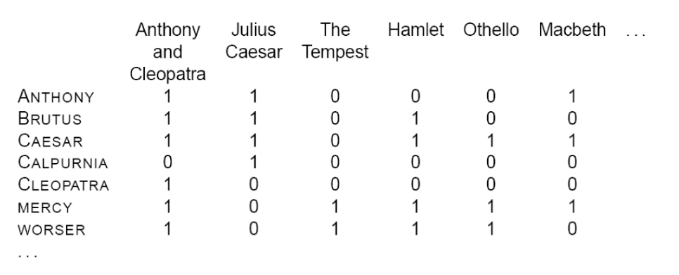

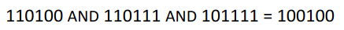

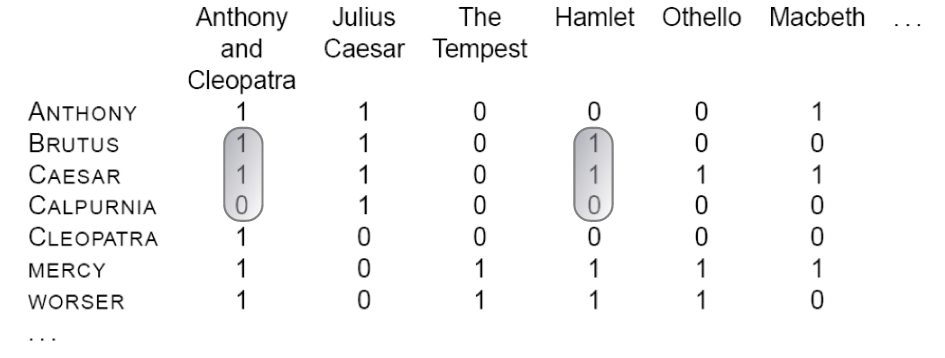

Se si volesse sapere in quale opera teatrale di Shakespeare ci sono le parole Brutus, Caesar ma non Calpurnia si usa una matrice di incidenza

Per rispondere alla query si prendono i vettori di incidenza di Brutus, Caesar e Calpurnia, si invertono bit a bit il vettore di Calpurnia e si fa l’and bit a bit dei 3 vettori: in termini di algebra booleana si può dire BRUTUS-AND-CAESAR-AND-NOT(CALPURNIA).

I documenti che soddisfano la query sono: Anthony and Cleopatra e Hamlet

## Inverted Index

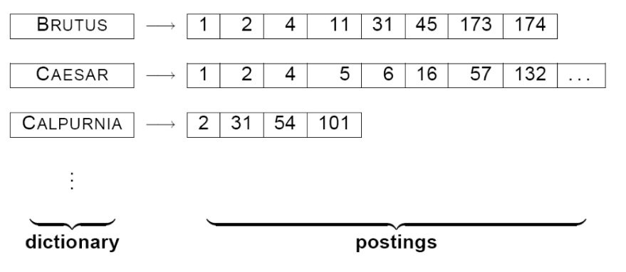

La matrice di incidenza però assume dimensioni non gestibili all’aumentare dei documenti, una soluzione è usare l’`indice inverso` dove per ogni termine $t$ viene memorizzata una lista di tutti i documenti che contengono $t$.

## Elaborazione di query booleane

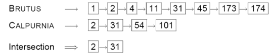

Si considera la query BRUTUS AND CALPURNIA e si usa l’algoritmo `intersect`, la condizione è che le liste devono essere ordinate

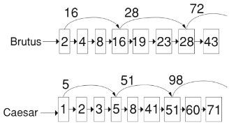

`skip list` è un espediente più efficiente 

In pratica si utilizzano puntatori ulteriori per saltare un pezzo di una sottolista

## Ottimizzazione della query

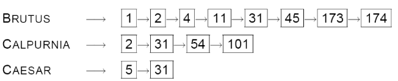

Il miglior modo per elaborare una query è elaborare le coppie di liste in ordine crescente di frequenza dei relativi termini. Quindi se la query è BRUTUS AND CALPURNIA AND CAESAR la ottimizzazione seguirà il seguente ordine CAESAR, CALPURNIA, BRUTUS.

---

## Rappresentazione dei documenti

Ci sono 2 possibili metodi per la rappresentazione dei documenti non strutturati e sono `bag-of-words` e `tf-idf` (term frequency - inverse document frequency)

## Bag of Words

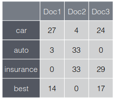

In questo modello è preso in considerazione solo il numero di occorrenze di ogni termine nel documento

In questo modo è possibile rappresentare ogni documento mediante un vettore di occorrenze 

Un problema in questa semplice rappresentazione è relativa ai termini poco frequenti

## Modello TF-IDF

Questa rappresentazione cerca di evidenziare i termini importanti, in particolare quelli che appaiono frequentemente in un documento (`common locally`) e raramente nel corpus (`rare globally`).

$$
\text{idf}_t=log\frac{N}{df_t}
$$

Si definisce `document-frequency`  $df$ per il termine $t$ come il numero di documenti nel corpus che contengono $t$.

Si definisce l’`inverse document frequency` come segue, dove $N$ è la cardinalità del corpus.

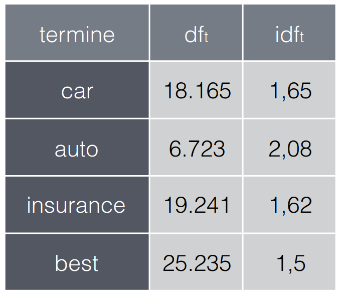

Nella seguente tabella sono riportati alcuni esempi di valori $df$ e $idf$ relativi alla collezione `Reuters`, costituita da 806791 documenti

$$
\text{tf-idf}_{t,d}=\text{tf}_{t,d}\cdot \text{idf}_t
$$

il `tf-idf` è definito a sinistra, in sostanza dato un documento $d$ assegna un peso al termine $t$

- Questo peso è `alto` quando $t$ è molto frequente in un piccolo numero di documenti
- Questo peso è `basso` quando il termine $t$ è poco frequente nel documento, oppure quando è presente in molti documenti

Il valore più basso si ha quando compare in tutti i documenti

## Vettore delle Query

Anche una query può essere rappresentata attraverso un `tf-idf`

## Metrica di Similarità

Una `metrica di similarità` è una funzione che calcola il grado di similitudine tra 2 vettori; grazie all’uso di una metrica di similarità tra una query e ciascun documento di un corpus è possibile ordinare i documenti dal più simile al meno simile e impostare una soglia limite per ignorare tutti i documenti che la superano.

## Cosine Similarity

$$
sim(x_i,x_q)=\frac{x_i^T\cdot x_q}{||x_i||\cdot ||x_q||}
$$

Questa metrica è molto utilizzata per misurare la similarità tra 2 documenti $x_i$ e $x_q$, sfrutta la rappresentazione vettoriale dei documenti. Sarebbe il rapporto del prodotto scalare e il prodotto tra i moduli

$$
sim(x_i,x_q)=\widehat{x}_i^T\cdot \widehat{x}_q
$$

L’effetto del denominatore è quello di normalizzare i vettori $x_i$ e $x_q$ per ottenere i corrispondenti vettori, detto questo si può riscrivere il tutto come mostrato

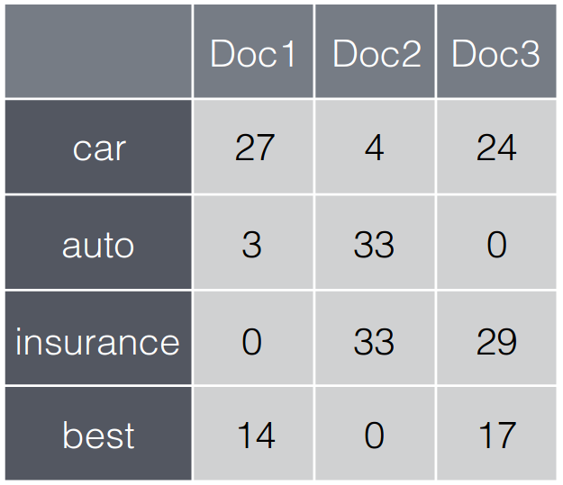

Se si considerano i documenti nella prima immagine rappresentati tramite i vari `tf`, la quantità:

$$
||x||=\sqrt{\sum_{j=1}^{d}x_j^2}
$$

($j$ → colonne)

ha i valori $30,56$ per `Doc1`, $46,84$ per `Doc2` e $41.30$ per `Doc3`.

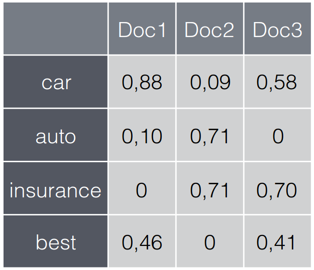

I valori ottenuti vengono utilizzati per ottenere la nuova tabella con i valori normalizzati

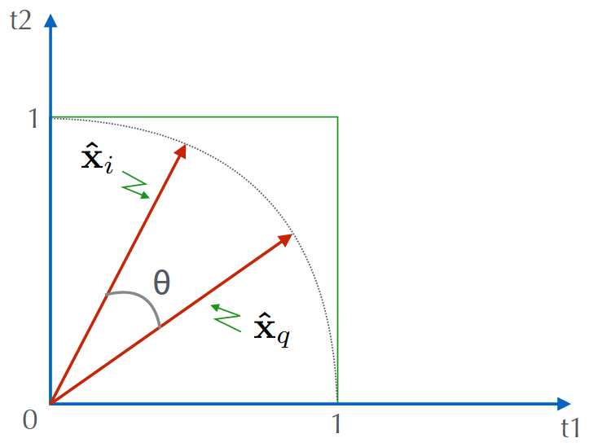

La similarità definita in precedenza corrisponde al coseno dell’angolo tra i 2 vettori:

$$
sim(x_i,x_q)
=cos(\theta)
$$