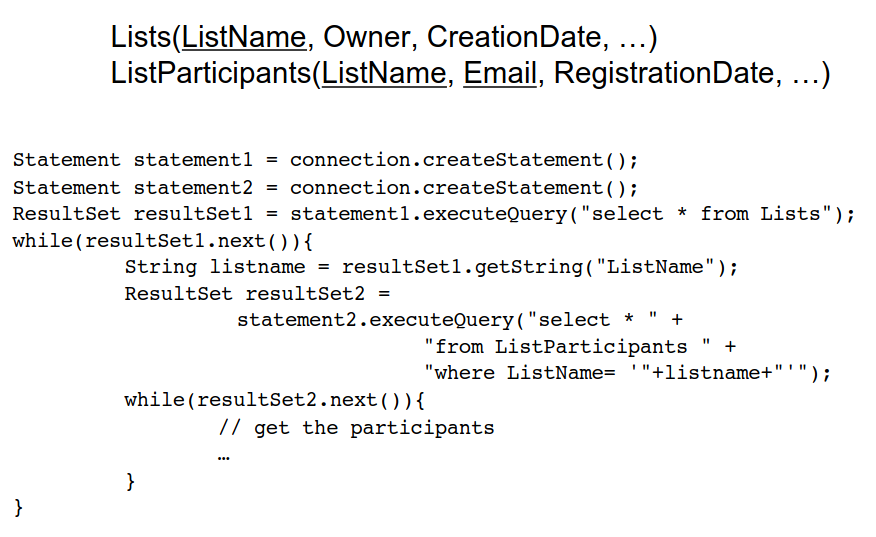
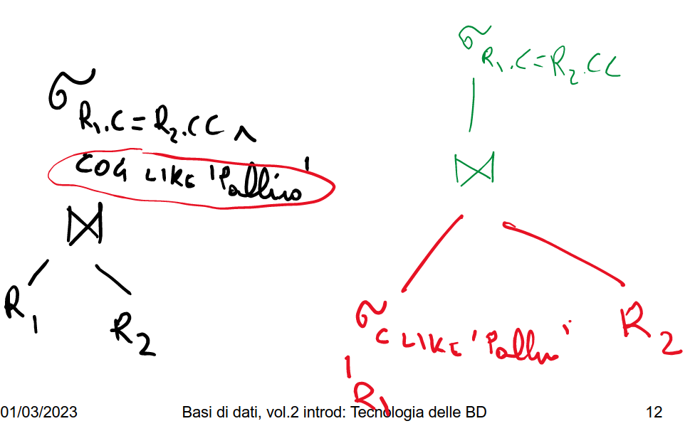
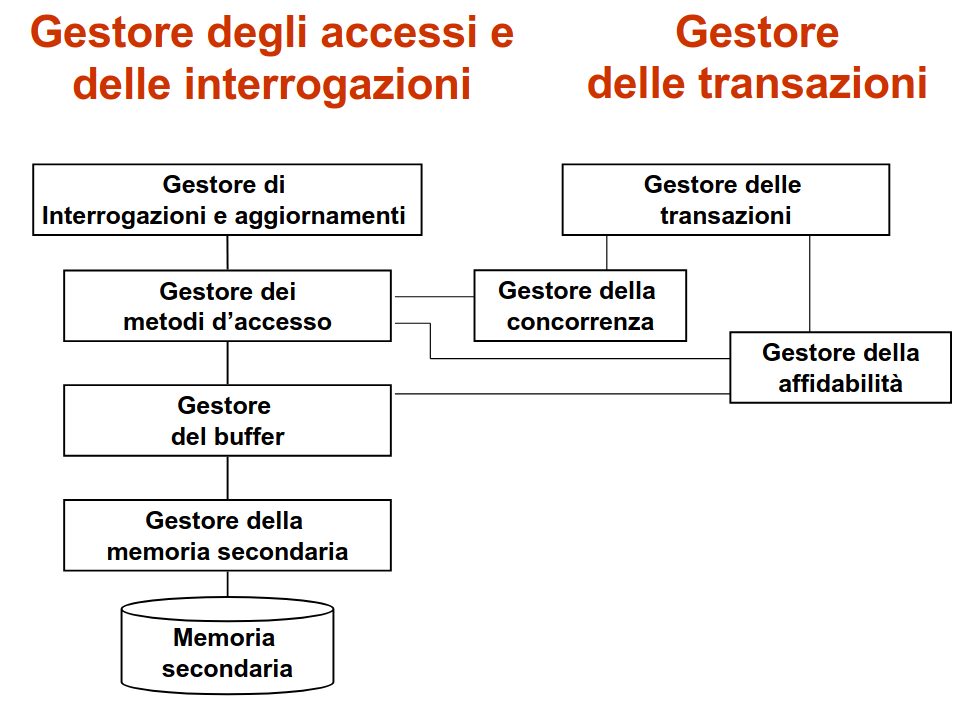

# 1 Marzo

Argomenti: DBMS
.: Yes

## DataBase Management Systems - DBMS

Sistema in grado di gestire `collezioni di dati` che siano:

`grandi`,`persistenti` e `condivise`

- `grandi`: di dimensioni molto maggiori della memoria centrale
- `persistenti`: con un periodo di vita indipendente dalle singole esecuzioni dei programmi
- `condivise`: utilizzate da applicazioni diverse

Garantiscono `affidabilità`(resistenza a malfunzionamenti hardware e software) e privatezza. Devono essere `efficienti` (utilizzando al meglio le risorse di spazio e tempo del sistema) ed efficaci.

Visto che la memoria secondaria è molto più lenta della memoria principale serve un’interazione fra memoria principale e secondaria che limiti il più possibile gli accessi alla memoria secondaria.

In questo esempio per ogni istanza di `result1` si fa un altra query per ogni istanza di `result2`

In questo esempio invece si sceglie prima di eliminare le ennuple che non servono per la query per poi fare il prodotto relazionale, migliorando di molto la query perché si fa il join solamente sulle ennuple di interesse

## Affidabilità delle basi di dati

Le basi di dati devono essere conservate anche in presenza di malfunzionamenti. Le `transizioni` devono essere:

- `atomiche`: la transizione termina sempre a status completo, non può terminare a metà operazione
- `definitive`: dopo la conclusione delle operazioni i cambiamenti non si dimenticano.

Struttura degli accessi nelle basi di dati