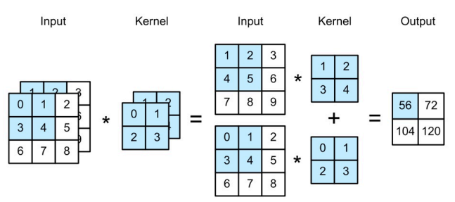
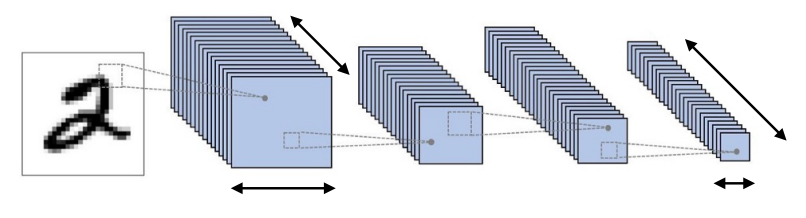
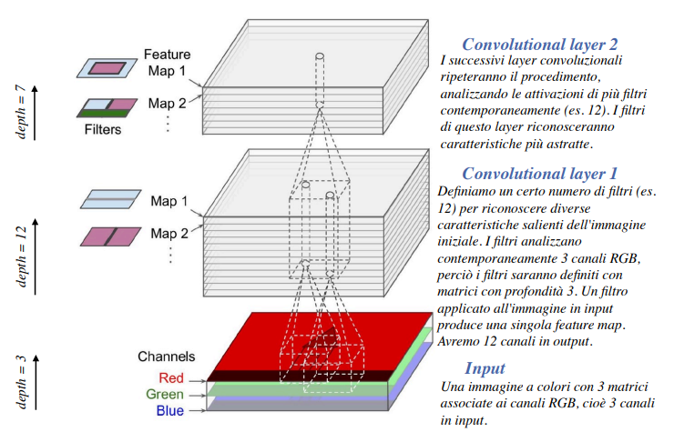
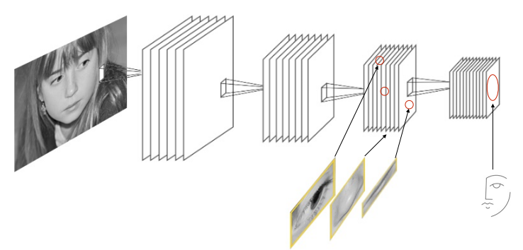

# 1 Ottobre

Tags: Canali multipli in input, Canali multipli in output
.: Yes

## Canali multipli in input

La profondità del kernel corrisponde al numero di canali in input; se in ingresso si hanno più canali (per esempio RGB, quindi $c_i=3$) allora il filtro rappresentato dal tensore $k_h\times k_w$ dovrà essere ripetuto per ogni canale.

Se si concatenano i tensori si ottiene un tensore risultante di questo tipo: $c_i\times k_h\times k_w$

## Canali multipli in output

Il numero di canali impiegati in un layer aumenta con la profondità della rete, riducendo allo stesso tempo la risoluzione spaziale degli input.

Un filtro individua una particolare caratteristica, ma questo non è sempre vero perché la stessa caratteristica può essere individuata o meglio rappresentata con le informazioni prese da più canali.

Se ogni filtro in un layer produce un singolo canale in output, quando si parla di `output-multicanale` si creano più tensori $c_i\times k_h\times k_w$, dove ognuno rappresenta un singolo canale in output $c_o$. Se si concatena si ottiene $c_o\times c_i\times k_h\times k_w$.

Esempio di rete CNN

## Feature maps e profondità della rete

Se si ripetono i procedimenti che si fanno con i layer convolutivi, ogni `feature-map` combinerà più caratteristiche dei layer precedenti per rappresentarne altre più di alto livello

Quindi i processi di `feature-extraction` e `feature-classification` sono fusi in un singolo processo il cui è possibile addestrare.

L’estrazione delle feature è automatizzata durante l’elaborazione.

## Pooling

Si vuole abbattere la dipendenza spaziale, il `pooling` serve infatti a togliere informazioni, viene effettuata sulle `feature-maps`:

- si riduce la dimensionalità delle informazioni da elaborare
- modera la sensitività dei layer convolutivi garantendo allo stesso modo capacità di generalizzazione.

I layer di `pooling` hanno lo scopo di ridurre il numero di parametri facendo un campionamento dei dati; computazionalmente si ha bisogno di meno risorse di memoria e meno parametri da stimare riducendo la probabilità di andare in overfitting.

Come nel convolutional layer, ogni nodo del layer è connesso con un numero `limitato` di nodi del layer precedente. Un’altra nota importante è che il layer di pooling non ha parametri, quello che fa è calcolare una media o valore massimo dei valori associati ai nodi. (Processo di aggregazione)

Gli iperparametri del `pooling-layer` sono la dimensione del LRF (`pooling size`) e il `pooling stride` e il tipo di processo di aggregazione. Ci sono 2 tipi principali di aggregazione e sono:

- `max-pooling`: un nodo assume l’attivazione massima tra i valori presenti nel field considerato
- `average-pooling`: si considera il valore medio nel field.