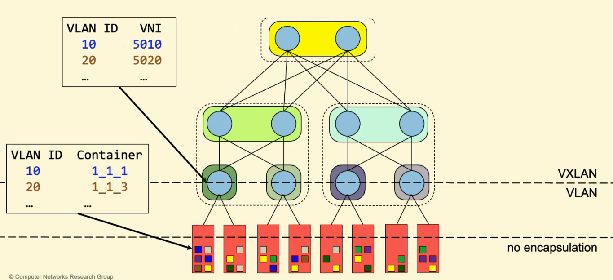

# 20 Dicembre

Argomenti: Locazione dei VTEP
.: Yes

## EVPN-BGP : locazione dei VTEP

Inanzitutto bisogna dire che i container devono essere ignari del tunneling, detto questo si hanno 2 scelte per il posizionamento dei `VTEP`:

- in ogni `server`: il server dovrebbe avere un BGP peering per abilitare `EVPN-BGP`, se questo fosse il caso allora la `CPU` del server sarebbe usata per instradare i pacchetti
- in ogni `leaf`: una `leaf` ha già un `BGP-peering`, è un router a prescindere e quindi ha un hardware di routing dedicato e per finire si possono usare le `VLAN` per distinguere i flussi tra le leaf e i server

Si valuta che la scelta migliore è mettere le `VTEP` all’interno delle `leaf`, lo scopo della leaf diventa quindi di decapsulare i pacchetti `VXLAN` e incapsulare in pacchetti `VLAN` e viceversa.

Dentro ai server si hanno le `VLAN ID` che permettono di mandare i pacchetti ai container giusti, l’unica cosa che deve fare il server è togliere i tag `VLAN` dai pacchetti per poi mandarli ai container.

Tra i server e le leaf si usa `VLAN` perchè si ricorda che tra di loro ci sta un solo cavo fisico e sullo stesso cavo si devono mandare tipologie di pacchetti diversi (dipendenti dal numero di tenants all’interno di un server) senza che questi si mischiano e senza che possa fare assunzioni sull’indirizzo IP usato. Il protocollo che permette di separare più LAN sullo stesso dominio di collisione è proprio `VLAN`.

Qui viene mostrato in quali livelli sono utilizzati i protocolli `VLAN`,`VXLAN`.