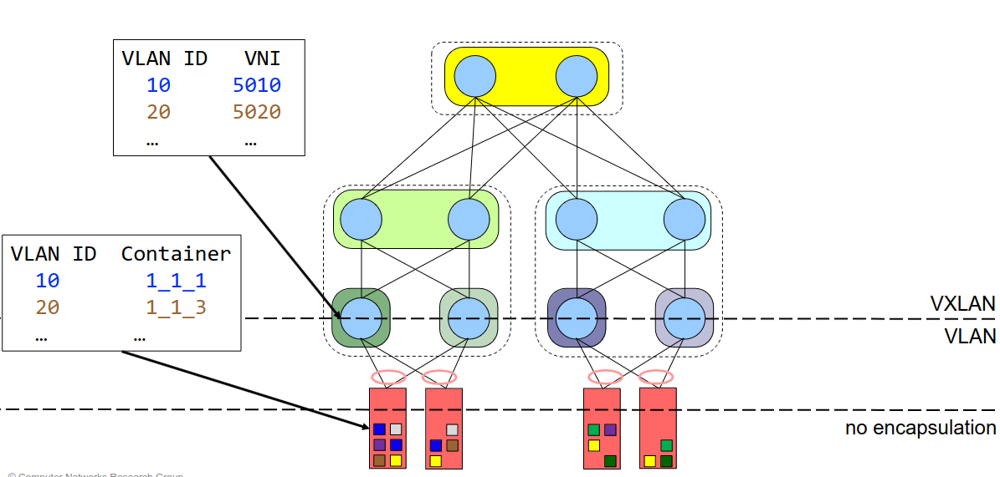
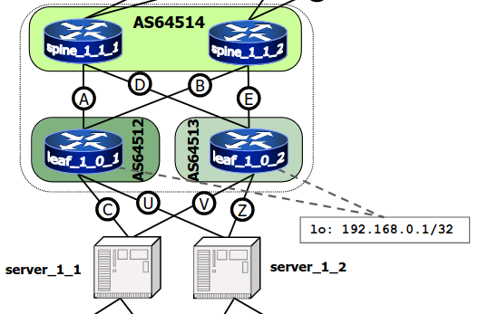

# 21 Dicembre

Argomenti: Anycast BGP, Bonding, MLAG
.: Yes

## EVPN-BGP and Bond

Ci sono ancora dei problemi da risolvere, di seguito sono elencati:

- se un link `leaf-server` si rompe, il server è separato dal data center
- se una `leaf` si rompe, tutti i server connessi a quella leaf sono separati dal server
- se si deve fare manutenzione in una `leaf`, tutti i server connessi a quella leaf sono temporaneamente separati dal data center

Per evitare che accadano questi problemi si va a fare il `dual attached servers` utilizzando una tecnologia chiamata `bonding`, cioè aggregare più `NIC` in un unica interfaccia virtuale. Si possono fare diverse politiche per il bonding:

- `active-backup`: si hanno 2 link che si mettono in bonding dove si utilizza solo uno mentre l’altro si tiene spento, quello spento verrà acceso solo quando il primo si romperà
- `active-active`

Il problema è che queste soluzioni risolvono quando il link si rompe ma non la leaf

## MLAG

Per risolvere i problemi di guasti alle `leaf` si usa il Multi-Chassis Link Aggregation, in pratica consente a un server o switch con un bond a due porte di collegare tali porte a switch diversi e di operare come se fossero collegati a un singolo switch logico. Questo fornisce una maggiore ridondanza e una maggiore capacità di sistema.

In pratica si attaccano i server a 2 leaf, il problema adesso è il server può mandare a 2 leaf diversi

## Anycast BGP

Per risolvere il problema dell’ambiguità dei 2 leaf collegati al server si utilizza la tecnologia `anycast BGP`.

Questa tecnica permette di assegnare a 2 macchine lo stesso indirizzo IP cosi da poter bilanciare il traffico.