# 21 Maggio

Tags: Cassandra, DynamoDB, MongoDB, Polyglot persistence, Ryak
.: No

# Key-Value Documents

Questi sistemi memorizzano oggetti come chiave-valore, dove i valori possono essere di qualsiasi tipo. La cosa fondamentale è che il valore associato all’identificatore è `opaco` (l’unico meccanismo all’oggetto è tramite l’identificatore) 

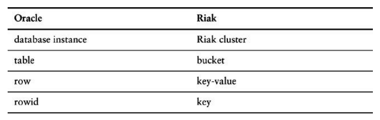

In questa immagine viene mostrata l’analogia  tra database relazione e un `ryak`.

## Ryak

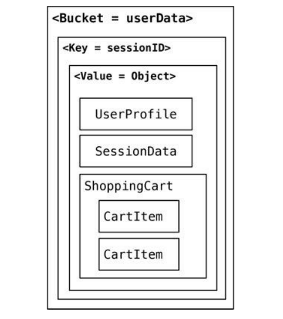

Primo sistema `key-value` che introduce un concetto di `bucket` che è composto da coppie `key-value`, diciamo che è un modo per raggrupare le chiavi. Tipicamente un `bucket` memorizza aggregati dello stesso tipo, per questo viene chiamato anche `domain-bucket`, ma questo non implica che ci possono essere aggregati di tipo diverso nello stesso bucket.

Offre un meccanismo di consistenza tramite `peer-to-peer` 

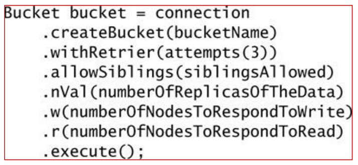

Tipicamente può essere gestita della consistenza tramite il `quorum` definendo $N$ come fattore di replicazione, $W$ il numero di scritture confermate nei vari nodi e infine $R$ il numero di letture nei vari nodi che garantiscono una risposta corretta

```java
.allowSiblings(false)
```

La consistenza viene gestita tramite questo comando, sostanzialmente si tiene conto solo  dell’ultima scrittura.

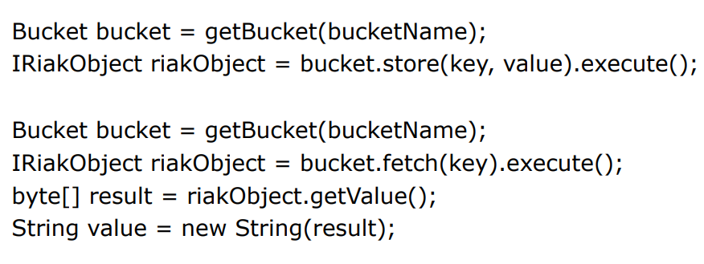

In questa immagine vengono mostrati operazioni di scrittura e lettura.

Da notare che nel `fetch` (lettura) si può ottenere solo una chiave.

## DynamoDB

Un altro sistema `key-value`, utilizzato per gestire acquisti su amazon (carrello della spesa, etc..) e utilizzabile tramite richieste HTTP (ci sono anche altri modi). L’unica struttura che offre è chiamata `table` che contiene `items` dove ogni `item` è una coppia `key-value`, in particolare per ogni tabella deve essere specificata una chiave composta da 2 attributi e sono la `partition-key` e il `sort-key` (Non sempre).

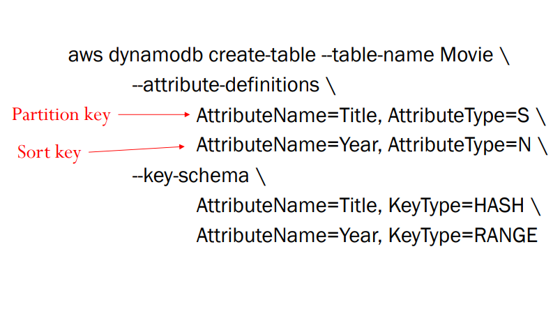

In questo esempio viene creata una nuova `table` dove si specifica solamente la `key`.

In questo caso la chiave è fatta da 2 componenti, nel caso in cui si voglia solo un attributo allora si definisce solamente la `partition-key`.

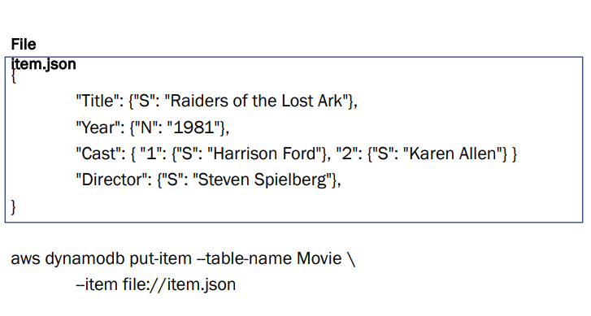

Per aggiungere un oggetto (all’inizio è un file json), si usa il comando `put` passando come parametro il file `.json` mostrato in figura.


L’unica maniera per accedere ad un oggetto è tramite la `get` dove gli unici valori che si possono specificare sono le chiavi. 

Anche questo sistema è `peer-to-peer` dove tutte le scritture sono confermate solamente quando sono scritte sulla maggior parte dei nodi (se il fattore di replicazione è 3 allora vanno bene 2 nodi per la conferma). Per problemi di efficienza le letture sono fatte su un nodo singolo quindi si potrebbero avere letture inconsistenti. 

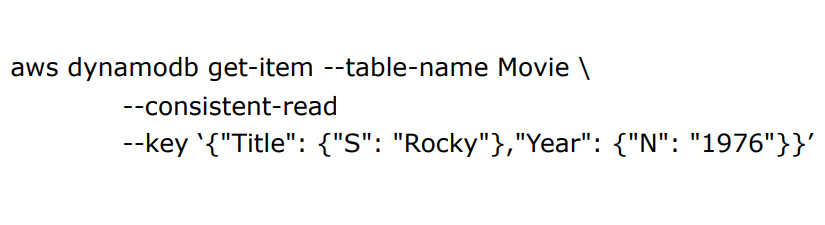

Si può forzare il comando di lettura per avere una lettura consistente aggiungendo il seguente flag.  Anche in questo caso si deve leggere nella maggior parti dei nodi per la conferma.

### Suitable Use Cases

Tutti e due gli esempi sono completamente `schemaless` l’unico meccanismo di accesso è tramite il valore della chiave. In questi sistemi non è possibile fare interrogazioni particolarmente complesse quindi conviene utilizzarli per task di questo tipo:

- gestione di informazioni di una sessione (`sessionId`)
- gestione di un profilo di un utente (`userId`)
- gestione del carrello della spesa (`sessionId` oppure `userId` oppure tutti e 2)

I `key-value` sono ottimi per accessi veloci e semplici a dati isolati, ma non adatti a scenari complessi o relazionali.

### When not to use

- Quando i dati hanno relazioni complesse tra loro.
- Quando servono transazioni con più operazioni collegate.
- Quando bisogna fare ricerche complesse basate sui valori, non solo sulle chiavi.
- Quando servono operazioni su gruppi di dati (filtri, aggregazioni, ecc.).

# Document Databases

Questi sistemi usano il meccanismo `key-value` che però è visibile cioè é possibile fare interrogazioni fra riferimento tra componenti interne dell’oggetto associato alla chiave.


In questa immagine vengono fatti confronti dal punto di vista terminologico tra `MongoDB` e `Oracle`. 

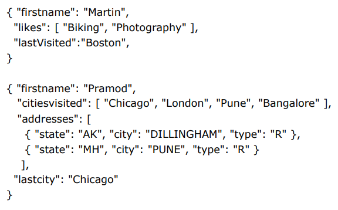

Il contenuto di questi sistemi è di tipo `json`, in questa immagine viene mostrato un esempio.

Da notare che questo sistema è `schemaless`, perché nell’immagine sono mostrati 2 oggetti che fanno parte della stessa collezione che però hanno una struttura completamente diversa.

A differenza dei sistemi relazionali non esistono linguaggi standard, quindi ogni sistema di tipo `document-database` ha un suo linguaggio (ognuno diverso dall’altro), quello che si garantisce però è che si possono fare query che fanno riferimento a componenti interne.

## MongoDB

`MongoDB` è un sistema di tipo `document-database`, non esiste un linguaggio di definizione e gli elementi sono coppie `key-document` dove la chiave ha sempre il nome `_id` che viene creato per ciascun documento. Usa il formato `BSON` che sarebbe la versione binarizzata di `json`.

Ogni `database` di mongodb contiene delle `collections` che sono in sostanza insiemi di documenti che possono avere formati completamente diversi, l’importante è che nella stessa collezione si hanno documenti che hanno a che fare con lo stesso oggetto concettuale

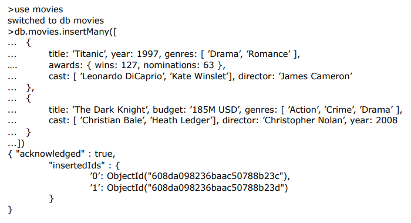

In questa immagine viene creato un database tramite `use`, poi vengono inseriti più elementi all’interno di questo database tramite la funzione `insertMany()`. Il controllo degli identificatori viene fatto automaticamente per fare in modo che gli elementi siano univoci.

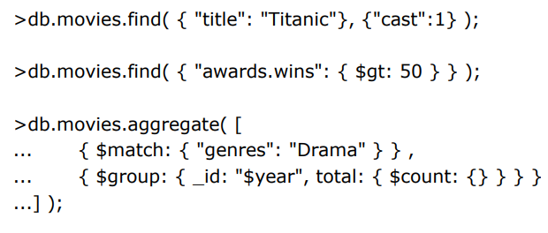

Il meccanismo di interrogazione avviene tramite `find` che prende in input due campi, il primo specifica la condizione di ricerca e il secondo quali attributi si vogliono in uscita.

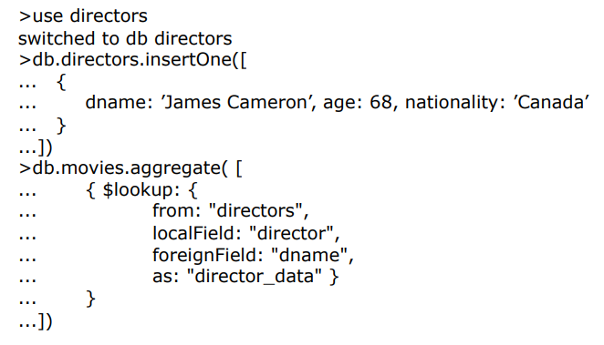

è possibile fare operazioni di join con una sintassi un po’ complessa. Questa operazione può essere molto lenta perché può succedere che si facciano i join su elementi che si trovano in nodi diversi perché nessuno garantisce che gli oggetti di interesse si trovino sullo stesso nodo.

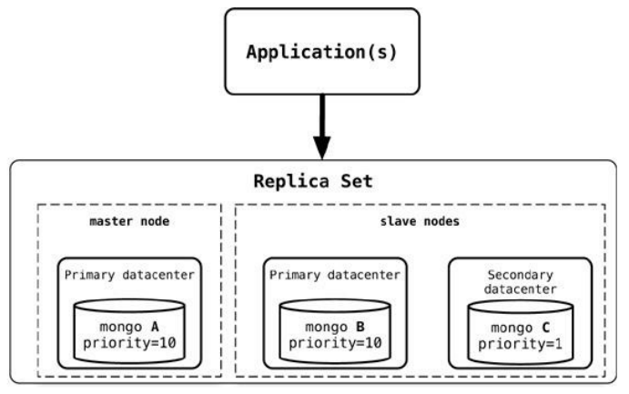

`MongoDB` usa un architettura `master-slave` dove utilizza il concetto di `replica-sets` dove ogni documento è memorizzato in ogni nodo. 

Di default si usano 3 nodi ma è possibile scalare aumentando questo numero. Nell’immagine viene mostrata la replicazione ma è possibile anche dare istruzioni di `sharding`.

Tutti gli aggiornamenti passano attraverso il `master` e gli `slave` rispondo alle query, il vantaggio è che non si possono avere conflitti `W-W` perché non è possibile che 2 scritture sullo stesso dato vadano in conflitto.

Si possono verificare conflitti dovuti a ritardo di propagazione da master agli slave; per fare in modo di avere una lettura corretta, anche in questo caso, ci si basa sul `quorum`. 

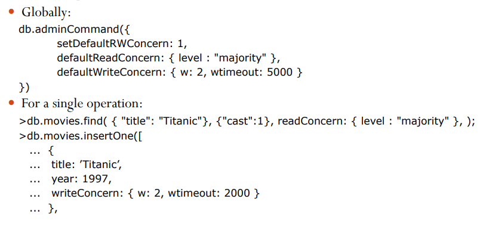

In questa immagine viene mostrato un esempio sul come gestire i conflitti sia di lettura che di scrittura. Per le letture si specifica un livello `majority` il che significa bisogna leggere la maggior parte dei nodi per avere la garanzia che la lettura sia corretta. Per le write, il numero di nodi su cui bisogna scrivere è pari a 2 con un tempo di timeout.

### Suitable Use Cases

MongoDB conviene utilizzarlo ogni volta che si hanno oggetti complessi che non hanno un formato predefinito e si vuole scalare su grandi dimensioni. Alcuni esempi possono essere:

- event logging, content management systems, blogging platforms, web analytics or real-time analytics, e-commerce applications

Se il sistema invece ha tante collezioni di tipo diverso e si vogliono mettere insieme informazioni di questo tipo diverso il sistema fatica molto.

### When not to use

Si evitano questi tipi di database quando servono transazioni complesse e sicuro tra più operazioni oppure bisogna fare query su dati con strutture molto diverse tra loro.

# Column(-Family) Stores

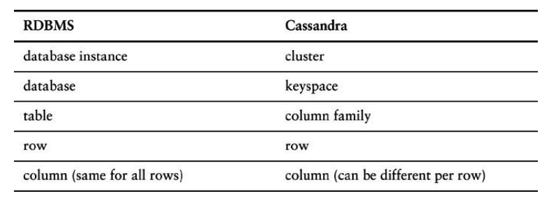

I sistemi basati su colonne, per certi versi, sono simili a tabelle relazionali. Il vantaggio è che anche questi sono schemi `schemaless`, per cui 2 righe della stessa tabella possono avere famiglie di colonne diverse

## Cassandra

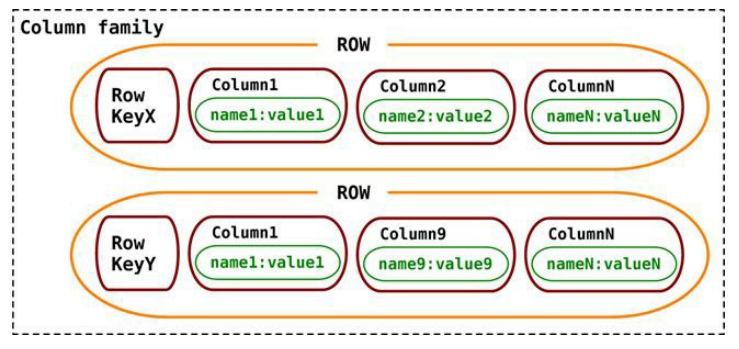

Questo sistema è pensato come meccanismo di gestione delle ricerche. A tutti gli effetti è molto simile a un sistema relazionale.

Il sistema è `peer-to-peer`

In cassandra non esiste un meccanismo di gestione di join e non è possibile definire vincoli di integrità referenziale. Si basa sul meccanismo di `denormalization`, cioè se si vogliono mettere insieme informazioni di tipo diverso bisogna metterli in unica tabella che poi verrà ovviamente denormalizzata.

In questo sistema bisogna definire quali sono le tipologie di query che verranno effettuate per poi modellare il sistema.

Il `data-model` di cassandra ha le seguenti proprietà:

- `keyspace`: sarebbe il concetto di basi di dati
- `table`: contiene partizioni che contengono righe che contengono colonne.
- `partition`: identificato dalla prima parte della `primary-key` (partition-key)
- `row`: contiene una collezione di colonne
- `column`: singolo dato che appartiene a una riga

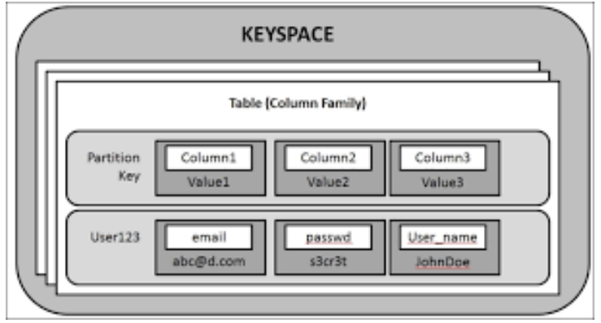

In questa immagine viene mostrato il `data-model` di cassandra

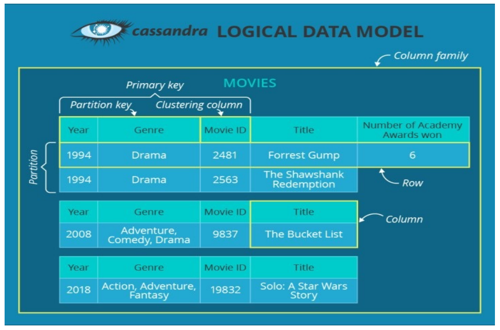

In questa immagine viene mostrato un esempio di `data-model` con vari dati.

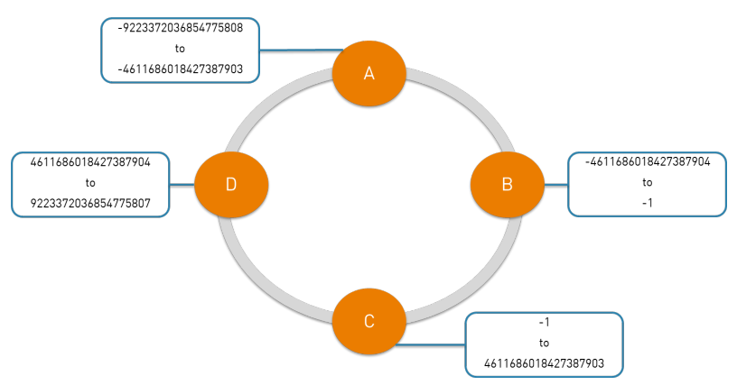

La distribuzione si fa tramite la `partition-key` in pratica c’è una funzione hash che associa, data la `partition-key`, un nodo. Siccome è una funzione hash è possibile che 2 righe diverse potrebbero finire sullo stesso nodo.

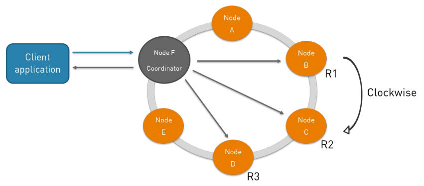

Nel meccanismo di replicazione, ciascun nodo quando riceve gli aggiornamenti coordina le operazioni con gli altri nodi.

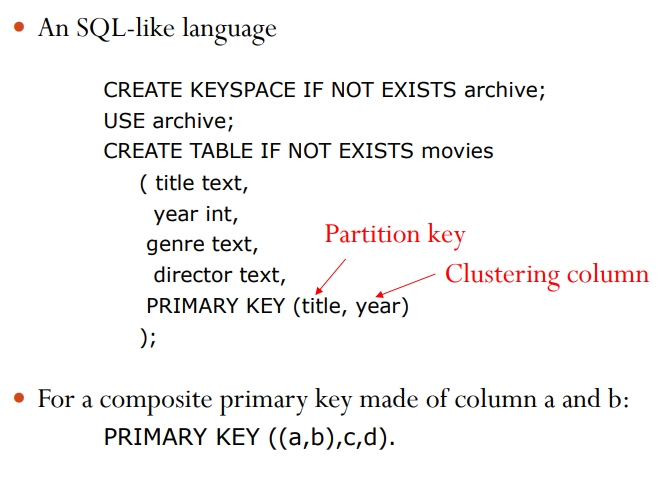

Il linguaggio di interrogazione è una variante di `SQL` chiamato `CQL`.  

Quello che si fa è creare un `keyspace` dove all’interno si definisce una tabella definendo la chiave primaria composta da `partition-key` e `clustering-column`.

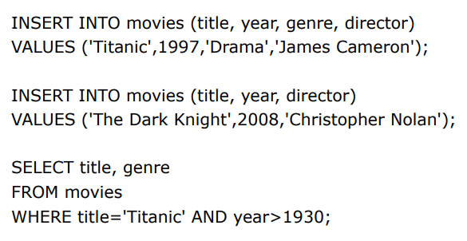

Gli inserimenti si fanno utilizzando i seguenti comandi utilizzando la notazione di `SQL` classico

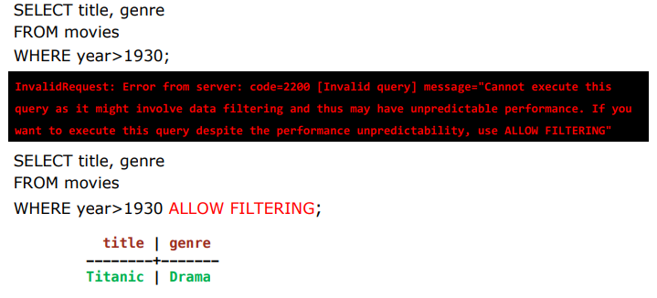

Non si possono fare interrogazioni SQL nella quale nella `where` non viene utilizzato il campo sulla quale è definito la `partition-key`. In pratica si devono essere utilizzati tutti i campi della chiave perché può richiedere un filtraggio dei dati con performance scadenti. Si può forzare però con `allow-filtering`.

Questo problema si può risolvere utilizzando gli indici: `CREATE INDEX ON movies(year)` 

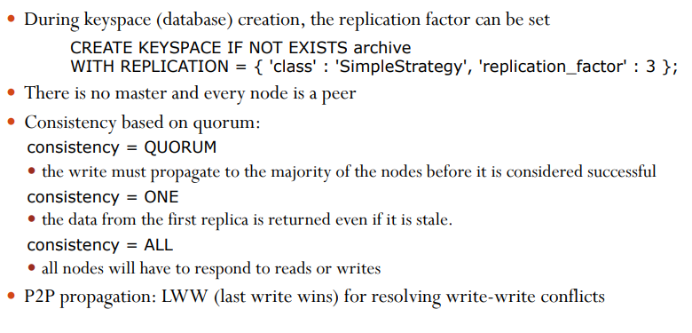

Si può definire il fattore di replicazione nel momento in cui si definisce il keyspace, dopodiché si definisce una volta per tutte il livello di consistenza.

### Suitable Use Cases

Simili a quelle di `MongoDB` ma con delle limitazioni, ma il grosso vantaggio rispetto alle limitazioni è che è possibile scalare su dimensioni più grandi. Non è possibile fare transazioni `ACID` e vale la regola del teorema `CAP`.

### When not to use

Si evitano questi tipi di database quando servono transazioni `ACID` robuste per letture e scritture oppure quando non si vogliono gestire i conflitti tra scritture simultanee

---

## Polyglot Persistence

Questi sistemi cercano di risolvere problematiche che i sistemi relazionali per loro natura non sono in grado di risolvere; in sostanza in qualunque azienda che ha bisogno di gestire applicazioni di tipo diverse possono nascere esigenze diverse. 

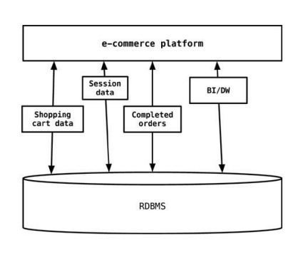

In questa immagine viene mostrato l’approccio tradizionale, cioè memorizzare tutto in unico sistema relazionale

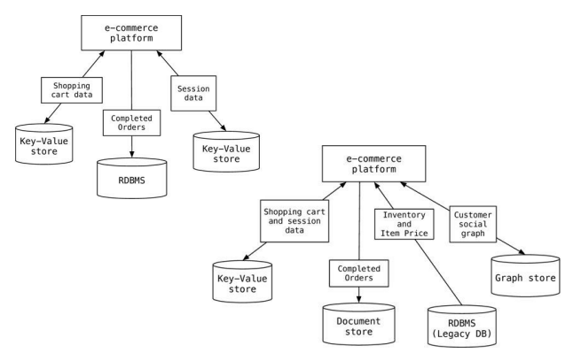

Al giorno d’oggi è possibile utilizzare un applicazione che fa uso di storage diversi, questo è proprio il concetto di persistenza poliglotta.

Naturalmente questo porta dei problemi perché non si ha un meccanismo omogeneo per gestire i dati, però si ha una maggiore eterogeneità.

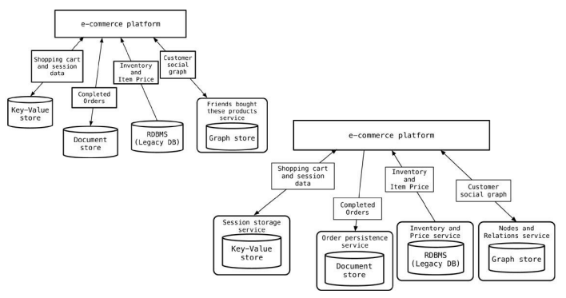

Tutto questo può essere incapsulato, cioè avere una maniera pulita per offrire un modo facile per accedere a questi servizi.

Garantisce in sostanza che la maniera di esportazione dei dati verso l’esterno sia uniforme, tramite l’utilizzo delle API.

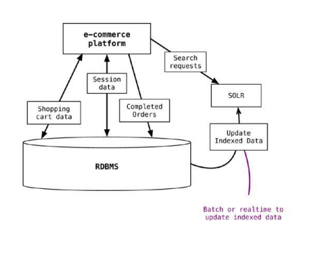

I sistemi relazionali continuano naturalmente a esistere, ma l’idea alla base della persistenza poliglotta è quella di poterli affiancare e integrare, estendendo l’architettura in modo flessibile quando emergono nuove esigenze, scegliendo di volta in volta la soluzione più adatta.

Il problema è che con la persistenza poliglotta aumenta la complessità.