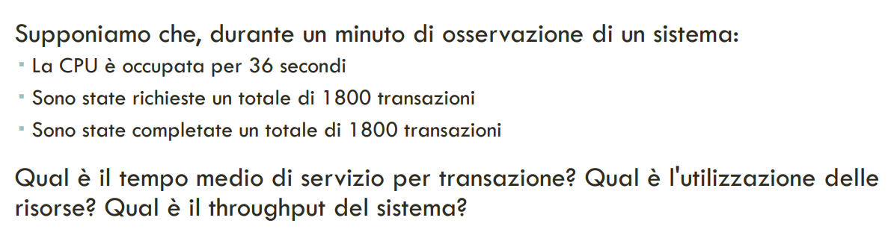
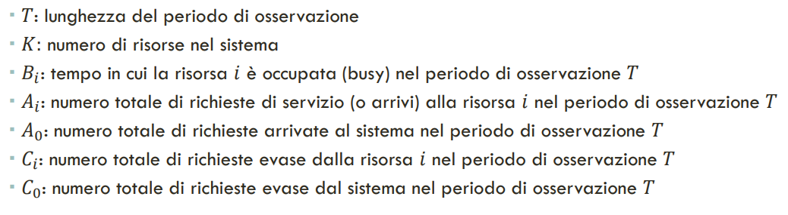
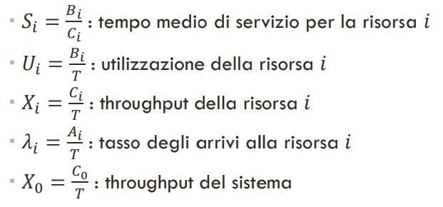
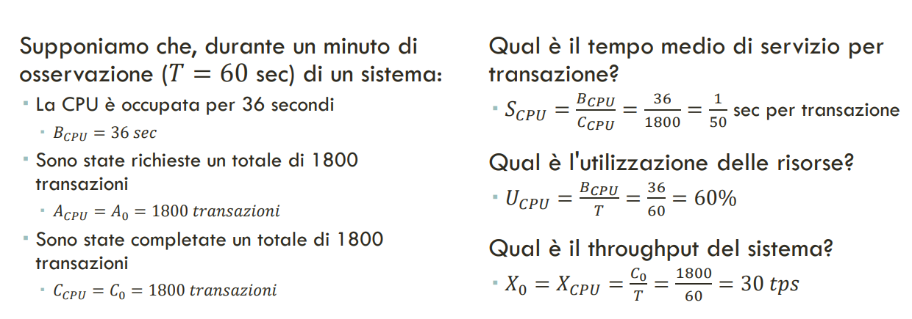
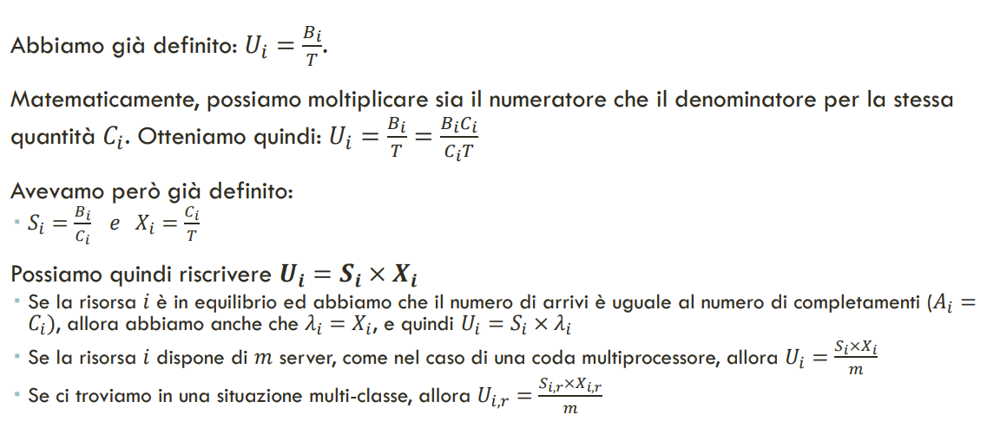
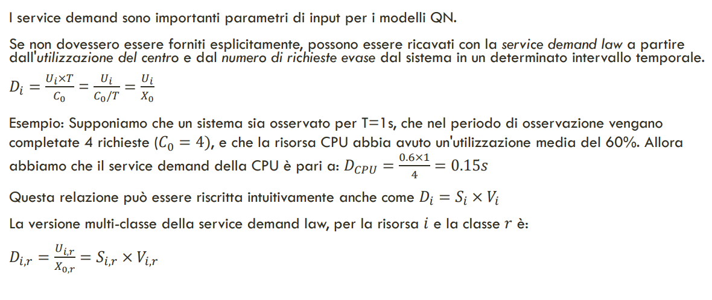

# 21 Maggio 2025

Text: Legge del service demand, Legge dell'utilizzazione, Variabili operazionali

## Variabili operazionali

Si introducono le `variabili operazionali`, che solitamente si possono misurare direttamente.

A partire da queste variabili operazionali si possono derivare ulteriori metirche

Adesso si può risolvere il problema

In molti casi è fondamentale poter dividere il workload in più classi, la notazione mostrata in precedenza è facilmente estensibile per supportare classi multiple introducendo $R$ numero di classi ed aggiungendo un indice alle variabili

## Legge dell’utilizzazione

## Legge del service demand

- `NOTA`: il service demand, per definizione, non include il tempo di coda ed è il tempo medio totale speso da una richiesta nella risorsa $i$