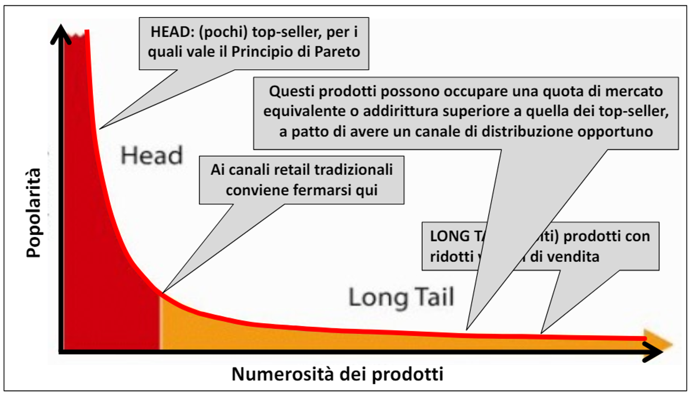
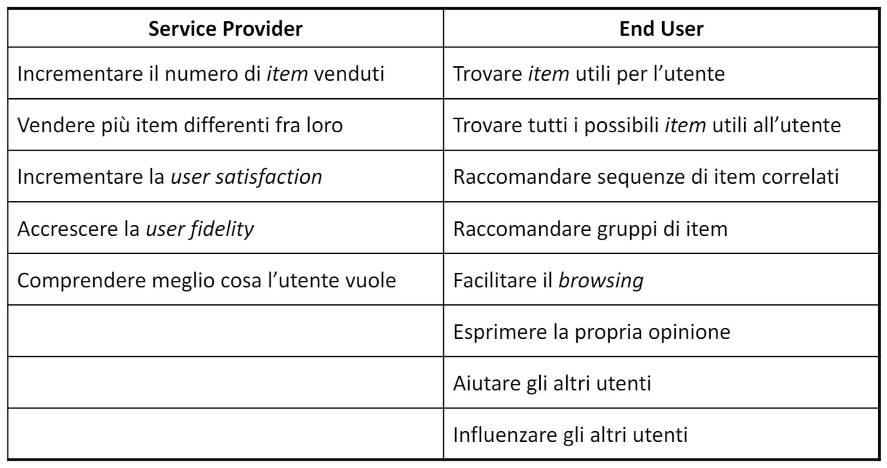

# 21 Maggio

Argomenti: Recommender System
.: Yes

## Recommender System

L’ideale sarebbe avere una serie di strategie per risolvere il `decision making problem`, i buoni consigli sono difficili da ricevere e nella maggior parte dei casi sono costosi, time-consuming e di qualità discutibile.

Sarebbe ideale disporre di un consulente personale che aiuti a prendere decisioni in maniera efficiente mirate al singolo utente; la realizzazione di sistemi che supportino gli utenti nel processo di decision making è l’obiettivo principale nell’ambito di sistemi di raccomandazione detti `recommender-system`. In particolare l’obiettivo del `RS` è fornire raccomandazioni facilmente accessibili, di alta qualita a un’ampia comunità di utenti.

Il `principio di pareto` è un principio empirico formulato in ambito economico che afferma che la maggior parte degli effetti è dovuta a un numero ristretto di cause, questo vale solo per grandi numeri 

## Long tail

I prodotti della long tail possono avere una quota di mercato anche superiore dei top-seller a patto di avere un canale di distribuzione opportuno.

---

L’idea è che i `recommender-system` aiutano ad associare `user` e `item`, si occupano di ridurre il problema dell’information overload. I `recommended-systems` sono degli agenti software che determinano le preferenze e gli interessi dei consumer individuali e fanno delle raccomandazioni di conseguenza; essi hanno la possibilità di supportare e migliorare la qualità delle decisioni che i clienti prendono per cercare e selezionare i prodotti online.

Ovviamente utenti diversi ottengono raccomandazioni diverse, questo è diverso dal `group-recommendation` che si occupa di massimizzare il grado di apprezzamento di tutti i membri del gruppo. 

## Obiettivi e fattori di successo

In questa immagine è mostrato il ruolo di un `recommender-system`.

Gli obiettivi sono diversi e dipendono dal dominio, non esite perciò uno scenario di valutazione unitario. Quello che fanno è ridurre i costi di ricerca, forniscono raccomandazioni “corrette” e gli utenti conoscono in anticipo cosa vogliono. In termini di predizione gli RS predicono il rating con cui a un certo utente piace/non piace un certo item.

## Ruolo di un RS per il service provider

- Gli item raccomandati sono probabilmente adatti alle reali esigenze e ai desideri dell’utente quindi aiuta ad incrementare il numero di item venduti.
- L’utente quando utilizza un RS può selezionare item che potrebbero essere difficili da trovare senza una buona raccomandazione precisa, quindi aiuta anche a vendere più item differenti fra loro
- L’utente troverà le raccomandazioni interessanti, rilevanti e apprezzerà l’utilizzo del sistema, quindi la RS incrementa la user satisfaction
- Un utente dovrebbe essere federe a un sito web che riconosce il vecchio cliente, quindi RS deve accrescere la user fidelity
- La RS deve comprendere meglio cosa l’utente desidera
