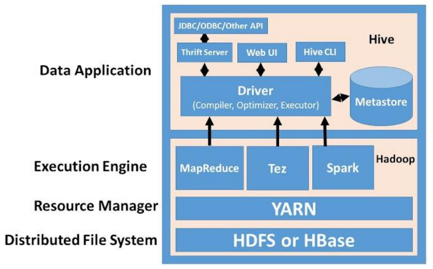
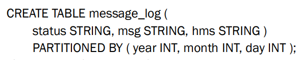
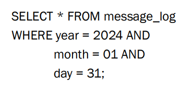
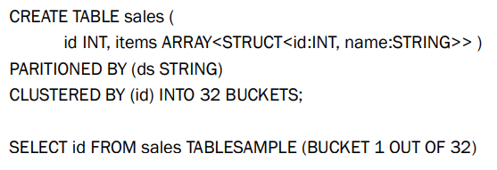
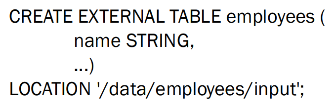
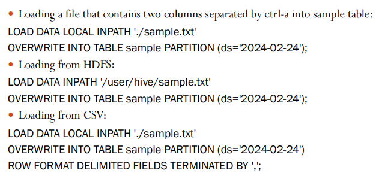
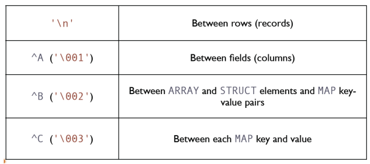
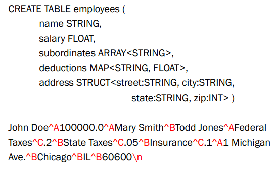

# 21 Marzo

Tags: Data Loading, Data Units, File Formats, Hive, Locations
.: Yes

## Hive

Il framework `apache-hadoop` supporta applicazioni distribuite ad alta intensità di dati, il problema è che usare il modello `map-reduce` è difficile da programmare, non è riutilizzabile ed é error prone.

Una soluzione è `apache-spark` ma il problema è che non è facile da usare e che la maggior parte degli utenti conosce `java`/`sql`/`bash`. Un altra possibile soluzione è quella di rendere i dati non strutturati simili a tabelle indipendentemente dal loro utilizzo cosi da poter utilizzare un sistema chiamato `SQL-over-Hadoop`:

- memorizzazione dei dati avviene sempre su Hadoop file system
- si fa utilizzo di query basate su SQL per poter lavorare con queste tabelle

Si introduce cosi `hive`, un’infrastruttura costruita sopra `hadoop` che consente di fare interrogazioni e vedere i dati in forma strutturata. Lo scenario di applicazione è la presenza di alta latenza e nessun aggiornamento a livello di riga; il miglior utilizzo è il lavoro batch su grandi set di dati. Tuttavia delle recenti versioni consentono una forma di transazione `ACID` a livello di riga utilizzando il locking, cioè una applicazione può aggiungere righe mentre un’altra legge dalla stessa partizione senza interferire. 

L’infrastruttura `HIVE` garantisce buoni livelli di performance perché `SQL` non viene eseguito da un DBMS relazione classico a causa di limiti di scalabilità. Lo scenario quindi è sempre quello del big-data cioè fare analisi su grandi dimensione di dati in cui l’obiettivo non è prevalentemente selezionare alcuni record di interesse ma fare operazione di `summarization` cioè estrarre informazioni che riassumono alcune proprietà dei dati che si hanno a disposizione.

Da notare che `spark` fa parte dei motori di esecuzione

Il `metastore` descrive come sono fatti i dati sottostanti, tramite questa descrizione il `driver` sa trasformare l’interazione `SQL` nell’opportuna elaborazione `map-reduce`, `tez` o `spark`

L’utilizzo di connettori consente di memorizzare `Hive` su diversi data store, il flusso tipo di operazione è descritto di seguito:

1. Un client si connette via JDBC, Thrift o CLI
2. Il Driver riceve la query, la compila e ottimizza
3. L'executor la esegue usando uno dei framework (MapReduce, Tez o Spark)
4. I dati vengono letti/scritti da HDFS/HBase
5. Le risorse sono gestite da YARN

## Data Units - HIVE

I dati di riferimento sono le basi di dati che sono fatte di tabelle. Una cosa che non c’è nello standard SQL ma che esiste in HIVE sono le `partitions`. Questa suddivisione è fatta sulla base dei valori di alcune colonne che si chiamano `partition-keys`, cioè dopo aver definito una colonna di partizione si prendono tutti i valori uguali che compaiono su questa colonna per formare una partizione, questo meccanismo di partizione consente di eseguire alcune query in maniera più efficiente.

Come detto prima il partizionamento permette di partizionare orizzontalmente una tabella, per esempio in questo caso si ha una tabella di messaggi e quello che si fa è partizionarlo secondo la data in particolare per anno, mese e giorno. Questi campi possono essere poi utilizzati come attributi della tabella però servono al tempo stesso per partizionare la tabella. Queste partizioni vengono salvate in directory separate.

Il vantaggio di tutto ciò è velocizzare la risposta di alcune interrogazioni che fanno riferimento per una specifica data perché banalmente il sistema non deve scandire un file ma va a interrogare soltanto la partizione e quindi la directory di interesse

I `bucket`(`cluster`) sono anche questi dividono i dati in porzioni in particolare una partizione può essere divisa in `bucket`, in sostanza servono per fare operazioni particolari ovvero estrarre campioni di dati (non tutti)

In questo esempio si clusterizza sulla base dell’attributo `id` in 32 buckets.

Si può fare un’interrogazione su `sales` prendendo un bucket per ottenere dei samples.

## Locations e data-loading

Si può specificare la locazione di questi dati; queste `locations` possono essere locali, in `HDFS` oppure in `S3`.

In `HIVE` è possibile fare l’operazione di join su dati che hanno locazioni diverse

In base alla locazione dei dati ci sono diversi modi per fare `data-loading`

## File formats - HIVE

Il formato dei dati (che vengono memorizzati in sistemi di storage tipo `hdfs` o `hbase`) con cui può operare `HIVE` possono essere text file, CSV, etc.

Per esempio nel caso di formato text file bisogna definire dei `terminators` che stabiliscono la fine di una riga o di un campo, per poterli trasformare in tabelle.

Utilizzando i `terminators` è possibile creare una tabella, in questo esempio `employees`, in formato di text file 

## Vantaggi e Svantaggi

- `vantaggio`: Offre un modo semplice per elaborare dati su larga scala, aiutando con il supporto per query basate su SQL
- `svantaggio`: è potenzialmente inefficiente, non è adatto agli aggiornamenti dei dati, I file sono raramente aggiornati.