# 21 Marzo

Argomenti: Expected Prediciton Error, Ottmizzazione Lasso, Subgradiente della funzione valore assoluto, Subgradiente di funzioni convesse
.: Yes

## Ottimizzazione Lasso

La funzione obiettivo per il Lasso da ottimizzare mediante coordinate descent è la seguente:

$$
RSS(\bold w)+\lambda\cdot||\bold w||_1=\sum_{i=1}^{N}\left[y_i-\sum_{j=0}^{D}\left(w_j\phi_j(\bold x_i)\right)\right]^2+\lambda\sum_{j=0}^{D}|w_j|
$$

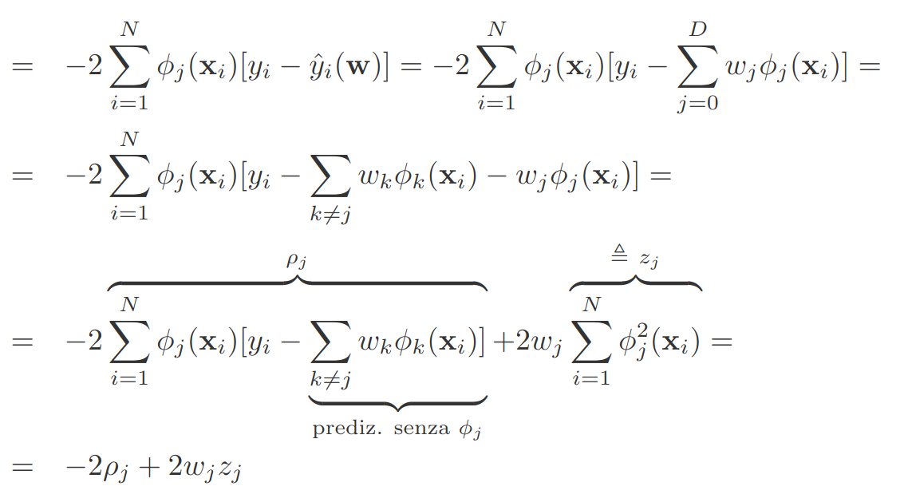

Questi sono i procedimenti per ottenere la forma di $\frac{\partial RSS(\bold w)}{\partial w_j}$

Il problema del secondo termine è che per il calcolo della derivata parziale in $0$ non è derivabile quindi si sfrutta il concetto di `subgradiente` di funzioni convesse

## Subgradiente di funzioni convesse

Visto che non si può calcolare il gradiente per funzioni non differenziabili, si sfrutta il subgradiente per ottenere la derivata di una funzione.

$$
g(\bold w)\ge g(\bold v)+\bold S^T(\bold w-\bold v)
$$

Un vettore $S$ che soddisfa questa condizione è detto `subgradiente` di $g$ in $\bold v$

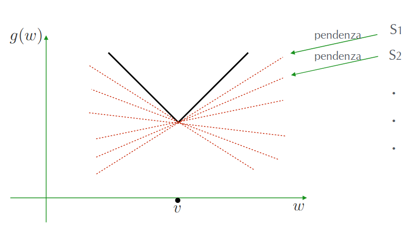

L’insieme dei subgradienti di $g$ in $\bold v$ è chiamato `differential-set` e indicato con $\partial g(\bold v)$ con $g:\mathbb{R}\to\mathbb{R}$

In sostanza si sfrutta il `differential-set` per capire se un punto è minimo o meno.

## Subgradiente della funzione Valore assoluto

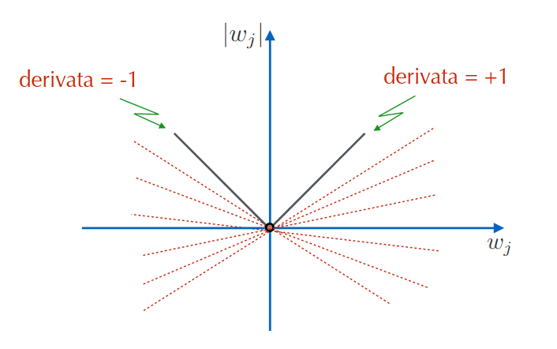

In questo esempio nel punto $0$ la funzione valore assoluto non è differenziabile

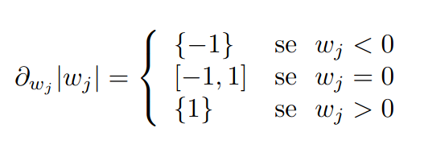

Il `differential-set` è dunque il seguente per i vari punti. In sostanza se $w_j=0$, quindi nel punto non derivabile allora il `d-s` è nell’intervallo $[-1,1]$, in tutti gli altri punti collassa per il valore della derivata.

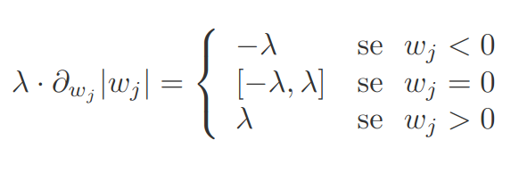

Nel caso del lasso, si ha che $\lambda$  moltiplica la derivata di $w_j$, considerando i valori precedenti è facile trovare il nuovo `differential-set`.

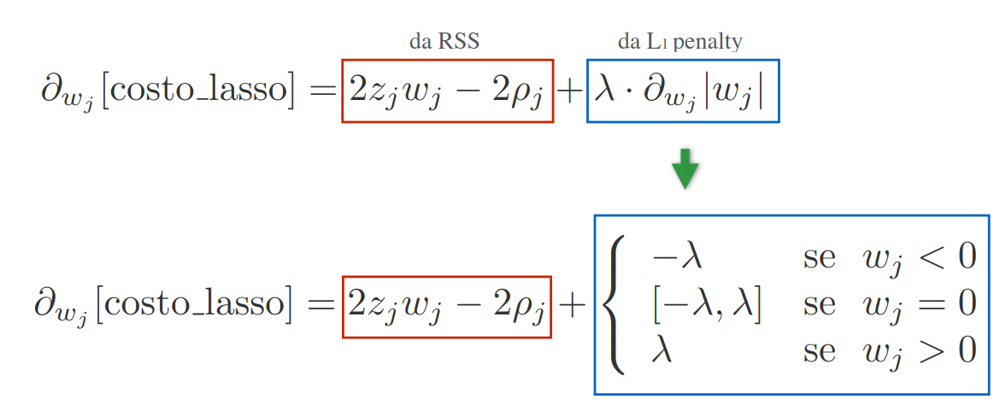

Quindi mettendo tutto insieme la derivata parziale della funzione costo lasso è mostrata in questa immagine

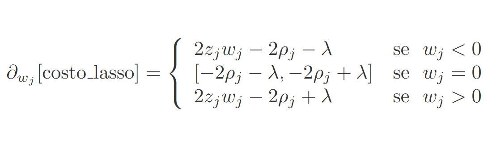

Sviluppando l’espressione precedente si ottiene questa forma

## Soluzione ottima della funzione costo lasso

Adesso che si ha la derivata parziale la si uguaglia a $0$ e si calcolano i vari pesi:

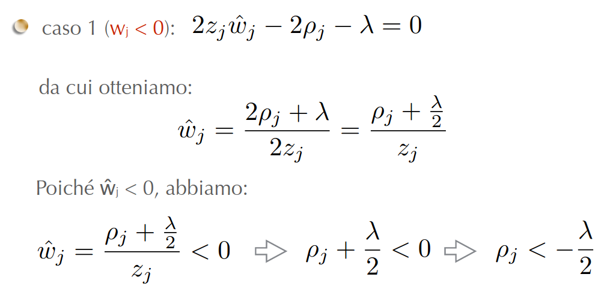

Caso in cui $w_j<0$

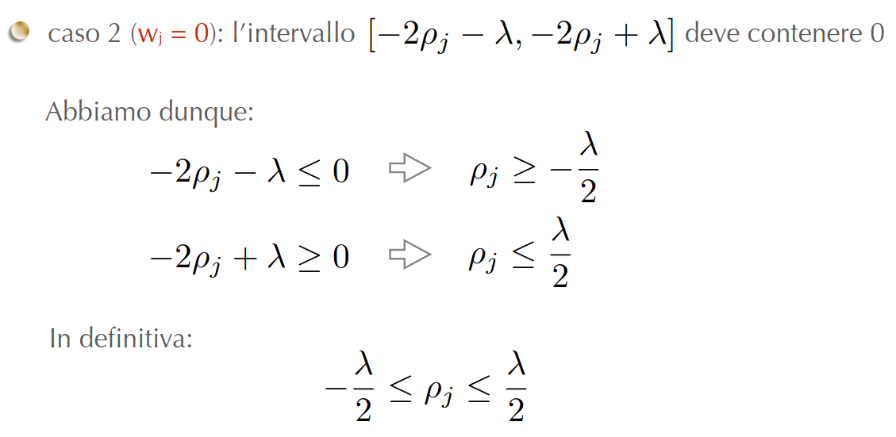

Caso in cui $w_j=0$

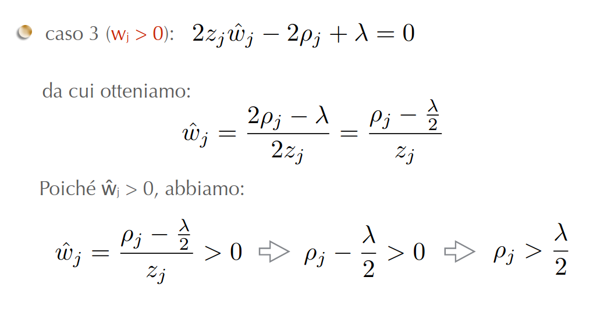

Caso in cui $w_j>0$

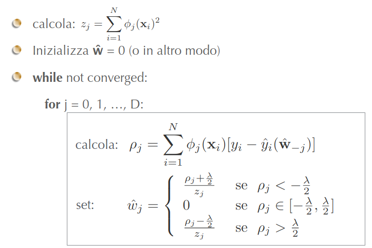

Qui di seguito è mostrato l’algoritmo coordinate descent per Lasso, con feature non normalizzate

---

## Training Set Randomness

Si suppone di avere un training set di $N$ osservazioni, potrebbe accadere che da queste $N$ osservazioni se ne potrebbero aggiungerne altre. La domanda che ci si pone è il come le prestazioni del sistema cambiano.

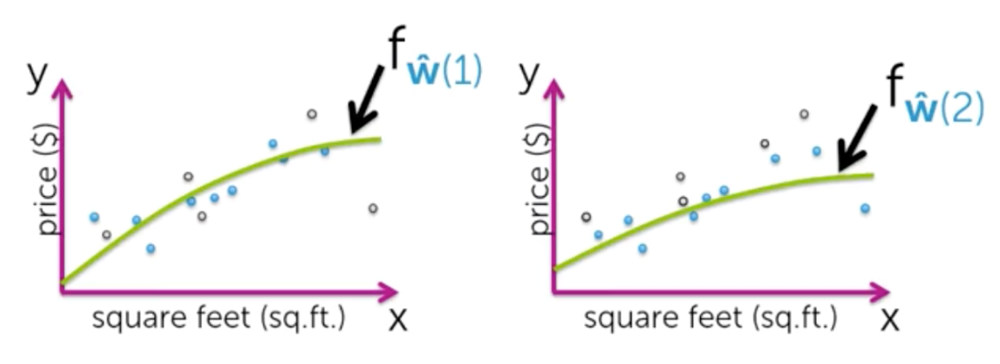

Se si volesse valutare la prestazione dei 2 `fit`, quindi a 2 situazioni relative a 2 diverse scelte del training set, bisogna prendere in considerazione il `generalization-error`.

Nei 2 casi si otterranno 2 valori diversi del generalization-error

## Expected Prediction Error

Idealmente, si vorrebbe poter ottenere una misura delle prestazioni del sistema, mediata su tutti i possibili training set. Tale quantità può essere definita come `expected-prediction-error` (EPE).

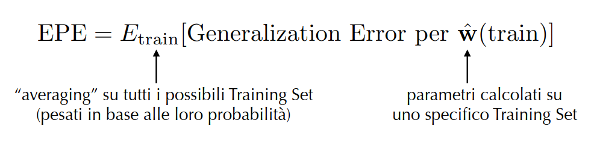

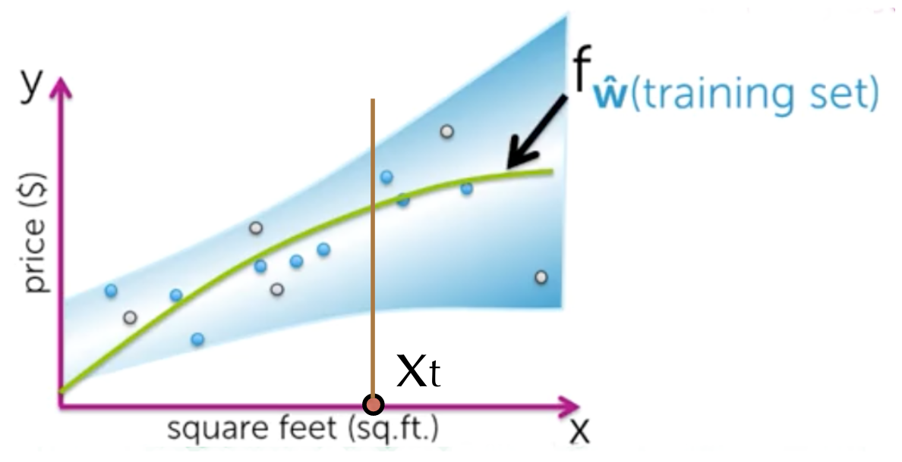

Per analizzare questo tipo di errore, si comincia prendendo in considerazione, uno specifico punto $\bold x_t$, supponendo che la loss function sia la seguente:

$$
L=\left[y,f_{\widehat{\bold w}}(x)\right]=\left[y-f_{\widehat{\bold w}}(x)\bold x\right]^2
$$

E’ possibile dimostrare che l’errore `EPE` in $\bold x_t$ è uguale alla somma di 3 termini:

$$
EPE(\bold x_t)=\sigma^2+\left[bias(f_{\widehat{\bold w}}(\bold x_t))\right]^2+var[f_{\widehat{\bold w}}(\bold x_t)]
$$

## Noise : Varianza dell’Errore del modello

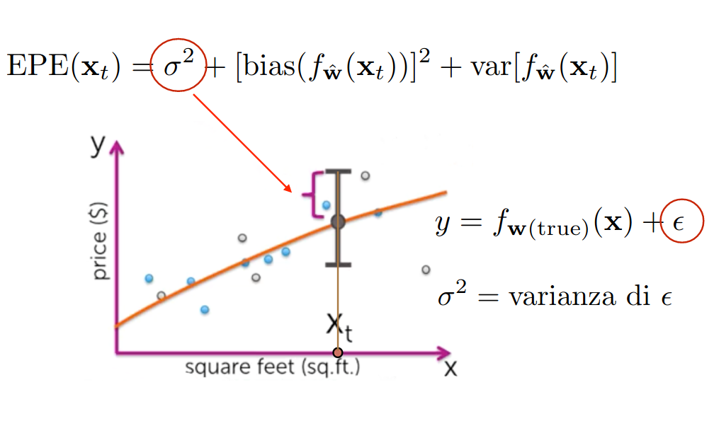

In generale si ha che $y=f_{\bold w(true)}(\bold x)+\epsilon$, dove $\epsilon$  è l’errore che necessariamente si ha perché evidentemente non si sono considerate altre feature, ecc.

Il $\sigma^2$ è la varianza di $\epsilon$

## Bias della funzione stimata

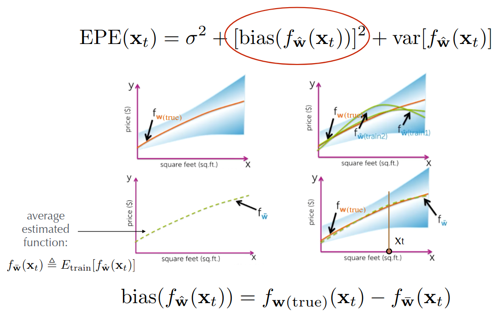

Il `bias` della funzione stimata è definita come la differenza della $f$ true e la $f$ media

## Varianza della funzione stimata

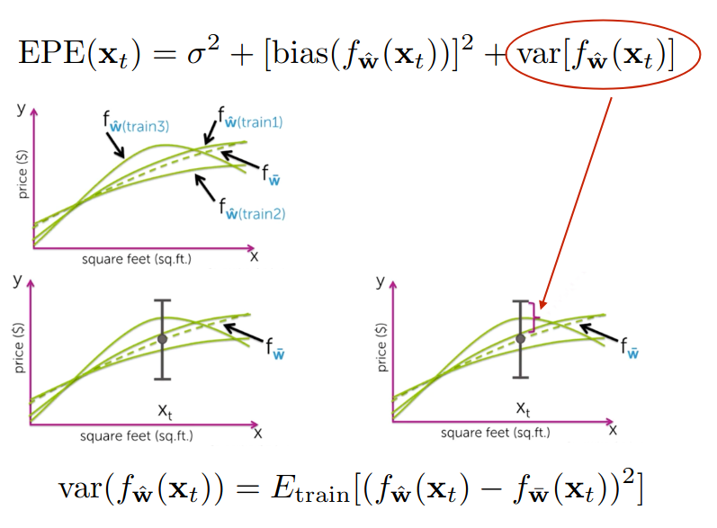

La `varianza` della funzione stimata è definita come il valore atteso al variare del training set del quadrato della differenza della $f$ stimata e la $f$ media

## Dimostrazione per l’Expected Prediction Error

Prima di cominciare con la dimostrazione, ci si riscrive la definizione di tale errore:

$$
\begin{align*}
  EPE &= E_{train}\left[\text{Generalization Error per }\widehat{\bold w}(train)\right] \\
  &= E_{train}\left[E_{\bold x,y}\left[L(y,f_{\widehat{\bold w}(train)}(\bold x))\right]\right] \\
\end{align*}
$$

$$
\begin{align*}
  L\left[y,f_{\widehat{\bold w}}(x)\right] &= (y-\widehat{y})^2 \\
  &= \left[y-f_{\widehat{\bold w}}(\bold x)\right]^2 \\
\end{align*}
$$

Si fanno le seguenti assunzioni, riferendosi ad uno specifico $\bold x_t$

$$
\begin{align*}
  &= E_{train,y_t}\left[(y_t-\widehat{y}_t)^2\right] \\
  &= E_{train,y_t}\left[(y_t-f_{\widehat{\bold w}(train)}(\bold x_t))^2\right] \\
\end{align*}
$$

Con le precedenti assunzioni, l’espressione per l’`epe` si semplifica come descritto, dove non si ha più l’expectation su $\bold x$, avendo fissato uno specifico $\bold x_t$, e dove l’expectation su $y$ è diventata l’expectation su $y_t$ perché bisogna considerare solo le osservazioni con l’input $\bold x_t$

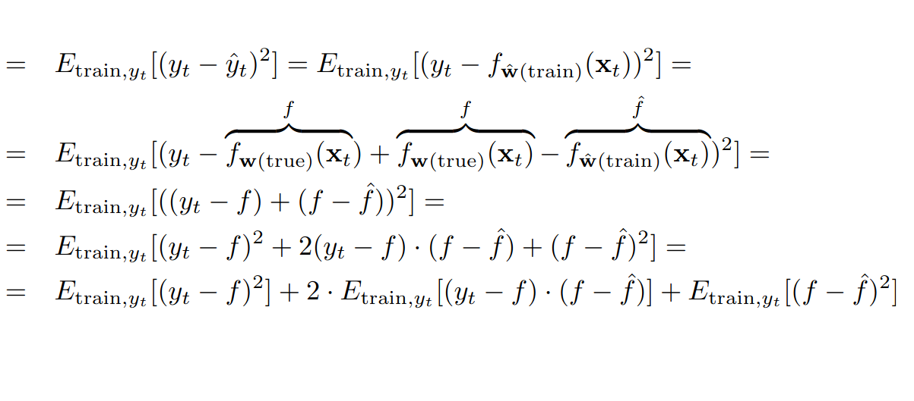

Partendo dall’espressione precedente, si dimostra la formula dell’`epe` ottenendo 3 termini:

$$
\begin{align*}
  E_{train,y_t}\left[(y_t-f)^2\right] &= E_{y_t}\left[(y_t-f)^2\right]
\\
  &= E_{y_t}\left[\epsilon^2\right] \triangleq \sigma^2
\end{align*}
$$

Il primo termine si semplifica come segue, poiché $y_t$ e $f$ non dipendono dal training set. Si noti che l’expectation del quadrato dell’errore $\epsilon$ è la varianza di $\epsilon$, avendo esso media nulla.

$$
\begin{align*}
  &= 2\cdot E_{train,y_t}\left[(\epsilon)\cdot(f-\widehat{f})\right]
\\
  &= 2\cdot E_{train,y_t}\left[\epsilon\right]\cdot E_{train,y_t}\left[(f-\widehat{f})\right]
\\
  &= 2\cdot 0\cdot E_{train,y_t}\left[(f-\widehat{f})\right]=0
\\
\end{align*}
$$

Il secondo termine si semplifica come segue. Da notare che $\epsilon$ è indipendente da $f$ e $\widehat{f}$ e quindi è indipendente dalla loro differenza, da notare anche che l’expectation di $\epsilon$ è nullo

$$
MSE(\widehat{f})\triangleq E_{train}\left[(f-\widehat{f})^2\right]
$$

Per il secondo termine, si considera il `means-squared-error` (MSE), definito come segue

$$
EPE(\bold x_t)=\sigma^2+MSE(\widehat{f})
$$

Considerando che il secondo termine è nullo bisogna dimostrare che $MSE(\widehat{f})$ è la somma di $\left[bias(\widehat{f})\right]^2$e $var(\widehat{f})$

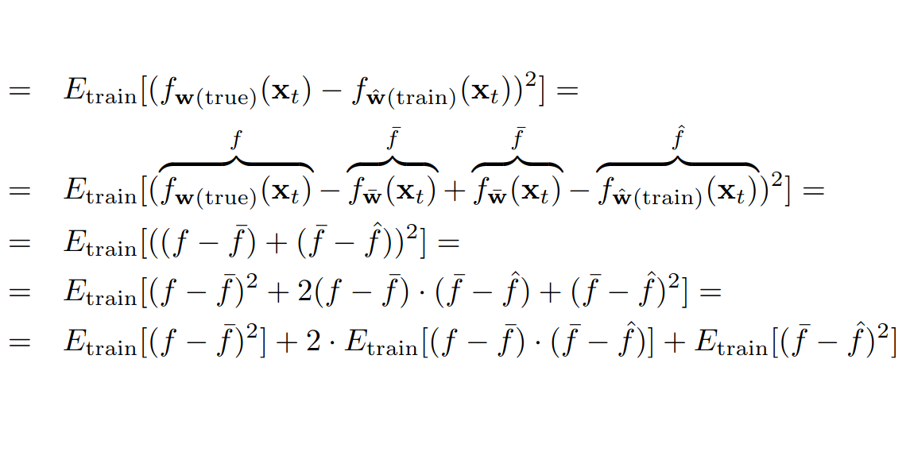

Questo è lo sviluppo di $MSE\left[f_{\widehat{\bold w}(train)}(\bold x_t)\right]$

$$
\begin{align*}
  E_{train}\left[(f-\overline{f})^2\right] &= (f-\overline{f})^2
\\
  &\triangleq \left[bias(\widehat{f})\right]^2
\end{align*}
$$

Visto che $\widehat{f}\triangleq E_{train}\left[\widehat{f}\right]$ si ottiene che il primo termine è uguale al bias di $\widehat{f}$ poiché $f$ e $\overline{f}$ non dipendono dal training set

$$
\begin{align*}
  &= 2\cdot (f-\overline{f})
\cdot E_{train}\left[(\overline{f}-\widehat{f})\right] \\
  &= 2\cdot (f-\overline{f})
\cdot \left(\overline{f}- E_{train}\left[\widehat{f}\right]\right)
\\
  &= 2\cdot (f-\overline{f})
\cdot \left(\overline{f}- \overline{f}\right)
\\
  &= 0
\end{align*}
$$

Sviluppo del secondo termine

$$
\begin{align*}
  &= E_{train}\left[\left(\overline{f}-\widehat{f}\right)^2\right] \\
  &= E_{train}\left[\left(\widehat{f}-\overline{f}\right)^2\right]
\\
  &\triangleq var(\widehat{f})
\end{align*}
$$

Sviluppo del terzo termine