# 21 Marzo

Argomenti: Hash-join, Merge-join, Nested-loop con indice
.: No

## Nested-loop con indice

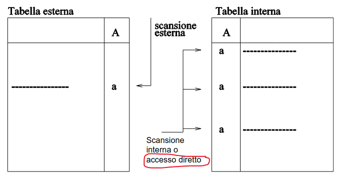

Si suppone di avere una relazione “esterna” (perchè nel ciclo è quella che viene esaminata per prima) e una seconda chiamata “interna” supponendo che ci sia una struttura che permetta l’accesso diretto quindi un indice o un hash

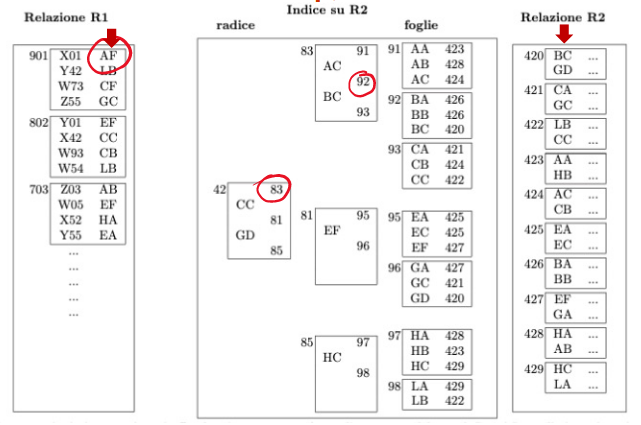

Rivedendo l’esempio le 2 frecce rosse indicano i 2 campi in cui vengono eseguiti i join; la prima cosa che si fa è una scansione della relazione $R1$ e per ciascuna ennupla di $R1$ si esegue un accesso all’indice.

In questo step il record con $AF$ non da nessun contributo al join

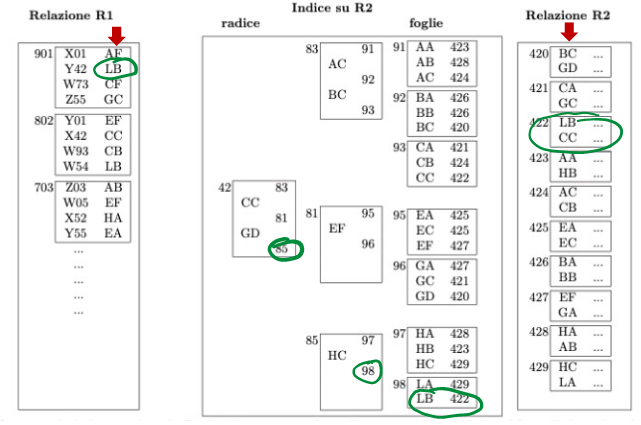

In questo caso il record con $LB$ da un contributo al join.

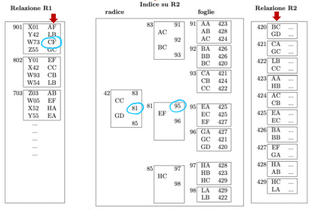

In questo caso il record con $CF$ non da contributo al join

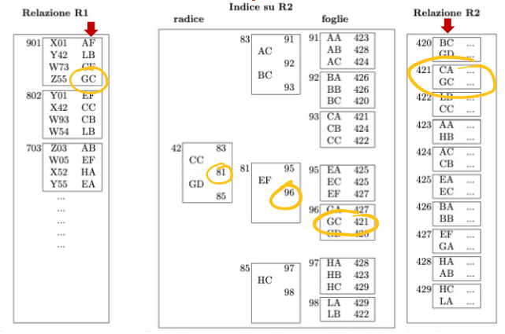

In questo caso il record con $GC$ da contributo al join

Adesso che è stato esaurito il primo blocco verrà eseguita l’unpin sul primo blocco passando al successivo.

## Nested-loop con indice, costi

Per calcolare il costo di tale operazione bisogna tenere conto del numero di blocchi della prima relazione perchè deve essere letta tutta quanta, l’indice che viene visitata tante volte quanti sono i record del file. Formalmente si ha:

- $R_1$ con $L_1$ ennuple e $N_1$ blocchi
- $R_2$ con $L_2$ ennuple e $N_2$ blocchi e indice di profondità $I_2$

Nell’algoritmo base il costo è la scansione di $R_1$ e, per ciascun record di $R_1$, si fa l’accesso diretto a $R_2$ con costo: $N_1+L_1\cdot(I_2+1)$, (+1 perché si fa l’accesso)

Con più pagine di buffer i livelli più alti dell’indice ad esempio 2, sono nel buffer quindi il costo è $N_1+L_1\cdot(I_2-2+1)$ 

## Merge-join

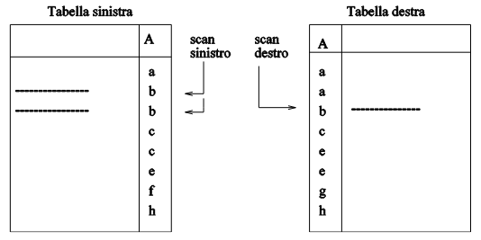

L’intuizione di questo algoritmo è che se i 2 file sono ordinati sul campo di join si possono fare 2 scansioni parallele

Il costo è lineare, approssimativamente sarebbe la somma del numero di blocchi delle 2 relazioni

Se i file sono disordinati e vengono ordinati preliminarmente o meglio durante il join stesso il costo dei 2 ordinamenti è $3\cdot(N_1+N_2)$, se invece i file sono sempre disordinati ma ci sono indici si ha $L_1+L_2$

## Hash-join

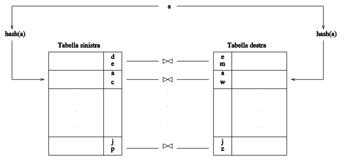

Si usa la stessa funzione hash ai campi di join delle 2 relazioni, si noti che non c’è e non serve una struttura hash sui 2 file

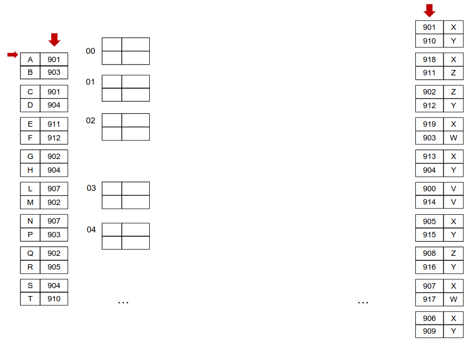

Si suppone di avere 2 file, di cui si fa un join sull’attributo della prima relazione e la chiave della seconda relazione.

Quello che si può pensare di fare è di avere una funzione hash che si utilizza per “preparare” il join. 

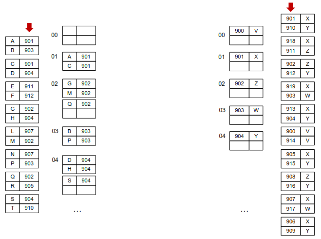

Si costruisce quindi una struttura temporanea di supporto, si fa la scansione del primo file ottenendo il bucket mostrato a sinistra, stessa cosa si fa la scansione ottenendo il bucket mostrato a destra

La funzione hash utilizzata per le 2 relazioni deve essere la stessa

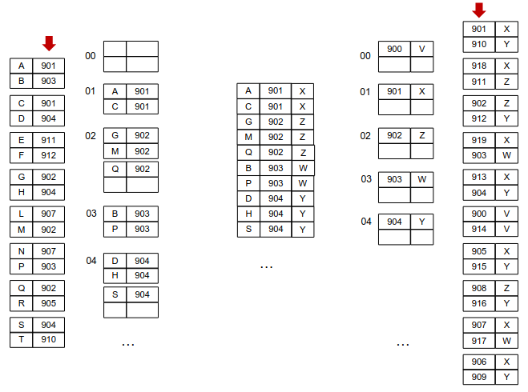

Eseguire i `join` adesso è estremamente semplice perchè bisogna solamente accoppiare i bucket corrispondenti allo stesso valore di hash.

Per calcolare il costo si considerano 2 file con $N_1$,$N_2$ record e $B_1$,$B_2$ blocchi rispettivamente si ha:

- il primo file viene letto sequenzialmente (costo $B_1$)
- i record, durante la lettura, vengono memorizzati secondo la funzione hash (costo $N_1$)
- secondo file viene letto sequenzialmente (costo $B_2$)
- i record, durante la lettura, vengono memorizzati secondo la funzione hash (costo $N_2$)
- poi si rilegge il tutto ($B_1$ e $B_2$) per “accoppiare”

Quindi si ottiene che il costo è $B_1+N_1+B_2+N_2+B_1+B_2$

## Hash-join con buffer

Sfruttando i `buffer`, si può usare una funzione hash con numero di valori di versi paragonabile al numero di pagine di buffer $P$ a disposizione.

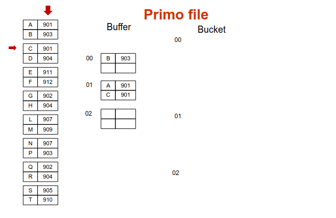

Quello che si fa è utilizzare 3 bucket dove per costruirli si avranno bisogno 3 pagine di buffer; si procede quindi alla scansione che una volta arrivato a $C$ il blocco è pieno e per poter continuare l’algoritmo in memoria centrale bisogna scaricare il blocco 1 in memoria secondaria 

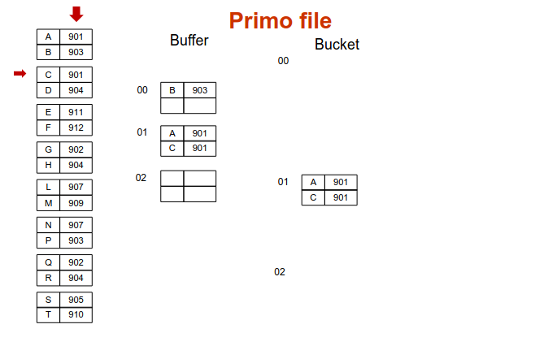

Ottenendo la situazione riportata in questa immagine

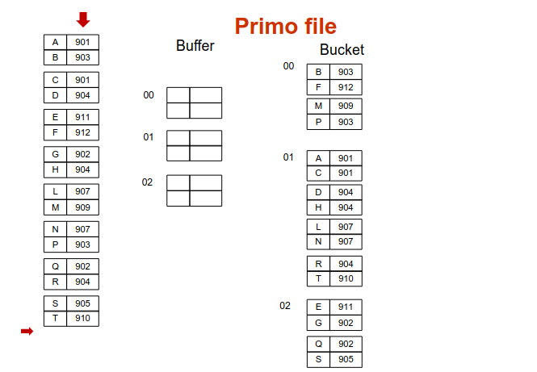

Andando fino alla fine si ottiene la situazione sei bucket mostrata in questa immagine

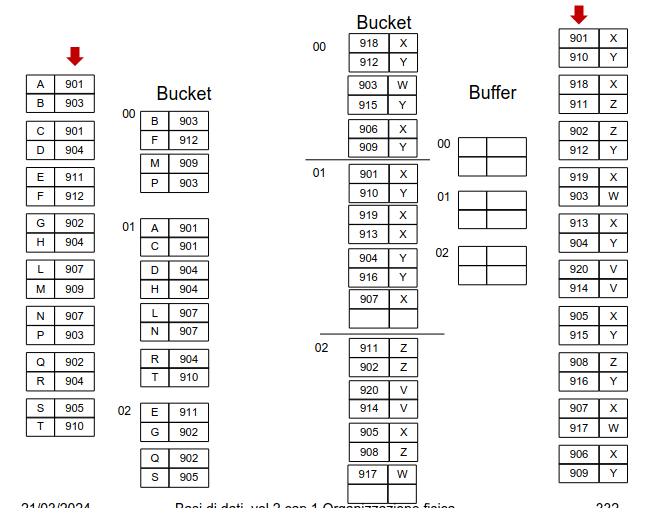

Facendo lo stesso procedimento per il secondo file si ottengono i seguenti bucket

Il costo di lettura è $B_1+B_2$, l’algoritmo non richiede altri accessi se le singole partizioni di uno dei file entrano in memoria, cioè se $min(B_1,B_2)/P<P$ cioè se $P^2>min(B_1,B_2)$. 

## Confronto dei 2 metodi

Se ci si aspetta che il risultato è piccolo conviene `nested-loop` con indice

Per operazioni grandi di dimensione paragonabile conviene `merge-join`, in teoria anche `hash-join` ma non è garantita la distribuzione uniforme dei valori

Per operazioni grandi ma di dimensione diverse conviene `hash-join`

## Pipelining vs Materializzazione

Ci sono 2 alternative per le interrogazioni nei sottoalberi:

- `pipelining`: le ennuple sono utilizzate dal nodo superiore a mano a mano che vengono prodotte, sono vantaggiose perché non si devono salvare risultati intermedi riducendo i costi di I/O. Svantaggioso perché se i risultati intermedi vengono riutilizzati più volte, è necessario ricalcolarli
- `materializzazione`: l’intero risultato intermedio viene prodotto e memorizzato, prima di essere utilizzato.

## Processo di esecuzione delle interrogazioni

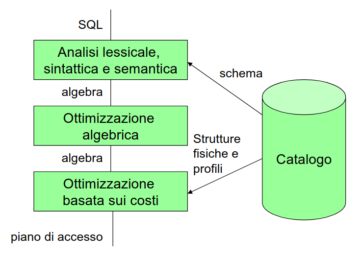

Le interrogazioni si scrivono in `sql` vengono ottimizzate attraverso l’algebra relazionale e poi implementata secondo un piano di accesso che prevede l’implementazioni di operatori visti in precedenza

## Ottimizzazione basata sui costi

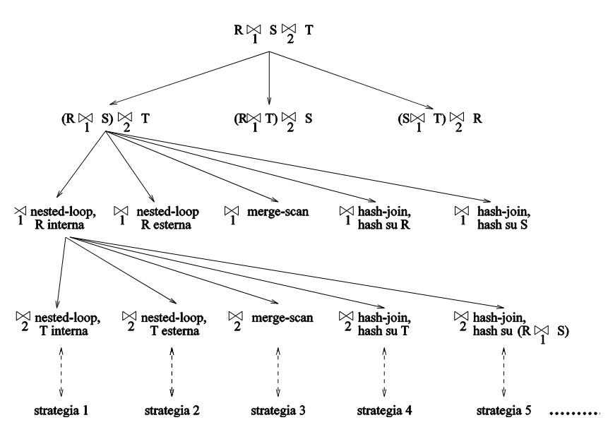

Per ciascuna interrogazione esistono diverse modalità di interrogazione, quello che si fa è costruire un albero di decisione con le varie alternative quindi diversi piani di esecuzione. Si valuta poi il costo di ciascun piano scegliendo quella minore. L’ottimizzatore trova di solito una buona soluzione non necessariamente quella ottima.

## Progettazione fisica

La fase finale del processo di progettazione di basi di dati è la `progettazione fisica`. In input si da lo schema logico e informazioni sul carico applicativo e in output si ottiene lo schema fisico costituito dalle definizione delle relazioni con le relative strutture fisiche.