# 21 Novembre

Argomenti: Algoritmi Genetici, Metodi di Crossover, Metodi di mutazione, Metodi di selezione Genitori
.: Yes

## Algoritmi Genetici

Una delle tecniche per la risoluzioni dei problemi è la famiglia di algoritmi chiamata `calcolo evolutivo`. All’interno di questa famiglia, il ramo più importante e ampiamente utilizzato è noto come `Algoritmi Genetici`.

Imitando il processo di selezione e riproduzione naturale, gli `Algoritmi Genetici` possono produrre soluzioni di alta qualità per vari problemi che coinvolgono la ricerca, l’ottimizzazione e l’apprendimento.

Questi algoritmi implementano una versione semplificata dell’evoluzione darwiniana che avviene in natura. I principi della teoria dell’evoluzione darwiniana possono essere riassunti utilizzando i seguenti principi:`Variazione`,`Ereditarietà` e `Selezione`

Un importante fattore abilitante dell’evoluzione è il `crossover` o `ricombinazione`, in cui la prole viene creata con un mix dei tratti dei genitori, aiutando a mantenere la diversità della popolazione e a riunire i tratti migliori nel tempo. Inoltre le `mutazioni` (variazioni casuali nei tratti) possono svolgere un ruolo nell’evoluzione introducendo cambiamenti che possono comportare un balzo in avanti ogni tanto.

Gli algoritmi genetici cercano di trovare una soluzione ottima per un dato problema; mentre nella popolazione darwiniana viene mantenuta una popolazione di individui di una certa specie, negli algoritmi genetici viene mantenuta una popolazione di soluzioni candidate chiamate individui per il problema in questione. Tali soluzioni candidate sono valutate ed usate per creare una nuova generazione di possibili soluzioni.

Ispirandosi al concetto di genotipo negli algoritmi genetici ogni individuo è rappresentato da un cromosoma (costituito da una collezione di geni) che può essere rappresentato da una stringa su un alfabeto finito, ad esempio una stringa di bit dove ogni bit rappresenta un `gene`.

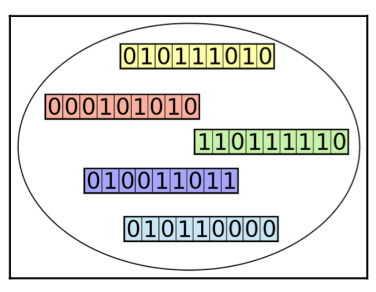

Gli algoritmi mantengono una popolazione di individui che rappresentano un insieme di soluzioni candidate al problema trattato. In essi ogni individuo è rappresentato da un solo cromosoma

## Funzione di fitness

Ad ogni iterazione dell’algoritmo, gli individui sono valutati mediante una funzione di adattamento. Questa è la funzione che l’algoritmo deve cercare di ottimizzare. Gli individui più adatti per la soluzione del problema, ossia quelli con le migliori valutazioni, hanno maggiori probabilità di essere scelti per produrre la prossima generazione.

## Selezione

Dopo aver valutato, mediante la fitness function, ogni individuo della popolazione, viene attuato un processo di selezione per determinare quali individui dovranno essere utilizzati per la creazione dei figli che costituiranno la prossima generazione. Gli individui con valutazioni più basse potranno comunque essere selezionati, anche se con probabilità minore.

## Crossover

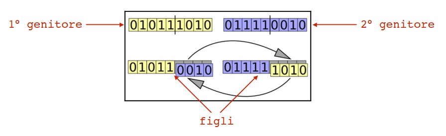

Per creare due nuovi individui in genere sono scelti due genitori dalla popolazione corrente, e parti dei loro cromosomi sono interscambiati creando due figli.

## Mutazione

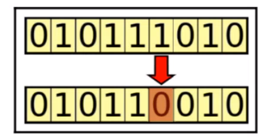

L’operazione di mutazione consente un refresh casuale della popolazione, introduce nuovi pattern e spinge la ricerca in aree inesplorate.

In questo esempio si fa un flip di uno dei geni in un certo individuo

## Roulette wheel selection (Fitness Proportionate Selection)

- In questo metodo, la probabilità di selezionare un individuo è direttamente proporzionale al suo valore di adattamento

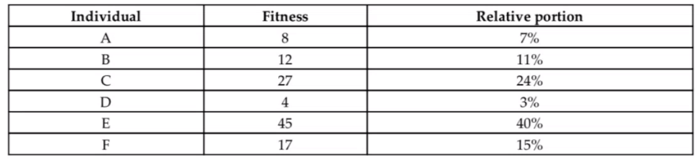

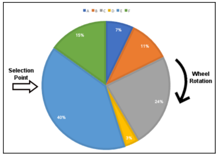

Si suppone di avere questi individui dove vengono mostrati i valori di fitness e la relative portion. Quello che si fa è dare a ogni individuo uno spicchio di ruota con un ampiezza proporzionale al valore di fitness.

Si mette un punto di selezione e quando la ruota si ferma si sceglie l’individuo. In questo modo gli individui migliori hanno più probabilita di essere selezionati

## Stochastic Universal Sampling

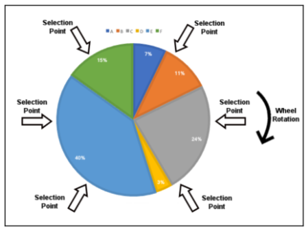

Versione leggermente modificata della precedente, in pratica si aggiungono più selection points equidistanti per scegliere simultaneamente tutti gli individui. 

Con questo metodo si satura l’insieme scelto per ottenere la nuova generazione. In pratica si danno maggiori possibilità agli individui più “deboli” di essere scelti per generare figli 

## Rank-based selection

Simile al roulette wheel selection ma invece di usare direttamente i valori della funzione di fitness per il calcolo delle probabilità di selezione, tali valori vengono usati solo per effettuare un ordinamento degli individui. Una volta ordinati, ad ogni individuo viene assegnato un rank relativo alla posizione occupata e le probabilità di essere selezionati vengono calcolate basandosi su tali rank.

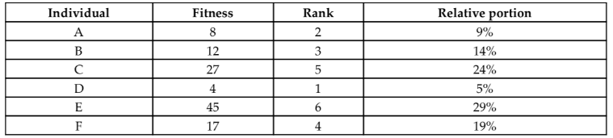

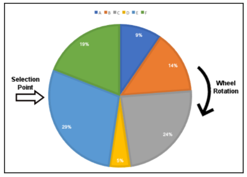

Prendendo l’esempio precedente la ruota si nota che usando il rank anziché il fitness value si riesce ad evitare che i pochi individui con alti fitness monopolizzino l’intera popolazione per la successiva generazione, poiché il ranking elimina le ampie differenze tra le valutazioni

Un altro caso utile è quando i vari individui hanno fitness values molto simili.

## Fitness Scaling

Mentre la selezione basata sul rango sostituisce ogni valore di fitness con il rank dell'individuo, il fitness scaling applica una trasformazione di scala ai valori di fitness grezzi e li sostituisce con il risultato della trasformazione.

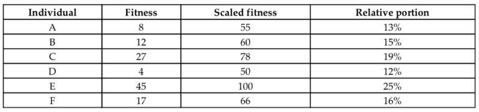

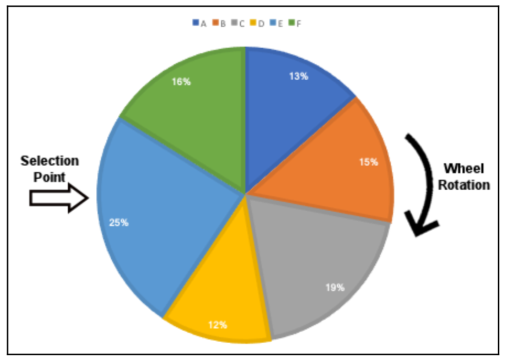

il ridimensionamento dei valori di fitness al nuovo intervallo ha fornito una partizione molto più moderata della ruota della roulette rispetto alla partizione originale.

## Tournament Selection

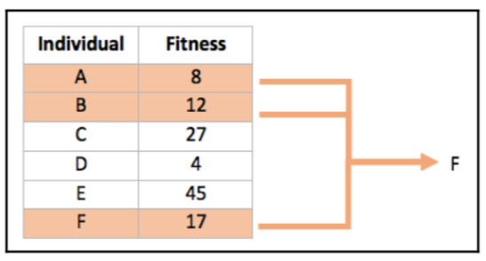

Supponiamo di avere sei individui aventi gli stessi fitness values degli esempi precedenti. In figura ne sono stati selezionati tre random (A, B e F) tra i quali vince F perché ha il valore più alto

Il numero degli individui che partecipano a ciascuna fare di selezione è chiamato `tournament size`.

Maggiore è il tournament size maggiori sono le possibilità che i migliori individui partecipino alla selezione, e di conseguenza minori solo le possibilità di scelta per gli individui con più basso punteggio.

---

## Metodi di crossover

- L’operatore di `crossover` corrisponde al crossover che si verifica nella riproduzione sessuale; usato per combinare l’informazione genetica di due individui, per produrre figli. Tale operatore è applicato con un alto valore di probabilità e se non applicato, entrambi i genitori sono clonati nella nuova generazione

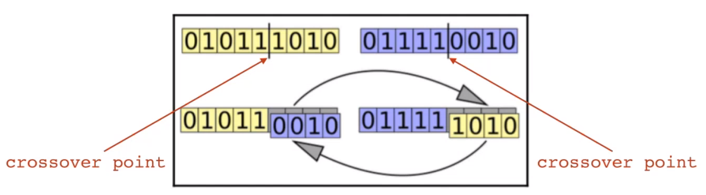

`single-point` crossover: si sceglie random una posizione nei cromosomi dei genitori e si effettua l’incrocio come mostrato in figura

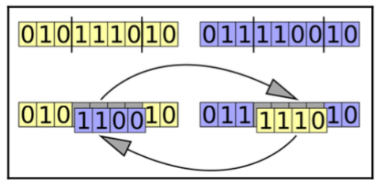

`two-point` crossover: si scelgono 2 punti random e si fa lo swap come nel metodo precedente

questo metodo può essere generalizzato scegliendo $k$ crossover points quindi il metodo è chiamato `k-point` crossover

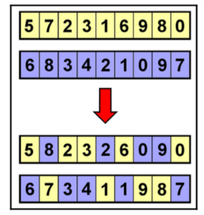

`uniform` crossover: in questo metodo ogni gene è indipendentemente determinato scegliendo uno random dai genitori

Poiché il metodo non cambia interi segmenti del cromosoma, esso ha un maggiore potenziale di diversità nella prole risultante

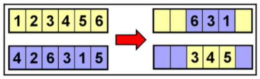

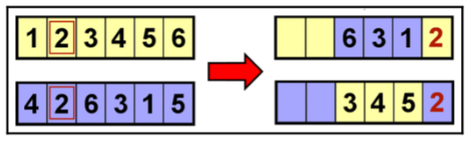

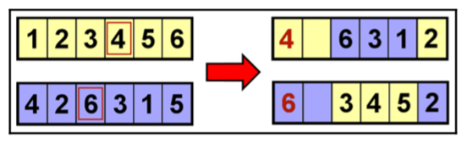

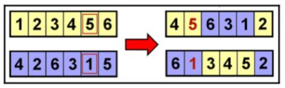

`ordered` crossover (OX1): cerca di preservare quanto più possibile l’ordine dei geni. 

Il primo passo consiste in un 2-point crossover con i due cut point scelti random, si prosegue riempendo il resto dei geni di ogni figlio esaminando tutti i geni dei genitori nel loro ordine originale, iniziando dopo il secondo punto del taglio. 

Si visitano i geni in modo circolare

## Metodi di Mutazione

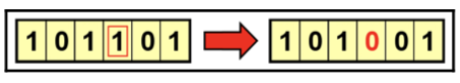

`flip bit` mutation

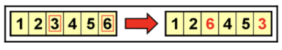

`swap` mutation

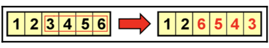

`inversion` mutation

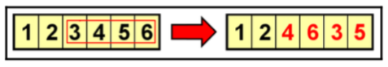

`scramble` mutation

## Condizioni di terminazione

Le due più comuni `stopping conditions` sono le seguenti:

- Numero massimo di generazioni raggiunto
- Nessun significativo miglioramento nelle ultime generazioni

Altre `stopping conditions` da poter utilizzare sono:

- Soglia sulla quantità di tempo di elaborazione
- Soglia su tempo di CPU e/o memoria