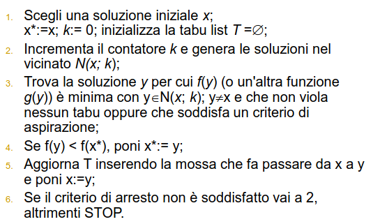
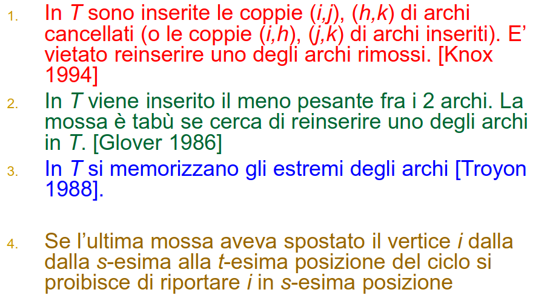

# 21 Novembre

Argomenti: Tabu Search, Tabu Search per TSP
.: Yes

## Tabu search

Se si usa la ricerca locale classica, quando si esplora il vicinato di una soluzione, l’unica informazione è la migliore soluzione `corrente` ed il corrispondente `valore` della funzione obiettivo. Usando il `tabu search` si mantengono in memoria le informazioni sulle ultime soluzione visitate, orientando la ricerca in modo tale da permettere di uscire da eventuali minimi locali.

Per poter sfuggire ai `minimi locali` è necessario accettare mosse che possano portare a un peggioramento della soluzione corrente, pur di spostarsi sufficientemente lontano dal minimo locale.

---

Si suppone di trovarsi in un minimo locale $x$, di solito ci si sposta nella soluzione $y\in N(x)$ in corrispondenza del minimo peggioramento della funzione obiettivo, però se si va in $y$ è molto probabile che la migliore soluzione in $N(y)$ sia $x$ che sarebbe la soluzione a cui si vuole sfuggire.

Per evitare il pericolo del ciclaggio si tengono conto in memoria delle ultime mosse che hanno portato alla soluzione attuale e si proibiscono quelle mosse per un certo tempo. Nella tabu search l’insieme delle soluzioni da esplorare dipende, oltre che dalla soluzione $x$ anche dall’iterazione $k$ del metodo, ossia il vicinato diviene $N(x,k)$.

## Tabu list

La `tabu list` $T$ è una coda in cui vengono memorizzate informazioni sulle ultime soluzioni in modo da impedire di tornare su soluzioni già visitate. Questa tabu list ha 2 modi per memorizzare queste informazioni:

- memorizzare le ultime soluzioni visitate (computazionalmente oneroso)
- memorizzare “attributi” delle soluzioni (ad esempio le mosse)

Quello che si fa tipicamente è memorizzare le ultime $T$ mosse effettuate, quindi le mosse che potrebbero dunque avere l’effetto di riavvicinarsi a soluzioni già visitate vengono proibite nella situazione attuale.

La lunghezza della tabu list viene chiamata `tabu tenure` e può essere di 3 tipi:

- `lunga`: vincola il processo di ricerca anche quando la distanza da una soluzione è già sufficientemente elevata da rendere improbabile un ritorno su tale soluzione
- `corta`: rende possibile il processo di ciclaggio
- `compromesso`: lunghezza dinamica e quindi variabile

La lunghezza dipende da problema a problema ma raramente si eccede il valore 10.

## Tabu Search - Criteri di arresto

Anche se non si hanno miglioramenti per la funzione obiettivo si continua comunque con l’algoritmo, di seguito sono mostrati i criteri con cui l’algoritmo si arresta:

- il numero di iterazioni raggiunge un valore $k_{max}$ prefissato
- il numero di iterazioni dall’ultimo miglioramento della funzione obiettivo raggiunge un valore $k^{0}_{max}$ prefissato
- si può certificare che l’ottimo corrente è l’ottimo globale

## Tabu Search - Criteri di aspirazione

Una mossa anche se `tabu` può essere comunque effettuata se questa conduce ad una soluzione con caratteristiche che la rendono in qualche modo interessante, tali `caratteristiche` vengono chiamate `criteri di aspirazione`. Il criterio più utilizzato è quando una mossa tabu può essere forzata se la soluzione cui essa dà luogo ha un valore di funzione obiettivo migliore dell’ottimo corrente.

## Algoritmo di tabu search

Algoritmo di tabu search

## Accessori per la tabu search

Per una ricerca efficace si può usare una memoria di `medio`/`lungo` periodo (opzionale) che consente di:

- `intensificare`: si esplorano in modo più approfondito le porzioni di spazio che sembrano promettenti per far si che le sue soluzioni migliori vengano trovate. Si basa su una memoria a medio termine (recency memory). Un suo approccio tipico è il riavvio della ricerca dalla migliore soluzione conosciuta e fissare le componenti che sembrano più attraenti.
- `diversificazione`: si tende a fare la ricerca in aree precedentemente inesplorate dello spazio di ricerca. Si utilizza una memoria a lungo termine (frequency memory). Ci sono 2 approcci il primo è il `restart diversification` dove si utilizzano le componenti che raramente sono state usate nella soluzione corrente e si riavvia a quel punto, il secondo è il `continuous diversification` dove si integrano le considerazioni sulla diversificazione direttamente nel processo di ricerca.

## Tabu search per il TSP

La mossa di base è il `2-OPT`, la tabu list e i criteri di aspirazione sono invece diversi.

Durante gli anni sono state proposte molte versioni della `tabu-list`

Per quanto riguarda i `criteri di aspirazione` una mossa tabù è accettabile solo se il ciclo risultante è migliore dell’ottimo corrente.