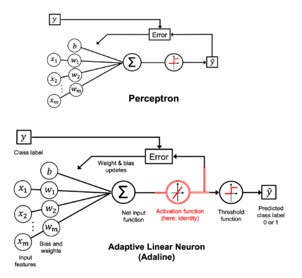

# 22 Aprile

Argomenti: Percettrone Adaline
.: Yes

## Percettrone

In sostanza è il più semplice classificatore binario; fa uso di pesi che, se moltiplicati con il vettore delle caratteristiche in ingresso, stabilisce il segnale di uscita. La sua evoluzione è l’algoritmo del neurone lineare adattivo `adaline`, anch’esso rappresentato da una rete neurale a singolo strato.

## Adaline

La funzione di attivazione di questo percettrone è lineare invece che a gradino, quindi è differenziabile

$$
\widehat{y}=\begin{cases}
1,\space\space \sigma(z)\ge0.5\\
0,\space\space otherwise
\end{cases}
$$

La predizione binaria impiega questa step function

$$
z=\sum_{i=1}^{m}\left(w_ix_i\right)+b
$$

Dove $z$ è ottenuto come combinazione lineare basata su pesi e bias. La funzione $\sigma$ è utilizzata per il training mentre la funzione $\widehat{y}$ solo per la previsione finale

$$
L(\bold w,b)=\frac{1}{n}\sum_{i=1}^{n}(y^i-\sigma(z^i))^2
$$

La loss function può essere formalizzaata tramite una $MSE$ estesa a tutte le istanze $n$

$$
L(\bold w,b)=\frac{1}{2n}\sum_{i=1}^{n}(y^i-\sigma(z^i))^2
$$

A volte si include un coefficiente $1/2$ che si annulla una volta che sono stati considerati i gradienti della funzione rispetto ai pesi e ai bias. L’effetto è quello di incrementare il tasso di apprendimento di 2.

Qui si può vedere come le 2 funzioni di training e per la predizione vengano utilizzate nelle varie fasi.

## Gradient descent per percettrone adaline

La funzione di attivazione lineare rende differenziabile anche la loss, quindi si può impiegare la discesa del gradiente. Bisogna calcolarsi le derivate parziali rispetto ai singoli pesi $w_j$ e al bias $b$. Si utilizza la orma di $L$ senza il termine $1/2$

$$
\dfrac{\partial L}{\partial\bold w}=-\dfrac{2}{n}\cdot\bold x_j^T\left(\bold y-\sigma(\bold z)\right)
$$

Derivata parziale rispetto al vettore dei pesi $\bold w$

$$
\dfrac{\partial L}{\partial b}=-2\cdot\left(\overline{\bold y-\sigma(\bold z)}\right)
$$

Derivata parziale rispetto al bias, dove la parte con la linea sopra indica la media del vettore.