# 22 Marzo

Argomenti: Affidabilità di previsione, Gradient Descent Algorithm per Logistic Regression, Introduzione alla classificazione, Learinng Pipeline, Link function, Log-Likelihood, Logistic Regression Model, Maximum Likelihood Estimation
.: Yes

## Introduzione alla classificazione

Il task della `classificazione` è simile in linea di principio a quello della `regression`. La vera differenza è che anziché predire un valore di output continuo si cerca di prevedere valori discreti o classi.

In sostanza un classificatore realizza un mapping, quindi preso in input un elemento dello `instance space` si ottiene un insieme delle `class labels`.

## Learning Pipeline

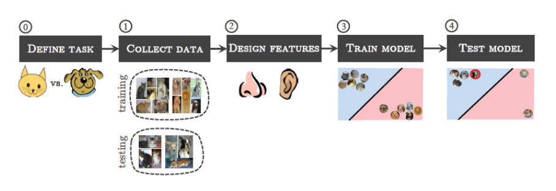

In questa figura è rappresentata la `learning pipeline` del problema di classificazione che si sta considerando. Questo processo è una generalizzazione di tutti i task di machine learning.

- `define-task`: si definisce quale task deve essere appreso dal computer
- `collect-data`: fase di raccoglimento di dati per training e test set.
- `design-features`:  definizione di features migliori per descrivere i dati
- `train-model`: scelta del modello e calibrazione dei parametri sul training set
- `test-model`:  valutazione delle prestazioni del modello sul test set

## Minimizzazione di una funzione costo

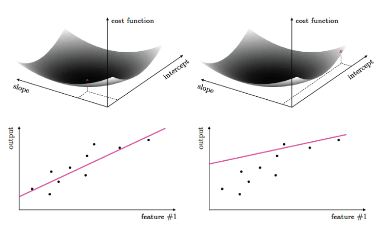

Caso della regressione

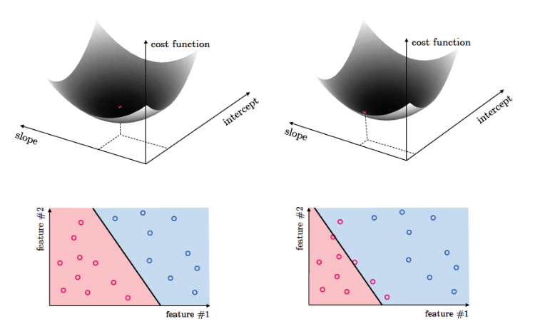

Nel caso della classificazione si ha anche in questo caso una funzione di costo. In pratica trovare il minimo implica trovare la retta che classifica lo “spazio delle classi” osservate

## Esempi di applicazione : sentiment analysis

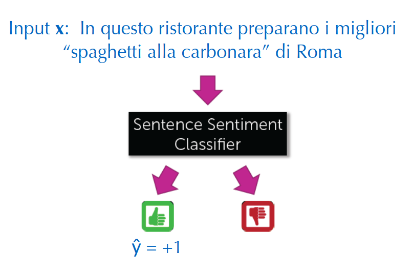

Si vuole capire se una certa review è un feedback buono o cattivo

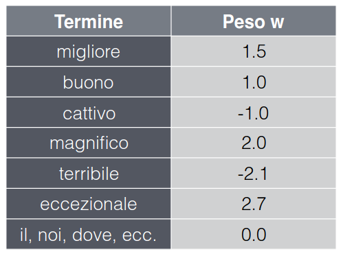

Un modo che si può adottare per classificare una review come positiva o negativa consiste nel considerare alcuni termini come rilevanti ai fini della classificazione, calcolando per ciascuno di essi il numero di occorrenze con cui compare nella review e un valore di rilevanza (peso) per calcolare un punteggio.

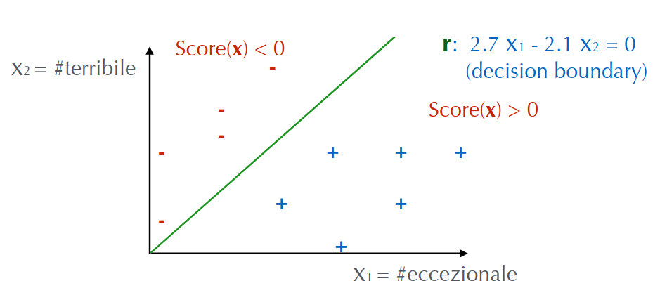

Si suppone che i termini in gioco siano soltanto 2 e che i pesi con le associazioni siano:

- `eccezionale`: 2.7
- `terribile`: -2.1

$$
\begin{align*}
 Score(\bold x_i) &= w_0+\sum_{i=1}^{d} w_i\cdot x_i\\
  &= \tilde{\bold w}^T\cdot \bold x_i
\end{align*}
$$

Nel caso in cui i termini siano $d$ si può calcolare il punteggio come mostrato

$$
\widehat{y}_i=sign\left[Score(\bold x_i)\right]
$$

classificando le review in questo modo dove se vale $1$ allora $Score>0$ e se vale $-1$ allora $Score<0$

$$
\begin{align*}
 Score(\bold x_i) &=\sum_{j=0}^{D} w_j\cdot \phi_j(\bold x_i)\\
  &= \tilde{\bold w}^T\cdot\phi(\bold x_i)
\end{align*}
$$

Nel caso generale di classificazione binaria si ha la seguente formula.

## Affidabilità di previsione

La funzione `sign` fornisce una classificazione binaria del sentiment della revisione, si potrebbe però essere interessanti al grado di confidenza della previsione. Per tale scopo si può sfruttare il calcolo delle probabilità. 

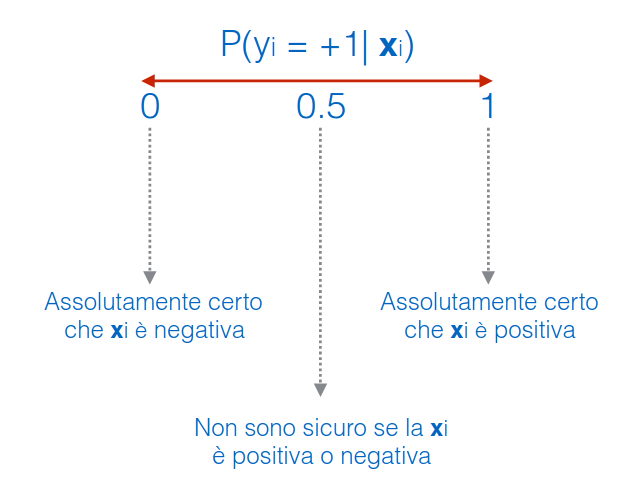

In generale dato un input $\bold x_i$ si ha la seguente situazione

## Link function

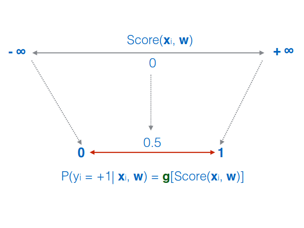

Il problema che bisogna risolvere, se si vuole sfruttare la probabilità condizionata è quella di capire come passare dai valori dello score a quelli di probabilità, perchè la funzione score ha un range di $\left[-\infty,+\infty\right]$ mentre la probabilità ha un range che varia da $\left[0,1\right]$.

Si deve definire pertanto una funzione $g$ che faccia un mapping tra i 2 intervalli

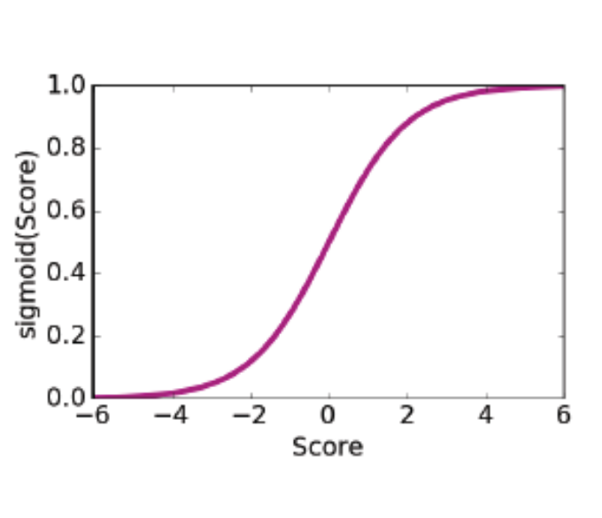

Una funzione tipicamente usata in questi casi è la funzione `logistica`, o `sigmoide` definita come:

$$
sigmoid(Score)=\dfrac{1}{1+e^{-Score}}
$$

## Logistic Regression Model

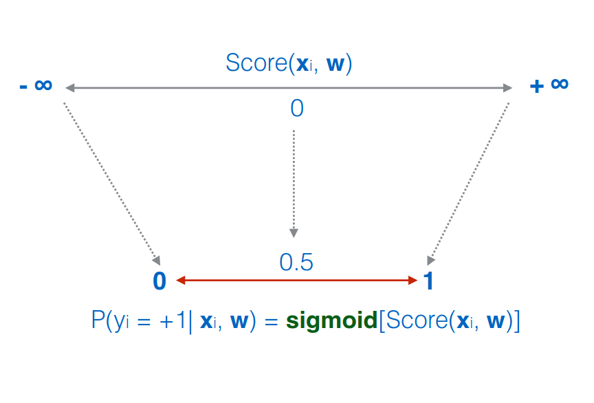

Il modello di `regressione logistica` diventa dunque il seguente. L’espressione per la probabilità, dato un ingresso $\bold x_i$ ed un vettore dei pesi calcolato $\widehat{\bold w}$ è la seguente:

$$
\widehat{P}(y_i=+1|\bold x_i,\widehat{\bold w})
\\=\dfrac{1}{1+e^{-\widehat{\bold w}^T\cdot \phi(\bold x_i)}}
$$

L’espressione per la probabilità, dato un ingresso $\bold x_i$ ed un vettore dei pesi calcolato $\widehat{\bold w}$ è la seguente

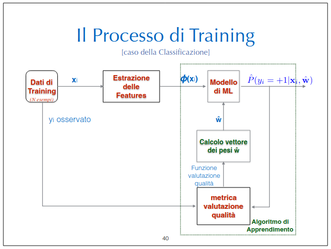

In questa figura è mostrato il processo di training nel caso di classificazione.

## Funzione per la valutazione qualità

Bisogna adesso definire una funzione che valuta la qualità delle prestazioni del sistema; per questo passo si prendono in considerazione le probabilità condizionate definite in precedenza.

$$
\mathcal{L}(\bold w)=\prod_{i=1}^{N}P\left(y_i|\bold x_i,\bold w\right)
$$

Si fa `maximum-likelihood-estimation` dove la forma generale è mostrata in questa formula.

$$
\underset{\bold w}{max}
\space \mathcal{L}(\bold w)=\underset{\bold w}{max}\prod_{i=1}^{N}P\left(y_i|x_i,\bold w\right)
$$

L’obiettivo è quello di massimizzare tale funzione tramite hill climbing o gradient descent visto che non si ha una forma chiusa.

## Log-Likelihood

Per il calcolo del gradiente bisogna calcolare le derivate parziali della funzione; per semplificare il calcolo si trasforma la funzione considerando il logaritmo naturale del Likelihood

$$
ln\left(\mathcal{L\left(\bold w\right)}\right)=ln\space \prod_{i=1}^{N}P\left(y_i,|\bold x_i,\bold w\right)
)=\sum_{i=1}^{N}ln\left(P\left(y_i|\bold x_i,\bold w\right)\right)
$$

In questo modo si trasformano i prodotti in somme, senza cambiare il punto di massimo assoluto:

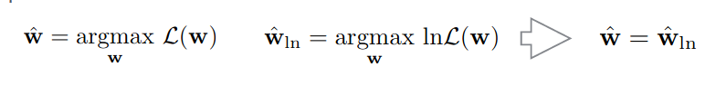

Per facilitare i calcoli si riscrive la funzione come segue, perchè fa comodo seprarare le probabilità relativi ai casi positivi con le probabilità relative ai casi negativi

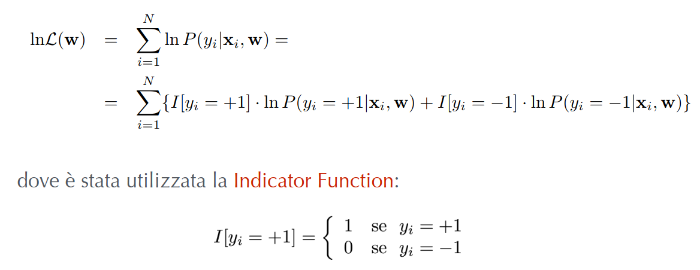

Si sostituisce alle probabiltà $P$ le seguenti espressioni

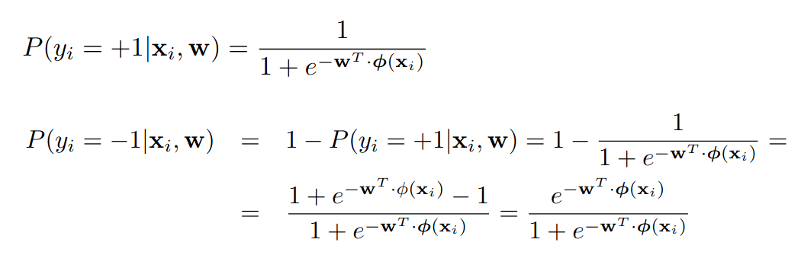

ottenendo per un solo punto $i$ la forma che segue:

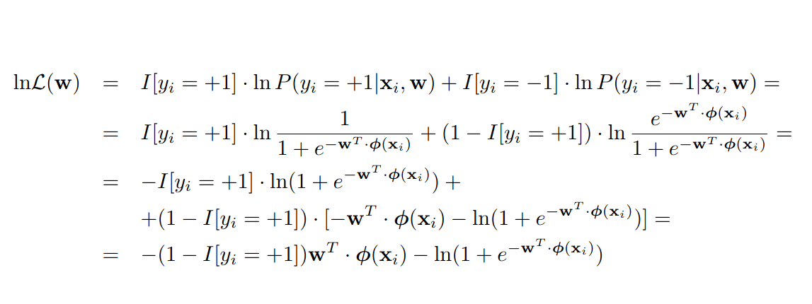

Adesso che si ha la forma di $ln\space \mathcal{L}(\bold w)$ ci si puo calcolare la derivata parziale per un solo punto $i$

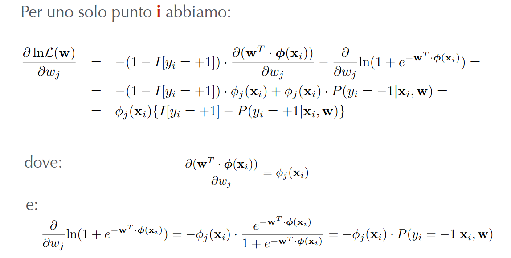

Sommando su tutti i punti $i$ si ottiene 

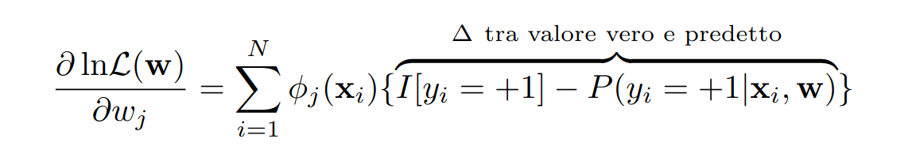

Quest’ultima è la forma della derivata parziale che si può utilizzare nell’algoritmo di `gradient-descent` per trovare il vettore $\widehat{\bold w}$ che ottimizza la funzione

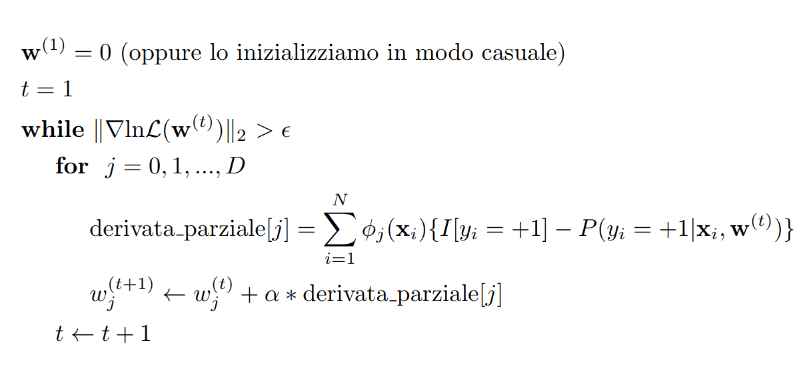

Questo è l’algoritmo di `gradient descent` per regressione logistica