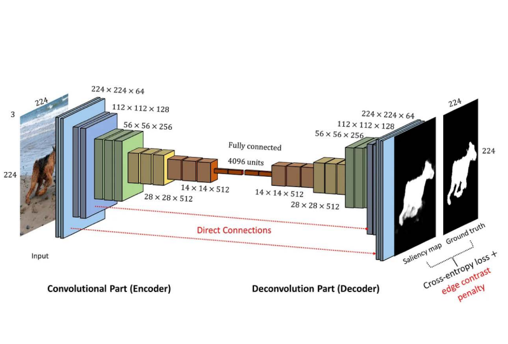
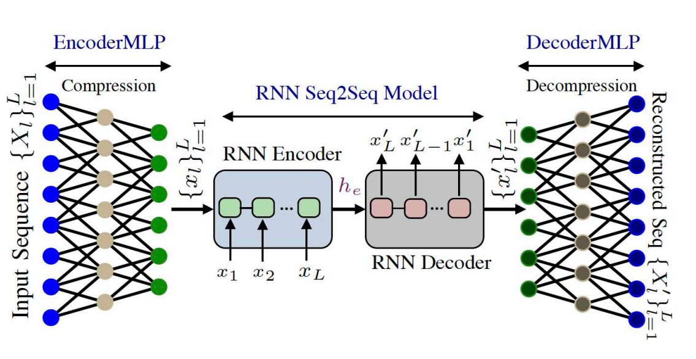
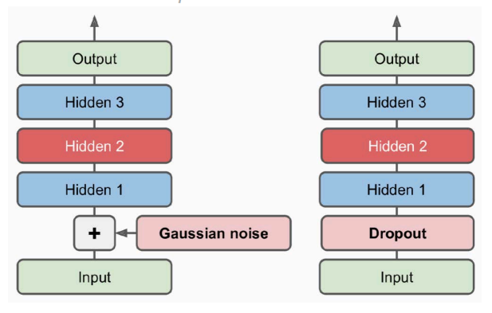
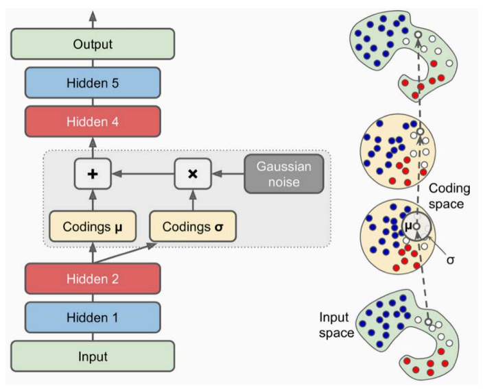
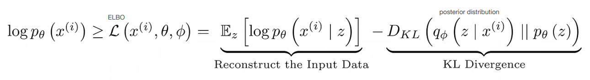
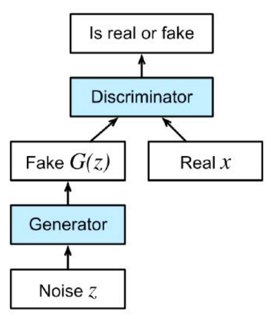

# 22 Novembre

Tags: Convolutional Autoencoders, Denoising Autoencoders, Generative Adversarial Network, Recurrent Autoencoders, Sparse Autoencoders, Variational Autoencoders
.: No

## Convolutional Autoencoders

I `convolutional-autoencoders` sono una variante degli autoencoder che utilizzano le `CNN` per apprendere rappresentazioni latenti di dati strutturati, come immagini o video. Sono particolarmente utili per applicazioni in cui i dati in ingresso presentano correlazioni spaziali. Le `CNN` vengono utilizzate per ridurre la dimensionalità permettendo cosi di incrementare la profondità della rete durante la codifica.

Quello che deve fare il `decoder` è l’inverso cioè ridurre la profondità e aumentare la risoluzione, quello che si usa non sono più le `conv` ma le `transpose-CNN` (Conv2DTranspose) che computazionalmente operano in modo diverso rispetto ai layer di convoluzione.

In questa immagine viene mostrata come è strutturato un convolutional autoencoder.

In output non si mira sempre a ricostruire l’input. In questo esempio si desidera una `saliency-map`.

## Recurrent Autoencoders

I `recurrent-autoencoders` sono una variante degli autoencoder che utilizzano le `RNN` per elaborare sequenze di dati. Sono progettati per apprendere rappresentazioni latenti e compatte di dati sequenziali come serie temporali, testo o dati audio.

L’`encoder` di questa architettura è tipicamente `sequence-to-vector` che comprime l’input in una rappresentazione latente vettoriale. Il `decoder` in un `vector-to-sequence`.

Nell’esempio si impiegano ulteriori layer MLP per estrarre features utili per costruire l’input delle RNN. In questo caso la RNN è una architettura encoder-decoder.

Bisogna però fare una considerazione sulla differenza fra `encoder-decoder` e `autoencoder`, la differenza principale risiede nell’obiettivo e nel tipo di dati gestiti:

- `encoder-decoder`: l’obiettivo è trasformare una sequenza di input in una sequenza di output diversa ma correlata. Le informazioni salienti sono rappresentate dallo stato interno.
- `autoencoder`: l’obiettivo è ricostruire la sequenza di input, imparando una rappresentazione latente compatta. Sfrutta lo stesso spazio, in ingresso e uscita e un task di ricostruzione per determinare lo spazio latente rappresentato dalle attivazioni del layer di codifica.

## Denoising Autoencoders

Quello che si fa in questo caso è aggiungere rumore alle istanze in input e nella fase di ricostruzione si impone loss minimo quando la rete ricostruisce le immagini senza rumore. Quello che si sta facendo in sostanza è addestrare la rete a rimuovere rumore.

Quello che si fa è ricreare il rumore che assomiglia maggiormente a quello del dominio di interesse, per esempio si può aggiungere rumore gaussiano oppure utilizzare il dropout.

## Sparse Autoencoders

Gli `sparse-autoencoders` sono progettati per apprendere rappresentazioni latenti **sparse**, cioè rappresentazioni in cui solo una piccola parte delle unità latenti (neuroni nello strato nascosto) è attivata per un dato input. Questo tipo di architettura promuove una compressione più efficiente e interpretazioni più significative dei dati, rendendoli utili per l'estrazione di caratteristiche e la riduzione della dimensionalità.

Si introduce un termine nella loss che favorisce un numero limitato di nodi “attivi” nel layer di coding. Questa `sparsity-loss` tende a penalizzare i nodi troppo attivi o i nodi non sufficientemente attivi.

## Variational Autoencoders

I `variational-autoencoders` sono una classe di autoencoder probabilistici progettati per apprendere una rappresentazione latente strutturata dei dati, utile per generazione, interpolazione e altre applicazioni di apprendimento non supervisionato. A differenza degli autoencoder standard, questa architettura non apprende una singola rappresentazione latente per ciascun input, ma piuttosto una distribuzione probabilistica nella latente, permettendo di campionare nuovi dati o eseguire analisi probabilistiche.

All’interno dell’encoder viene prodotto un vettore codifica della media $\mu$ e un vettore codifica deviazione standard $\sigma$, entrambi di una certa dimensione $K$ (iperparametro).

Perciò la codifica di una istanza in input consiste in 2 vettori corrispondenti ad una distribuzione gaussiana.

La `loss` tende a raggruppare le codifiche in modo da generare una “nuvola gaussiana” di punti.

- Intuitivamente $\mu$ controlla il punto nello spazio latente su cui centrare l’input in ingresso mentre $\sigma$ indica quanto può variare la codifica rispetto alla media.
- Il `decoder` associa ad una classe non solo un punto, ma anche la “nuvola” di punti intorno ad esso.

La `loss` ha 2 contributi: la `reconstruction-loss` tradizionale e una `latent-loss` che spinge ad avere codifiche campionate da una distribuzione gaussiana, ricavata con la `KL-divergence`.

Nell’immagine viene mostrata l’introduzione di termine che stima la differenza tra la distribuzione di probabilità appresa sullo spazio latente e una distribuzione precedente predefinita.

Quello che assicura è che la distribuzione appresa sullo spazio latente sia simile alla distribuzione precedente, il che aiuta a regolarizzare il modello e garantisce che lo spazio latente abbia una struttura significativa.

---

## Apprendimento discriminativo e generativo

Finora è stato trattato il `discriminative-learning`, cioè un apprendimento che mira a distinguere istanze, le relative caratteristiche, e saperle classificarle e raggruppare; arrivando a livelli di accuratezza comparabili a quelli umani.

In altri casi si fa `generative-learning` cioè creare esempi sintetici tramite un modello basato su determinate distribuzioni ottenute analizzando le caratteristiche di grossi dataset non etichettati. 

## Generative Adversarial Networks (GAN)

Questi tipi di rete sfruttano un approccio discriminativo per generare modelli generativi. Bisogna dire che l’approccio discriminativo è soddisfacente se non si riesce a fare la distinzione fra i dati generati e quelli reali. Il problema è che non si riesce ad associare label a dati generati, per questo motivo si fa uso di un arbitro discriminativo. 

L’architettura è costituita da:

- `generative-network`: lo scopo di questa rete è generare istanze. Mira a generare istanze associate a valori del discriminatore vicini a 1.
- `discriminative-network`: lo scopo di questa rete è distinguere dati reali da quelli fake e adattare la rete generatrice. Implementato come un classificatore binario cioè dato un input $x$, in output si ottiene un numero interpretato come una probabilità dove più è alta e più è reale.

Si ottimizzano simultaneamente i modelli del discriminatore e del generatore.

In questa immagine viene mostrato come le 2 componenti del `GAN` vengono fatte funzionare.

Nell’immagine si intende con $G(z)$ l’istanza creata dal generatore a partire da $z\in\mathbb{R}^D$, dove $z$ riveste il compito di variabile latente.

$$
E_x\left[log(D(x))\right]+E_z\left[log(1-D(G(z)))\right]
$$

Il modello finale deve ottimizzare entrambe le loss composta da 2 componenti:

- $E_x$: valore medio calcolato sulle istanze reali del dataset
- $E_z$: valore medio esteso a tutti gli $z$ del generatore, perciò a tutte le istanze fake

Bisogna dire che:

- $D(x)$ è la probablità assegnata dal discriminatore che stima quanto l’istanza $x$ sia reale.
- $D(G(z))$ è la stima del discriminatore di quanto $G(z)$ sia reale

Il generatore non può influenzare $log(D(x))$, perciò può solo minimizzare $log(1-D(G(z)))$.