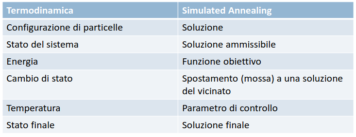
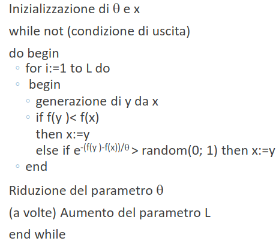
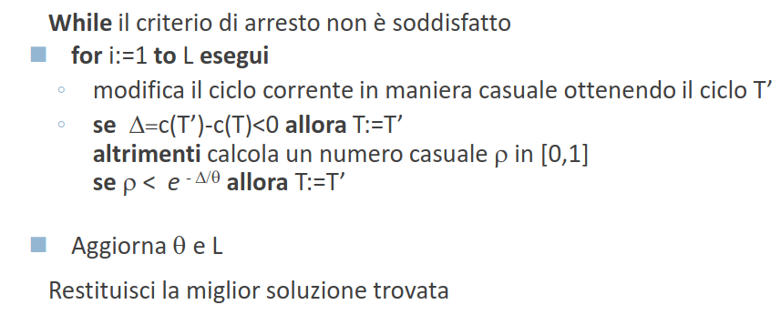

# 22 Novembre

Argomenti: SImulated Annealing per il TSP, Simulated Annealing, Simulated Annealing per la partizione uniforme di grafi
.: No

## Simulated Annealing

Il `simulated annealing` è una tecnica stocastica che si ispira alla meccanica statistica per trovare soluzioni per problemi di ottimizzazione sia continua che discreta. I metodi basati su questo algoritmo applicano un meccanismo probabilistico che consente alla procedura di ricerca di fuggire dai minimi locali.

L’idea di base è accettare in certi casi, oltre alle transizioni che corrispondono a miglioramenti anche quelle transizioni che portano a peggioramenti. La probabilità di accettare tali deterioramenti varia nel corso del processo di ricerca, e discende lentamente verso zero.

Verso la fine della ricerca, quando vengono accettati solo miglioramenti, questo metodo diventa una semplice `ricerca locale`. La possibilità di passare in punti dello spazio di ricerca che deteriorano la soluzione ottima corrente, consente di abbandonare i minimi locali ed esplorare meglio l’insieme delle soluzioni ammissibili.

## Schema di principio del simulated annealing

La simulazione del processo di annealing applicato a problemi di ottimizzazione richiede diversi passi preparatori, per prima cosa si devono identificare nel problema di ottimizzazione le analogie con i concetti fisici:

- l’`energia` diventa la `funzione obiettivo`
- le `configurazioni` di particelle divengono le configurazioni di parametri (`variabili decisionali` del problema da ottimizzare)
- ricercare uno stato di `energia minima` significa ricercare una soluzione che `minimizza` la `funzione obiettivo`
- la `temperatura` diventa un parametro di `controllo`

In questa immagine viene mostrata la transizione da termodinamica a simulated annealing.

## Schema semplificato del simulated annealing

L’algoritmo parte con l’inizializzazione di $x$ che rappresenta una possibile soluzione e di $\theta$ che costituisce il parametro di controllo dell’algoritmo stesso (rappresenta la temperatura). La situazione di arresto si verifica quando si raggiunge una soluzione soddisfacente o in corrispondenza del raggiungimento della temperatura di congelamento prefissata per il sistema.

## Schema di annealing statico

Di seguito è riportata l’implementazione della strategia di raffreddamento:

- valore iniziale di $\theta$: valore abbastanza alto, ad esempio stimato come la massima differenza tra i valori delle funzioni obiettivo di due soluzioni nello stesso intorno
- funzione per diminuire $\theta$ nel tempo: cioè si ha $\theta:=\alpha\theta$ con $\alpha<1$, tipicamente $\alpha\in[0.8,0.99]$
- criterio di arresto: valore fisso di $\theta$ piccolo, normalmente correlato alla minima differenza tra i valori delle funzioni obiettivo di due soluzioni nello stesso intorno
- numero di iterazioni senza variare $\theta$: numero fisso, normalmente correlato alla dimensione dell’intorno

## Simulated annealing per il TSP

Siano $T$ la soluzione iniziale; $\theta$ la temperatura iniziale; $L$ il fattore di ripetizione allora il SA per il TSP è mostrato in questa immagine.