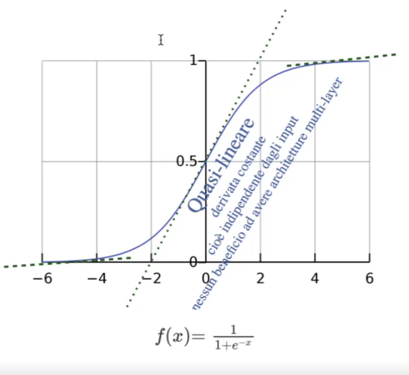
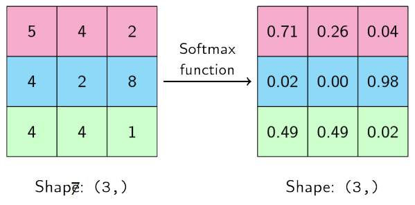
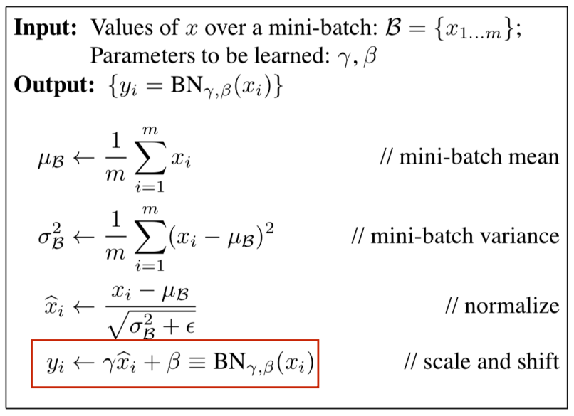

# 22 Ottobre

Tags: Batch Normalization, Inizializzazione dei parametri, Inizializzazione di Xavier Glorot, Internal Covariate Shift, Standardizzazione dei dati
.: Yes

## Training Deep

L’addestramento di reti neurali con molti layer è soggetto a ulteriori problematiche come il `vanishing-gradients` o `exploding-gradients`, e anche alla lenta o mancata convergenza. Per questi motivi si introducono tecniche di addestramento specifiche adatte a reti deep.

## Inizializzazione dei parametri

Sarebbe vantaggioso far partire l’addestramento in un punto buono, cioè dove è molto facile raggiungere un valore ottimo; quindi questo fa capire che bisogna partire da una configurazione iniziale. Si potrebbe partire da una configurazione `casuale`, dove bisogna definire un range di valori, la distribuzione di questi valori e con le varie caratteristiche.

## Funzioni di attivazione: Sigmoid e Softmax

Le funzioni di attivazioni sono molto preziose perché la parte non lineare della rete si trova qui, quindi durante l’addestramento bisogna cercare di mantenere questa non linearità.

L’intervallo non può essere troppo esteso e non può essere troppo centrale e deve essere un intervallo ragionevole dove si ha la possibilità di avere derivate significative a variazioni dell’input.

La funzione di attivazione `softmax` è spesso utilizzata nella classificazione multi label, quello che fa è premiare con più probabilità le classi associate ai nodi che hanno in output attivazione superiori agli altri questo succede soprattutto quando l’intervallo dei valori è molto esteso.

Quello che si cerca di fare è ridurre questo intervallo ampio per alleviare questo comportamento detto `opinionated` sui valori di output, soprattutto nelle prime fasi di training.

## Inizializzazione dei parametri

Sperimentalmente si nota che la distribuzione `casuale-uniforme` non è ottimale, soprattutto per funzioni di attivazione sigmoid.

- Questa funzione di attivazione spinge i layer iniziali verso la saturazione. Se i layer iniziali della rete sono spinti verso la saturazione, vuol dire che i pesi e bias della rete sono tali che i neuroni nei primi strati ricevono input molto grandi o molto piccoli, portando la funzione di attivazione a restituire sempre gli stessi valori estremi. Nel corso delle epoche questi strati escono da questa saturazione notando `plateu`.
- Dopo aver inizializzato i parametri i valori dei gradienti back-propagated si riducono via via che ci spostiamo verso gli strati in input.

$$
Var\left[\frac{\delta \text{Cost}}{\delta \text{s}^i}\right]
$$

La varianza dei gradienti, cioè la varianza del costo rispetto a un parametro la si indica in questo modo.

Dove $s^i=x^i\cdot W^i+b^i$, sono i valori passati alla funzione di attivazione $x^{i+1}=f(s^i)$, per un generico layer $i$, in una rete con $d$ layer. 

$$
\forall i, Var\left[\frac{\delta \text{Cost}}{\delta \text{s}^i}\right]=\left[n\cdot Var[W]\right]^{d-i}\cdot Var[x]
$$

Per $n$ campioni si ottiene la seguente proprietà

La formula mostrata esprime il modo in cui la varianza del gradiente rispetto a $s^i$ evolve attraverso gli strati di una rete, cioè rispetto alle matrici dei pesi $W$ associato ad un certo layer e all’ingresso $x$. Se $Var[x]$ è molto grande/piccolo i gradienti possono esplodere/svanire propagandosi all’indietro.

## (Internal) covariate shift

L’`internal-covariate-shift` indica la circostanza in cui, durante il training, la distribuzione dei valori di attivazione nella rete cambia a causa della variazione dei parametri. Questa distribuzione cambia in funzione dei valori che si riceve in input, cioè la deviazione standard dei parametri cambia.

Il fatto che cambia la deviazione standard non è molto piacevole, perché se ci sono variazioni troppo piccole/grandi allora questo crea problemi. Se si impostano dei valori nei primi cicli con una certa deviazione si vuole che questi stessi parametri siano distribuiti in modo simile anche durante il training. Si vuole comunque che i parametri si muovano con la massima libertà, ma se si suppone che la distribuzione segua certe caratteristiche allora le caratteristiche della distribuzione devono mantenersi durante il training.

Detto in modo formale il `covariate-shift` è un problema che si verifica durante il processo di allenamento di un modello di machine learning, come una rete neurale, quando la distribuzione dei dati di addestramento e quella dei dati di test (o di utilizzo in produzione) non coincidono. Questo significa che le caratteristiche o variabili (dette "covariate") su cui il modello si basa per fare previsioni cambiano tra il momento in cui il modello è addestrato e il momento in cui viene utilizzato per fare previsioni. Tuttavia, la relazione tra input e output rimane invariata.

Per esempio supponiamo di avere una rete neurale addestrata a riconoscere oggetti in foto. Se il set di addestramento contiene solo immagini prese in ambienti ben illuminati e poi il modello viene utilizzato per fare previsioni su immagini prese in ambienti scarsamente illuminati, la distribuzione degli input (le immagini) è cambiata. Questo è un esempio di `covariate-shift`, poiché la rete ha visto solo certi tipi di immagini durante l’addestramento e potrebbe non performare bene su immagini con condizioni diverse.

## Inizializzazione di Xavier Glorot

Questo tipo di inizializzazione cerca di trovare una configurazione che renda significativo il valore delle attivazioni e dei gradienti durante il processo di apprendimento limitando i fenomeni di exploding e vanishing dei gradienti.

Quello che si fa è prendere un certo layer e per generare i parametri casuali per quel layer si considerano il numero di connessioni in input e output per determinare su che scala fare la generazione dei parametri casuali focalizzandosi sulla varianza dei valori. Questa inizializzazione impone 2 supposizioni:

- la varianza degli output di ogni layer deve corrispondere alla varianza degli input del layer successivo. In sostanza il forward signal si propaga con varianza costante.
- la varianza dei gradienti ottenuti prima e dopo un certo layer devono essere corrispondenti. In sostanza il backward signal si propaga con varianza costante.

L’inizializzazione si ottiene inizializzando i pesi della rete per ogni layer in modo casuale con distribuzione `gaussiana` con media 0 e varianza pari a $n^{-1}$, dove $n$ è il numero di nodi del layer precedente.

Di seguito è mostrata la dimostrazione:

$$
y=f\left(\sum_{i}^{n}w_i\cdot x_i + b\right)
$$

Si considera un singolo nodo, per un certo layer si ha in input $X$ con $n$ elementi, con una matrice dei pesi $W$ e funzione di attivazione $f$

$$
\sigma^2(y)=\sigma^2\left(\sum_{i}^{n}w_i\cdot x_i\right)
$$

Si ricorda che la varianza di una costante è 0 e che $f$ è lineare intorno allo 0

$$
\sigma^2(w_ix_i)=\mu(x_i)^2\cdot \sigma^2(w_i)+\mu(w_i)^2\cdot\sigma^2(x_i)+\sigma^2(w_i)\sigma^2(x_i)
$$

Supponendo $X$ e $y$ indipendenti, vale anche questa proprietà

$$
\sigma^2(w_i\cdot x_i)=\sigma^2(w_i)\cdot\sigma^2(x_i)
$$

Visto che si ha media pari a 0, si ottiene questo risultato

$$
\sigma^2\left(\sum_{i}^{n}w_i\cdot x_i\right)=\sum_{i=1}^{n}\sigma^2(w_i\cdot x_i)
$$

Supponendo che $w_ix_i$ siano indipendenti per ogni $i$

$$
\sigma^2(y)=n\cdot \sigma^2(w_i)\cdot \sigma^2(x_i)
$$

Supponendo anche che $w_i$ e $x_i$ siano generati con stessa distribuzione

$$
\sigma^2(w_i)=\frac{1}{n}
$$

Se si impone che le 2 varianze siano identiche allora si ottiene il risultato finale

Il risultato finale ottenuto garantisce che la varianza del segnale propagato nella rete rimanga inalterato. Questo risultato è facilmente implementabile e le funzioni di attivazioni più recenti e tecniche di normalizzazione dei parametri hanno ridotto l’importanza del tipo di inizializzazione dei pesi.

Sperimentalmente gli adattamenti di questa tecnica permettono di incrementare il learning rate anche per reti complesse.

## Richiami: Batch, discesa del gradiente ed Epoca

Il gruppo di istanze da processare prima di aggiornare il modello è chiamato `batch`. Finora il batch è stato l’intero training-set. Nel caso di modelli complessi e training set estesi il training set è suddiviso in più batch, la discesa del gradiente assume diversi nomi in base al metodo di scelta del batch:

- `batch` gradient descent: dimensione del batch e dimensione del training set coincidono
- `stochastic` gradient descent: la dimensione del batch corrisponde a una singola istanza del training set
- `mini-batch` gradient descent: la dimensione del batch è superiore a 1 ma minore del batch del training set

L’`epoca` consiste nella fase di addestramento che esaurisce tutte le istanze nel training set, questo significa che un’epoca può consistere in uno o più batch a seconda della partizione scelta. Non c’è un procedimento per scegliere il numero adatto di epoche, questa scelta dipende da molti fattori come la complessità del modello, numero di istanze, velocità di convergenza e sparsità nei dati.

## Standardizzazione dei dati

Un altro problema dell’`internal-covariate-shift` è che aumenta il tempo di addestramento, necessita di tecniche di regolarizzazione e layer diversi mostrano variazioni di parametri molto diverse.

Quello che si fa prima della fase del training è `standardizzare` i dati di training cioè si impone per ogni caratteristica lo `zero-mean` oppure `unit-variance`. Questo processo però non garantisce che i valori mantengano la stessa distribuzione durante il training, soprattutto per tutti i layer della rete.

## Batch normalization

Il `batch-normalization` cerca di venire incontro dove la `standardizzazione` non risolve, cioè durante il training si normalizzano i dati in ingresso per un hidden layer dove questa normalizzazione può essere ripetuta su più hidden layers.

Quello che si fa è calcolare media e deviazione standard sul mini-batch che si sta considerando attraverso 2 parametri che vengono ricavati durante il training; questi 2 parametri sono `shifting` e `scaling`, e il mini-batch sarà standardizzato in funzione di questi parametri, che sarà poi usato con input al layer corrente.

Se si ha un mini-batch $B$ di $m$ istanze, con media $\mu_B$ e varianza $\sigma^2_B$ e scale $\gamma$ e offset $\beta$, si normalizza ogni istanza in input $x_i$ in questo modo l’output lo si ottiene con il vecchio campione standardizzato rispetto alla media e varianza del minibatch.