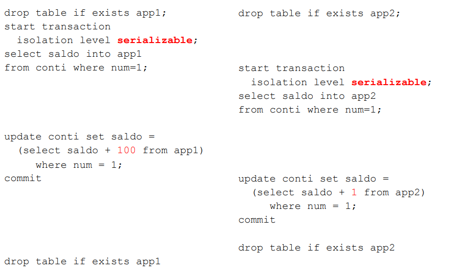
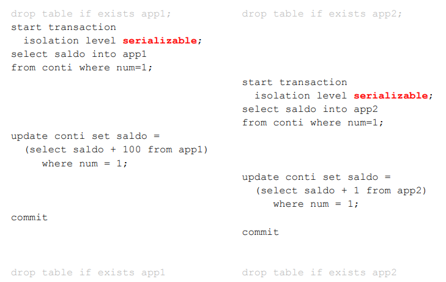
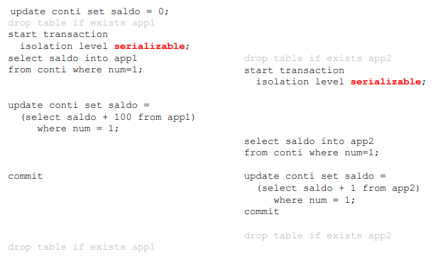

# 23 Aprile 2025

## Esempio 1-S



la seconda transazione da errore quando esegue il suo `update`

```
ERROR:  could not serialize access
due to concurrent update 

```

`EXTRA`: nel caso in cui il livello di isolamento fosse `repeatable read` l’errore mostrato sopra si verifica comunque

`EXTRA`: nel caso in cui il livello di isolamento fosse `read committed`, l’errore non si presenta questo perchè si ha il lock in lettura ma senza 2PL

- se si usano livello di isolamento bassi si possono rovinare i contenuti della base di dati

## Esempio 1-S bis



In questo caso la seconda transazione viene messa in attesa finchè la prima non fa il commit. Comunque dopo il commit la seconda transazione fallisce.

Questo esempio enfatizza:

1. protezione di lettura e scrittura con i lock
2. dopo che il lock viene rilasciato si controlla che non ci sono stati aggiornamenti 

`EXTRA`: con `read committed` i lock vengono utilizzati lo stesso ma non c’è il controllo sulle scritture già avvenute

`EXTRA`: con `repetable read` avviene la stessa cosa del caso `serializable`

## Esempio 1 quater



In questo caso l’update della seconda transazione viene eseguita subito solo che da errore perchè sostanzialmente il dato è stato modificato da una transazione dopo l’avvio della seconda transazione