# 23 Maggio

Tags: Cypher, GraphDB, Neo4j
.: No

## Graph Databases

L’incapacità di scalare bene su grandi moli di dati è una delle limitazioni dei DBMS relazionali. I `graphDB` lavorano bene su grandi moli di dati e in più gestiscono le correlazioni forti tra oggetti (le correlazioni nei sistemi relazionali corrispondo alle operazioni di JOIN). 

L’idea è quindi gestire le relazioni in maniera semplice e riuscire a collegare i dati tramite relazioni in maniera molto efficiente senza l’utilizzo dei `JOIN`. Questo è molto utile in scenari dove i dati hanno una naturale rappresentazione sotto forma di grafo.

Per esempio i social network sono caratterizzati dalla presenza di utenti che possono essere rappresentati da nodi e la relazione tra utenti con gli archi.

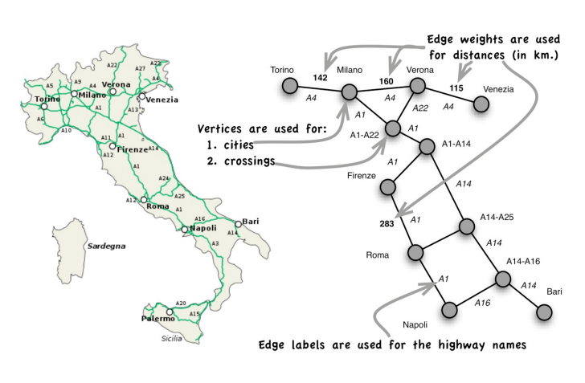

Stesso esempio per le aree geografiche

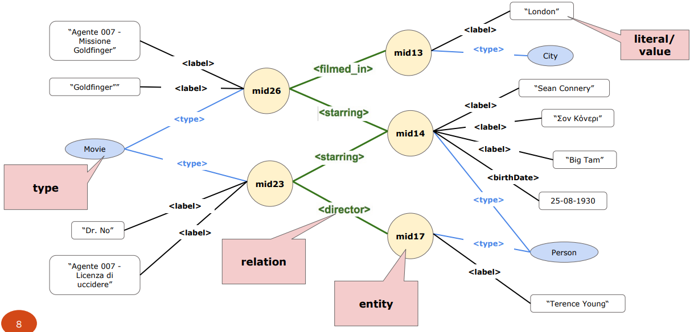

Uno strumento che permette di rappresentare i dati in termini concettuali sono i `knowledge-graph`. In sostanza è una rete semantica.

Quindi un `GraphDB` non è altro che un database nella quale questo tipo di struttura è esplicita cioè un insieme di nodi e archi. Quello che viene garantito è che anche al crescere della dimensione del grafo il costo dell’attraversamento dell’arco è sempre costante, proprio perché si vuole favorire la navigazione all’interno del grafo. Tipicamente si aggiunge la possibilità di avere degli indici perché avere a disposizione questa struttura consente di andare rapidamente sul nodo da cui si vuole partire per fare la navigazione.

L’obiettivo quindi di un `GraphDB` è memorizzare entità e relazioni fra di loro, sia nodi che archi hanno delle proprietà che sono essenzialmente delle etichette e il meccanismo di inserimento o interrogazione si basa su meccanismi di navigazione. Le query ovviamente sono orientate a trovare pattern di interesse.

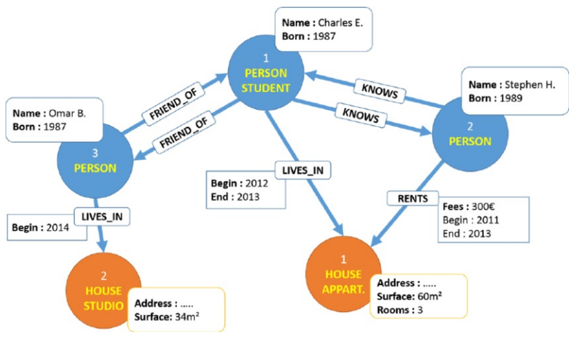

In questa immagine è mostrato un grafo basato su proprietà.

L’utilizzo di questi sistemi conviene quando bisogna fare molte interrogazioni e un numero limitato di aggiornamenti.

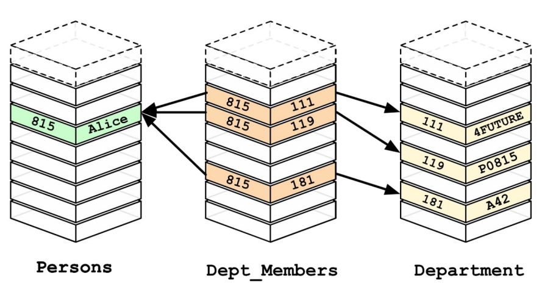

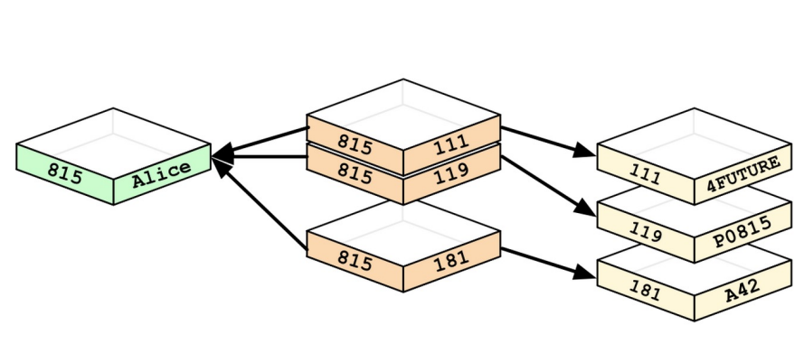

Differenza tra `GraphDB` e `DBMS-relazionali`.

## Graph vs RDBMS

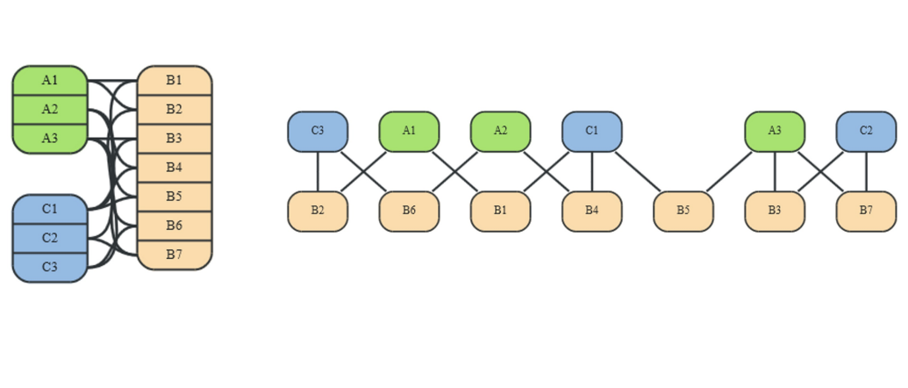

I `RDBMS`: sono ottimizzati per dati che sono per loro natura aggregati mentre i `GraphDB` sono ottimizzati per grafi molto connessi

## Graph vs Aggregate-oriented

Nei `aggregate-oriented` la differenza è che c’è un naturale meccanismo di decomposizione e distribuzione su cluster ma per il fatto della distribuzione (CAP theorem) i `graphDB` non sono adatti a lavorare su cluster proprio perché non è garantito il costo costante per l’attraversamento dell’arco quando il grafo è distribuito in un cluster. Il vantaggio di poter lavorare su single server è garantire le proprietà `ACID`.

## Graph vs Key-value stores

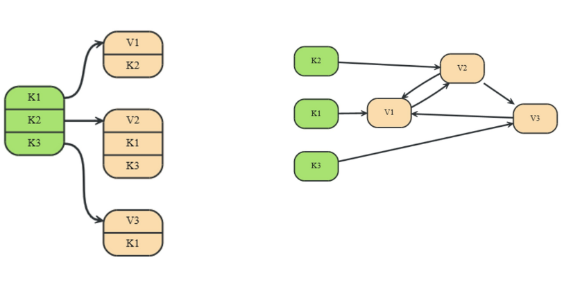

Anche in questo caso la visita (JOIN) potrebbe essere molto costosa perché si potrebbe richiedere accessi a nodi diversi di un cluster.

## Graph vs Document stores

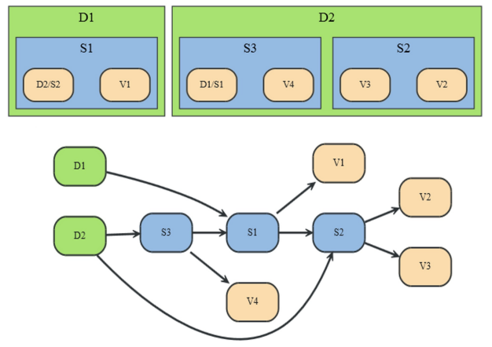

Stessa cosa in questo caso quando si vogliono fare dei collegamenti fra i vari aggregati.

## Schemaless Databases

Anche i `GraphDB` sono `schemaless`, cioè non esiste uno schema di riferimento quindi si può costruire un grafo aggiungendo nodi e archi a piacimento.

Non esiste un linguaggio standardizzato per la visita del grafo, l’idea è partire da un nodo (la presenza degli indici può aiutare) e da questo utilizzare delle primitive offerte dai vari sistemi a grafo.

## Neo4j

Un sistema `GraphDB` open source che offre transazioni `ACID`, si basa sul modello `master-slave`, c’è un meccanismo meno primitivo di `sharding` ed è possibile utilizzarlo tramite interfacce `REST` e `API`.

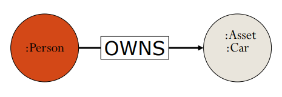

A ciascun nodo è possibile assegnare una o più categoria con `“:”`

E’ possibile associare delle proprietà sia ai nodi che agli archi con la sintassi:

`"nome-proprietà":valore`

## Neo4j - Cypher

Il linguaggio di `Neo4j` si chiama `Cypher`, è un linguaggio dichiarativo, espressivo e basato su un concetto di pattern matching basato su grafo.

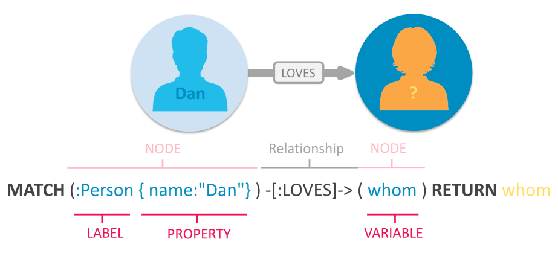

Bisogna definire un pattern che descrive una porzione di grafo presente sul DB.

L’idea è che se si trova un pattern sul grafo che ha la struttura specificata allora ci si fa qualcosa. Tra parentesi tonde si descrive un nodo, tra parentesi quadre la relazione (categoria)

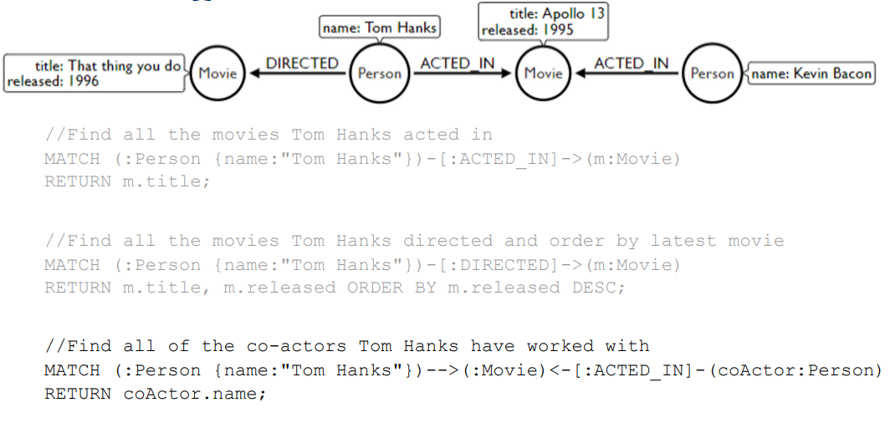

In questa immagine viene esteso l’utilizzo di `match`

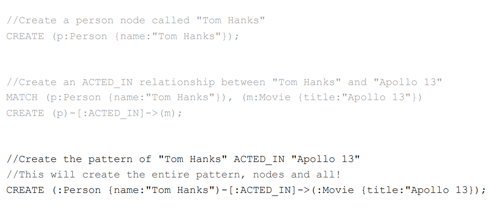

In questa immagine viene mostrato come inserire attraverso l’uso del comando `create`

## Sharding and distribution

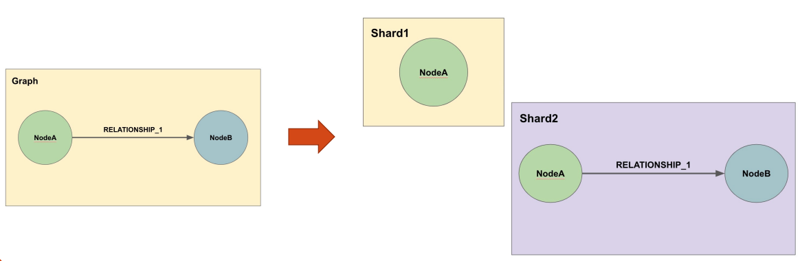

E’ possibile effettuare un meccanismo di sharding introducendo anche la ridondanza, cioè si fa una copia di una parte del grafo e poi si spezza quella copia per avere più ridondanza.

Un problema è che si è molto legati al meccanismo di distribuzione, cioè se si accede al singolo nodo non si può accedere alla copia dell’intera relazione.

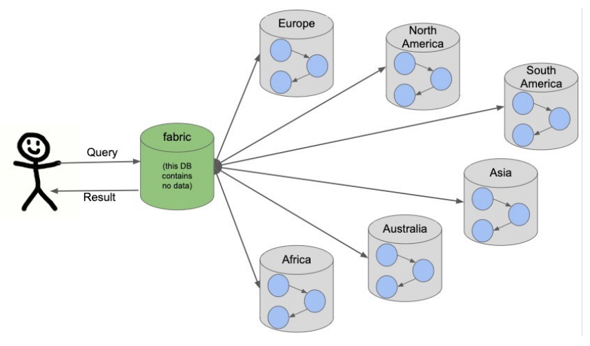

Il meccanismo di interrogazione è di tipo `master-slave` che c’è un nodo che riceve sia gli aggiornamenti che interrogazioni che poi invia le richieste a vari nodi nella quali ci possono essere porzioni di grafo. Questo è importante perché il nodo deve sapere distinguere se vuole lo `shard1` o `shard2`.

Quindi è possibile memorizzare un grafo su un cluster ma in maniera un po’ primitiva, cioè non ci sono tutti i vantaggi dei sistemi basati su aggregati.