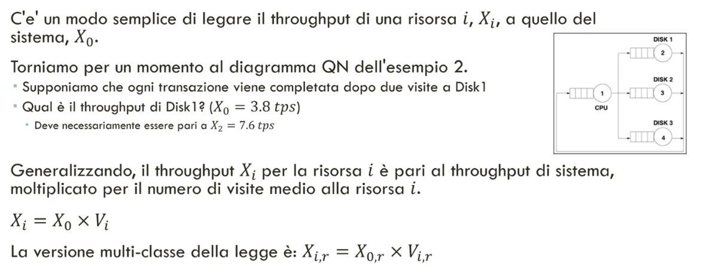
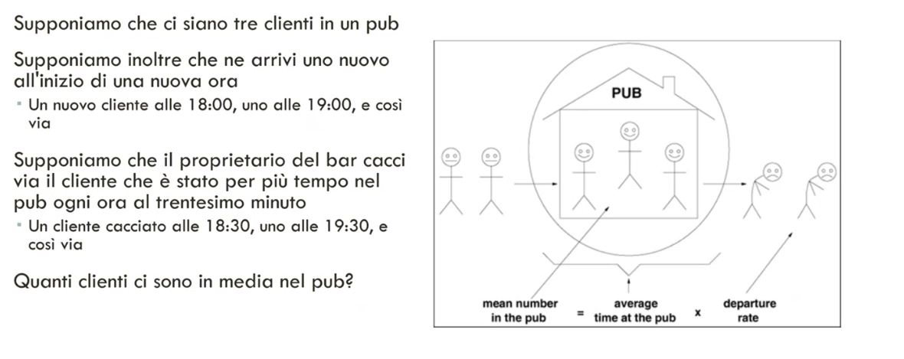
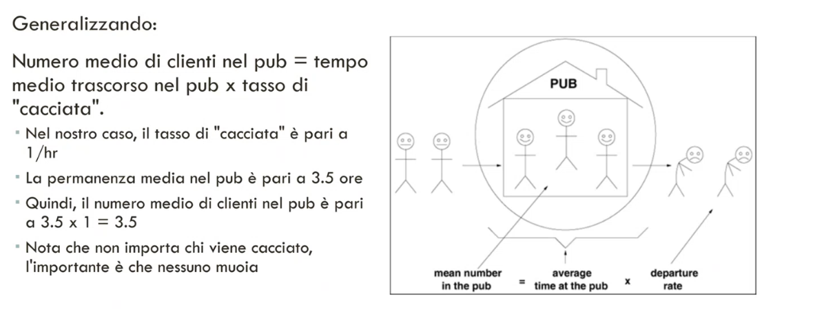
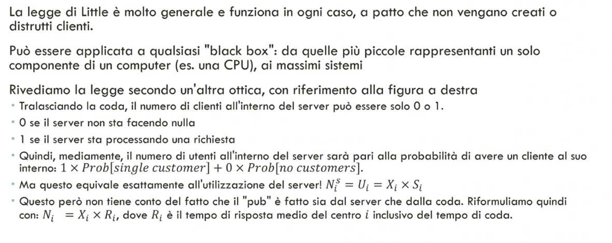
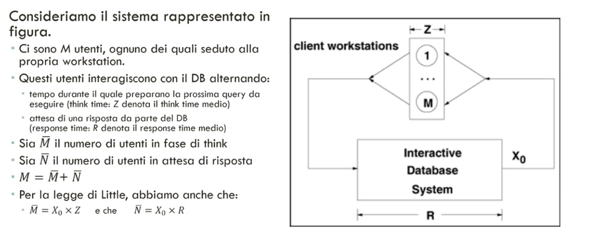
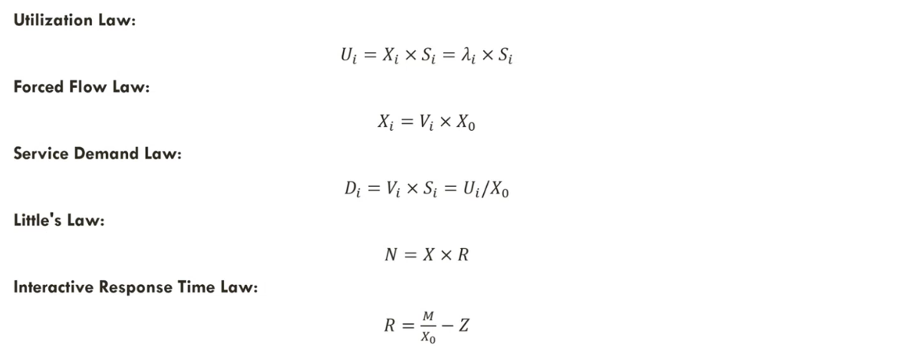
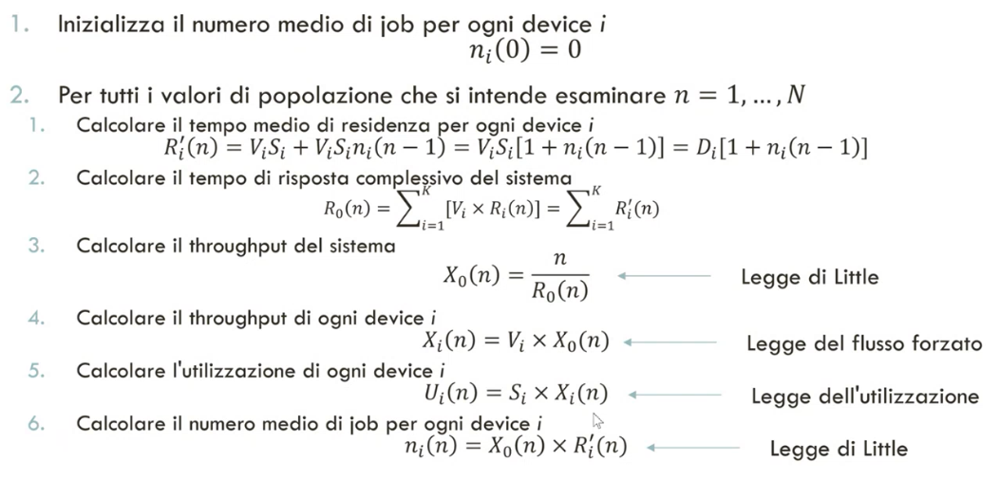
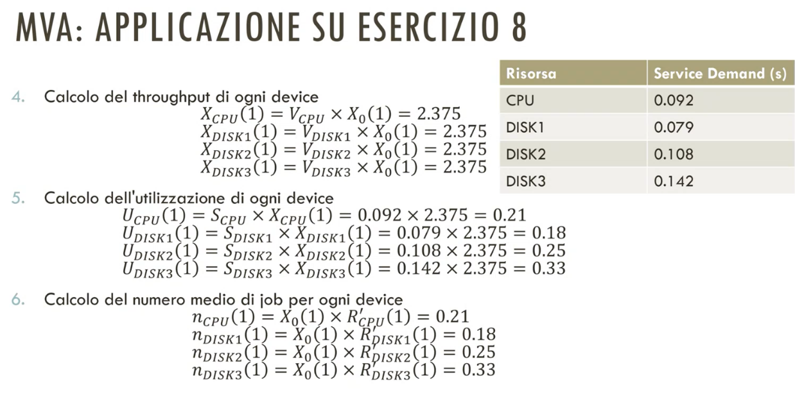

# 23 Maggio 2025

Text: Legge del flusso forzato, Legge del tempo di risposta interattivo, Legge di little, Mean Value analysis

## Legge del flusso forzato

## Legge di little

## Legge del tempo di risposta interattivo

## In sintesi

---

## Mean Value analysis

Questo algoritmo calcola, il tempo medio di residenza in ogni centro, il tempo di risposta del sistema, il troughput del sistema, il troughput dei singoli centri e il numero di job in ogni centro.

L’algoritmo è mostrato in questa figura

