# 23 Maggio

Argomenti: Dimensionality Reduction, Principal Component Analysis
.: No

## Dimensionality Reduction

Un approccio alternativo alla `feature-selection` è `feature-extraction`, cioè si trasforma il contenuto informativo del dataset in un nuovo sottospazio di features con dimensionalità inferiore all’originale; questa operazione si chiama `dimensionality-reduction`.

In generale si cerca di comprimere i dati in modo da memorizzare e analizzare grosse quantità di dati.

## Unsupervised dimensionality reduction via PCA

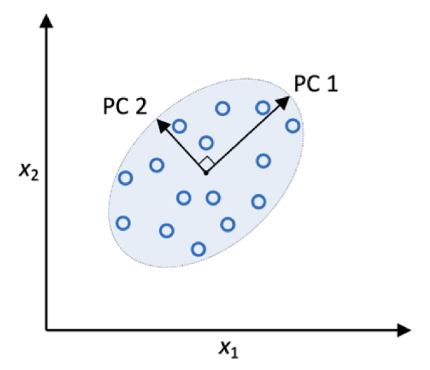

La `Principal-Component-Analysis` è una tecnica di trasformazione lineare non supervisionata. 

Gli assi ortogonali (cioè le principal component) sono 2 vettori che definiscono il nuovo spazio.

Questi vettori vengono messi in una posizione dove raccolgono più informazione possibile, questo può essere interpretato come direzioni di massima varianza del dataset (massime differenze dei punti).

Fare `PCA` significa proiettare istanze, appartenente a uno spazio iniziale, in un nuovo spazio che viene definito con dimensione minore di quella iniziale.

$$
\bold W\in\mathbb{R}^{d\mathrm{x}k}
$$

Il mapping viene effettuato tramite `matrice di trasformazione`

$$
\bold x\in\mathbb{R}^d \Rightarrow\bold z\in \mathbb{R}^k
$$

Questa matrice permette di mappare un vettore $\bold x$ con generici vettori $\bold z$ con dimensione del secondo minore del primo

$$
\bold x\bold W=\bold z
$$

Tutte le componenti principali hanno varianza decrescente e sono ortogonali fra loro.

Le direzioni della PCA sono sensibili alla scala dei dati, quindi è necessario standardizzare le caratteristiche nel caso in cui siano su scale diverse tra loro.

## Metodo grafico per il calcolo dei Principal Components

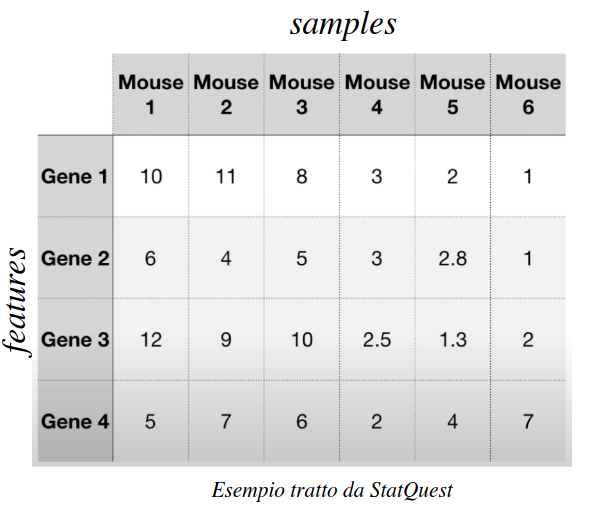

Si prende questo dataset per mostrare il metodo grafico

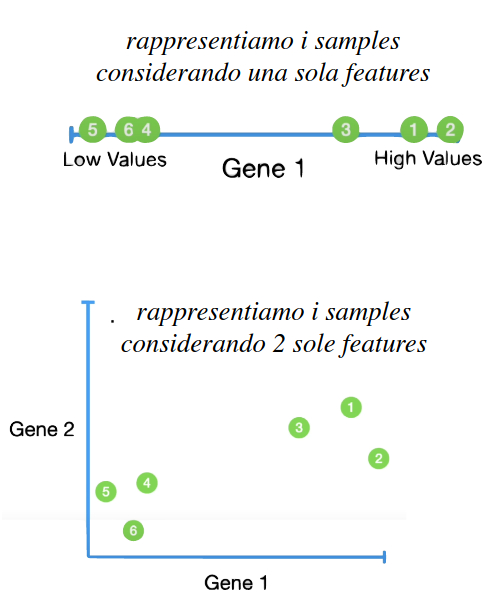

Se si rappresentano questi dati, una volta su una feature e la seconda volta su 2 feature si nota come la diversa rappresentazione abbia un diverso modo di interpretare i dati.

Il problema che si ha è che se si volesse rappresentare una terza dimensione una maggiore non si potrebbe farlo.

Quello che si vuole quindi è avere poche dimensioni che possano rappresentare tutti i samples in modo compatto

Eventualmente le dimensioni `PC` possono indicare quali features sono più utili per classificare i dati.

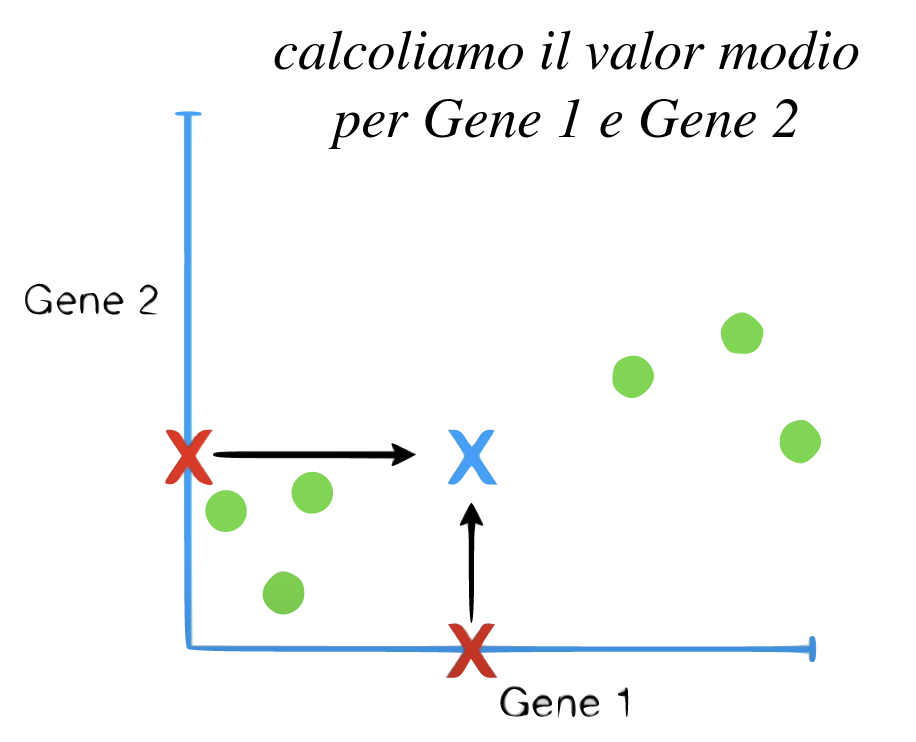

Per procedere con la `PCA` si suppone di prendere solo 2 feature dal dataset e graficare i punti associati alle 2 feature

A questo punto si prende il valore medio rispetto ai 2 assi e ci si mette una $\bold X$

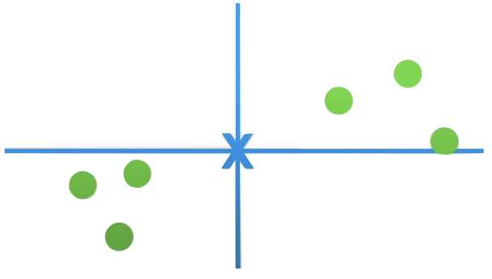

Quello che si fa poi è traslare i punti graficati con il sistema di riferimento centrato nel valore medio

I `P-C` che devono essere trovati sono in sostanza gli assi ortogonali del nuovo sistema di riferimento

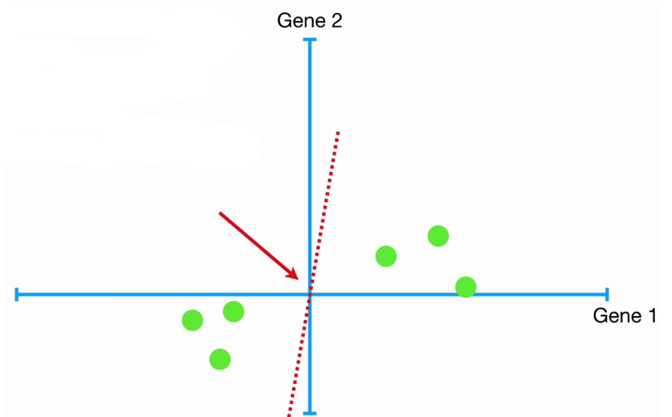

Quello che si fa per trovare il primo PC è tracciare una retta a caso passante per l’origine e la si fa ruotare fino a quando “fitta” maggiormente i dati

Ci sono 2 criteri per cui una retta “fitta”

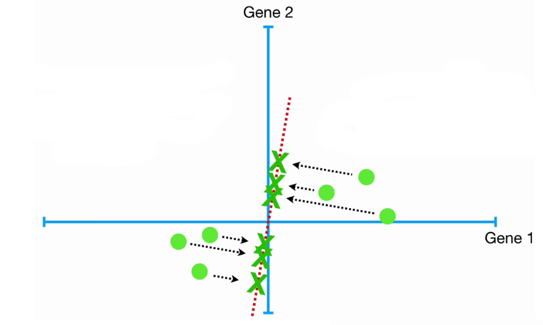

Il primo criterio è cercare la retta che massimizza la distanza delle proiezioni rispetto all’origine

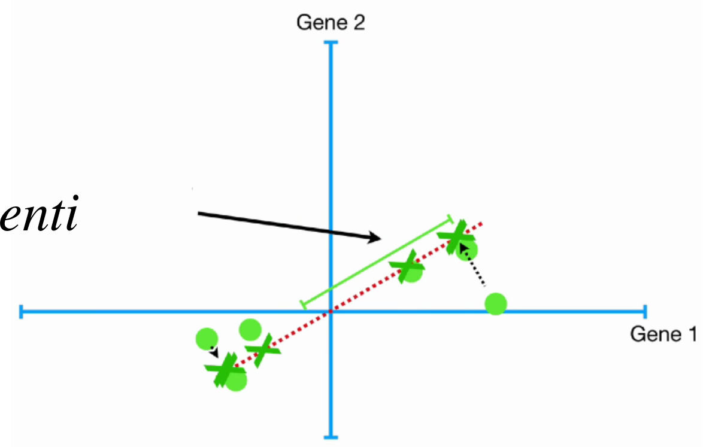

Il secondo criterio è tentare di minimizzare la distanza dei punti rispetto alla retta

I 2 criteri però sono equivalenti

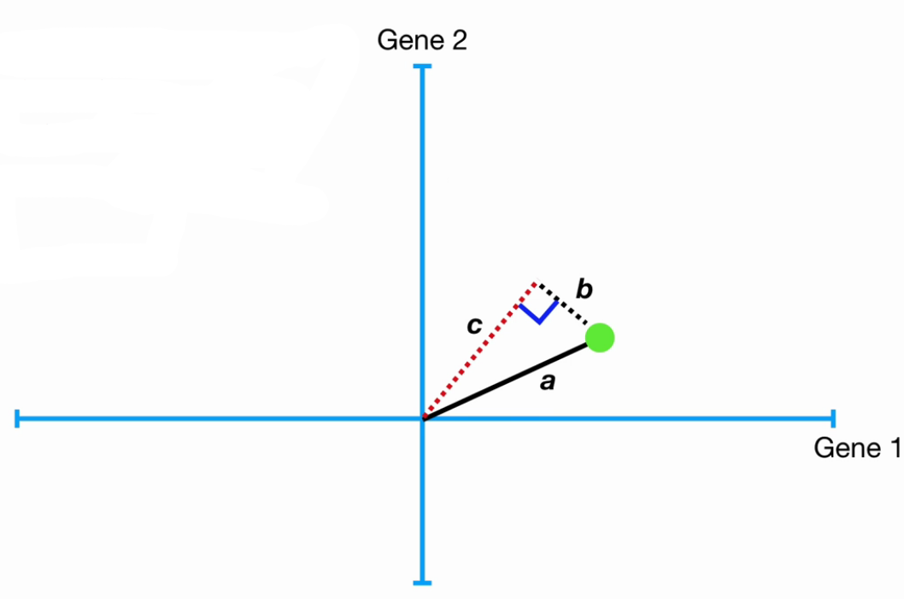

In questa immagine viene mostrata l’uguaglianza dei 2 criteri, poiché $a$ rimane inalterato, se $b$ aumenta $c$ deve decrementare, computazionalmente è più facile ricavare $c$ e massimizzarlo

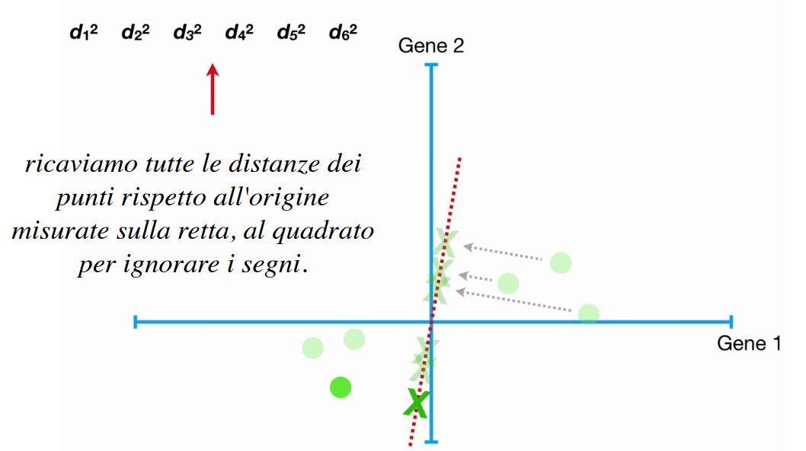

Quello che si fa quindi è ricavare tutte le distanze dei punti rispetto all’origine misurate sulla retta, al quadrato per ignorare i segni. Si ruoterà la retta finché la somma delle distanze $S$ è massima. La retta che verrà trovata è chiamata `principal-component-1`

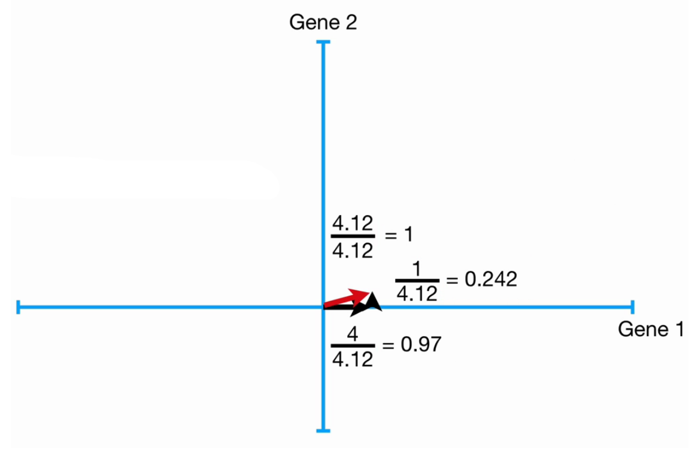

Supponendo di aver trovato la `PC1`, dove ha direzione mostrata in rosso nell’immagine, ci si calcola l’autovettore di `pc1`.

$$
\left[0.97\space\space\space0.242\right]
$$

Si fa questo per poter mappare un generico punto nei `pc` che verranno ottenuti

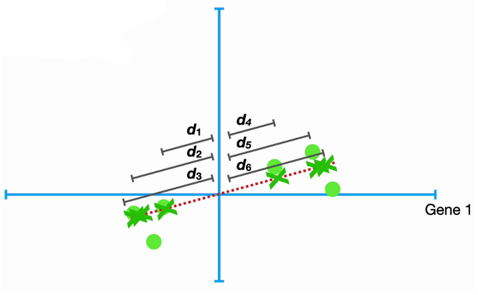

Per ricavarsi l’autovalore di `pc-1` si fa la somma delle distanze rispetto all’origine iniziale; questo autovalore è legato al concetto di varianza rispetto all’origine cioè più è alto e più i dati sono sparpagliati sull’asse

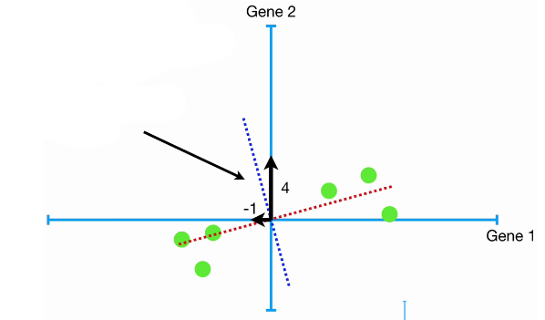

`pc2` sarà perpendicolare a `pc1`, dove il suo autovettore sarà:

$$
[-0.242\space\space\space0.97]
$$

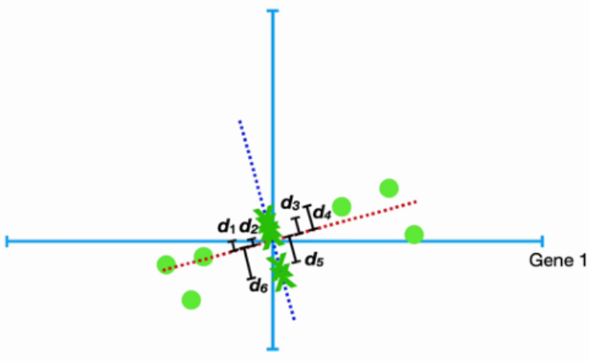

L’autovalore di `pc2` si ricava allo stesso modo a partire dalla distanza dei punti rispetto all’origine, ma proiettati sulla nuova retta

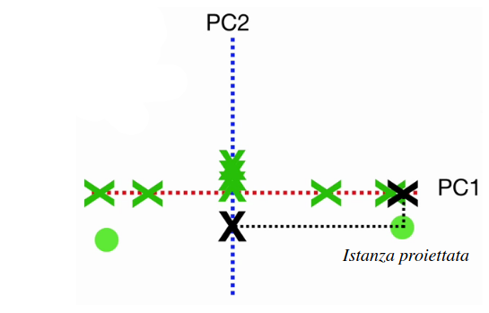

Una volta arrivati a questo punto, con questi autovettori si possono mappare in punti

Alcune considerazioni da fare sono:

- visto che gli autovalori sono associati ad una misura di varianza, si introduce il concetto di `varianza-spiegata`, viene calcolata come:
    
    $$
    \sum_{i:\text{pc}_i}\left(\dfrac{d_i}{n-1}\right)^2=\text{varianza per pc}_i
    $$
    
- alcune volte, ignorare alcune `pc`, cioè quelli con bassa percentuale di varianza spiegata, non influenza il task, si ottiene però il vantaggio di ridurre i dati da analizzare e potenzialmente ridurre rumore nei dati. (Tramite lo `screen-plot` si tiene traccia delle varie “percentuali” di varianza spiegata)

## Metodo analitico per il calcolo dei Principal Components

La `PCA` studia le relazioni lineari tra le variabili rappresentate dalla matrice di covarianza o dalla versione standardizzata rappresentata dalla matrice di correlazione, ecc.

Le 2 matrici sono entrambe simmetriche, e se viene decomposto una matrice di covarianza nei suoi autovalori e autovettori, l’autovettore associato all’autovalore più alto corrisponde alla direzione della massima varianza nel set di dati. Più in generale gli autovettori corrispondono alle `pc`, e gli autovalori alla varianza dalle componenti principali.

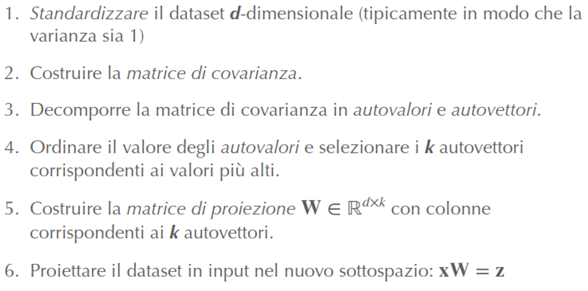

Qui è riassunta la procedura `PCA`.

### Step 1 - standardizzare il dataset $d$ dimensionale

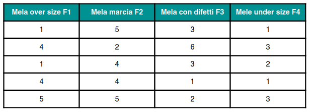

Si prende un dataset con $d$=4 features, per rappresentare 5 campioni di mele con le relative variazioni per tipologia

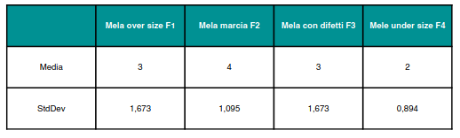

Vengono ricavati media e deviazione standard

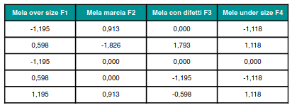

Da cui vengono usate per standardizzare le features, per esempio tramite `z-score`

### Step 2 - costruzione della matrice di covarianza

$$
COV(X,Y)=\\\frac{1}{n-1}\sum_{i=1}^{n}(x_i-E(X))(y_i-E(Y))
$$

Quello che si fa adesso è controllare come variano le features in base alla rispettiva media e cercare di trovare variazioni simili tra le features, per fare questo si costruisce la matrice delle covarianze per ogni coppia di features $X$ e $Y$

Qui è mostrata la matrice delle covarianze che è stata ottenuta tramite la formula precedente. Di seguito la matrice sarà indicata con $A$

### Step 3 - decomposizione della matrice di covarianza

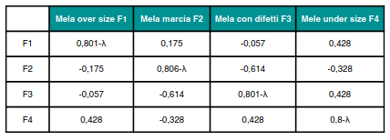

Quello che si fa adesso è trovare $x$ e $\lambda$ tali che $\bold A\bold x=\lambda\bold x$, quindi si costruisce la matrice $\bold A-\lambda I$

### Step 4 - Ordinare gli autovalori e selezionare i $k$ più alti

$$
\lambda_1=1.814\\
\lambda_2=0.952\\
\lambda_3=0.373\\
\lambda_4=0.068
$$

Risolvendo $det(\bold A-\lambda\bold I)=0$ si ottengono i seguenti autovalori

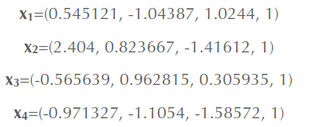

Ora si sostituisce a turno i 4 autovalori e si risolve $(\bold A-\lambda \bold I)\bold x=0$ ottenendo i 4 autovettori

### Step 5 - Costruzione della matrice di proiezione

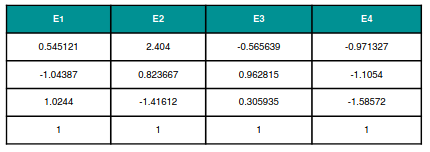

Usando i 4 autovettori, già ordinati in base al corrispettivo autovalore ci si calcola la matrice di proiezione $\bold W$ con colonne corrispondenti ai $k$ autovettori

$$
\dfrac{\lambda}{\sum_{j=1}^{k}\lambda_j}
$$

Se si volesse diminuire, si hanno 2 modi: uno è con lo `scree-plot` mentre l’altro è graficare la somma cumulativa degli autovalori, si sceglie di fare la seconda

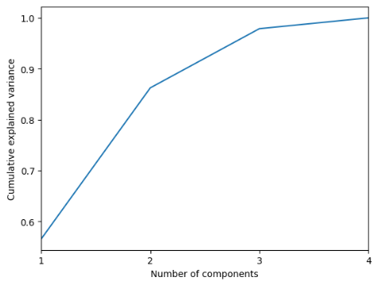

Si nota che il 97% della varianza è catturata con $k=3$ componenti principali, questo significa che si può ignorare l’ultima componente

### Step 6 - proiezione del dataset nel nuovo sottospazio

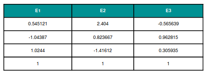

Si ottiene la matrice $\bold W\in\mathbb{R}^{d\mathrm{x}k}$, che permette di ricavare le nuove rappresentazioni $\bold x\bold W=\bold z$, in uno spazio tridimensionale.

---

La tecnica di `PCA` è utile utilizzarlo quando il dataset è numeroso e ha alta varianza, molto utile quando le variabili all’interno dell’insieme di dati sono altamente correlate.

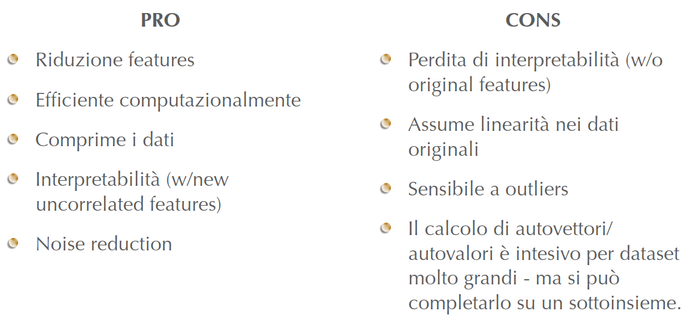

In questa immagine sono mostrati i vantaggi e svantaggi del PCA