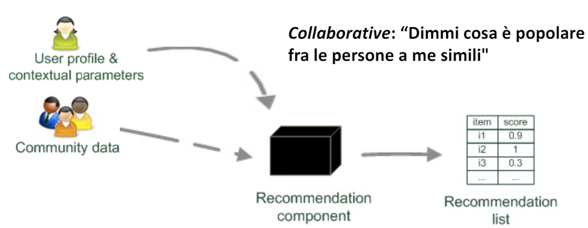
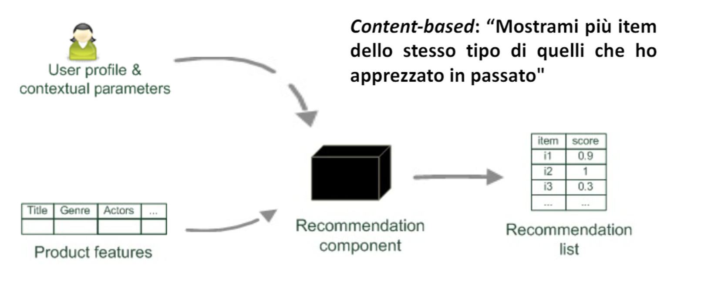
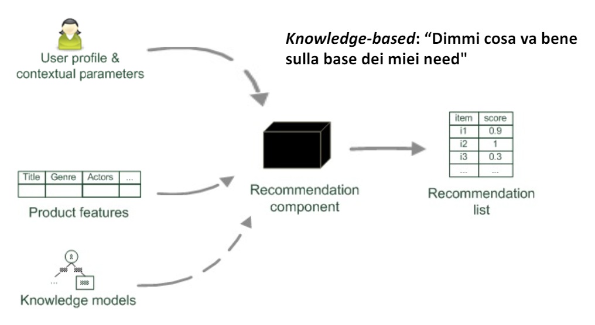
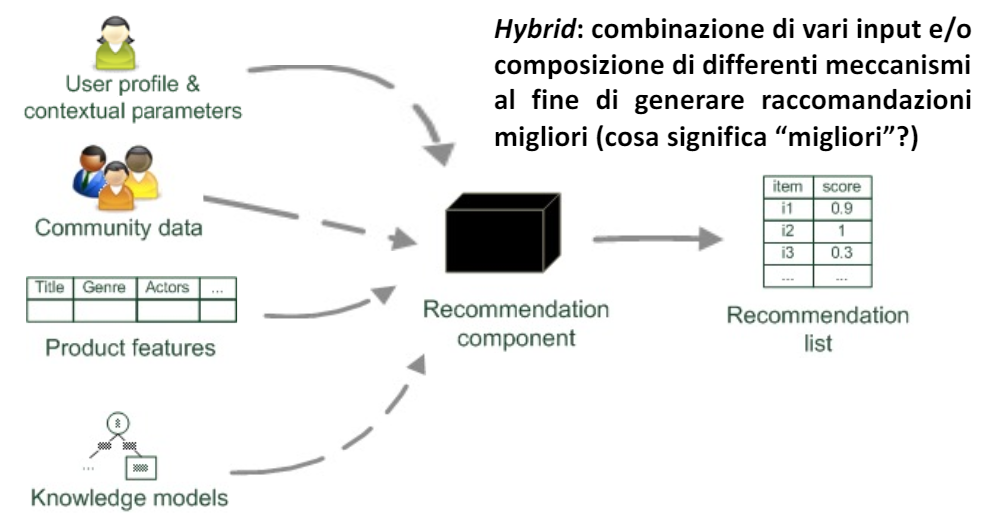
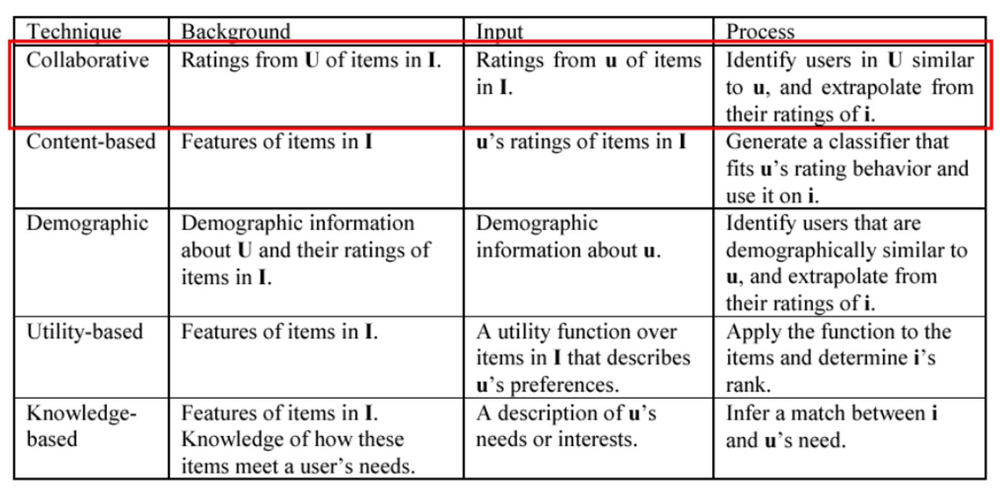
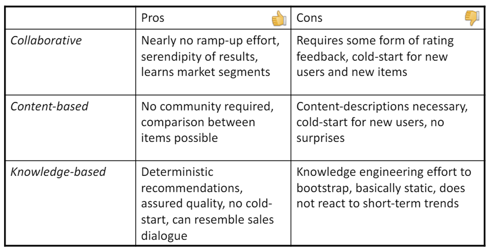

# 23 Maggio

Argomenti: Paradigmi dei Recommender System, Tecniche di base dei RS
.: Yes

## Paradigmi dei Recommender System

Nonostante esistano differenti tipologie di `RS`, tutti i diversi sistemi raccolgono dati inerenti a:

- `item`: prodotti o servizi da raccomandare, caratterizzati da `valore di utilizzo` (positivo o negativo in base all’utilità che ha per l’utente target) e `complessità` (dipende dalla disponibilità dei dati)
- `user`: ogni utente ha differenti interessi, preferenze e necessità; gli user data costituiscono lo user profile. Tutti gli utenti sono quindi diversi tra loro e necessitano di una personalizzazione della raccomandazione.
- `transaction`: interazione registrata fra l’utente e il RS; si basa sui log data, che immagazzinano informazioni attraverso diverse tipologie di feedback che possono essere `espliciti`(rating, review, tag dopo aver testato l’item) o `impliciti`(inferenze su comportamento dello user)

Il `recommender system` può essere visto come una `black-box` in cui in input si hanno l’item e il profilo  utente sui cui fare la raccomandazione e in output si ha un valore di rilevanza che viene usato per il ranking

## Information Retrieval - IR

Identifica del materiale non strutturato che soddisfa un particolare `information-need`, si parla quindi di file di testo, immagine, brano musicale, video, ecc. L’applicazione classica prevede di ricevere dall’utente una query e restituisce una serie di documenti rilevanti, il problema è che se 2 utenti sottomettono la stessa query in 2 motori di ricerca tradizionali ricevono lo stesso output.

## Information Filtering - IF

Fornisce all’utente delle informazioni per lui rilevanti, filtrando tutto il sovraccarico informativo (`information-overload`). Una semplice applicazione dell’information filtering è lo spam filtering nelle email.

## Information Retrieval vs Information Filtering

`IR` e `IF` rappresentano due aree di ricerca strettamente correlate fra loro. Possiedono lo stesso obiettivo, ovvero ottimizzare e rendere più semplice l’accesso a sorgenti di dati non strutturati. Il punto di convergenza è la ricerca personalizzata cioè `IR` non fa differenze rispetto agli utenti mentre `IF` prevede di personalizzare il filtering in base all’utente.

## Paradigma Collaborative

L’idea è quella di considerare il comportamento, le opinioni e i gusti di una larga comunità di altri utenti, quindi si usano approcci `collaborative` e `community-based`. Individua degli utenti simili e estende il comportamento di questi all’utente in questione; ad esempio se gli utenti $A$ e $B$ hanno una purchase history che si sovrappone fortemente e l’utente $A$ ha di recente acquistato un libro che l’utente $B$ non ha ancora visionato, la logica fondamentale è proporre questo libro a $B$.

Nel caso in cui l’utente utilizza il sistema per la prima volta, oppure l’item è appena stato aggiunto non si hanno informazioni di raccomandazione in entrambi i casi, quindi quello che si fa in questi casi è fornire una descrizione all’item appena aggiunto.

## Paradigma Content-Based

Questo paradigma si basa sulla descrizione degli item e un profilo che assegna importanza alle descrizioni degli item

## Paradigma Knowledge-Based

## Paradigma Hybrid

## Tecniche di base dei RS

La distinzione fra le diverse tecniche non è correlata all’`interfaccia utente` ma alla sorgente dei dati utilizzati per la raccomandazione. Ognuna delle tecniche si basa su 3 concetti e sono: `background-data` cioè alle informazioni di cui il sistema dispone prima che inizi il processo di raccomandazione, `input-data` cioè le informazioni che l’utente deve fornire al sistema per ottenere in output una raccomandazione e poi l’`algoritmo` cioè come vengono combinati i dati di background con i dati in input per generare una raccomandazione. 

I `recommender-system` forniscono realmente il valore predetto in quanto sono personalizzati.

In questa immagine sono mostrati come le varie tecniche usano i `background-data`, `input-data` e l’algoritmo

- `collaborative`: i dati di background sono i ratings dell’insieme $U$, ovvero l’insieme di tutti gli utenti che il sistema possiede, di tutti gli items in $I$. L’input sono i ratings espressi da $u$, utente target a cui suggerire la raccomandazione, sugli items in $I$. L’algoritmo identifica gli utenti in $U$ simili ad $u$ ed estrapolare i loro ratings per gli item di $I$, non visionati o acquistati.
- `content-based`: i dati di background sono le feature degli item in $I$. In input si hanno i ratings $u$ degli items $I$, ovvero si hanno una lista di acquisti, ratings, feedback, di $u$. Il processo genera un classificatore addestrato con il rating behavior di $u$ e usato su $i$. Classificatore addestrato sulla purchase history, prende in input un item appartenente a $i$, non valutato, in output si ha un valore di predizione.
- `demografico`: riguarda gli utenti dal punto di vista statistico. Informazioni demografiche di $U$ e i loro ratings per gli items in $I$. In input si hanno le informazioni demografiche di $u$. Il processo identifica gli utenti che sono demograficamente simili a $u$ ed estrapola i loro ratings per $i$.
- `utility-based`: Si hanno le feature per gli item $I$, si passa in input una funzione di utilità sugli item in $I$, ricavabile dagli acquisti degli utenti, che descrive le preferenze di $u$. Si applica la funzione agli item e si determina il rank di $i$.
- `knowledge-based`: Feature degli item $I$ espressi sottoforma di modelli di conoscenza.

In questa immagine sono mostrati i vantaggi e svantaggi delle tecniche `collaborative`, `content-based` e `knowledge-based`.

- L’algoritmo `collaborative` è molto semplice, si individuano solamente gli utenti più simili tra di loro. Serendipity of results. Apprende porzioni di mercato. I contro sono che si ha necessità di avere informazioni di feedback degli utenti. Introduce un inizio a freddo degli utenti e nuovi item: gli utenti appena registrati sul sito non possiede informazioni e non può essere personalizzato.
- l’algoritmo `content-based` non necessita di una comunity ed è possibile fare confronti tra item sulla base delle caratteristiche. I contro è che deve essere necessaria la descrizione dei contenuti e deve essere machine readable. Cold-start per i nuovi utenti. Non c’è il vantaggio della serendipity, nessuna sorpresa, le raccomandazioni funzionano in base a quello che si ha già apprezzato
- l’algoritmo `knowledge-based` da una raccomandazione deterministica con qualità assicurata, ma a fronte di uno sforzo di creazione notevole.
