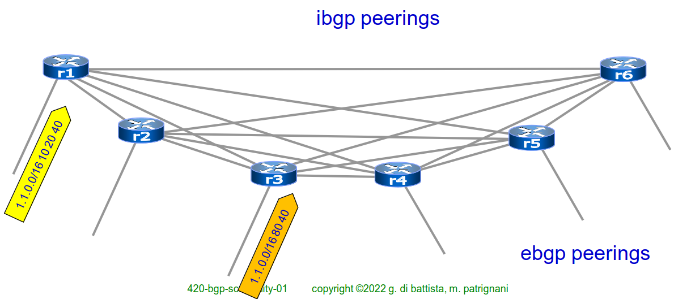
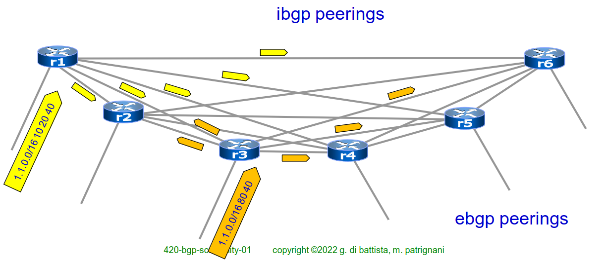
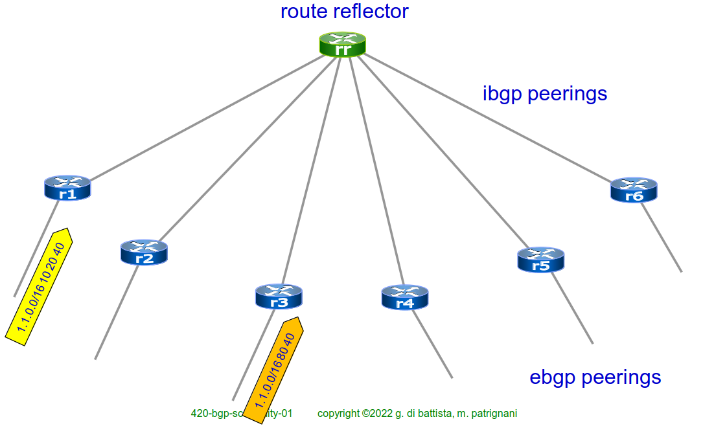
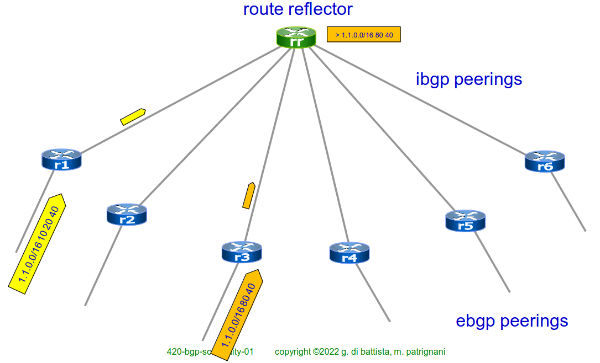
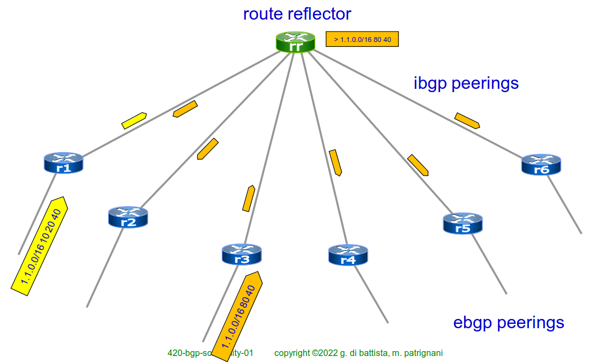
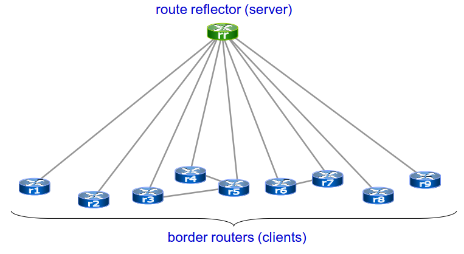
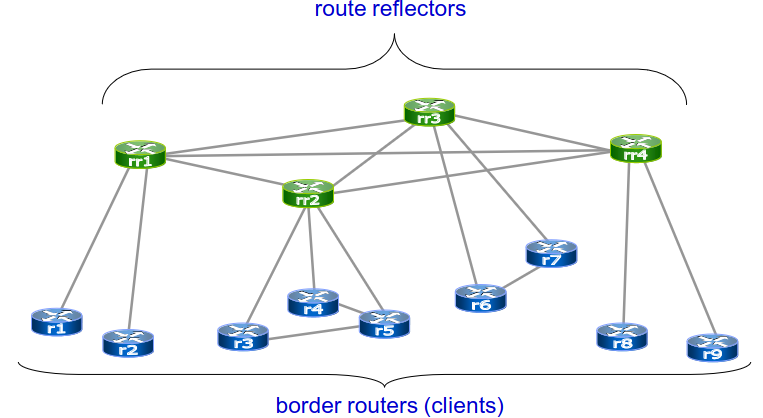
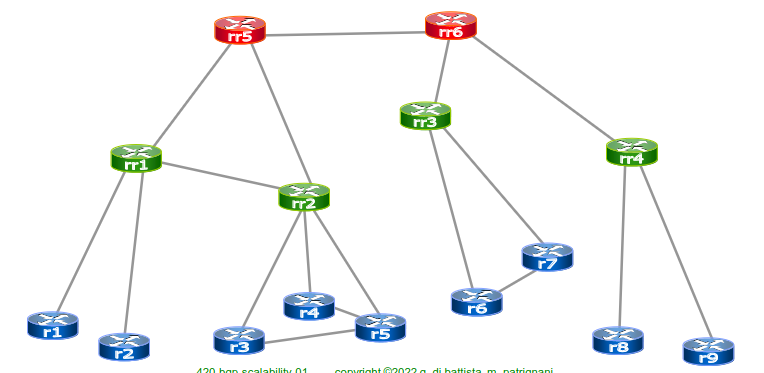
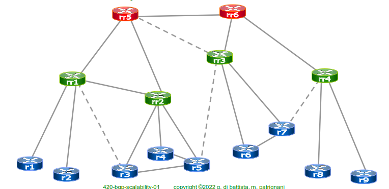

# 23 Novembre

Argomenti: Miglioramento scalabilità BGP, Route Reflectors
.: Yes

## Miglioramento della scalabilità di BGP

Può accadere che l’amministratore BGP cambi le politiche di routing, questo implica che le rotte che indicano i percorsi migliori debbano essere ricalcolate. In questi casi ci sono 2 soluzioni:

- `hard bgp peer reset`: in pratica forza i vicini a rimandare tutti gli annunci, questa soluzione è divisa in 2 step:
    - il router viene riavviato ristabilendo la connessione bgp ricevendo e annunciando tutte le rotte come all’avvio
    
    Il problema di questa soluzione è che utilizza di molto la CPU del router
    
- `soft reconfiguration`: il router a cui vengono cambiate le politiche mantiene delle copie di tutti gli annunci ricevuti. Questa soluzione è stata proposta per sostituire l’hard reset e in cambio consuma memoria invece della CPU.

Parlando di queste soluzioni è stata creata la `route refresh` anche chiamata come “soft bgp peer reset”; consiste nel mantenere il peering bgp chiedendo ai neighbors di riannunciare i loro prefissi.

## Next-hop

L'impostazione predefinita di BGP prevede che l'hop successivo esterno venga propagato senza modifiche ai peer IBGP.

Per diverse implementazioni BGP, ciò implica che IGP deve trasportare next-hop esterni.

In caso contrario, la ricerca ricorsiva non riuscirebbe e la rete esterna non verrebbe utilizzata.

Poiché un AS può avere molti peer ebgp, ciò causa un pesante carico aggiuntivo sul protocollo igp.

Una soluzione consiste nel modificare il next-hop esterno in modo che sia quello del router locale con il comando:

**neighbor x.x.x.x next-hop-self**

## Route reflectors

Sono router che non vengono utilizzati per fare traffico ma servono a semplificare la `full-mesh` (peering diretto fra tutti i router di frontiera) della iBGP e a selezionare la rotta migliore adottando il processo decisionale di BGP

### AS senza l’utilizzo di un route reflector

Si suppone che 2 annunci con lo stesso prefisso arrivino in 2 differenti router, allora l’annuncio con l’`as-path` più corto sarà scelto

I 2 annunci verranno propagati agli altri router di frontiera

Ogni router di frontiera riconoscerà e sceglierà la rotta migliore.

### AS con l’utilizzo di un route reflector

Introducendo il route reflector i collegamenti sono dell’ordine del numero di router di frontiera

Si ipotizza che lo scenario sia lo stesso cioè che R1 ed R3 ricevano gli stessi annunci

Questi annunci verranno solamente propagati al route reflector evitando cosi il traffico nell’intera rete

Quindi sarà il route reflector a decidere quale annuncio scegliere. Una volta scelto il migliore questo verra propagato agli altri router di frontiera

### Vantaggi dei route reflectos

RR non si occupa del traffico all’interno della AS ma si occupa solo del calcolo delle rotte.

Avere dei peering tra router di frontiera non ha nessun lato negativo per il route reflector e contribuisce anche a ridurre la latenza

Per migliorare notevolmente la scalabilità si fa un `full-mesh` di route reflectors 

In questo modo si è astratto ancor di più il collegamento tra i vari router.

- Il reflector riceve rotte da clienti e non clienti
- seleziona la rotta migliore
    - se la rotta viene dal cliente, riflette la rotta ai propri client e ad altri client non appartenenti alla reflector
    - se la rotta viene da un non-client viene solamente mandata ai propri clienti

## Gerarchia dei route reflectors

Si possono usare più livelli di route reflectors e solamente quelli al primo livello devono essere `full-meshed`.

Un router può essere un client di un route reflector in `cluster` differenti, questo però introduce ridondanza introducendo loop di annunci.

Per evitare i loop di annunci si utilizzano 2 metodi:

- `Originator-ID` attribute: il route reflector aggiunge questo attributo che specifica l’identificatore del router della rotta dell’AS interno
- `Cluster-list` attribute: quando l’annuncio arriva a un cluster e al router che rappresenta quel cluster, viene aggiunto all’annuncio un attributo cluster-id dove vi è la lista dei cluster che sono stati attraversati nella gerarchia dei route reflectors