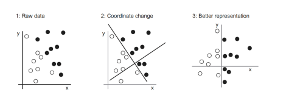
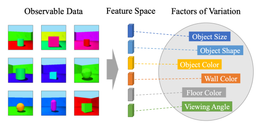
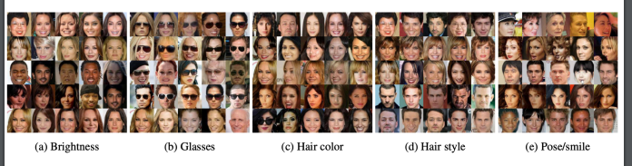
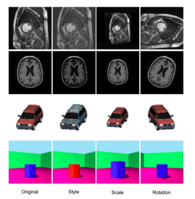

# 24 settembre

Tags: Autoencoders, Disentangled Representation Learning, Introduzione
.: Yes

## Deep Learning

Il `deep-learning` automatizza la definizione delle rappresentazioni dei dati impiegate per produrre l’output, cioè creare nuove trasformazioni per far funzionare vari algoritmi.

Quello che si fa in pratica è definire nuovi sistemi di riferimento, quindi definire nuove regole per semplificare l’apprendimento nella nuova rappresentazione.

## Disentangled Representation Learning

Si vogliono introdurre vari vincoli per semplificare il tutto a valle, questo ha l’obiettivo di identificare i `fattori di variazione` nei dati osservabili. L’apprendimento `disentagled` mira a creare spazi delle caratteristiche dove tali fattori sono comprensibili mediante dimensioni indipendenti, il problema è che questo procedimento è molto complesso.

Nella prima immagine viene mostrato che sarebbe più facile se si potessero avere tutte le caratteristiche citate sotto i `fattori di variazione`. Si nota che alcune sono apparentemente informative o poco informative altre invece sono molto informative, anche se alcune feature non sono molto informative si lasciano comunque perché potrebbero essere utili ad altri task. Questi fattori di variazioni si possono imparare analizzando molti immagini, quindi non serve definire il task.

Le altre immagini mostrano come questo processo si può estendere ad altri domini e casi d’uso. Lo spazio latente districato serve per spiegare meglio all’algoritmo quello che ci si può trovare all’interno del dominio.

## Autoencoders

Gli `autoencoders` sono composti da 2 pezzi:

- `encoder`: costruisce una rappresentazione con dimensionalità ridotta, ridurre i nodi che fanno parte dell’encoder, significa comprimere le informazioni.
- `decoder`: ricostruisce l’input a partire dalla rappresentazione generata dall’`encoder`.

Si ottiene quindi uno `spazio-latente` compatto in cui sono rappresentate le caratteristiche più informative, per esempio le `GAN` sfruttano la stessa tecnica.