# 25 Marzo

Argomenti: Alberi di Decisione, Algoritmi greedy - Decision tree learning, Boosting, Feature selection, Feature split selection, Metrica di Qualità, Recursive stump learning
.: No

## Alberi di Decisione

Un altro metodo per fare classificazione è quello di utilizzare gli `alberi di decisione`. Un albero di decisione prende in input un oggetto o una situazione descritta da un insieme di features e restituisce una “decisione”.

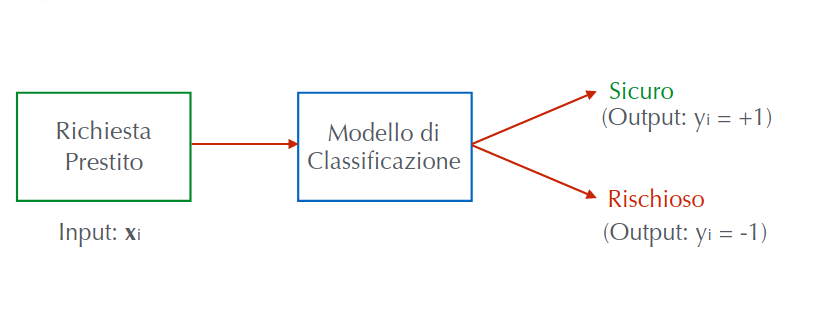

Un esempio di applicazione può essere quello di valutare le richieste di prestito da parte di un cliente alla propria banca.

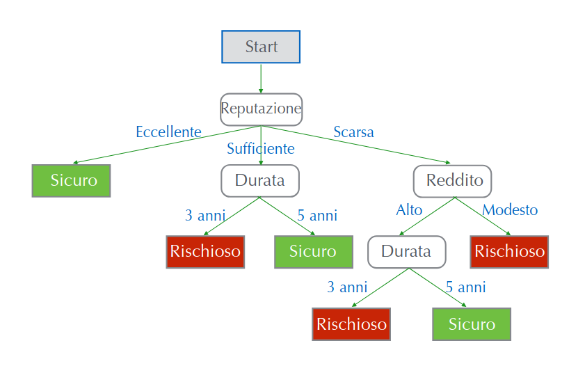

Nel formulare questo problema come un problema di apprendimento si deve decidere quali features sono disponibili per descrivere osservazioni nel dominio.

Supponendo che `reputazione` abbia 3 valori, `durata` 2 valori e `reddito` 2 valori si potrebbe avere una situazione simile a quella mostrata in figura

Se si dà un generico input $\bold x_i$, l’albero di decisione prende le seguenti decisioni restituendo l’output come un prestito sicuro

## Apprendimento albero dai dati

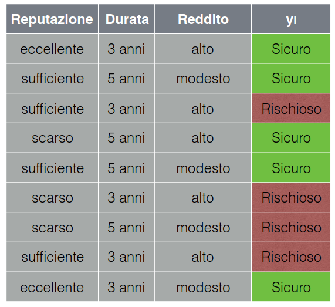

E’ possibile costruire un decision tree a partire da un certo numero di osservazioni.

Poi si dovrà minimizzare un certo numero di osservazioni per poi ottenere alla fine l’albero di decisione.

## Metrica di qualità

$$
Errore = \dfrac{\text{\# previsioni errate}}{\text{\# esempi}}
$$

Una funzione di costo può essere quella della `quality-metric`, che misura la frazione delle previsioni errate fornite dall’albero.

Ovviamente il miglior valore possibile è $0$ perché equivale a dire che le previsioni errate sono $0$, il peggior valore possibile invece è un valore random.

L’obiettivo è quindi di costruire un albero di decisione che minimizzi il `classification-error` (quindi l’errore definito in precedenza) sui dati di training; purtroppo questo è un task estremamente difficile perché è un problema NP-hard, però è possibile utilizzare delle euristiche che funzionano bene.

## Algoritmo greedy - decision tree learning

Per costruire un albero di decisione senza utilizzare la metrica dell’errore si eseguono i seguenti step:

- si comincia da un albero vuoto considerando tutti gli esempi disponibili
- `feature-selection`: si seleziona la feature migliore con la quale si può partizionare (cioè fare split) i dati in base ai diversi valori che essa può assumere.
- per ogni split:
    - `stopping-condition`: se non ci sono altre operazioni da fare, costruisce una foglia con la previsione
    - `recursive-step`: se ci sono altre operazioni da fare si continua la costruzione dell’albero a partire dagli split che stiamo considerando.

## Predizioni con Decision Stump - feature selection

Si suppone di avere 40 osservazioni di cui 22 sono sicuri e 18 sono richiosi:

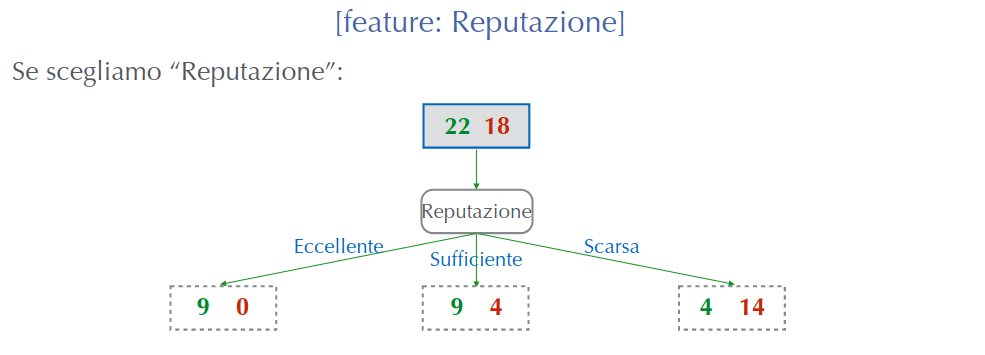

Se si sceglie la feature `reputazione`, si ottengono queste decisioni

- quelli che hanno un valore eccellente: sono 9 positivi e 0 negativi
- quelli che hanno un valore sufficiente: sono 9 positivi e 4 negativi
- quelli che hanno un valore scarso: sono 4 positivi e 14 negativi

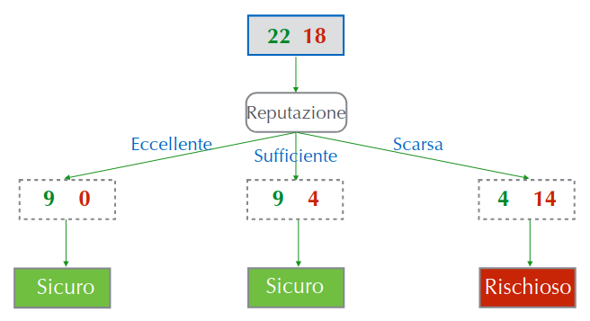

Se si volesse fermarsi in questo punto, si usa l’approccio del `majority-value` cioè della maggioranza

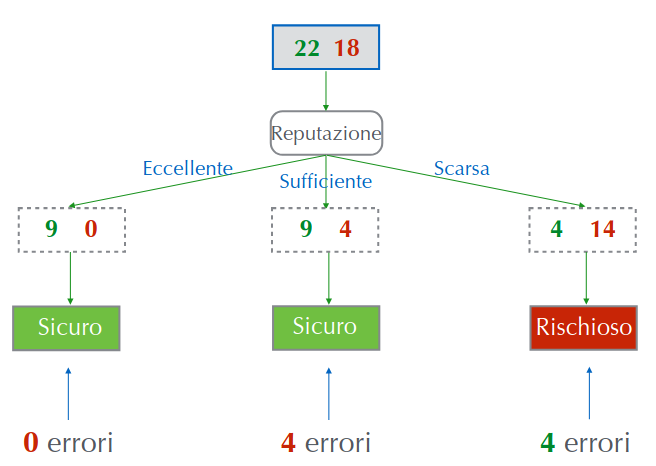

Il problema è che in questa figura sono mostrati gli errori se si sceglie la feature reputazione

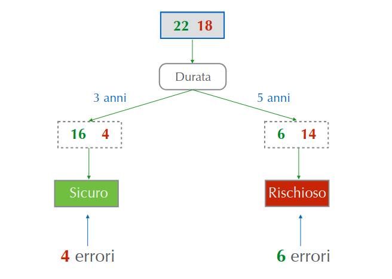

Se invece si scegliesse la feature durata, in questa immagine sono mostrati per esempio gli errori commessi 

## Selezione della feature migliore

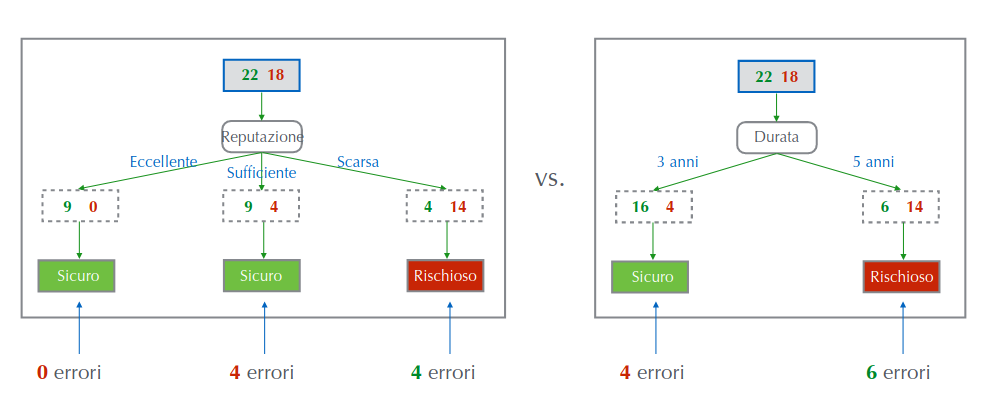

Bisogna definire un criterio per la scelta della feature migliore, per fare questo si considerano gli errori già visti in precedenza calcolando per ogni modello la `classification-error` per ogni feature

$$
\text{error 1}=\dfrac{4+4}{22+18}=0.2
\\ \space
\\
\text{error 2}=\dfrac{4+6}{22+18}=0.25
$$

Si ottiene che scegliendo il modello con feature reputazione si commette un errore pari a 0.2 mentre se si sceglie la feature durata si commette un errore pari a 0.25

Si sceglie dunque la feature con il classification error più basso.

## Algoritmo per Feature split selection

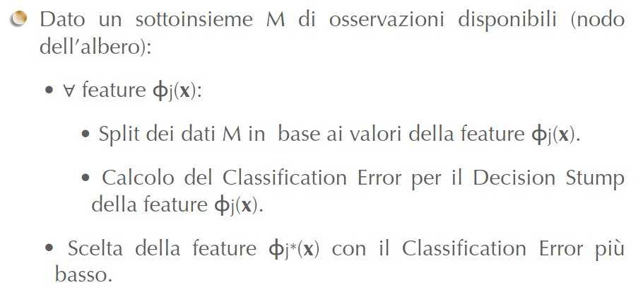

Questo algoritmo è la formalizzazione dei procedimenti spiegati prima

## Recursive stump learning

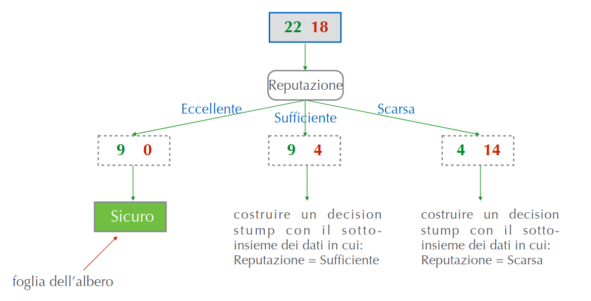

Si sceglie reputazione come prima feature, per il valore eccellente si hanno 9 positivi e 0 negativi e quindi ci si può fermare.

Per gli altri 2 casi non c’è unanimità, quindi si applica lo stesso approccio nei 2 sottoinsieme, facendo decision stump considerando quale tra le caratteristiche che non si è preso in esame è la migliore.

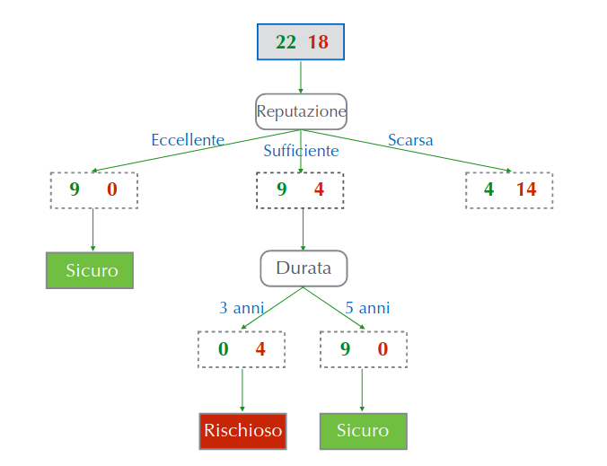

Continuando si potrebbe avere una situazione di questo tipo ottenendo situazioni unanimi per i vari valori delle feature

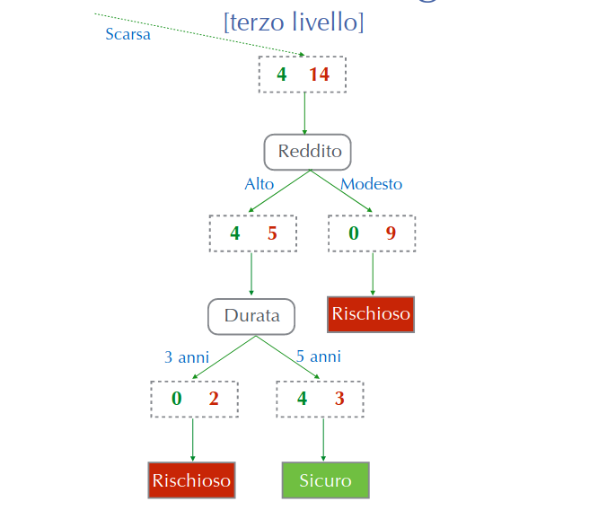

Questo è un continuo dell’albero precedente

## Algoritmo greedy - decision tree learning

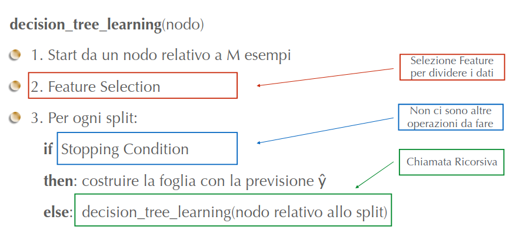

Rappresentazione formale dell’algoritmo

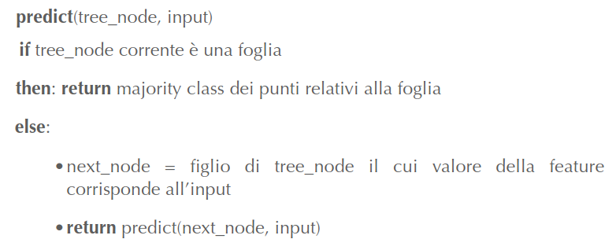

Questo algoritmo implementa la funzione $T(\bold x)$, ossia l’algoritmo che, a fronte di un ingresso $\bold x_i$, visita l’albero di decisione costruito nella fase di training e fornisce in output una previsione $\widehat{\bold y}_i$ 

---

## Boosting

Il `boosting` è una tecnica per combinare molti classificatori di base per produrre un nuovo classificatore le cui prestazioni sono di gran lunga migliori di ciascuno dei classificatori; l’idea è quella di partire da `simple-classifiers` caratterizzati in genere da bassa varianza e alto bias.

Quello che si fa in generale per migliorare un classificatore può essere quello di aggiungere più features al classificatore, per esempio nella regressione logistica si aumenta il grado del polinomio cercando di evitare l’overfitting mentre nei decision trees si aumenta la profondità dell’albero.

Nel boosting si fa qualcosa di diverso: si parte da un insieme di weak classifiers i cui risultati sono opportunamente combinati per ottenere uno strong classifier

## Ensemble Classifier

$$
F(\bold x_i)=sign\left[\sum_{j=1}^{T}w_j\cdot f_j(\bold x_i)\right]
$$

Alla base del boosting c’è l’idea dell’`ensemble classifier`, che considera vari `weak-classifiers` e i vari voti espressi dai classificatori sono combinati insieme per formulare la previsione finale. Si considerano $T$ weak-classifiers

Se il segno è positivo la previsione vale $+1$, se è negativo vale $-1$. Si segnala l’importanza dei pesi $w_i$ che devono essere individuati mediante un processo di training.

## Apprendimento di un Decision Stump - vantaggio del boosting

Di seguito sono riportati i passaggi per costruire un albero di decisione

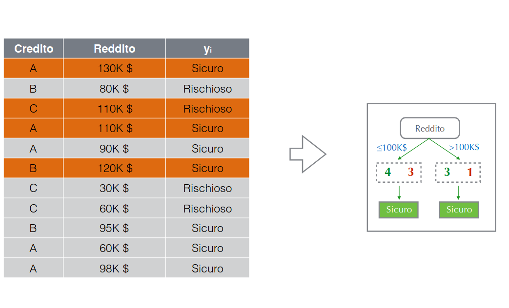

Supponendo di prendere la feature reddito e di considerare solamente 2 sottoinsiemi mettendo la soglia a 100k per decidere se dare in prestito

Per valori maggiori di 100k si ha (3,1), per decision stump si mette sicuro, stessa cosa si fa per valori minori di 100k.

Questo esempio mostra che il `decision-stump` non è riuscito a catturare adeguatamente le informazioni dal numero limitato di dati disponibili. Quello che fa il boosting è considerare il decision-stump, lo valuta, vede come classifica i vari punti, e addestra un successivo decision stump con il quale si focalizza soprattutto sui punti dove il precedente classificatore era debole.

## Apprendimento su dati pesati nel caso di boosting

L’idea è quella di dare maggior peso agli esempi ritenuti più importanti, quindi ogni esempio ($\bold x_i,y_i$) è pesato mediante un $\alpha_i$, più il punto è ritenuto importante, più è elevato il peso $\alpha_i$. L’algoritmo di apprendimento rimane lo stesso.

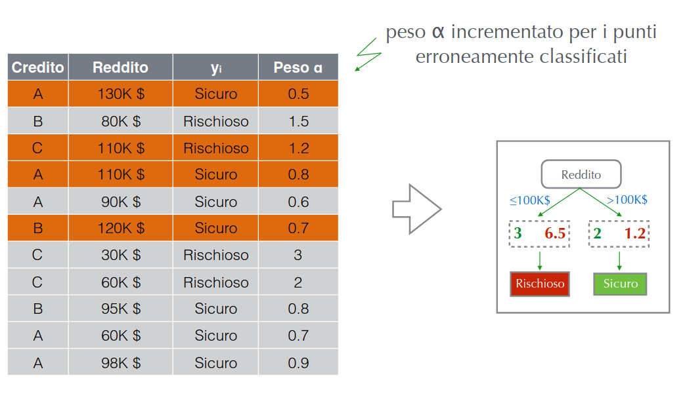

Considerando l’esempio di prima, si aggiunge la colonna dei pesi incrementato per i punti classificati male.

Questo approccio può essere applicato a molti algoritmi di machine learning, per esempio nel gradient ascent per la logistic regression: (si nota l’$\alpha$ che appare all’interno della sommatoria)

$$
w_j^{(t+1)}\gets w_j^{(t)}+\eta\cdot\sum_{i=1}^{N}\alpha_i\phi_j(\bold x_i)\left\{I\left[y_i=+1\right]-P\left(y=+1|\bold x_i,\bold w^{(t)}\right)\right\}
$$

## Boosting

Quindi il `boosting` è un algoritmo greedy, per l’apprendimento di “ensemble dai dati”, avvalendosi di `weak-learners` usati come black box. L’assunzione che si fa su questi weak learners è che ciascuno di essi deve avere prestazioni migliori di un classificatore “random”; nel boosting i base classifiers sono addestrati in sequenza. Per migliorare le prestazioni di un weak learner, l’algoritmo deve poter manipolare i dati in ingresso, altrimenti si ottengono sempre gli stessi risultati.

## AdaBoost

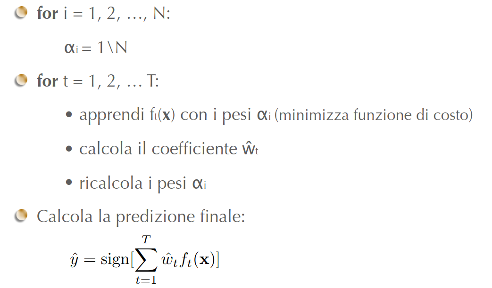

Nell’`adaboost` si procede come segue:

- si inizia associando i pesi per ciascuna feature $i$ come $1/N$
- poi una volta deciso il numero $T$ di classificatori, si esegue il ciclo dove si apprende la $f_t(\bold x)$ con i pesi $\alpha_i$ minimizzando la funzione di costo, calcolando il coefficiente $\widehat{\bold w}_t$ e poi ricalcolare i pesi $\alpha_i$.
- Calcolando poi la predizione finale

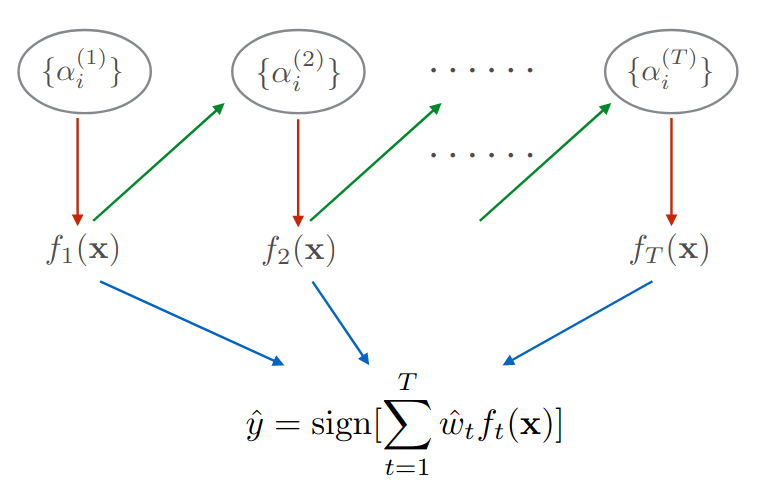

In questa immagine si evidenzia il processo di training dei vari classificatori, basato su una forma pesata dei punti del training set(linee rosse). 

Ogni peso dipende dalle prestazioni del precedente classificatore (linee verdi)

Si creano però i seguenti problemi:

- come calcolare il coefficiente $\widehat{\bold w}_t$
- come ricalcolare i pesi $\alpha_i$

## Problema n.1 - calcolo del coefficiente $\widehat{\bold w}_t$

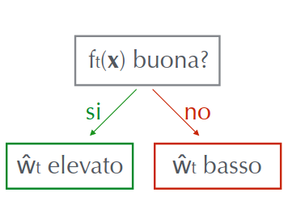

Il peso $\widehat{\bold w}_t$ rappresenta un grado di fiducia nella $f_t$, pertanto se $f_t(\bold x)$ è buono allora la $\widehat{\bold w}_t$ deve essere elevato altrimenti è basso. 

Una funzione è considerata buona se ha un basso training error.

## Weighted Classification Error

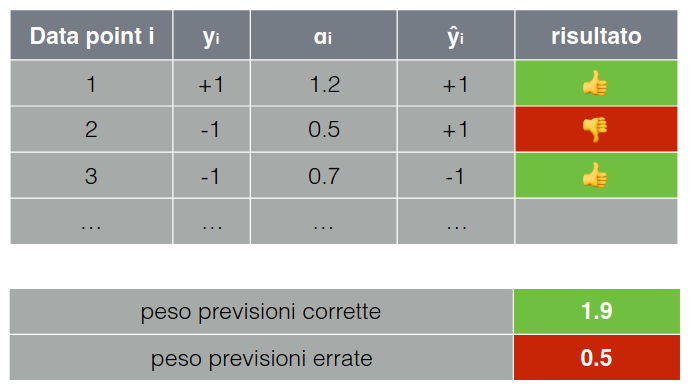

La misura di un errore pesato è simile a quella di un errore calcolato su dati non pesati. 

Supponendo di utilizzare l’esempio riportata nella figura, ci si calcola il peso delle previsioni corrette e quelle errate ottenendo per esempio $1.9$ e $0.5$ rispettivamente

Di seguito sono mostrate formule per calcolare il `weighted-error`:

$$
\sum_{i=1}^{N}\alpha_i\cdot I\left[\widehat{y}_i\neq y_i\right]
$$

Peso totale degli errori

$$
\sum_{i=1}^{N}\alpha_i
$$

Peso totale di tutti i data points

$$
we=\dfrac{\text{peso totale degli errori}}{\text{peso totale di tutti i data points}}
$$

Calcolo del `weighted-error` dove il miglior valore è $0$ e il peggior valore è un valore random

## Calcolo del coefficiente $\widehat{\bold w}_t$

$$
\widehat{w}_t=\dfrac{1}{2}\cdot ln\left(\dfrac{1-we(f_t)}{we(f_t)}\right)
$$

Questa è la formula usata in `adaboost`, risolvendo il problema n.1

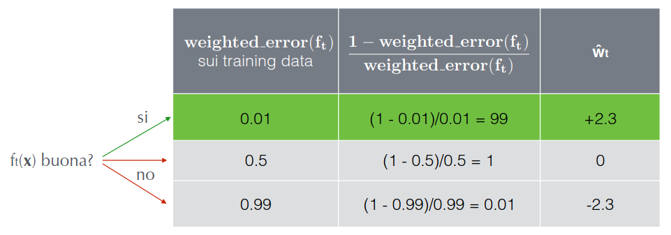

In questa immagine si vede il calcolo di $\widehat{\bold w}_t$ partendo dal weighted error

## Problema n.2 - ricalcolo pesi alfa

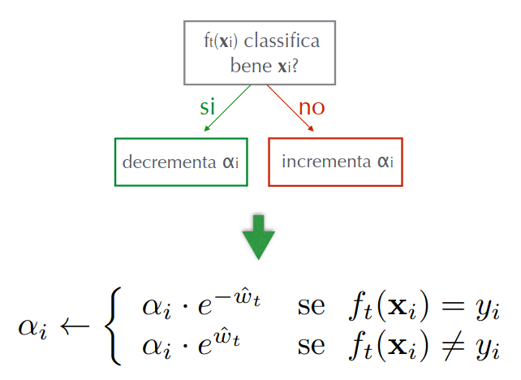

Bisogna focalizzarsi sopratutto sui data point dove la funzione commette errori

In sostanza de $f_t(\bold x_i)$ classifica bene $\bold x_i$ si decrementa $\alpha_i$ in caso contrario si incrementa.

## Normalizzazione pesi $\alpha$

La normalizzazione dei pesi $\alpha_i$ è suggerita dal fatto che: se la funzione sbaglia spesso la classificazione di $\bold x_i$, il peso $\alpha_i$ tende ad assumere valori molto alti, se la funzione prevede spesso correttamente la classificazione di $\bold x_i$, il peso $\alpha_i$ tende ad assumere valori molto bassi.

$$
\alpha_i\gets\dfrac{\alpha_i}{\sum_{j=1}^{N}\alpha_j}
$$

Tutto ciò può causare instabilità numerica dopo varie iterazioni, quindi quello che si fa è normalizzare in modo tale che dopo ogni iterazione la somma dei pesi $\alpha_i$ sia sempre uguale ad 1

## Adaboost algoritmo

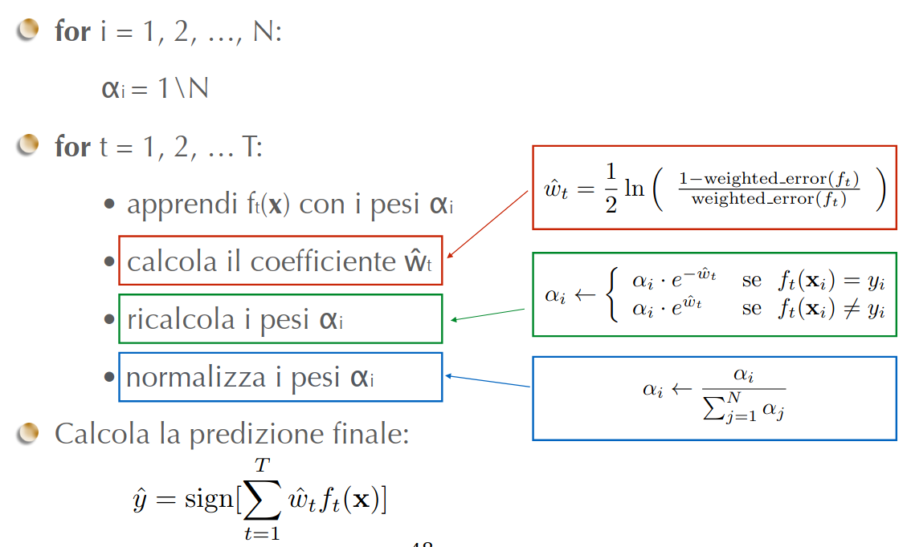