# 25 Ottobre

Tags: Activation Functions, Batch Renormalization, Gradient Clipping, Group Normalization, Local Response Normalization, Transfer Learning
.: Yes

## Batch Renormalization

Sperimentalmente si nota come la `batch-normalization` non dà nessun beneficio se i valori di `media` e `deviazione-standard` divergono frequentemente da quelle dell’intero dataset, questo fa riaffiorare effetti di `covariate-shift`. Quello che si fa quindi è applicare una ulteriore trasformazione alle attivazioni normalizzate, si fa questo quando la BN non dà nessun beneficio.

La `batch-renormalization` cattura le differenze tra stime e valori esatti di media e stddev; quello che si fa è considerare gli ultimi $n$ minibatch analizzati, per poi utilizzare le stime di $\mu$ e $\sigma$ per quel particolare minibatch per creare una trasformazione affine che viene usata durante l’addestramento per correggere i parametri stimati sul minibatch.

$$
r=\frac{\sigma_B}{\sigma}\\
d=\frac{\mu_b-\mu}{\sigma}
$$

Cioè si utilizzano 2 parametri di correzione $r$ e $d$, definiti in questo modo

$$
\widehat{x}=\frac{x-\mu}{\sigma}
$$

Si sa che nella `batch-normalization` i dati di input vengono normalizzati rispetto alla media $\mu$ e la deviazione standard $\sigma$ del batch di input

$$
\widehat{x}=\frac{x-\mu_B}{\sigma_B}\cdot r+d
$$

Con la `batch-renormalization` l’input viene trasformato in questo modo

Quello che si sta facendo è correggere le divergenze tra $\mu_B$ e $\mu$ e tra $\sigma_B$ e $\sigma$ dove $\mu_B$ e $\sigma_B$ sono ricavate sul particolare minibatch. Se si volesse far coincidere le 2 tecniche allora non ci deve essere divergenza tra i $\mu$ e $\sigma$ e bisogna porre $r=1$  e $d=0$. I parametri $r$ e $d$ sono considerati costanti durante il calcolo del gradiente per un certo minibatch.

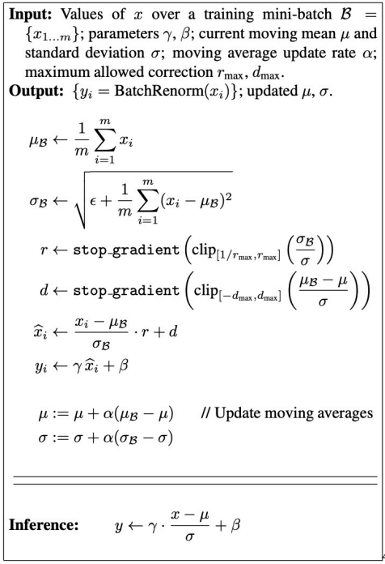

Qui viene mostrato l’algoritmo del `batch-renormalization`:

- si sfrutta la `moving-average` cioè una media ricavata su una sequenza che include gli ultimi valori analizzati, quindi $\mu$ e $\sigma$ sono ricavati sugli ultimi minibatch analizzati.
- $r$ e $d$ sono ulteriori valori ricavati dalla discrepanza delle statistiche sul minibatch corrente e sull’insieme degli ultimi minibatch analizzati. Il loro valore viene modificato quando il numero di minibatch analizzati cresce. La funzione `clip` cerca di mantenere una bassa discrepanza tra i valori per non alterare troppo il comportamento del training.

---

## Bootstrapping/Resampling

Quando si hanno pochi dati per l’addestramento si usano tecniche per aumentarne la quantità, in questi casi si fa `resampling`, cioè si campionano i campioni dei dati di addestramento originali.

La tecnica del `boostrapping` consiste nel stimare la distribuzione di un parametro (come la media, la deviazione standard o un coefficiente di regressione) a partire da un campione di dati, senza fare forti ipotesi sulla distribuzione della popolazione da cui è tratto il campione. È particolarmente utile quando i dati sono limitati o quando non si conosce la distribuzione teorica dei dati. La `batch-renormalization` si ispira alla tecnica del `boostrapping`.

---

## Local Response Normalization

Il `LRN` è una tecnica che introduce una forma di competizione locale tra neuroni adiacenti tra di loro nei canali della rete, mettendo in risalto le attivazioni forti e riducendo quelle deboli, migliorando la capacità della rete di catturare pattern più rilevanti nei dati.

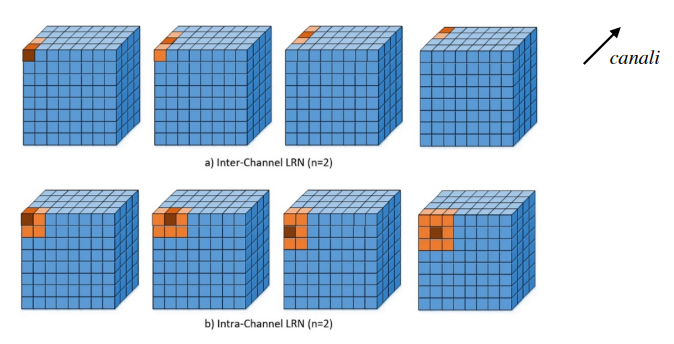

Quindi quello che fa questa tecnica è ridurre le attivazioni dei neuroni meno importanti e mantenere importante i neuroni che sono più attivati. Ci sono 2 tipi di `LRN` e sono la `Inter-Channel` e `Intra-Channel`.

Inter-Channel → Across Channels

Intra-Channel → Withing Channel

## Inter-Channel LRN

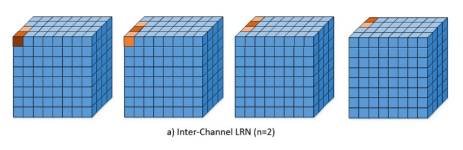

Per ogni $x$ e $y$, il vicinato e la relativa normalizzazione sono definiti lungo la dimensione dei canali.

$$
b_{x,y}^{i}=a_{x,y}^{i}/\left(k+\alpha \cdot\sum_{j=max(0,i-n/2)}^{min(N-1,i+n/2)}(a_{x,y}^{j})^2\right)^\beta
$$

Di seguito sono elencati i significati delle varie variabili:

- $b_{x,y}^{i}$: attivazione normalizzata
- $a_{x,y}^{i}$: attivazione originale del neurone nella posizione $(x,y)$ sul canale $i$
- $N$: numero totale di canali
- $k$: garantisce la `numerical-stability`, cioè evita divisioni per lo $0$
- $\alpha$: usato come costante di normalizzazione
- $\beta$: è una costante di `contrasto`.
- $n$: utilizzata per definire la grandezza del `neighborhood`, ossia quanti valori consecutivi del pixel devono essere considerati durante la normalizzazione.
    - la configurazione $(k,\alpha,\beta,n)=(0,1,1,N)$ è la normalizzazione standard
    - nella figura mostrata si è assunto $n=2$ e $N=4$

## Intra-Channel LRN

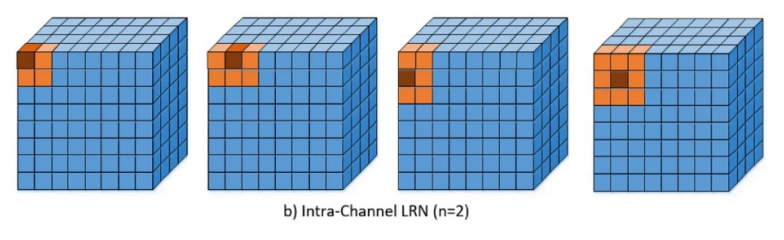

In questo caso il neighborhood considera un singolo canale alla volta.

$$
b_{x,y}^{k}=a_{x,y}^{k}/\left(k+\alpha \cdot
\sum_{i=max(0,x-n/2)}^{min(W,x+n/2)}
\sum_{j=max(0,y-n/2)}^{min(H,y+n/2)}(a_{i,j}^{k})^2\right)^\beta
$$

Dove $(W,H)$ sono la larghezza e l’altezza della mappa delle caratteristiche, ad esempio nella figura mostrata si ha $(W,H)=(8,8)$.

L’unica differenza tra `Inter` e `Intra` channel LRN è la selezione del neighborhood per la normalizzazione perché:

- `intra`:  viene definito un neighborhood 2D
- `inter`: viene definito un neighborhood 1D attorno al pixel in esame

## Group Normalization

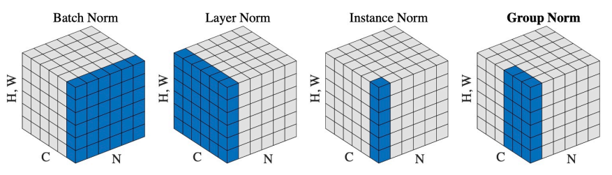

La `group-normalization` è un’altra tecnica di normalizzazione che viene applicata ai dati lungo gruppi di canali, piuttosto che su singoli batch o su singoli canali.

La motivazione per questa tecnica è che la `batch-normalization` calcola la media e stdddev per normalizzare i dati all’interno di un batch, tuttavia quando i batch sono piccoli le stime della media e della stddev possono essere meno rappresentative, riducendo l’efficacia della normalizzazione. Quindi la `group-normalization` risolve questo problema normalizzando i canali all’interno di gruppi, rendendola indipendente dalla dimensione del batch.

## Funzioni di attivazione

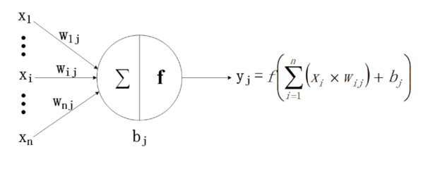

Le funzioni di attivazione convertono una trasformazione affine utilizzando pesi e bias in un layer o in più layer in una trasformazione tipicamente non lineare.

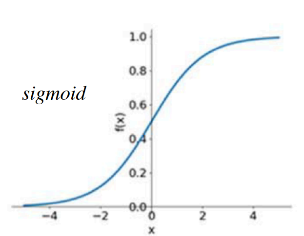

La sigmoide mappa qualsiasi input nell’intervallo $(0,1)$, molto utile nei problemi di classificazione binaria.

La tangente iperbolica, che ha valore medio pari a 0, è una sorta di standardizzatore degli input, facilitando l’apprendimento per il layer successivo

## ReLU activation function

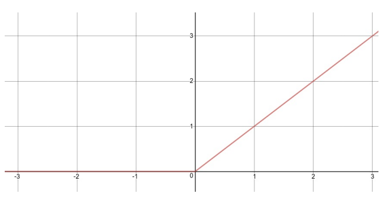

La `relu` è una funzione di attivazione che non satura, ha solo output positivi perciò la media degli output sarà maggiore di 0. Definita come:

$$
f(x)=max(0,x)
$$

I `vantaggi` sono che garantisce la non linearità anche per valori prossimi allo 0, non satura per valori positivi elevati quindi riduce il vanishing problem e riduce la complessità computazionale visto che la derivata è una costante.

Gli `svantaggi` sono che è più probabile che si vada in overfitting, se l’input x genera un valore negativo allora l’output sarà nullo, questo significa che l’errore smette di propagarsi su alcuni nodi, che si considerano inattivi. Un altro problema dell’output nullo è che la derivata è nulla.

## Leaky ReLU

$$
f(x)=max(\alpha\cdot x,x)
$$

Per evitare che i nodi generano un output nullo, si introduce la `Leaky-ReLU`, definita in questo modo

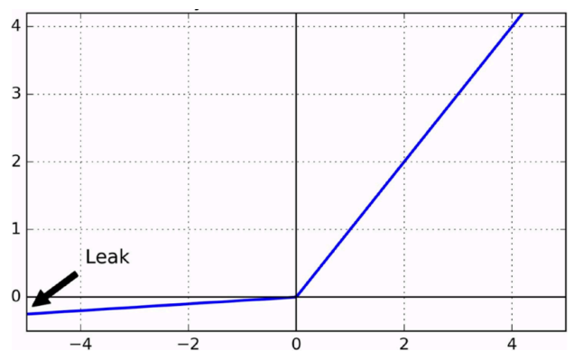

L’iperparametro $\alpha$ garantisce che l’output sia un valore diverso da 0 per $x\lt0$

## Scaled Exponential Linear Units

$$
f(x)=\begin{cases}
\lambda x,\space\space x\gt0\\
\lambda\alpha(e^x-1),\space\space .
\end{cases}
$$

Definita in questo modo, la `SELU` non si annulla per valori $<0$, a differenza della ReLU

I vantaggi di questa funzione di attivazione è che è sempre derivabile, e l’output include valori negativi, perciò la media degli output di un layer si allontana meno da 0 rispetto alla ReLU.

## Funzioni di attivazione - 2

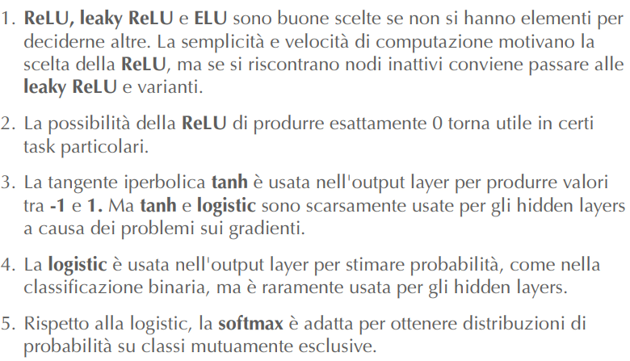

Ricapitolando qui sono elencati i casi d’uso delle varie funzioni di attivazione mostrate.

---

## Gradient clipping

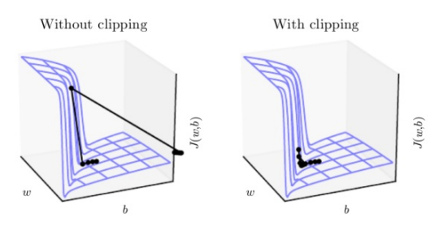

La tecnica del `gradient-clipping` introduce una soglia $c$, quindi un iperparametro, per limitare il valore dei gradienti durante la `backpropagation`. 

Se si ridimensiona la derivata dell’errore, anche gli aggiornamenti sui pesi sono ridimensionati, riducendo la probabilità di overflow e underflow. Bisogna notare però che si sta riducendo la quantità di informazione propagata nella rete.

$$
g\gets c\cdot\frac{g}{||g||}
$$

Se $||g||\ge c$ allora si fa il gradient clipping mostrato qui accanto.

---

## Transfer learning

Il `transfer-learning` è un approccio per riutilizzare parametri ottenuti da architetture già addestrate:

- riduce il tempo di addestramento perché non bisogna fare l’addestramento da zero ma solamente “affinare” la rete sul task di interesse, si riutilizzano i pesi di architetture già addestrate per semplificare molta parte del lavoro.
- riduce la dimensione del training set necessaria ad addestrare la rete sul nuovo obiettivo di interesse

Si basa sull’assunzione che la rete di partenza sia stata addestrata su istanze con caratteristiche sufficientemente generiche per essere rilevati anche nel nuovo task.

Ci sono molti modi per fare `transfer-learning` ma per dare un quadro generale bisogna dire queste cose:

- ci sono molte strategie possibili per ogni scenario di task/dominio/dati, e sono `inductive-TF`, `transductive-TF` e `unsupervised-TF`.
- ogni approccio si specializza su una forma di conoscenza da trasferire tra 2 modelli e sono `instance-transfer`, `feature-representation transfer`, `parameter-transfer` e `relational-knowledge transfer`.

Detto questo ci sono varie `tecnologie` che implementano una `strategia` e un `approccio` su specifici tipi di modelli.

## Inductive transfer learning

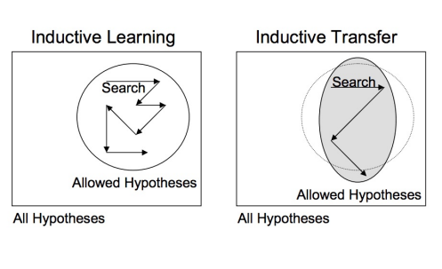

L’idea è che nel learning induttivo si sta cercando una certa ipotesi, mentre nell’approccio induttivo si sta sostanzialmente cercando di riutilizzare ipotesi riconosciute da una parte e di impiegarle nel proprio dominio, non è detto che il mio dominio corrisponda al dominio “precedente”.

In sostanza si può trasferire parte della conoscenza (disegno a sinistra), all’interno del proprio dominio di interesse (disegno a destra).

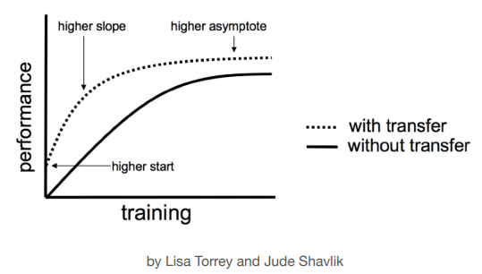

Con il transfer learning si ha che le performance nelle fasi iniziali sono migliori, il tasso di miglioramento delle performance sono più alte e la convergenza migliora.

## Transfer learning: strategie e approcci

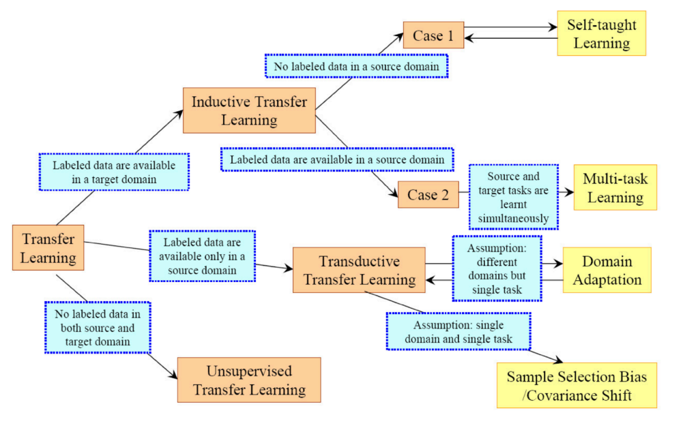

In questa immagine vengono mostrati i vari approcci da utilizzare nelle varie caratteristiche.

Qui sono riportate le strategie:

- `inductive-TF`:
- `transductive-TF`:
- `unsupervised-TF`:

Qui sono riportati gli approcci:

- `instance-transfer`: sarebbe lo scenario ideale dove i dati di un sottoinsieme del dominio sorgente possono essere riutilizzate insieme ai dati target per migliorare i risultati
- `feature-representation-transfer`: si cerca di minimizzare la divergenza dei domini e a ridurre l’errore identificando rappresentazioni di caratteristiche che possono essere utilizzate in entrambi i domini.
- `parameter-transfer`: si basa sul presupposto che i modelli addestrati per task correlati condividano parametri e iperparametri
- `relational-knowledge-transfer`: mira a gestire dati non indipendenti e identicamente distribuiti

---

## Off-the-shelf Pre-trained Models come feature extractors

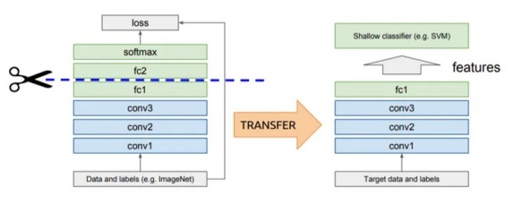

Quando si fa transfer-learning si possono prendere solo alcune parti della rete; le parti che si prendono posso essere usate per estrarre le caratteristiche. La rete sorgente diventa un `generic-feature-detector`.

## Fine tuning off-the-shelf pre-trained models

Quando si prendono quelle parti di rete che sono utili, non ci si limita solamente a sostituire i layer finali, ma si fa `fine-tuning` su alcuni layer a valle per adattarli al nuovo task. Il procedimento è mostrato di seguito:

- si congelano i parametri della rete neurale utilizzata per il task sorgente
- eventualmente si rimuovono gli ultimi layer della rete sorgente visto che sono troppo specifici per il task originale
- si scongelano gli ultimi layer per l’addestramento del task obiettivo
- i layer rimossi possono essere sostituiti con nuovi layer per motivi di adattamento al task obiettivo oppure per aumentarne la profondità sempre per il task obiettivo

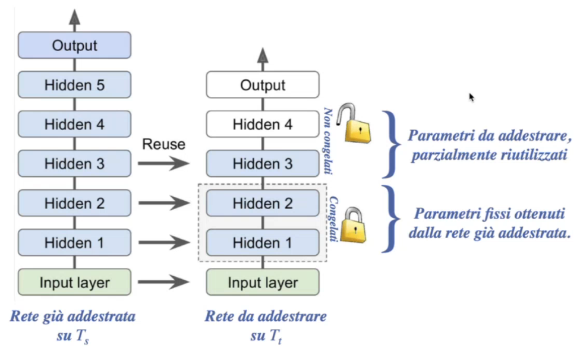

In questa immagine viene mostrato come riutilizzare già addestrati

## Semi-supervised learning

Ci sono alcune casistiche dove il task ha pochi dati di training e non esistono modelli pre-addestrati da sfruttare, quello che si può fare è implementare una rete che apprende rappresentazioni salienti sui dati non etichettati.

La rete viene addestrata uno strato alla volta, partendo da quello più vicino agli input; ogni layer è addestrato usando l’output dello strato precedente, quindi in modo `non-supervisionato`, durante l’addestramento gli altri layer non di interesse sono congelati.

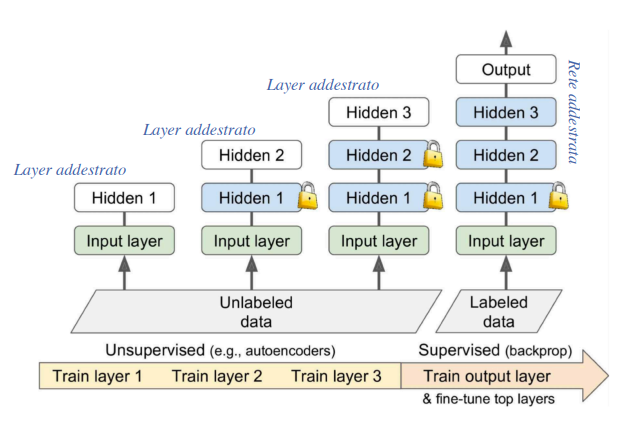

Quando tutta i layer sono stati addestrati, la rete può essere addestrata con un approccio `fine-tuned` supervisionato su un dataset ridotto, per esempio congelando dei layer precedenti e aggiungendo un ultimo layer, questa combinazione di training non supervisionato con dopo il training supervisionato viene chiamato `semi-supervised-learning`.

L’approccio unsupervised crea una approssimazione dei parametri utile per l’identificazione delle rappresentazioni delle caratteristiche salienti per il task obiettivo. Il vantaggio di questo approccio è che lo spazio di ricerca viene ridotto rendendo possibile l’apprendimento sul target obiettivo e riducendo la possibilità di esplorare zone sub-ottime, infatti ad ogni step lo spazio di ricerca è più limitato rispetto a quello associato al target obiettivo.

Col termine `pretraining` si indica generalmente il procedimento per addestrare modelli semplificati su dati non etichettati e incompleti prima di arrivare al modello finale.