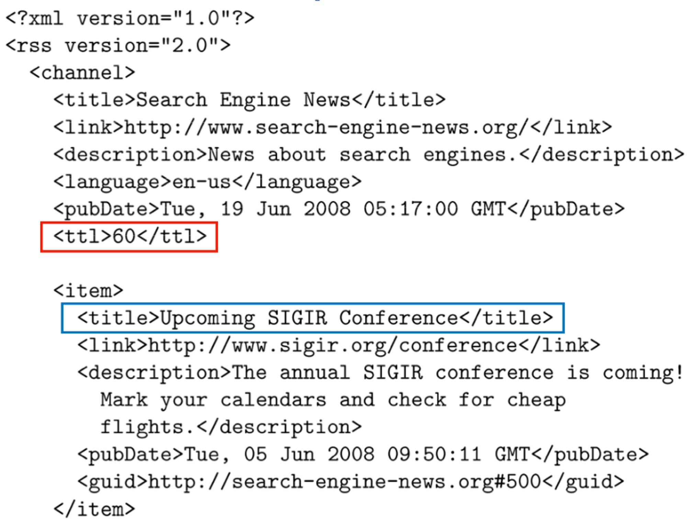
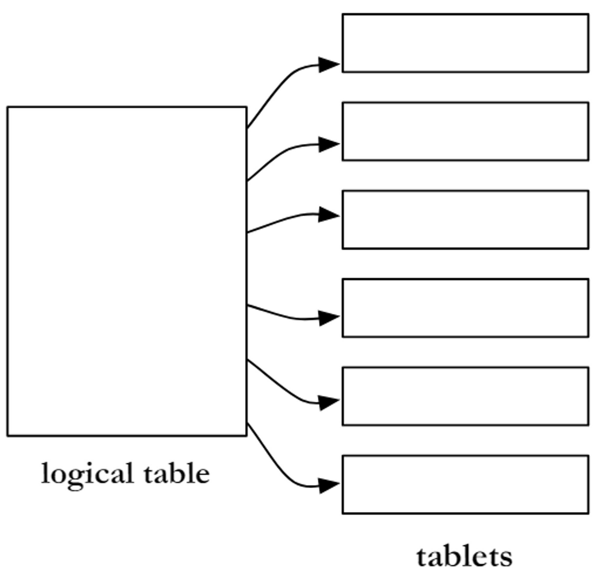

# 26 Marzo

Argomenti: Big-table, Conversion, Document feed, Fingerprint, Ricerca dei duplicati, Simhash
.: Yes
Description: Text acquisition 2

## Document feed

In generale, nel caso di web crawler e desktop crawler si assume che qualsiasi documento possa essere creato o modificato in qualsiasi istante, tuttavia molti documenti sono `pubblicati`, ovvero creati in un istante prestabilito e raramente aggiornati.

I documenti pubblicati da una singola risorsa possono essere ordinati in una sequenza temporale chiamata `document-feed`. Quindi questa document-feed la si può vedere come una collezione di documenti che sono facilmente accedibili per un `web-crawler` in quanto si connette direttamente al feed. Visto che è una collezione di documenti ordinati i nuovi documenti si trovano nella parte finale del feed, quindi un `web-crawler` in generale analizza solo la parte finale del feed.

Esistono 2 tipi di document-feed:

- `push-feed`: avverte un sottoscrittore quando viene pubblicato un nuovo documento
- `pull-feed`: richiede che il sottoscrittore controlli periodicamente i nuovi documenti, il formato più comune è `RSS`.

In questa immagine viene mostrato un esempio dello standard `RSS`. 

Il campo `TTL` indica il tempo il quale i contenuti sono memorizzati temporaneamente, una volta superato questo tempo viene considerato `stale` cioè vecchio. Questa informazione però indica anche il tempo dopo il quale il feed deve essere visitato da un crawler.

---

## Conversion

Il testo è memorizzato in centinaia di file file incompatibili fra loro, quindi quello che si fa è convertirli in XML o HTML. Memorizzare i documenti trasformati in testo permette di risparmiare risorse di crawling quando le pagine non sono aggiornate e forniscono un accesso efficiente al testo per la generazione dello `snippet`. I database possono provvedere alla memorizzazione del documento per alcune applicazioni. I motori di ricerca per il web usano sistemi custom di memorizzazione di documenti. 

Sono richiesti i seguenti 3 punti per i sistemi di memorizzazione:

- `accesso-casuale`: usando funzioni di hash basati sull’URL, si richiede il contenuto di un documento tramite la sua URL. Per ogni indice da recuperare i tempi di recupero devono essere gli stessi
- `compressione`: si cerca di ridurre i requisiti di spazio per la memorizzazione ed aumentare l’accesso efficiente. Questi algoritmi si basano su regole grammaticali per poter prevedere cosa segue ad una determinata lettera.
- `aggiornamento`: deve essere possibile lavorare su grandi volumi di documenti nuovi e modificati

L’idea è quindi quella di memorizzare i documenti in grandi file invece di usare un documento per file, al fine di evitare overhead nell’apertura e chiusura di file e ridurre il tempo di ricerca e lettura.

## Big Table

La soluzione di google è quella di usare una `big-table`, cioè un sistema di database distribuito dove ogni database contiene una sola tabella.

La tabella è suddivisa in piccole porzioni chiamati `tablet` che sono serviti da migliaia di macchine.

Una `big-table` è una mappa multilivello, ordinata, distribuita, persistente e multidimensionale. La mappa è indicizzata da 3 parametri: `row-key`, `column-key` e un `timestamp`. La combinazione di questi 3 identifica il contenuto memorizzato.

## Ricerca dei duplicati

La presenza di documenti che possono contenere le stesse informazioni consumano risorse significative durante il crawling e comportano rumore. Le tecniche di ricerca dei `duplicati` sono diverse a seconda del tipo di duplicato che si cerca, sono del tipo `esatto` o `simile`.

- il ritrovamento di un `duplicato esatto` è molto semplice, basta utilizzare tecniche di checksum tramite il quale si calcola un valore sulla base del contenuto di un documento, per esempio la somma dei byte del file del documento.
- il ritrovamento di un `duplicato simile` è più complicato, i `near-duplicate` sono definiti utilizzando un valore di soglia per una misura di similarità tra coppie di documenti. Ad esempio, il documento $D_1$ è un near-duplicate di $D_2$ se più del 90% delle parole nei documenti sono le stesse,  se la condizione è verificata allora non verrà incluso l’url del documento all’interno del crawling

Esistono 2 scenari per il rilevamento dei `near-duplicate`:

- `search`: ha l’obiettivo di trovare i near-duplicate di un dato documento $D$, presenta un numero di comparazioni richieste pari a $O(N)$, con $N$ numero di documenti della collezione
- `discovery`: ha l’obiettivo di trovare tutte le coppie di near-duplicate nella collezione, con costo $O(N^2)$. Visto che è computazionalmente oneroso sono state sviluppate tecniche per ricavare rappresentazioni compatte dette `fingerprint`.

## Fingerprint

Il processo di base per la generazione di `fingerprint` è il seguente:

- Il documento è analizzato, si esiste solo il contenuto composto da parole
- le parole sono raggruppate in $n$-grammi, cioè raggruppamenti di parole di dimensione fissa $n$
- alcuni degli $n$-grammi sono selezionati per rappresentare il documento e sono sottoposti ad hashing per migliorare l’efficienza del processo di retrieval e ridurre le dimensioni della rappresentazione.
    - la selezione avviene tramite la funzione `mod-b`, cioè se un valore è divisibile per $b$ si seleziona
- i documenti sono poi confrontati fra loro utilizzando la sovrapposizione di fingerprint

## Simhash

Le comparazioni di similarità che usano rappresentazioni `word-based` sono le più efficaci per ritrovare `near-duplicate`. La tecnica di `simhash` combina i vantaggi della similarità basata sulla misura word-based con l’efficienza di `fingerprint` basato su hashing.

In pratica per documenti simili si hanno valori di hash simili, più precisamente la similarità fra 2 pagine misurata dalla misura di correlazione del coseno risulta proporzionale al numero di bit che sono gli stessi nei fingerprint generati da simhash.

La procedura per il calcolo di un `fingerprint-simhash` è il seguente:

- si elabora il documento in un insieme di feature con pesi associati. Si assume che le parole sono feature pesate in base alla loro frequenza.
- si genera un valore hash con $b$ bit per ogni parola. Questo valore dovrebbe essere univoco per ogni parola.
- Nel vettore $b$-dimensionale $V$, si aggiornano le componenti del vettore aggiungendo il peso di una parola a ogni componente per il quale il bit corrispondente nel valore hash della parola è 1 e sottranedo il peso se il valore è 0
- dopo che tutte le parole sono state elaborate, si genera un fingerprint di $b$-bit importando l’$i$-esimo bit a 1 se l’$i$-esima componente di $V$ è positiva, o 0 altrimenti.
