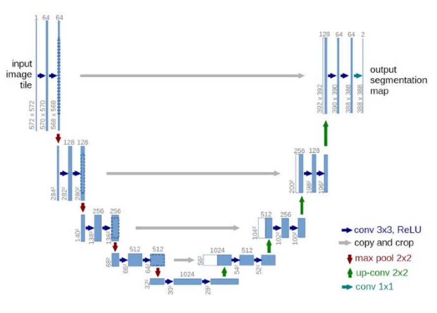
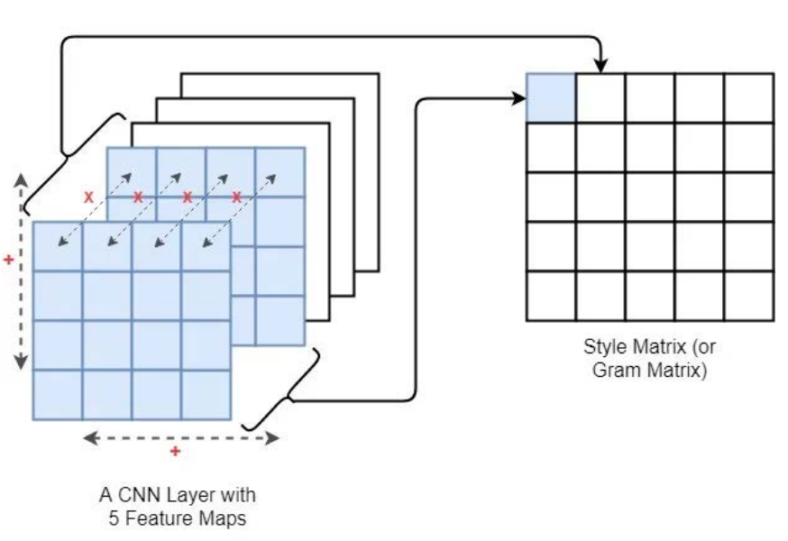
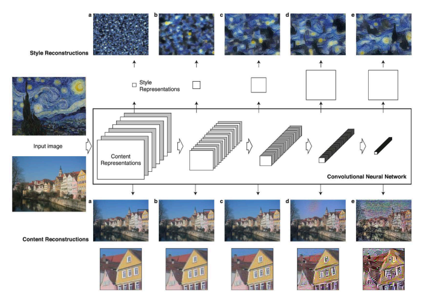

# 26 Novembre

Tags: Transposed convolutions, U-Nets
.: No

## Transposed convolutions

Le `transposed-convolutions` sono operazioni utilizzate principalmente in reti neurali convoluzionali (CNN) per aumentare la risoluzione spaziale delle feature map, ovvero per passare da un'immagine più piccola a una più grande.

## U-Nets: long skips connections

Questa è una architettura `encoder-decoder` che impiega `skip-connections`. Viene usata nei task in cui l’output ha dimensioni spaziali uguali a quelle in input. 

Le skip connections hanno lo scopo di inviare informazioni direttamente da layer della fase di codifica a quelli di decodifica, evitando di elaborare l’informazione per tutti i layer dell’architettura. In questo modo si possono preservare le caratteristiche riducendo la possibile perdita che si ottiene con la codifica-decodifica.

## Long vs short skip connections

Le connessioni devono rispettare vincoli di dimensionalità: in pratica stesse dimensioni sia in caso di addizione, sia in caso di concatenazione. Si hanno 2 tipi di skip connections:

- `short`: sono usate insieme a conv-layer consecutivi che non cambiano la dimensione dell’input
- `long`: si usano spesso in architetture simmetriche, in cui la dimensionalità spaziale si riduce nella parte di codifica e aumenta gradualmente nella parte di decodifica.

## Image style transfer

L’obiettivo è costruire specifici `feature-extractors`, cioè creare più spazi latenti ognuno dedicato a specifiche classi di caratteristiche. Ipotizzando di riconoscere lo stile di una immagine in un certo spazio latente, si può ricostruire la stessa impiegando un diverso punto dello spazio che rappresenta un diverso stile.

Supponendo di voler utilizzare una `VGG` pre-addestrata, si hanno questi input:

- `content-image`: indicato con $c$,  sarebbe l’immagine su cui si desidera trasferire uno stile
- `style-image`: indicato con $s$, sarebbe l’immagine da cui si vuole estrarre lo stile
- una immagine generata in input $g$, sarebbe l’immagine che contiene il risultato finale.

Facendo cosi si usano 2 tipi di loss:

- `content-loss`: assicura le attivazioni degli strati più a valle, cioè quelli che rappresentano maggiormente gli oggetti presenti nell’immagine, siano simili tra $c$ e $g$.
- `style-loss`: assicura che la correlazione delle attivazioni in tutti gli strati sia simile tra style image e l’immagine generata.

$$
\mathcal{L}_c=\frac{1}{2}\cdot \sum_{i,j}(A_{ij}^l(g)-A_{ij}^l(c))^2
$$

Data la mappa delle attivazioni di un hidden layer, la `content-loss` è definita nel modo seguente.

$$
\mathcal{L}_s=\sum_{l}w^l\cdot
\left(\frac{1}{M^l}\sum_{ij}(G_{ij}^l(s)-G_{ij}^l(g))^2\right)
$$

Una volta definita la `gram-matrix`, la `style-loss` è definita in questo modo.

In pratica ci si ricava una `style-matrix`, per la generated-image e la style-image. La style loss è definita come la differenza quadratica media tra le 2 matrici di stile.

Le $\times$ indicano le moltiplicazioni e il $+$ indica la somma di entrambe le mappe di caratteristiche in larghezza e altezza.

Minimizzando la loss si impone che la “distribuzione di features” nelle feature maps di un certo layer sia la stessa, tra immagine di stile e immagine generata.

In questa immagine viene mostrato il funzionamento di `U-Nets`.

---