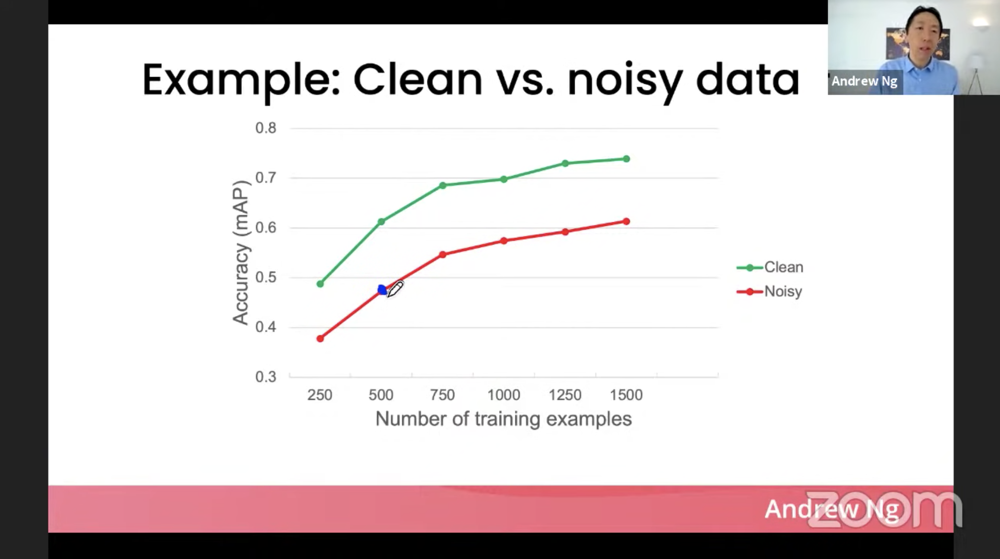

# 26 Settembre

Tags: Data Acquisition, Data-centric, Introduzione, Model-centric
.: No

## Modelli data-driven

I sistemi `data-driven`, aiutano a prendere decision che possono influire sulla società e su singoli individui, si basano su un processo decisionale affiancato da un supporto umano. Quello che fanno è migliorare l’efficienza e a favorire la l’equità; lavorano su dati appartenenti a persone.

Il cilo di vita di un sistema `data-driven`:

- `dati in ingresso`: da dove vengono i dati?
- `sistema di calcolo`: come è arrivato ai risultati?
- `risultati`: come sono usati i risultati?

## Acquisizione e preparazione dei dati

Questi problemi rientrano nella sfera del `data-engineering`; si usano dati da sorgenti interne ed esterne per poi eseguire un complesso processo di ingegneria dei dati come per esempio:

- `data-cleaning`: elimina valori errati, oppure assegna un valore ai dati mancanti
- `data-integration`: su cerca di trovare delle corrispondenze tra le entità
- `data-fusion`: in caso di conflitti, sceglie il valore più plausibile

## Model-centric

Si sviluppa un modello che ha una buona performance gestendo il rumore nei dati che sono stati raccolti

La caratteristica di questo caso è che i dati sono fissi e si itera iterativamente il codice/modello

## Data-centric

La consistenza dei dati è importantissima, si fa utilizzo di strumenti che migliorano la qualità dei dati, con questo si ha la possibilità di avere più modelli che performano bene.

La caratteristica di questo caso è che il codice è fisso e si migliorano iterativamente i dati.

## Dati sporchi e dati puliti

Nel caso in cui si hanno per esempio un numero di dati e una percentuale di questi è rumorosa le seguenti soluzioni sono ugualmente effettive:

- pulire il rumore
- raccogliere lo stesso numero di dati per ottenere alla fine il dobbio dei dati.

Con l’approccio `data-centric`, c’è molto spazio per i miglioramenti

In questo grafico viene mostrato come la precisione cresce aumentando il numero di dati e la differenza di dati puliti e sporchi.
