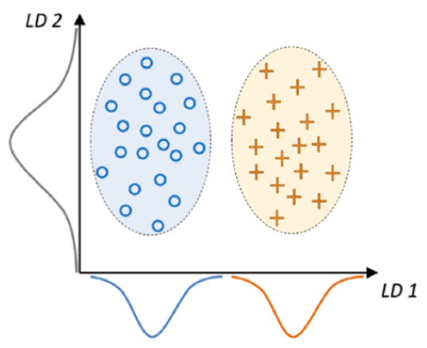
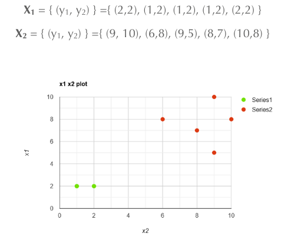
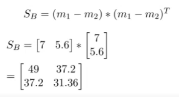
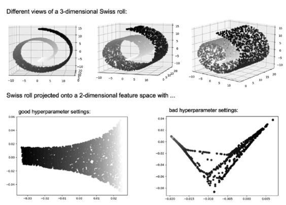
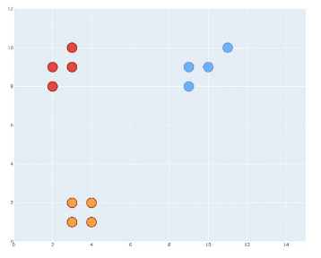
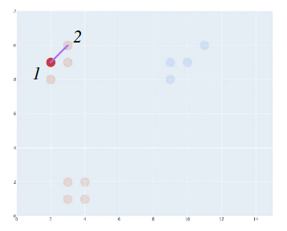
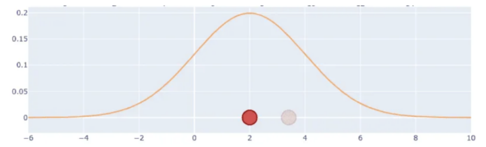

# 27 Maggio

Argomenti: Linear Discriminant Analysis, Manifold Learning, t-SNE
.: No

## Linear Discriminant Analysis (LDA)

La `LDA` è basata su un approccio supervisionato, come la `PCA` è una tecnica lineare di estrazione delle caratteristiche volta ad aumentare l’efficienza computazionale e ridurre il grado di overfitting. La `PCA` cerca di trovare le componenti ortogonali con massima varianza rispetto a un certo dataset mentre `LDA` fa comunque una trasformazione lineare ma mira a trovare il sottospazio delle caratteristiche che ottimizza la separabilità delle classi.

Nell’esempio, potremmo impiegare un discriminante lineare basato sui valori dell’asse $x$ (`LD1`) per separare le 2 classi rappresentate da distribuzioni gaussiane

Sebbene il discriminante lineare sull’asse $y$ (`LD2`) rappresenti bene la varianza nel dataset, non è adeguato per catturare le informazioni necessarie alla classificazione.

La `LDA` si basa su varie ipotesi:

- i dati devono essere distribuiti normalmente
- le classi devono avere matrici di covarianza identiche
- gli esempi di addestramento sono statisticamente indipendenti tra loro

Tuttavia `LDA` è ancora efficiente nella riduzione della dimensionalità anche se alcune di queste ipotesi non sono verificate

## Procedimento di LDA

Il procedimento è completamente identico a quello di PCA, l’unica cosa che cambia è il modo in cui si ottiene la matrice di covarianza $A$, di seguito sono riportati i procedimenti:

- standardizzare il dataset $d$-dimensionale
- per ogni classe, determinare il vettore $d$-dimensionale costituito dal valor medio ricavato per ogni dimensione
- costruzione della matrice di dispersione tra classi $S_B$ e la matrice di dispersione all’interno delle classi $S_W$
    - una `scatter-matrix` è una stima della matrice delle covarianze costruite a partire dai dati estratti da un dataset.
- calcolo degli autovettori e i corrispondenti autovalori della matrice $S_W^{-1}S_B$
- ordinare gli autovalori in modo decrescente e di conseguenza i relativi autovettori
- scegliere i $k$ autovettori che corrispondono ai $k$ autovalori di valore più elevato e costruire una matrice di proiezione $\bold W\in\mathbb{R}^{d\mathrm{x}k}$, con colonne pari agli autovalori
- proiettare il dataset in input nel nuovo sottospazio $\bold x\bold W=\bold z$

$$
\bold m_i=\frac{1}{n_i}\sum_{\bold x\in D_i}\bold x_{\bold m}
$$

`LDA` tiene conto delle informazioni relative ad ogni classe $i$, rappresentate dal vettore dei valori medi $\bold m_i$ considerando le istanze in $i$

$$
\bold S_w=\sum_{i=1}^{c}\bold S_i
$$

La `within-class scatter matrix` si ricava nel seguente modo

$$
\bold S_i=\sum_{\bold x\in D_i}(\bold x-\bold m_i)(\bold x-\bold m_i)^T
$$

cioè sommando la $\bold S_i$ ricavata per ogni classe $i$

$$
\frac{1}{n_i}\bold S_i
$$

Se le istanze tra le classi non hanno distribuzione uniforme bisognerebbe ottenere la `scaled-within-class scatter matrix`, cioè la matrice di covarianza $\Sigma_i$

$$
\bold S_B=\sum_{i=1}^{c}
(\bold m_i - \bold m)
(\bold m_i - \bold m)^T
$$

Infine si ricava la `between-class scatter matrix` $\bold S_B$, dove il vettore media $\bold m$ è ottenuto considerando tutte le istanze, stavolta in modo indipendente dalla classe di appartenenza.

## LDA - Esempio

Si suppone di avere 2 classi con dei punti mostrati in figura.

$$
\begin{align*}
  m_1 &= \left[\frac{\sum x_1}{5},\frac{\sum y_1}{5}\right]
\\
  &= [1.4,2]
\\ \\
m_2 &= \left[\frac{\sum x_2}{5},\frac{\sum y_2}{5}\right]
\\
  &= [8.4,7.6]\\
\end{align*}

$$

La prima cosa che si fa è calcolare le medie per caratteristica, cioè si fa la somma dei vari punti lungo l’asse delle $x$ e la si divide per il numero di coordinate, stessa cosa si fa per i valori lungo l’asse delle $y$

Si ottengono le seguenti coordinate che rappresentano il punto medio delle varie classi

A questo punto si calcola la matrice $S_i$ e poi la matrice $S_W$

In questa figura viene mostrato il calcolo di $(x-m_i)$ per il calcolo di $S_1$, gli stessi procedimenti si fanno per $S_2$

$$
S_1=\begin{bmatrix}
    0.24 & 0 \\
    0 & 0
\end{bmatrix}
\\ \space \\
S_2=\begin{bmatrix}
    1.84 & -0.04 \\
    -0.04 & 2.64
\end{bmatrix}
$$

Si ottengono $S_1$ ed $S_2$

$$
S_W=\begin{bmatrix}
    2.08 & -0.04 \\
    -0.04 & 2.64
\end{bmatrix}
$$

Si ottiene $S_W$ come la sommatoria di tutte le $S_i$

Si ottiene anche $S_B$

Avendo le matrici $S_W$ e $S_B$ si può ricavare anche $S_W^{-1}S_B$ su cui si estrarranno gli autovettori e autovalori per poi costruire la matrice $W$ in modo simile a $\text{PCA}$

---

## Manifold Learning

Sono tecniche non lineari per la riduzione della dimensionalità, dove le istanze originali sono proiettate in spazi di dimensioni ridotte chiamate `latent-manifolds`. Le proiezioni devono catturare la struttura dei dati originali per poterli preservare nello spazio latente.

Possono semplificare notevolmente il processamento dei dati ma non sono facili da impiegare, possono dare output non utili come scelte di iperparametri non ideali.

In questa immagine è mostrata che la comprensione visiva dei dati è possibile solo tramite 2 o 3 dimensioni.

---

## t-distributed stochastic neighbor embedding (t-SNE)

La `t-SNE` è una tecnica di riduzione non lineare della dimensionalità, utilizzata per visualizzare insiemi di dati multi-dimensionali in spazi a 2 o 3 dimensioni. Caratterizza le istanze originali in base alle distanze misurate a coppie mediante un kernel gaussiano, cioè i punti distanti tra loro hanno una probabilità inferiore di essere scelti rispetto ai punti vicini.

Questo metodo definisce una distribuzione di probabilità di tale distanza nel nuovo spazio latente che più si avvicina alla distribuzione nello spazio originale. Perciò mira a preservare tali distanze minimizzando la divergenza di 2 distribuzioni con un approccio a discesa del gradiente

Questa tecnica opera unicamente sui dati forniti in origine perciò non può essere usata su nuove istanze, torna utile per interpretare parametri di modelli complessi (CNN).

## t-SNE - procedimento

Si suppone di avere 3 classi facilmente distinguibili

$$
p(j|i)
$$

Si definisce la `similarità` tra 2 punti come la probabilità condizionale che $x_i$ scelga $x_j$ come suo vicino

Si prende il punto 1, dopodiché si sceglie un secondo punto per esempio 2 e si calcola la distanza $|x_i-x_j|$

A partire dal punto $1$ si può pensare di costruire una gaussiana centrata nel punto $1$ e tutti gli altri punti vengono spalmati sull’asse delle $x$ per caratterizzare la gaussiana a distanza pari alla distanza che è stata misurata

In sostanza si calcolano le distanze euclidee tra tutte le coppie di punti $x_i$ e $x_j$ nel dataset ad alta dimensione

La similarità tra 2 punti $x_i$ e $x_j$ è definita come la probabilità condizionale $p_{j|i}$, che rappresenta la probabilità che il punto $x_i$ scelga $x_j$ come vicino. Questa probabilità è calcolata utilizzando una distribuzione gaussiana centrata su $x_i$

$$
p_{j|i}=\dfrac{g(||x_i-x_j||)}{\sum_{k\neq j}g(||x_i-x_k||)}
$$

Si normalizza considerando la somma di tutte le proiezioni e ponendo $p_{j|i}$, dove per definizione $p_{i|i}=0$

$$
g(x')=\dfrac{1}{\sigma\sqrt{2\pi}}\cdot exp\left(-\dfrac{1}{2}\cdot\dfrac{(x'-\mu)^2}{\sigma^2}\right)
$$

dove la funzione $g$ è definita in questo modo

## Perplexity

Quello che si fa per ricapitolare è introdurre una probabilità che è funzione di una gaussiana che a sua volta è funzione della distanza. Ci si ricorda che l’idea di partenza era mantenere questi dati nello spazio latente.

Per caratterizzare la distribuzione non resta che definire la varianza $\sigma^2$ per ogni istanza $x_i$, il problema è che non esiste un unico valore perché dipende dal numero di punti che circondano il suo centro.

$$
Perp(P_i)=2^{H(P_i)}
\\ \space\\
H(P_i)=-\sum_{j}p_{j|i}\cdot log_2(p_{j|i})
$$

Viene introdotto la `perplexity` come misura `smooth` del numero effettivo di vicini, definita per mezzo dell’entropia di `shannon`

Più alta è il valore di `perplexity` più è alto il valore della varianza, è un iperparametro tipicamente nel range $[5,50]$

All’aumentare della varianza aumenta l’entropia della distribuzione, e la `perplexity` è legata proporzionalmente alla varianza. Per regioni dense si hanno valori bassi di varianza.

$$
p_{j|i}=\dfrac{exp\left(\dfrac{-||x_i-x_j||^2}{2\sigma_i^2}\right)}{\sum_{k\neq i}exp\left(\dfrac{-||x_i-x_k||^2}{2\sigma_i^2}\right)}
$$

Questa è la forma espansa della formula $p_{j|i}$

L’ultimo step di `t-SNE` crea uno spazio a bassa dimensione, con lo stesso numero di punti dello spazio originale, l’obiettivo è avere una distribuzione di probabilità simile a quella dello spazio originale.

$$
q_{j|i}=\dfrac{exp\left(-||y_i-y_j||^2\right)}{\sum_{k\neq i}exp\left(-||y_i-y_k||^2\right)}
$$

Si introduce una distribuzione simile per lo spazio a bassa dimensione, dove $\sigma$ è importata a $1/\sqrt(2)$ e $q_{i|i}=0$

$$
\begin{align*}
  C &= \sum_{i}KL(P_i\space||\space Q_i)
\\
  &= \sum_{i}\sum_{j}p_{j|i}\cdot log\left(\dfrac{p_{j|i}}{q_{j|i}}\right)
\end{align*}
$$

L’obiettivo è avere $p_{i|j}$ e $q_{j|i}$ simili, si usa la divergenza `kullback-leibler`, che assume la forma di una cross-entropy, la quale sarà ottimizzata considerando tutti i punti nel dataset mediante un approccio a discesa del gradiente.

Il problema è che la funzione di costo associata alla distribuzione è di difficile ottimizzazione quindi, quello che si fa è usare la distribuzione $t$ di `student`. Questa distribuzione garantisce:

- una funzione di costo con gradienti che sono più facili da calcolare
- la distribuzione `heavy-tailed` che si ha nello spazio a bassa dimensione evita il sovraffollamento, cioè si hanno meno punti non ideali.

Avendo reso costante $\sigma$ non bisogna stimarla nella distribuzione di $q_{j|i}$. Altre considerazioni da fare sono che la `t-SNE` tende a espandere i cluster densi e a comprimere quelli radi, il che può alterare la percezioni delle dimensioni relative dei cluster. L’algoritmo non garantisce la conservazione delle distanze tra i cluster, quindi le distanze nel grafico `t-SNE` non riflettono necessariamente le distanze reali nei dati originali. La `t-SNE` è capace di gestire gli outlier, evitando che influenzino eccessivamente la struttura dei dati nel nuovo spazio a bassa dimensione.

La `t-SNE` è utile usarlo in vari casi:

- quando altri algoritmi di riduzione delle dimensioni non riescono a trovare strutture e configurazioni e quando i dati hanno una distribuzione non lineare.
- Rispetto a `PCA` può mantenere la struttura locale dei dati, ma potrebbe ignorare la struttura globale originale; questo rende t-SNE particolarmente utile per dati distribuiti in modo non lineare
- questo metodo è adatto per dataset con distribuzioni non lineari