# 27 Settembre

Tags: Attivazione di un nodo, CNN, Canali, Invarianza spaziale, LRF, Permutation Invariance, Principio di località, Stacking Feature Maps, Stride e Padding
.: Yes

## Introduzione della Visual cortex

Molti neuroni nella parte di corteccia deputata al riconoscimento di immagini possiedono una `local-receptive-field (LRF)`, cioè reagiscono agli stimoli situati in regioni circoscritte del campo visuale. Alcuni neuroni si specializzano e si attivano solo in presenza di linee orizzontali, altri verticali, ecc.; alcuni neuroni più estesi si attivano in presenza di certe configurazioni spaziali di caratteristiche a basso livello.

Quindi se si aumenta la complessità, cioè ripetere gli step di specializzazione e attivazione in cascata, nei vari step successivi si possono apprendere `pattern-visuali` anche molto complessi. Si può dire che si comprime l’informazione affinché arrivino le più importanti alla fine.

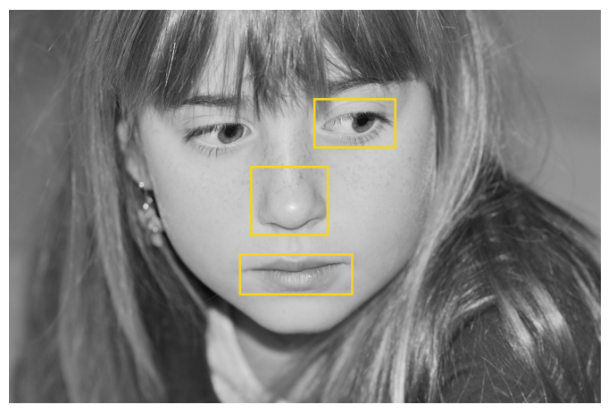

Per riconoscere certe `caratteristiche specifiche` si analizzano informazioni ravvicinate, cioè con una distanza relativa limitata senza considerare l’intera immagine.

## Multi-layer perception

Non si usa una `NN-MLP` per riconoscere gli oggetti perché, a causa dell’elevato numero di parametri da stimare, si hanno quindi problemi di memoria, risorse computazionali e di molti dati per stimare i parametri.

Sono comunque efficaci in molti contesti come:

- dati in formato tabellare dove non esiste nessuna relazione che mette in correlazione le caratteristiche
- dati in cui si estraggono un numero di caratteristiche non elevato che però limitano il numero di parametri da stimare
- in presenza di trasformazioni lineari come rotazione, scalatura, ecc.

## Permutation Invariance

La `permutation invariance` è una proprietà di funzioni matematiche o algoritmi per la quale l’output rimane costante anche quando l’ordine delle caratteristiche in input varia

## Invarianza spaziale (Spatial Invariance)

Si suppone di avere una `MLP` con uno strato nascosto $H$ e un input $X$ entrambe con la struttura da $2D$. Si indica poi con:

- $[\bold X]_{i,j}$: il pixel di una immagine in scala di grigi nella posizione $\left\langle i,j \right\rangle$
- $[\bold H]_{i,j}$: il corrispettivo nodo nel layer nascosto.

S indicano poi con $\bold W$ e $\bold U$ rispettivamente `pesi` e `bias` della rete.

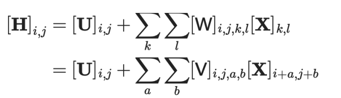

Si introduce un semplice cambio notazione. Gli indici $a$ e $b$ sono offset rispetto a $\left\langle i,j \right\rangle$ e scorrono l’intera immagine in input, perciò possono assumere valori anche negativi a differenza di $k$ e $l$

L’`invarianza-spaziale` impone che, se si ha uno `shift` nell’input $\bold X$, anche la rappresentazione $\bold H$ deve subire lo stesso shift, in modo che l’output rimanga uguale. Ma questo è possibile solo se $\bold U$ e $\bold V$ non dipendono da $\left\langle i,j \right\rangle$

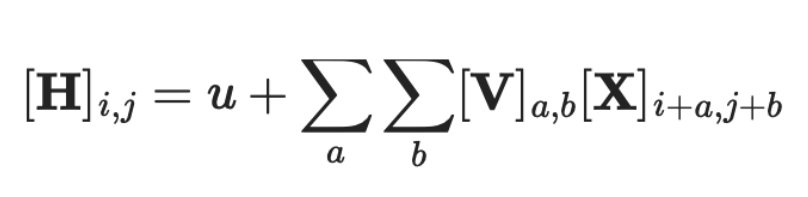

Quindi si impone $[\bold V]_{i,j,a,b}:=[\bold V]_{a,b}$ e $\bold U$ diviene costante, come mostrato in questa formula

Questa formula rappresenta l’operatore di `convoluzione`, quello che dice è che il pixel $\left\langle i+a,j+b \right\rangle$ vicino alla location $\left\langle i,j \right\rangle$ è pesato con il coefficiente $[\bold V]_{a,b}$ per ottenere l’output $[\bold H]_{i,j}$.

## Principio di località

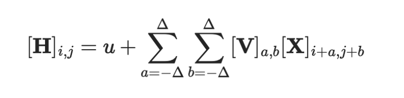

Se si limita l’analisi per determinare $[\bold H]_{i,j}$ a una zona $\Delta\times \Delta$ con $\Delta<<1000$, quindi senza considerare l’intera immagine si ha questa formula

La regione $\Delta\text{x}\Delta$ che genera le attivazioni nel successivo layer è chiamata `local-receptive field (LRF)`.

## CNN - Convolutional layer e LRF

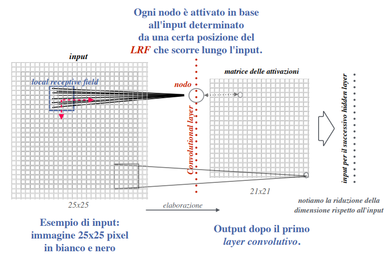

Ogni nodo è attivato in base all’input determinato da una certa posizione del `LRF` che scorre lungo l’input

Il layer $\bold H$ che è stato introdotto prende il nome di `convolutional-layer` e la rete basata su tale layer è chiamata `convolutional-neural-networks`, dove $\bold V$ p chiamato filtro.

Detto più semplicemente la `LRF` è la porzione dell’immagine che “vede” un neurone specifico e la dimensione di questa è determinata dalla dimensione del filtro. Il `filtro` é una matrice di pesi che viene applicata all’immagine di input per estrarre caratteristiche specifiche.

## Channels

Le immagini a colori hanno 3 canali RGB, quindi si aggiunge un altro asse lavorando cosi con tensori a 3 dimensioni ($[\bold X]_{i,j,k}$), questo implica avere filtri del tipo $[\bold V]_{a,b,c}$. 

Infine se si usano più filtri allora l’hidden layer sarà costituito da più matrici di attivazione, cioè si sta creando una `feature-map` dove ogni griglia è creata con un filtro distinto, ogni filtro usato nel layer è chiamato `canale`. (Quindi #canali=#filtri)

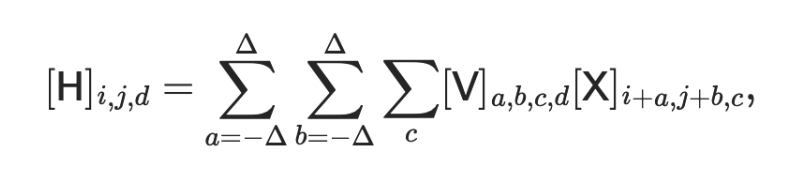

Supponendo di avere più canali in input $(c)$ e più canali nell’hidden layer $(d)$ si ottiene questa formula.

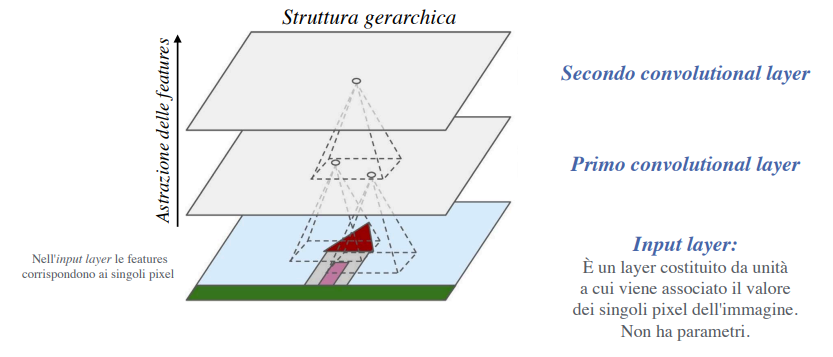

Nelle `CNN` il ridimensionamento che avviene nelle `MLP` è controproducente perché si perderebbe l’informazione relativa alla vicinanza delle features all’interno di una certa regione.

## Attivazione di un nodo

L’attivazione di un nodo in un layer convoluzionale si ottiene analizzando l’output dal layer precedente per mezzo del `LRF`. 

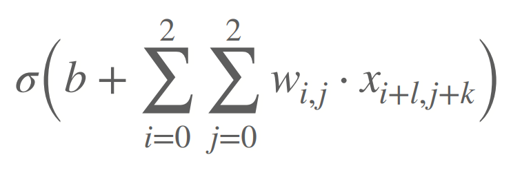

La funzione di attivazione $\sigma$ per il nodo $\left\langle l,k \right\rangle$, si valuta considerando il bias $b$ e la matrice $W$ di dimensione $f_h\times f_w$ associati a $LRF$

in questo caso la dimensione è $3\times 3$

- $i$ e $j$ sono gli indici dei parametri associati al filtro
- $l$ e $k$ corrispondono alle posizioni della matrice di attivazione

## Iperparametri di una CNN

Il numero dei filtri usati, la dimensione del `LRF` e il numero di hidden layers non sono gli unici parametri dell’architettura CNN:

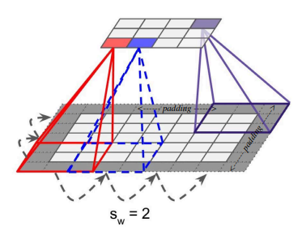

`stride`: sarebbe la distanza tra 2 `LRF` adiacenti, praticamente rappresenta il numero di passi

In questa immagine si ha un `LRF` di $3\times 3$ e uno stide di 2

NOTA: per stride maggiori di 1 si può ridurre la dimensione del layer convoluzionale a scapito della precisione

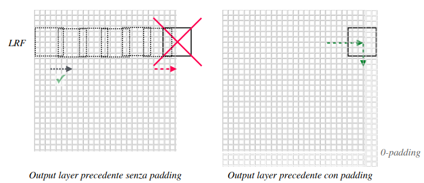

`padding`: si aggiungono dimensioni ai dati in input perché facendo scorrere un filtro può accadere che il numero di stride impostati non permetta di scorrere l’intera istanza in input.

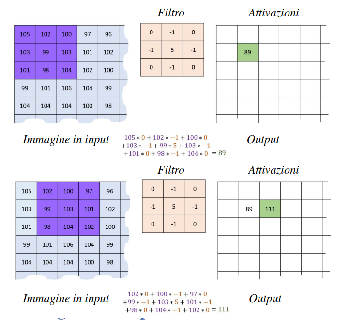

In questa immagine viene mostrato come i valori del filtro vengono utilizzati per calcolare l’attivazione

## Stacking Feature Maps

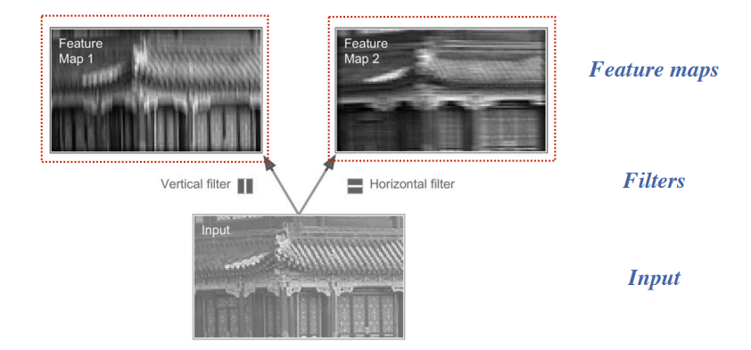

L’insieme delle attivazioni ottenute con lo stesso filtro viene chiamato `feature-map` e possono essere visualizzate come una immagine.

Durante il `forward-propagation` è fondamentale che i filtri, cioè i parametri (pesi e bias) che costituiscono il layer convoluzionale, rimangano costanti (`shared-weights`), questo permette di:

- ridurre il numero di parametri da stimare rispetto alla `MLP`
- durante la `backpropagation`, analizzare le immagini di input dove ogni filtro si concentra su rilevare e apprendere una specifica caratteristica dell’immagine.
    - in sostanza usare lo stesso filtro in diverse zone dell’immagine garantisce la translational e permutation invariance, quindi riconoscere la caratteristica in diverse posizioni.

Detto in modo più semplice assicura che lo stesso tipo di caratteristica venga estratto in modo uniforme su tutta l'immagine di input. Questo permette alla rete di rilevare pattern specifici indipendentemente dalla loro posizione nell'immagine.