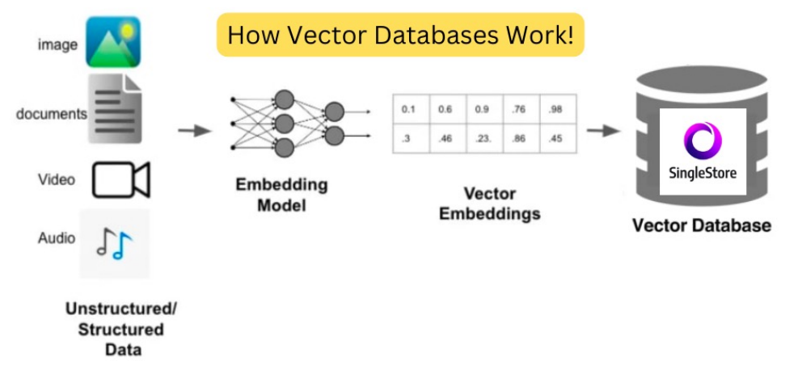
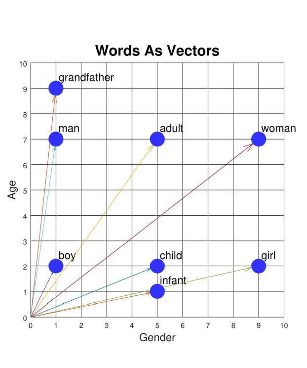
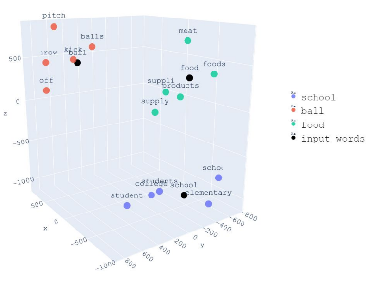
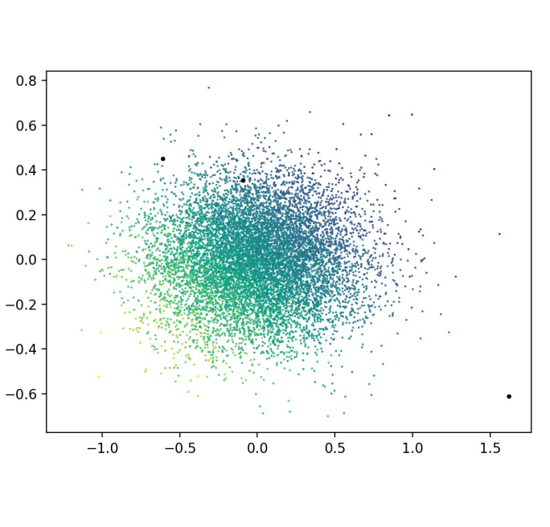
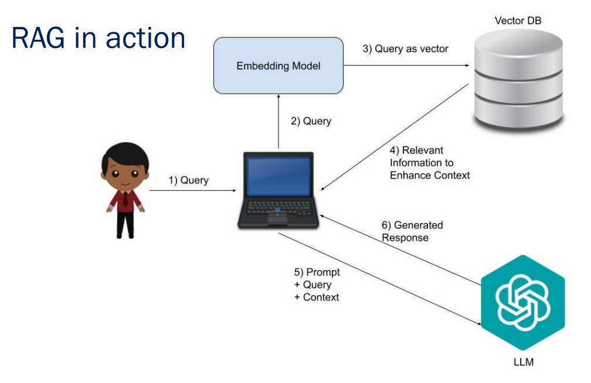

# 28 Maggio

Tags: Dimensionality Reduction, Distance Metrics, High-Dimensional Spaces, Indexing Strategies, Similarity Metrics, Vector Database System, Vector Embeddings
.: No

## Vector Database System

Un database vettoriale è un tipo di database che è progettato per memorizzare, indicizzare e recuperare dati di dimensioni multiple chiamati `vettori`.

La caratteristica è che rispetto ai database tradizionali, che gestiscono i dati organizzati in tabelle (o simili), i database vettoriali sono appositamente progettati per gestire dati rappresentati in uno spazio vettoriale a più dimensioni.

Per trasformare i dati in `vector-embeddings` (sono la rappresentazione vettoriale), si fa uso di `embedding-model` per poi memorizzare nel database vettoriale

Per le interrogazioni si utilizzano tecniche di indicizzazione e algoritmi di ricerca basati sulla similarità; questa caratteristica è cruciale per sistemi di raccomandazione, riconoscimento di immagini e voci, processamento del linguaggio naturale. In sostanza questa topologia di base di dati sono adatti per le necessità delle applicazioni IA che fanno molto affidamento a una vasta quantità di dati.

## Vector embeddings

I `vector-embeddings` sono codici numerici che racchiudono le caratteristiche chiave degli oggetti. Sono punti multi-dimensionali rappresentati come un vettore in un spazio multidimensionale dove ogni elemento del vettore è una `feature`.

Questa rappresentazione è molto utile quando si fa uso di algoritmi di ricerca basati su similarità perché trasforma caratteristiche qualitative in caratteristiche quantitative che possono essere facilmente utilizzate per operazioni di confronto attraverso operazioni matematiche.

## Funzionamento di un database vettoriale

Svariati dati vengono prima processati da un modello di `embedding`. Questo modello di solito è una rete neurale che trasforma i dati in vettori multi-dimensione.

Data una query il database vettoriale esegue operazioni basati su ricerca per similarità per cercare ed ottenere i vettori che sono più simili alla query.

Questo processo permette una rapida e precisa gestione di molti dati in applicazioni che richiedono alte velocità.

## Dimensionality and High-Dimensional Spaces

All’aumentare delle feature si hanno dati a più dimensioni, però questo porta ad un aumento esponenziale dello spazio vettoriale. Si hanno problemi come il :

- `curse-of-dimensionality`: all’aumento delle dimensioni la distanza dei tra i punti perdono significato (spazio delle feature diventa sparso)
- `computational-complexity`: la ricerca in uno spazio vettoriale a molte dimensioni diventa più costoso a causa di tutte le possibili distanze che si devono calcolare

## Dimensionality Reduction

La `dimensionality-reduction` è una tecnica che ha l’obiettivo di ridurre la dimensione in un vettore cercando di preservare le informazioni essenziali. Questo può alleviare le sfide associate alla alta dimensionalità dei dati, di seguito sono riportate alcune tecniche utilizzate:

- `feature-selection`: si seleziona un sottoinsieme rilevante di feature le quali sono le più utili rispetto a un task, questo ridurre significatimente la computazione.
- `hashing`: si trasformano i vettori multi-dimensionali in rappresentazioni a bassa dimensionalità utilizzando funzioni di hash
- `principal-component-analysis`: tecnica statistica che identifica le componenti principali o le direzioni che hanno più varianza nei dati. Questo riduce la dimensionalità del dataset permettendo comunque di avere molta varianza originale.

## Distance Metrics and Similarity

Le `distance-metrics` sono funzioni matematiche che calcolano la distanza tra 2 punti in uno spazio vettoriale. Diverse metriche possono catturare diversi aspetti di similarità, facendo la scelta di questi è un aspetto cruciale per specifiche applicazioni. Di seguito sono elencati alcune metriche di similarità:

- `euclidean-distance`: anche conosciuto come `l2-norm`, quello che fa è misurare la distanza di 2 punti in un spazio vettoriale. Questa metrica è molto sensibile alla norma del vettore
    
    $$
    d=\sqrt{(x_2-x_1)^2+(y_2-y_1)^2}
    $$
    
- `manhattan-distance`: anche conosciuto come `l1-norm`, è una variante della `euclidean-distance` quello che fa è sommare il valore assoluto delle differenze delle rispettive coordinate. Si usa questa metrica quando si vuole calcolare quanto le corrispettive feature differiscono tra loro
    
    $$
    |x_2-x_1|+|y_2-y_1|
    $$
    
- `cosine-distance`: misura il coseno dell’angolo compreso tra 2 vettori, più è alto il valore e più sono simili.
    
    $$
    cos(\theta)=\dfrac{\bold A\cdot \bold B}{|\bold A|\cdot|\bold B|}
    $$
    
- `dot-product`: si fa il prodotto scalare tra 2 vettori:
    
    $$
    |\bold a|\cdot|\bold b|\cdot cos(\theta)
    $$
    
- `hamming-distance`: dati 2 vettori della stesso modulo, la distanza di hamming rappresenta il numero di punti che differiscono tra questi 2 vettori. Sostanzialmente misura il numero minimo di cambiamenti per trasformare il vettore $a$ al vettore $b$
- `jaccard-similarity`: viene utilizzato per calcolare la similarità tra 2 oggetti (per esempio documenti), misura la sovrapposizione dei 2 insiemi per valutarne la somiglianza.
    
    $$
    \dfrac{\text{Intersection}(A, B)}{\text{Union}(A, B)}
    $$
    
- `search-similarity`: recupera dati simili data una query specifica, basandosi su una metrica di distanza o misura di similarità scelta.
- `K-nearest-neighbors`: fissato un valore $k$ questo algoritmo restituisce i $k$ vicini più simili a un punto. Molto facile da implementare però può essere computazionalmente costoso per dataset molto grandi ed è molto sensibile a feature non rilevanti.
- `approximate-nearest-neighbor`: tecnica molto efficiente per trovare punti simili in un dataset molto grande ma non necessariamente identici dati una query. Questo algoritmo usa varie tecniche per esplorare lo spazio di ricerca, l’approccio greedy consiste nell’iniziare da un punto (chiamato entry-point) e visitare i suoi vicini cercando di fare il minor numero di “passi” per arrivare al punto più vicino alla query.

## Indexing Strategies

Gli `index` in questo caso hanno lo stesso funzionamento di quelli nei database tradizionali: ottimizzano la struttura dati per una ricerca rapida in uno spazio vettoriale ristretto e velocizzare il recupero di record.

Gli indici vengono creati su specifici componenti del vettore, cosi i database vettoriali possono velocizzare di molto le operazioni di ricerca. Di seguito sono riportati alcune tipologie di indici:

- `flat-index`: quello che fanno è memorizzare i punti cosi come sono in una struttura dati piatta, per esempio un array o una lista. Funzionano bene per documenti molto piccoli che hanno un numero di parole limitate.
- `inverted-file-index`: divide il dataset in cluster dove ogni partizione è associato a un centroide utilizzando il `k-means`. Ogni vettore del dataset è assegnato a un cluster che corrisponde al centroide più vicino.
- `ANNOY`: costruisce alberi dividendo ricorsivamente il dataset rispetto a un asse scelto arbitrariamente. Ogni split viene fatto per fare in modo che l’albero sia il più bilanciato possibile e una volta che gli alberi sono pronti vengono indicizzati da ANNOY. Per trovare i vicini di una query-point, ANNOY visita gli alberi per trovare i punti più vicini invece di esaminare ogni singolo punto.
- `random-projection`: è una tecnica di riduzione della dimensionalità che proietta vettori ad alta dimensione in uno spazio più piccolo tramite una matrice casuale. La ricerca dei vicini
- `product-quantization`: tecnica che comprime vettori di alta dimensionalità in una rappresentazione ridotta e più maneggevole
- `HNSW`: costruisce un grafo che connette vettori simili insieme, permettendo di avere una navigazione efficiente tra vicini.

Se si hanno dataset piccoli allora `flat-index` è la scelta giusta, per dataset di medie dimensioni `inverted-flat-index`, `HNSW` o `ANNOY` per dataset di grandi dimensioni dove la velocità di recupero di dati è più importante rispetto alla precisione, `RP` o `PQ` quando la memoria di memorizzazione è limitata perché offrono una rappresentazione compressa.

## Vector database o Vector store

Un `vector-database` è un tipo di database progettato per memorizzare, indicizzare ed ottenere i dati in modo efficiente, mentre un `vector-store` è un tipo di database utilizzato per l'archiviazione generale, la ricerca e il recupero dei dati, ma che ha anche la capacità di memorizzare e recuperare dati vettoriali.

## Retrieval Augmented Generation

In assenza di `RAG` (Retrieval-Augmented Generation), il modello linguistico (`LLM`) formula le risposte basandosi esclusivamente sui dati del proprio addestramento.

Con `RAG`, invece, un processo aggiuntivo di recupero delle informazioni sfrutta l'input dell'utente per ottenere dati pertinenti da fonti esterne, che vengono poi presentati al LLM per generare la risposta:

1. **Creazione dei dati esterni**: I dati esterni sono informazioni che vanno oltre il dataset originale con cui è stato addestrato il LLM. Possono provenire da fonti diverse come API, database o archivi documentali e possono essere in vari formati, tra cui file, record di database o lunghi documenti testuali. Tramite il processo di embedding, questi dati vengono trasformati in vettori e memorizzati in un database vettoriale.
2. **Recupero delle informazioni rilevanti**: Il prompt dell’utente viene convertito in una rappresentazione vettoriale e confrontato con le voci presenti nel database vettoriale.
3. **Arricchimento del prompt per il LLM**: Successivamente, il modello RAG arricchisce il prompt dell’utente integrando i dati recuperati nel contesto. Questo arricchimento consente al modello linguistico di fornire risposte più accurate alle richieste dell’utente.
4. **Aggiornamento dei dati esterni**: Per evitare che i dati esterni diventino obsoleti, vengono adottate misure proattive per mantenerli aggiornati. Questo include aggiornamenti asincroni dei documenti e delle relative rappresentazioni vettoriali (embedding).