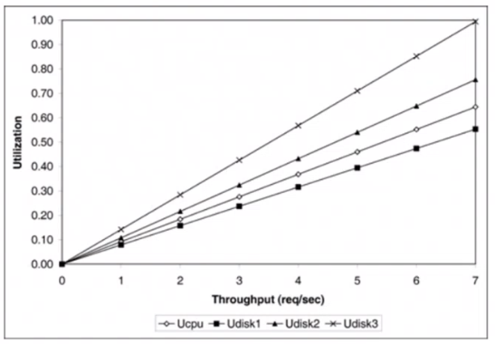
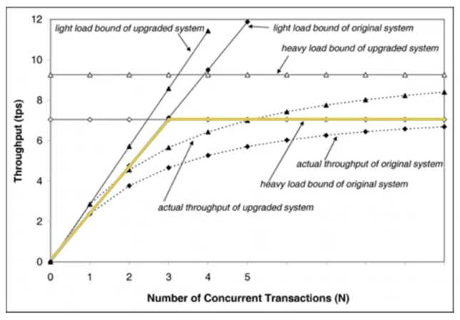
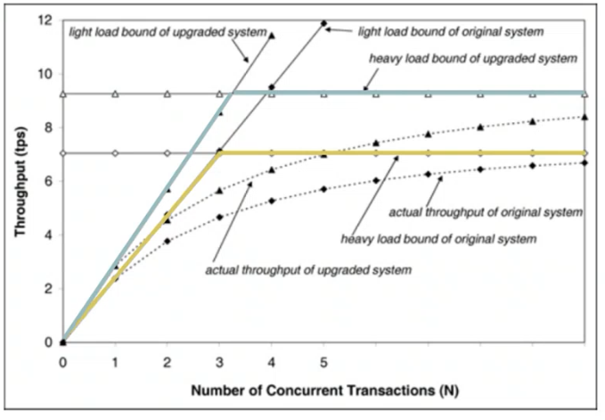
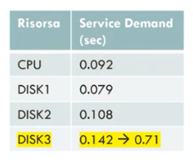

# 28 Maggio 2025

Text: Studio dei limiti delle prestazioni

## Studio dei limiti delle prestazioni

E’ possibile calcolare l’upper bound sul troughput e il lower bound sul tempo di risposta, quello che bisogna fare è individuare la risorsa `bottleneck` cioè quella con più alto service demand.

La risorsa collo di bottiglia è il disco 3 

## Calcolo del troughput massimo

Utilizzando la service demand law, si può calcolare l’utlizzazione o alternativamente il troughput ad un certo livello di utlizzazione. Il trougput massimo $X_0$ ottenibile dal sistema è pari a quello della risorsa bottleneck quando questa raggiunge il 100% di utilizzazione.

$$
X_0=\dfrac{U_i}{D_i}=\dfrac{1}{0.142}=7.042\text{ tps}
$$

$$
X_0=\dfrac{U_i}{D_i}\le\dfrac{1}{D_i}\space\space \forall i
$$

Più in generale si può stabilire la seguente relazione sul troughput

$$
X_0\le \dfrac{1}{max\left\{D_i \right\}}
$$

Oppure in modo più compatto

Quindi in condizioni di carico elevato si ha la relazione mostrata sopra, questo vuol dire che il sistema è in saturazione e che è molto probabile che alcune richieste dovranno accordarsi nel centro collo di bottiglia.

## Upper bound troughput con carico leggero

Il vincolo che si impone è che non si vogliono code sulle nostre risorse:

$$
R=\sum_{i}D_i
$$

Se nessuna richiesta viene mai accodata allora il tempo di risposta è pari a $R$

$$
N=R\times X_0 \ge\left(\sum_{i}D_i\right)\times X_0
$$

Per la legge di little si ha questa formula

$$
X_0=\dfrac{N}{\sum_{i} D_i}
$$

Quindi si ha che l’upper bound sul troughput in condizioni di carico leggero è questo

$$
X_0\le min\left[ \dfrac{1}{max\left\{ D_i \right\}},\dfrac{N}{\sum_{i} D_i} \right]
$$

Combinando upper bound leggero e pesante si ottiene

Il grafico dice che all’inizio molto probabilmente il troughput cresce linearmente con il numero di job all’interno del sistema e una volta che va in saturazione il sistema non ci sta più crescita lineare 

Se si sostituisce a DISK3 con uno il doppio più veloce si aumenta il troughput massimo del 32%

