# 28 Marzo

Argomenti: Algoritmo k-means clustering, Clustering, Funzione di qualità nel caso L1 ed L2, Metriche di Qualità, Overfitting nella classificazione, Regularization nella classificazione, k-means++
.: No

## Metriche di Qualità

Le `metriche di qualità` che si usano sono l’`errore` e l’`accuracy`;

$$
\dfrac{\text{\#previsioni errate}}{\text{\# esempi}}
$$

Formula per calcolare l’`errore`.

Miglior valore possibile è 0

$$
\dfrac{\text{\# previsioni corrette}}{\text{\# esempi}}
$$

Formula per calcolare la frazioni delle previsioni corrette, quindi l’`accuracy`.

Miglior valore possibile è 1

## Overfitting - classificazione

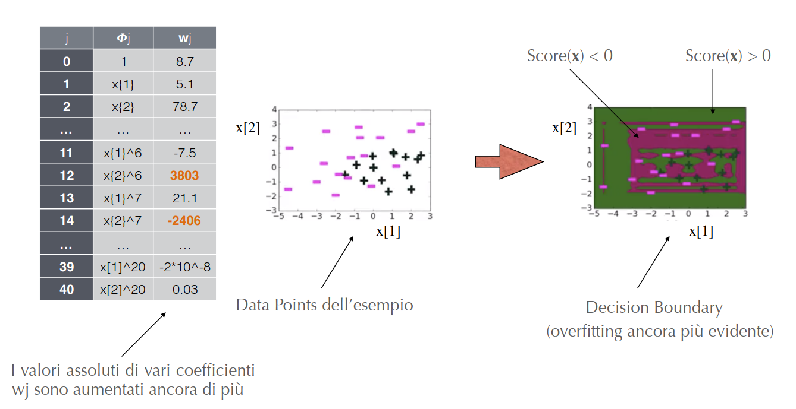

Quando un modello di classificazione va in overfitting si ottiene che i pesi $w_j$ aumentano di molto, ma questo è comune per qualsiasi modello.

## Regularization nella classificazione

L’idea è quella di limitare il valore assoluto dei coefficienti $w_i$ ,definendo come segue la funzione di qualità totale, da massimizzare nella fase di training

$$
\text{qualità totale}=\text{misura del "fit"}-\text{misura grandezza coefficienti}
$$

Per misura del `fit` si intende una funzione come la `MLE`. Per misurare i coefficienti si usa o la somma dei valori assoluti (L1 norm) oppure la somma dei quadrati (L2 norm)

## Funzione di Qualità nel caso L2-penalty

Questo è il caso dove si usa la somma dei quadrati, dove la funzione che rappresenta la qualità totale nel caso della `logistic-regression` è la seguente:

$$
\text{Qualità totale}_{L2}=ln\left(\mathcal{L}\left(\bold w\right)
\right)
-\lambda \cdot||\bold w||_2^2
$$

Il parametro $\lambda$ serve per bilanciare i 2 termini, dove per diversi valori di $\lambda$ si hanno diverse situazioni:

- $\lambda=0$: ci si riconduce alla vecchia soluzione, cioè la massimizzazione del likelihood
- $\lambda\to\infty$: per soluzioni dove $\widehat{\bold w}\neq 0$, la qualità totale tende a $-\infty$, e l’unica soluzione per massimizzare la qualità è $\widehat{\bold w}=0$
- $0<\lambda<\infty$: si ha la seguente condizioni $0<||\widehat{\bold w}||_2^2<||\widehat{\bold w}_{MLE}||_2^2$

Qui viene mostrato l’effetto della l2-regularization.

## Gradient Ascent con la L2-regularization

Come è noto nell’algoritmo gradient ascent bisogna aggiornare il vettore dei pesi $\bold w$ come segue:

$$
\bold w^{(t+1)}\gets \bold w^{(t)}+\alpha \cdot\nabla\text{Qualità totale}_{L2}\left(\bold w^{(t)}\right)
$$

$$
ln\left(\mathcal{L}(\bold w)\right)-\lambda\cdot||\bold w||_2^2
$$

Si deve dunque calcolare il gradiente della funzione di qualità totale cioè la formula riportata accanto

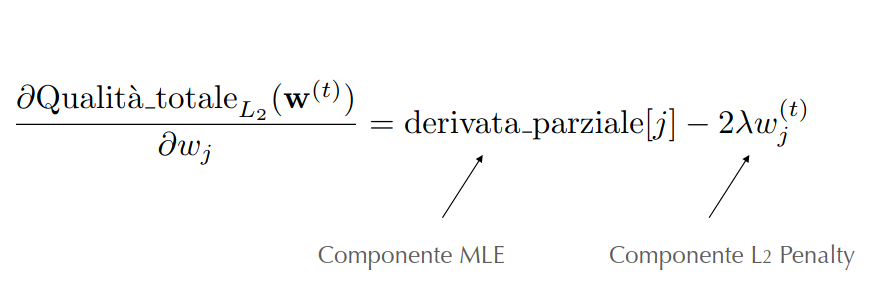

La derivata parziale della funzione di qualità totale rispetto al termine generico $w_j$ è mostrata in questa immagine

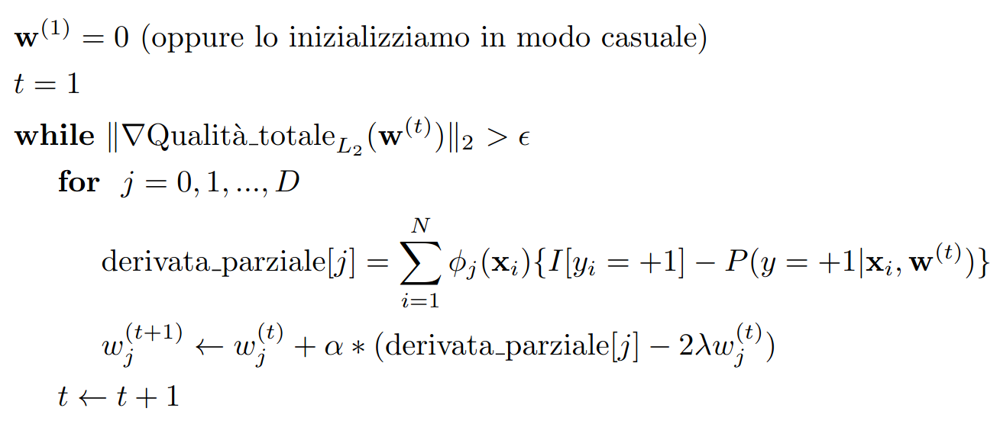

Questa è la versione dell’algoritmo

## Funzione di qualità nel caso L1-penalty

Questo è il caso in cui si usa la somma dei valori assoluti per la penalty, in genere è chiamata `sparse-logistic-regression`.

$$
ln\left(\mathcal{L}(\bold w)\right)-\lambda\cdot||\bold w||_1
$$

La funzione che rappresenta la qualità totale nel caso della logistic regression con $L1$ è mostrata accanto.

Il parametro $\lambda$ nel caso $=0$ e $\to \infty$ è uguale al caso di $L2$, mentre quando $0<\lambda<\infty$ si va verso soluzioni sparse in cui vari $w_j$ sono uguali a 0

---

## Clustering

Gli esempi visti fino ad ora rientrano nel dominio dell’apprendimento supervisionato, in sostanza date delle osservazioni si hanno le soluzioni corrette. Nel caso non supervisionato ci si trova in una situazione in cui si hanno varie osservazioni per le quali non si hanno le soluzioni, questa situazione è definita `unsupervised` proprio perchè nei data points disponibili manca la risposta che può supervisionare l’analisi.

Per risolvere il problema si cerca per esempio di comprendere le relazioni tra le osservazioni; in queste situazioni si utilizzano approcci chiamati `cluster-analysis` oppure `clustering`.

L’obiettivo del `clustering` è quello di verificare, date le feature in input, se le osservazioni disponibili ricadono all’interno di gruppi relativamente distinti tra di loro.

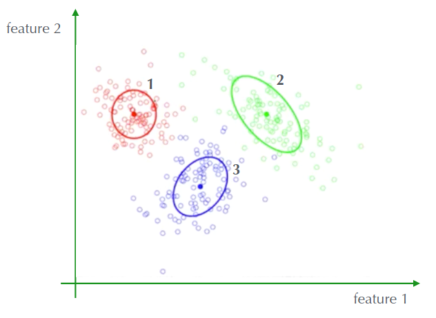

Un `cluster` è un raggruppamento denso delle osservazioni, in questa immagine ogni cluster è definito dal `centroide` e dalla forma

- Ciascuna osservazione $\bold x_i$ è assegnata al cluster $k$ se il punteggio di $\bold x_i$ sotto il cluster $k$ è migliore rispetto agli altri cluster, per semplicità si definisce lo `score` come la distanza dal centroide del cluster ignorando lo shape.

## k-means Clustering

L’algoritmo `k-means` assume come `score` proprio la distanza di una osservazione dalla centroide, più bassa è la distanza e migliore è lo score.

In questa immagine viene riportata la terminologia nel k-means clustering

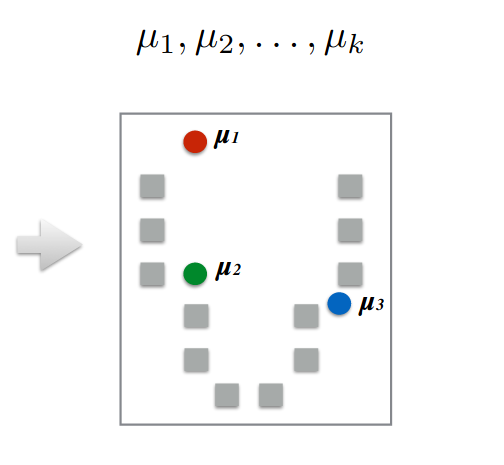

Supponendo di scegliere come numero di cluster $k=3$, si inizializzano $k$ centroidi

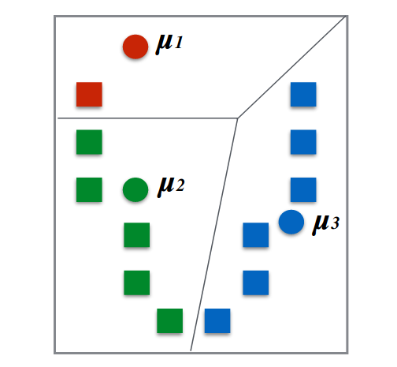

Le osservazioni vengono assegnate al centroide più vicino tramite la seguente formula:

$$
z_i\gets\underset{j}{argmin}
||\mu_i-\bold x_i||^2
$$

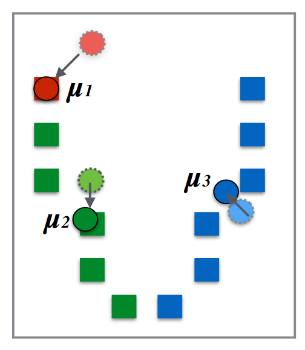

Si ricalcolano i centroidi come media delle osservazioni assegnate ad ogni cluster, tramite la seguente formula:

$$
\mu_j=\frac{1}{n_j}\sum_{i:z_i=j}{\bold x_i}
$$

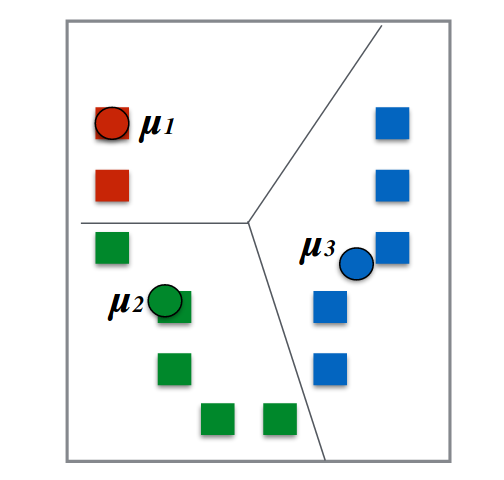

Per poi riassegnare le osservazioni al centroide più vicino, ricominciando poi le operazioni fino al raggiungimento di una condizione di terminazione.

## Algoritmo k-means

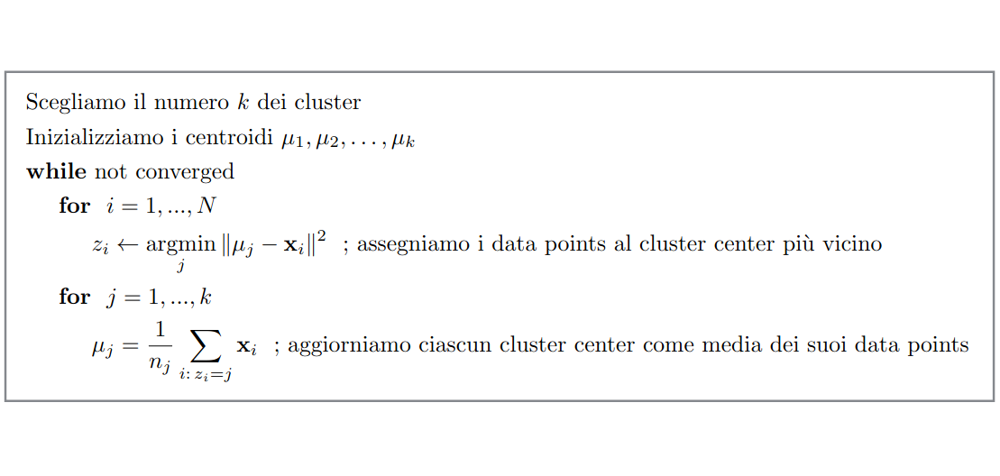

L’algoritmo può essere pertanto sintetizzato come mostrato in figura

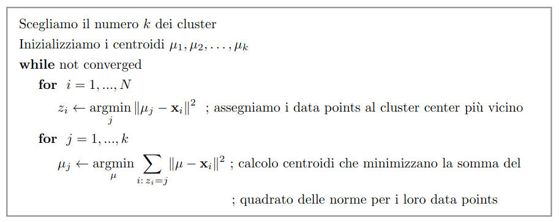

Si nota che la formula di $\mu_j$ è equivalente a quella mostrata in questa immagine, si ottiene la versione equivalente dell’algoritmo come coordinate descent, alternando le minimizzazioni di $z_i$ e $\mu_j$.

## Convergenza di k-means

In genere questo algoritmo converge ad un ottimo locale ed è molto sensibile all’inizializzazione dei centroidi

## k-means ++

Visto che l’inizializzazione di `k-means` è critica ai fini della qualità dell’ottimo locale trovato, si potrebbe usare il metodo `k-means++` che consiste in una particolare inizializzazione dei centroidi che in genere da buoni risultati.

Lo `smart-initialization` sceglie il primo centroide in modo casuale tra tutti i data points, per poi calcolare per ogni osservazione $\bold x_i$ la distanza $d(\bold x_i)$ tra $\bold x_i$ e il più vicino centroide. Dopodiché sceglie il nuovo centroide tra i data point con la probabilità di $\bold x_i$ di essere scelto proporzionale a $d\left(\bold x_i\right)^2$, ossia al quadrato della distanza tra $\bold x_i$ e il centroide più vicino già scelto. Poi si ripetono le osservazioni e le scelte fino ad avere $k$ centroidi

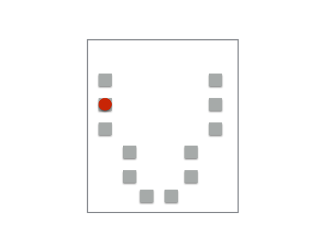

Quello che si fa è che date queste osservazioni, si inizia ponendo per esempio $k=3$.

Poi si sceglie in modo casuale tra tutte le osservazioni il primo centroide come mostrato in figura.

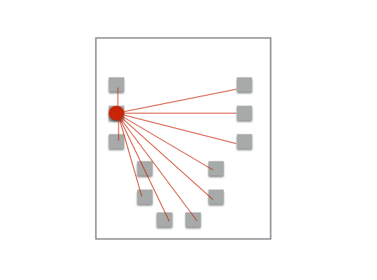

Si calcolano tra tutte le osservazioni la distanza $d(\bold x_i)$, per poi scegliere il punto con la probabilità maggiore.

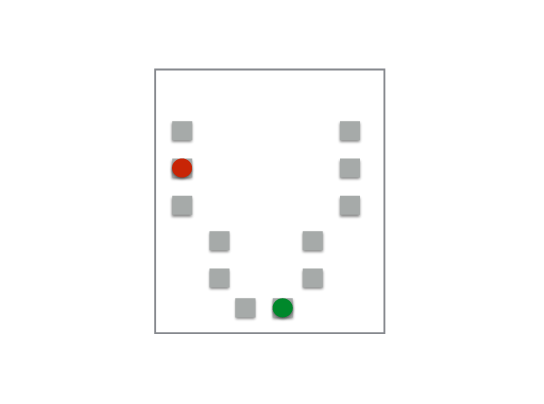

Supponendo che venga scelto il secondo cluster center in verde, si hanno adesso 2 cluster.

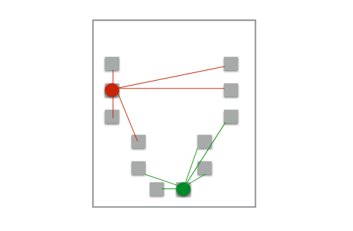

Si fa la scelta del nuovo cluster, scegliendo il punto con la probabilità maggiore, dove la probabilità è proporzionale a $d(\bold x_i)^2$

Supponendo che il cluster center scelto sia quello in blu, adesso si hanno $k=3$ cluster da cui verrà inizializzato l’algoritmo `k-means`.

- `pro`: eseguire `k-means++` è certamente più oneroso computazionalmente rispetto alla scelta random dei suddetti centroidi
- `contro`: l’esecuzione di `k-means` con l’inizializzazione di `k-means++` spesso converge più rapidamente.

In generale si può dire che `k-means++` tende a migliorare la qualità dell’algoritmo locale trovato e diminuisce il tempo di esecuzione.

## Cluster Heterogeneity

Considerando $k=N$, cioè che ogni osservazione è un cluster center si ottiene che il costo (heterogeneity) è uguale a 0. Questo costo decresce al crescere di $k$.

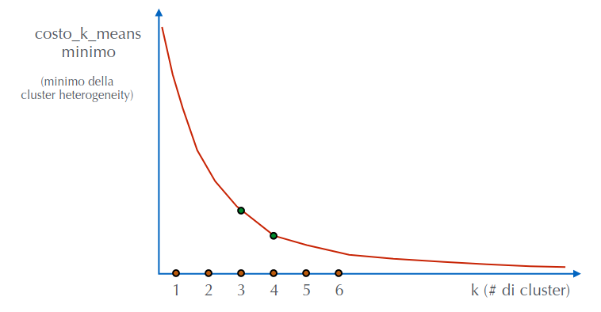

Si usa `elbow-method`, cioè un’euristica con la funzione di scegliere un punto che si trova nel gomito della curva. In pratica si sceglie il valore $k$ buono per fare clustering

$$
\sum_{j=1}^{k}\sum_{i:z_i=j}||\mu_j-\bold x_i||^2
$$

Questa è la formula del costo `k-means`