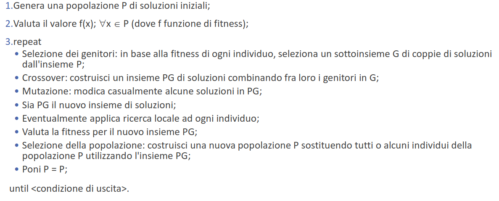
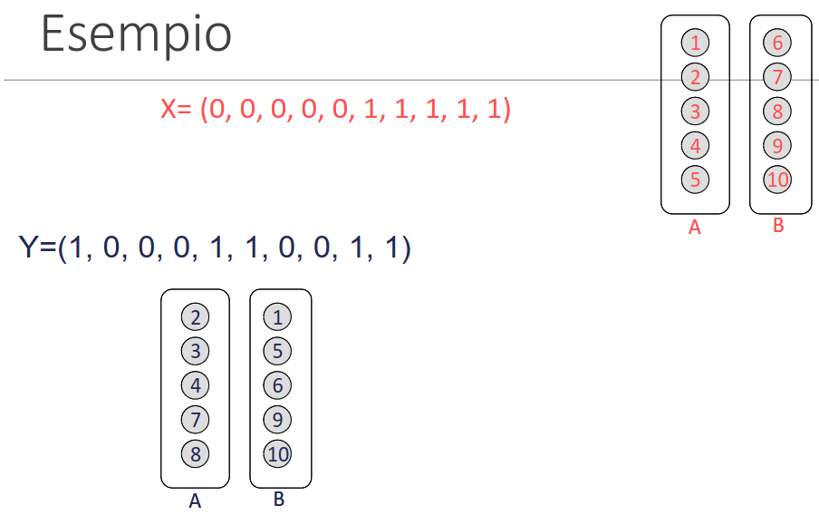

# 28 Novembre

Argomenti: Algoritmi Genetici, Algoritmi Genetici per il TSP, Algoritmi genetici per la partizione uniforme di grafi
.: Yes

## Algoritmi genetici

Questi algoritmi si ispirano al processo evolutivo degli organismi in natura; sono efficienti anche quando tutta la conoscenza a priori è limitata alla sola procedura di valutazione che misura la qualità di ogni soluzione.

Si usano `semplici rappresentazioni` per codificare strutture molto complicate e `semplici trasformazioni` per migliorare queste rappresentazioni. 

Si effettuano evoluzioni delle rappresentazioni in modo da imitare il processo di evoluzione di popolazioni di organismi viventi. 

## Algoritmi genetici - idea di fondo

Si suppone che in un problema di ottimizzazione si abbia un insieme di soluzioni, tra queste ci sono naturalmente di più buone e meno buone. La qualità di queste soluzioni è misurata attraverso una `fitness function`, a questo punto si vogliono generare nuove soluzioni accoppiando le soluzioni in possesso, con la `speranza` che fra queste ce ne siano di migliori.  

Allora da un certo insieme di soluzioni, se ne ricava un altro che costituisce una nuova generazione; è possibile che questa nuova generazione sia più numerosa della precedente quindi si effettua una `selezione` per poi ricominciare.

## Algoritmi genetici - procedimento

- Per rappresentare una soluzione, tipicamente si usa un insieme di stringhe di interi o binari detti `cromosomi`, ciascun cromosoma è a sua volta composto da `geni` (singoli bit)
- Per combinare 2 individui si fa il `crossover` da cui nasce una nuova soluzione del problema; i geni della nuova soluzione provengono esclusivamente da quelli dei 2 genitori.
- Visto che si hanno un insieme di soluzioni, si generano dopo il crossover più soluzioni. Tramite il processo di selezione si mantiene costante il numero di soluzioni generati a ogni generazione utilizzando la `fitness function` per escludere le soluzioni che non superano una certa soglia scelta a priori.
- Nella pratica si è osservato che dopo un certo numero di iterazioni le soluzioni non migliorano più, quindi quello che si fa è introdurre l’operazione di `mutazione` che dipende dal problema. Quello che si fa è alterare un gene di alcuni individui prima di procedere alla successiva generazione.

Qui è riassunto il procedimento per affrontare il problema utilizzando gli algoritmi genetici.

## Selezione dei genitori

I genitori vengono scelti in base alla funzione di fitness, dove più è alto il valore e più è alta la probabilità che un insieme di soluzioni vengano scelti come genitori. In questo modo si seleziona il patrimonio genetico migliore di tutta la popolazione in modo che venga tramesso alle generazioni successive.

- `roulette-wheel`: ogni individuo riceve una porzione di una roulette la cui porzione è interamente proporzionale al suo livello di fitness
- `tournament`: si selezionano solo alcuni membri a caso e poi si sceglie il migliore tra questi
- `rank-based roulette wheel`: è simile alla roulette proporzionale, ma la porzione che ogni individuo riceve è basata interamente sul ranking, invece che sul valore del livello di fitness

## Generazione dei figli

Ciascuna coppia di individui prescelti, genera con probabilità $p_c$ una coppia di figli. Con la `mutazione` si effettua con una probabilità $p_m$, una complementazione del valore assunto da un bit in corrispondenza ad una posizione scelta in modo casuale.

## Ricambio generazionale

Questa fase è necessaria per limitare la dimensione della popolazione di soluzioni, si hanno 3 tipologie di approccio:

- `ricambio generazionale classico`: alla popolazione dei genitori si sostituisce la popolazione dei figli
- `ricambio generazionale con eccezione`: si preserva dalla scomparsa l’esemplare migliore in assoluto, qualora la nuova popolazione non dovesse contenere nessuna soluzione migliore di esso.
- `selezione naturale`: non si guarda se sono genitori o figli, sopravvivono solo gli esemplari migliori.

In questa immagine viene spiegata più in dettaglio il procedimento dell’algoritmo genetico

---

## Algoritmi Genetici per la partizione uniforme di grafi

- `problema`: trovare una partizione $(A,B)$ dell’insieme dei nodi che sia:
    - di costo minimo
    - bilanciata, cioè $|A|=|B|=n$

Una soluzione viene rappresentata da una stringa di $2n$ bit in cui $x_i$ vale $0$ se il nodo $i$ appartiene ad $A$ e vale $1$ se il nodo $i$ appartiene a $B$

## Algoritmi Genetici per il TSP

Le soluzioni vengono rappresentate da un vettore di $n$ interi, si hanno 3 modi:

- `rappresentazione adiacente`: l’elemento $x_i$ del vettore è il vertice che segue il vertice $i$ nel ciclo
- `rappresentazione sentiero`: sequenza di visita dei vertici
- `rappresentazione ordinale`: data una lista ordinata di città che serve come punto di riferimento per le liste, il vettore che rappresenta il cromosoma indica passo dopo passo la posizione della successiva città nel tour rispetto alla lista di riferimento

Usando questi tipi di rappresentazione si deve modificare leggermente l’operazione di `mutazione` perché potrebbe generare una soluzione non ammissibile

Stessa cosa si può dire per l’operazione di `crossover` che potrebbe portare a soluzioni non ammissibili, tra le molte tecniche proposte si hanno:

- `greedy crossover`:
- `order crossover`: