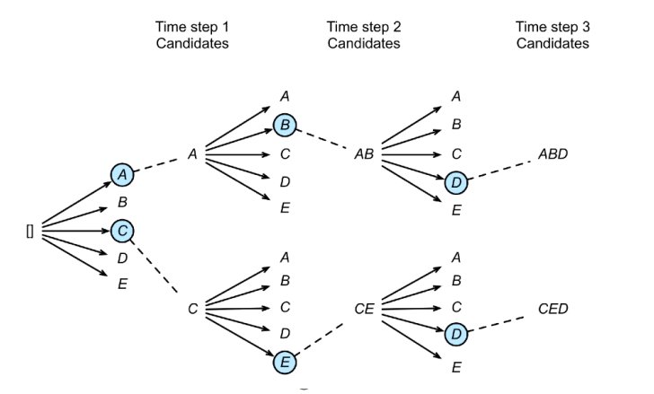
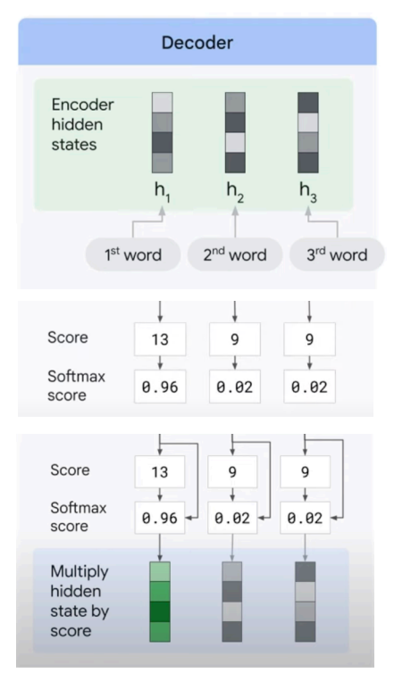
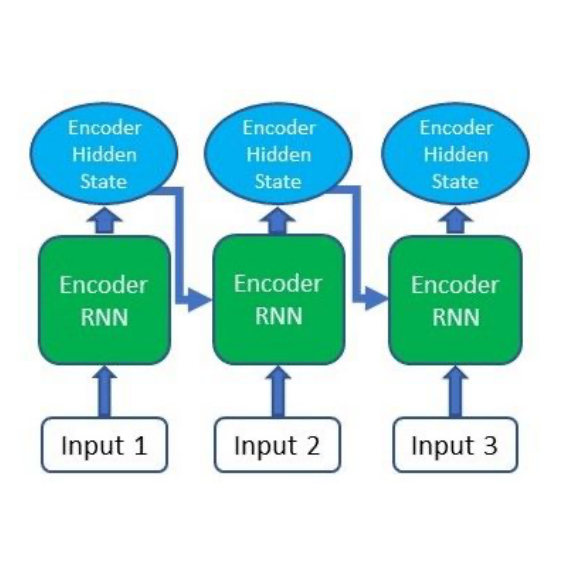

# 29 Novembre

Tags: Attention mechanism, Beam search
.: No

## Attention Mechanism

Gli `attention-mechanism` mirano a risolvere le limitazioni delle rappresentazioni vettoriali delle architetture RNN, l’obiettivo è assegnare livelli di importanza alle caratteristiche e sfruttarle nel fornire un output più accurato.

## Beam search

Nella architettura `seq2seq` il token generato è quello con più alta probabilità. Si utilizza una strategia `greedy`, basata sullo stato o variabile contesto $c$ che rappresenta la frase in input e sui token già generati.

$$
y_{t'}=\underset{y\in Y}{argmax}\left(P\left(y|y_1,...,y_{t'-1},c\right)\right)
$$

Una alternativa che produce migliori risultati è la `beam-search`, in pratica nello step corrente si scelgono $k$ token candidati più probabili e nello step successivo si tengono in considerazione i $k$ token precedenti per la generazione dei nuovi candidati, espandendo i rami di ricerca.

Quando i rami ottenuti sono terminati, la sequenza in output corrisponderà al ramo con probabilità complessiva maggiore.

## Encoder/decoder e attention

Sebbene la `beam-search` possa migliorare le prestazioni, le relazioni semanticamente salienti, che si estendono su più token, sono spesso ignorate nelle architetture encoder-decoder.

Alla base dell’`attention-mechanism` c’è la possibilità di sfruttare gli stati intermedi della fase di codifica; questi stati intermedi sono prodotti durante l’analisi dei token in input per la generazione dell’output. Questi stati intermedi aiutano il decoder a comprendere quale token sia più adatto. 

Inoltre il modello sarà addestrato per assegnare un livello di `attenzione selettiva` alle informazioni intermedie durante la generazione dell’output.

Il `decoder` si focalizza sulle parti più rilevanti dell’input analizzando gli hidden-state che ha ricevuto dall’encoder.

Ogni `hidden-state` è legato ad un token processato in input, a questo è associato uno score che per mezzo di una softmax, sarà interpretato come l’attenzione da dare al relativo hidden-state.

La somma pesata degli hidden state con tali score genererà il `context-vector`.

Poiché gli score dipendono anche dai dati correntemente generati in output, ogni token in output avrà un context vector distinto.

## Attention mechanism - step by step

L’`encoder` produce gli `hidden-state` per ciascun elemento della sequenza di ingresso

Una `RNN` codifica la sequenza di ingresso. L’architettura è quella di un encoder classico.

$$
score(h_t, \overline{h}_s)
$$

- $h_t$: stato nascosto attuale del decoder
- $\overline{h}_s$: stati nascosti dell’encoder

Calcolo degli `alignment-score` tra il precedente stato nascosto del decoder e ciascuno degli stati nascosti dell’encoder, questi vengono trattati come output dell’encoder. L’ultimo stato dell’encoder può essere utilizzato come primo stato nascosto nel decoder.

$$
\alpha_{ts}=\dfrac{exp(score(h_t,\overline{h}_t))}{\sum_{s'=1}^{S}exp(score(h_t,\overline{h}_{s'}))}
$$

Gli `alignment-score` sono sottoposti a softmax ottenendo gli `attention-weights`.

$$
c_t=\sum_{s}\alpha_{t,s}\cdot \overline{h}_s
$$

I vettori che rappresentano gli stati nascosti dell’encoder sono combinati insieme con una somma pesata in base agli `attention-weights`. Si ottiene un singolo vettore $c_t$ chiamato `context-vector`.

$$
\alpha_t=f(c_t,h_t)=tanh(W_c\left[c_t;h_t\right])
$$

Si concatena `context-vector` e `hidden-state` corrente per generare l’`attention-vector` $a_t$ usato in input ad una rete neurale per generare il nuovo token in output.

I punti 2-5 sono ripetuti fino alla fine della sequenza in uscita.