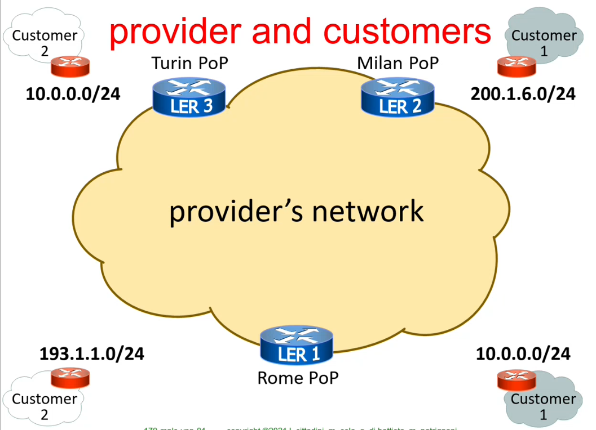
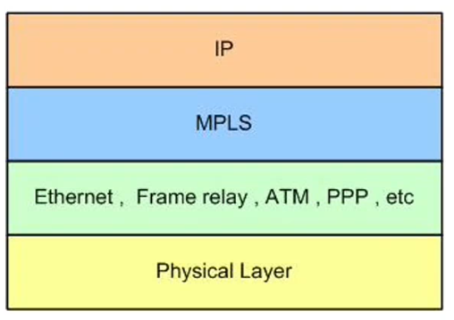
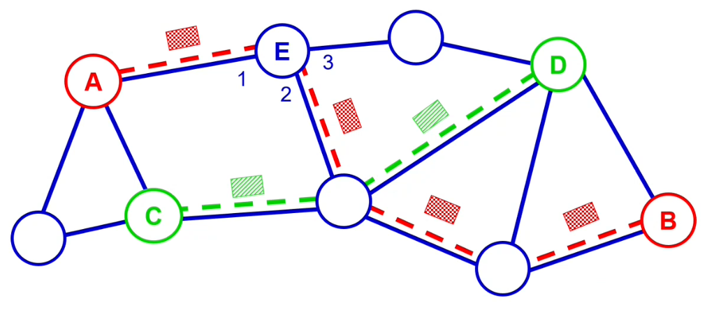
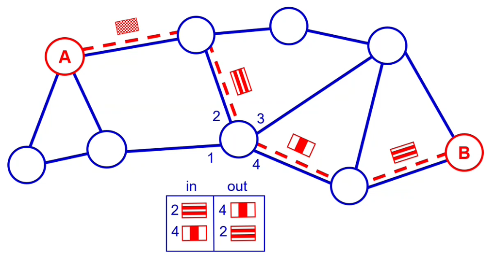
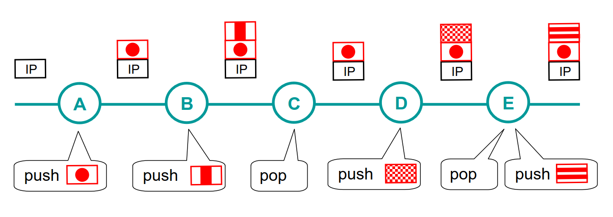
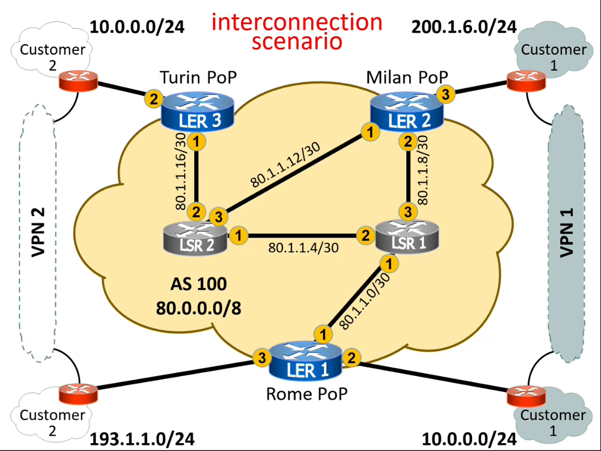
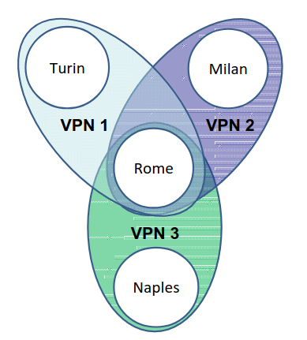

# 29 Novembre

Argomenti: MPLS VPN, Route Target, VRF
.: Yes

## MPLS VPN - Introduzione

- Un customer ha diverse sedi (cioè diverse reti) che sono distribuite geograficamente in un qualche territorio e questo customer ha il problema di collegare tra loro queste sedi in un unica network IP. Concettualmente la cosa migliore da fare per la società è comprare dei fili a proprio uso esclusivo che collegano tra loro le varie sedi, a questo punto si può pensare di creare una rete che colleghi appunto le proprie sedi.
- Un provider tipicamente possiede una infrastruttura di rete dove vi si accede attraverso un certo numero di Point of Presence (`PoP`)

In pratica il customer ha bisogno di fili mentre il provider potrebbe vendere questi fili “virtuali” sui quali possono passare flussi di pacchetti

Nella figura è mostrata una rete di un provider al quale vi si accede tramite PoP situati a Torino, Milano e Roma, poi ci sono 2 customer di cui il customer 1 ha sede a milano e roma e customer 2 che ha sede a torino e roma. Customer 1 e 2 vorrebbero poter collegare le loro sedi, questi 2 hanno anche un proprio spazio di indirizzamento (diversi indirizzi IP).

## Vincoli del Provider, Customer e venditori di apparati

- Un `customer` ha voglia di mantenere invariato il suo spazio di indirizzamento per le propri sedi, cioè si vuole che quando verranno interconnesse tra di loro dovranno preservare il loro spazio di indirizzamento. Vuole anche che il suo traffico non si mescoli con il traffico di altri customer.
- Un `provider` vuole avere bassi costi di manutenzione e di configurazione e vorrebbe che le prestazioni non peggiorassero troppo, quindi in qualche modo vorrebbero che le prestazioni dipendessero dal traffico e non dalle connessioni tra customer supportate.
- I `venditori` di apparati hanno l’obbiettivo di vendere più router possibili

## Punto di incontro dei 3

Il punto di incontro tra provider, customer e venditori è la `MPLS` che sta per Multi Protocol Label Switching. Attraverso questa tecnologia è possibile costruire `VPN` (realizzate ANCHE con MPLS) il quale consentono alle sedi dei singoli customer di essere collegati fra loro.

Queste `VPN` si comportano come fili fisici privati a completa disposizione dei customer ma in realtà sono implementate tramite `MPLS`.

## MPLS - Multi Protocol Label Switching

Tecnologia altamente scalabile, `protocol-agnostic`(cioè utilizzabile con altri protocolli) e `data-carrying mechanism` (cioè usata per trasportare dati). 

Nella pila Iso-osi si trova tra il 2 e 3

(Label switching network - without label swaps)

Il funzionamento del label switching si basa su questa idea: per mandare un pacchetto da un punto A ad un punto B si stabilisce un circuito virtuale; una volta stabilito si prendono tutti i pacchetti che girano su quel circuito virtuale e gli si da una label in modo tale che i router intermedi sappino che quando arrivano pacchetti con un certo label si sa già a quale interfaccia mandarlo.

Visto che tutti i pacchetti che fanno la stessa strada devono essere labellati, non vale la pena dare a tutti i pacchetti lungo tutto il flusso lo stesso colore, l’importante è che si possano distinguere quando attraversano lo stesso filo.

Per evitare delle label che hanno valenza universale, quindi per identificare il flusso al passaggio di uno specifico filo, ad un certo flusso si da una label che è univoca soltanto per ciascuno dei link attraversati, per esempio quando arriva un certo tipo di label nell’interfaccia 2 allora nell’interfaccia 4 gli si cambia label.

Per integrare il label swapping con MPLS si suppone che A e B siano 2 sedi della stessa organizzazione che devono essere collegate fra loro, dove si ricorda che il customer avrebbe voglia di un filo fisico che le connetta, invece il provider per collegare le sedi invece di usare un filo fisico usa un filo virtuale. Quindi `MPLS` è lo strumento che permette di costruire circuiti virtuali nella rete di un provider.

In termini tecnici nella rete ci girano pacchetti IP e quello che fa MPLS è incapsulare il pacchetto IP in un pacchetto MPLS dove il percorso sarà già stabilito con label switching, questo è simile a un tunnel.

## MPLS stack

Si suppone che ci sia un pacchetto che si muova da A verso E, l’elemento affiorante dello stack viene usato per label swapping mentre l’altra per distinguere tra loro i diversi customer.

## Interconnection scenario

Quindi una volta introdotto `MPLS` customer 1 e 2 vorrebbero avere una `VPN`.

Guardando all’interno si ha che la rete del provider ha un suo AS chiamata per esempio AS100

I router (rossi) dalla parte del customer sono chiamati `customer edge` routers (CE), i router sul bordo si chiamano `provider edge` routers (PE) mentre quelli all’interno sono chiamati `provider` routers (P)

## Setup di VPNs

- bisogna fare in modo che i `PE` siano raggiungibili tra di loro attraverso IP
    - la prima cosa da fare è assegnare un indirizzo IP al loopback di ogni `PE` per garantire la raggiungibilità tra i `PE` all’interno della backbone utilizzando un IGP (RIP non si usa)
    - una soluzione allettante per implementare la VPN è quella di utilizzare IP-in-IP tunnel tra i loopback dei `PE` il problema è la difficoltà di configurazione e il numero quadratico di configurazioni, quindi questa soluzione è scartata.
- si usa `BGP` per annunciare i prefissi dei customer
    - si utilizza la variante di `BGP` → `MP-BGP`
    - ogni `PE` stabilisce un iBGP peering con gli altri `PE` utilizzando i route reflectors per lo scaling
- si utilizza `MPLS` per realizzare i tunnel che portano traffico all’interno della backbone
    - un pacchetto IP da un customer (proveniente da un `CE`) viene incapsulato all’interno di un pacchetto `MPLS`, dove lungo la strada viene modificata attraverso il label swapping
    - 2 label vengono inserite nella stack di MPLS dove la prima denota la VPN alla quale è destinata il pacchetto mentre la seconda è usata per il label swapping.

## Realizzazione del data plane MPLS

Il protocollo `LDP` detto Label Distribution Protocol viene usato per costruire il percorso per raggiungere ogni `PE` loopback appoggiandosi a un `IGP`.

Su una `PE` ci sono varie tabelle di instradamento, una per ciascuna `VPN`, questo è necessario perchè potrebbero esserci degli spazi di indirizzamento di overlap e quindi la soluzione è proprio avere diverse tabelle di instradamento virtuali (Multiple Virtual Routing Tables)

Ogni porta su cui è attaccato il customer, relativamente al `PE`, è associata ad una specifica tabella di routing virtuali e questo viene fatto dalla configurazione della rete.

## Virtual Routing and Forwarding (VRF)

Con questo concetto un router può avere molte tabelle di forwarding e l’insieme di queste tabelle è una virtual routing framework e quindi ciascuna tabella è una istanza di `VRF`. Ogni `PE` ha in generale tante istanze di `VRF` una per ogni insieme di siti che sono direttamente connessi al router e che appartengono alla stessa `VPN`. Ogni istanza di `VRF` contiene le rotte che sono ricevute dai `CE` che sono direttamente connessi alla istanza `VRF` e le rotte che sono ricevute dagli altri `PE` utilizzando `BGP`.

## VPN-IP addresses

Per avere questi spazi di indirizzamento sovrapposti si usa un `Route Distinguisher` consentendo di trasformare indirizzi IP univoci per evitare conflitti di sovrapposizione.

In pratica si convertono indirizzi IP non univoci in indirizzi VPN-IP univoci. (si aggiunge il tag)

## Nomi dei router nel linguaggio MPLS

- `LER`: (Label Edge Router) è il router che etichetta il pacchetto mettendo la prima label.
- `LSR`: (Label Switching Router) è il router che fa solamente label swapping durante il tragitto del pacchetto.

## Topologie complesse di VPN

Tutti possono parlare con roma ma non con gli altri.

`MPLS` offre lo strumento `Router Target`, si usa per specificare quali rotte debbano importate o esporate in una instanza `VRF`.