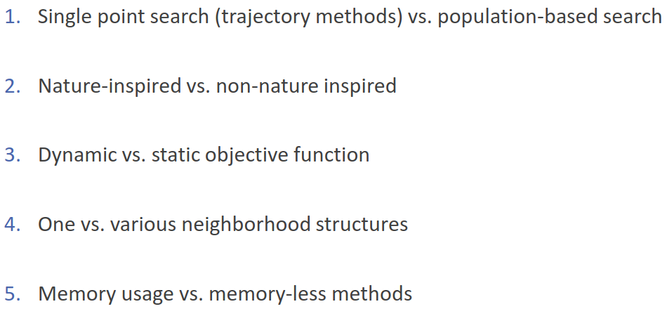
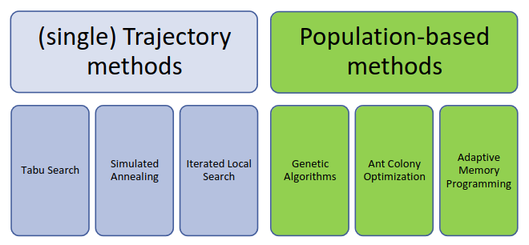
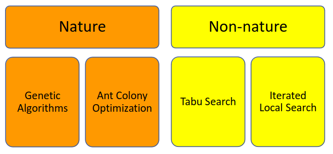
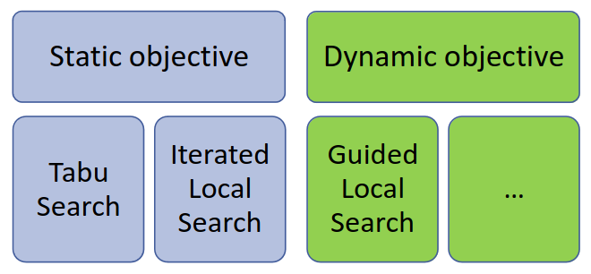
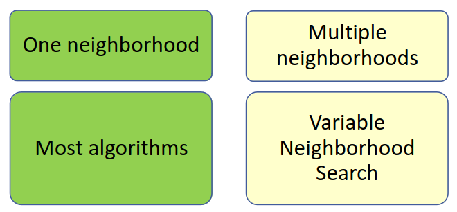
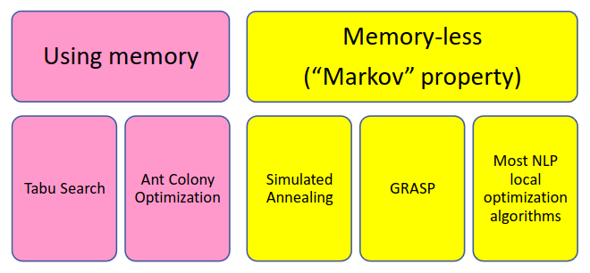
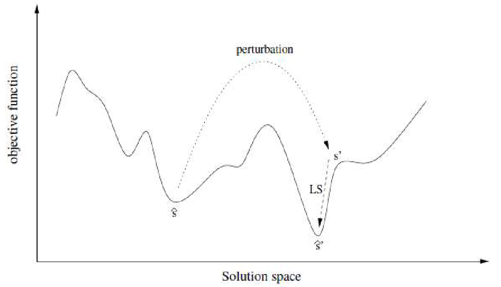
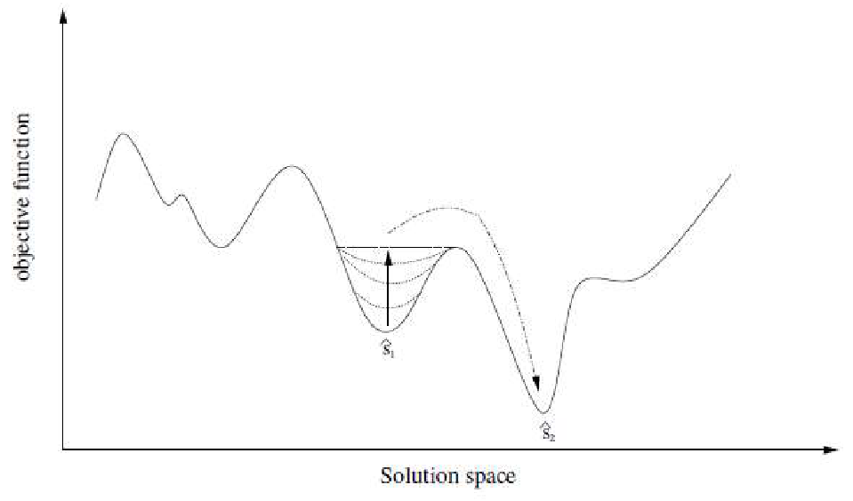

# 29 Novembre

Argomenti: ALNS, DLS, GLS, GRASP, ILS, VNS
.: Yes

## Uscire dai minimi locali

Per uscire dai minimi locali le tecniche utilizzano passi random e memoria e possono andare a influenzare:

- `soluzione iniziale`: multi start, ILS ,VNS
- `vicinato`: VNS
- `funzione obiettivo`: DLS
- `criteri di selezione delle soluzioni`: SA, TS, GLS

## Metodi multi-start

L’approccio di questi algoritmi inizia dalla progettazione di diversi algoritmi costruttivi, generare una soluzione iniziale con ognuno di essi e poi iniziare la ricerca locale da ogni soluzione iniziale.

Questi metodi rappresentano l’approccio classico, hanno i seguenti svantaggi:

- `scarso controllo`: le soluzioni tendono ad essere simili
- `impossibilià di ripetizioni a piacere`: il numero di ripetizione di solito è fisso
- `elevato sforzo per la progettazione`: sono necessari molto algoritmi diversi
- `nessuna garanzia di convergenza`: neanche a tempo infinito

Per superare gli svantaggi, di solito si preferiscono le metaeuristiche costruttivi con passi casuali o memoria oppure entrambi.

## Classificazione delle metaeuristiche

---

## Iterated Local Search (ILS)

L’idea per `ILS` (iterated local search) consiste nell’applicare la ricerca locale fino a che non ci si imbatte in un minimo locale, a quel punto si perturba la soluzione e si ricomincia la ricerca locale. Per uscire dal minimo locale la perturbazione non deve essere troppo piccola. Se invece è troppo grande diventa una specie di multistart.

La forza di una `perturbazione` è misurata attraverso il numero di componenti della soluzione che vengono modificati.

- se `troppo forte`: diventa un multistart casuale
- se `troppo debole`: la ricerca locale può annullare la perturbazione e tornare sulle vecchie soluzioni

Se le perturbazioni tengono conto delle proprietà del problema e sono ben coordinate con l’algoritmo di ricerca locale allora si ottengono risultati migliori.

## Variable Neighborhood Search (VNS)

Il `VNS` si basa su vicinati sempre più ampi; questo algoritmo ogni volta che viene individuata una soluzione migliore rispetto a quella corrente riprende l’esplorazione dal vicinato più piccolo.

Sarebbe un algoritmo di ricerca che si basa su vicinati sempre più ampi. Se nel vicinato non viene trovata alcuna soluzione migliore della corrente, si allarga la definizione di vicinato e si esplora nuovamente il vicinato. Si procede iterativamente per $k_{max}$ vicinati finché non si trova una soluzione migliore e si cerca in quel vicinato. Ogni volta che si accetta una nuova soluzione si ritorna alla dimensione più piccola del vicinato. Ci si ferma solamente quando in nessuno dei $k_{max}$ vicinati si trova una soluzione migliore della corrente.

## Dynamic Local Search (DLS)

Di seguito sono elencati gli step dell’idea principale del `DLS`:

- si associa una funzione di `penalità` $w:E\rightarrow N$, che penalizza l’insieme $E$ degli elementi che costituiscono la soluzione
- si definisce una funzione `ausiliaria` $f(z(x),w(x))$ che combina la funzione obiettivo $z(x)$ con la funzione di penalità $w(x)$
- si esegue un’euristica di ricerca locale che ottimizza $f$
- si aggiorna la penalità a seconda dei risultati e si riavvia l’euristica di ricerca locale

## Guided Local Search (GLS)

Con il `GLS`, per uscire dai minimi locali, invece di cambiare la struttura del vicinato o l’insieme delle soluzioni, si cambia dinamicamente la funzione obiettivo in modo da rendere l’ottimo corrente meno desiderabile.

Si usano le `solution features`, cioè proprietà che possono essere usate per distinguere le soluzioni fra loro. La funzione obiettivo viene modificata `penalizzando` la presenza di queste `solution features`.

Nel TSP una feature può essere una città A che segue B subito dopo nel ciclo oppure no.

Nel Knapsack se l’oggetto $i$ è inserito nel contenitore o no.

La modifica che riguarda la valutazione delle mosse nella GLS è basata sulle features che la soluzione deve o non deve avere.

## Greedy Randomized Adaptive Search Procedure (GRASP)

- `greedy`: indica che usa un’euristica costruttiva base
- `randomized`: indica che l’euristica base fa passi casuali
- `adaptive`: indica che l’euristica usa un criterio di scelta adattativo, che dipende dall’iterazione e dalla soluzione corrente
- `search`: indica che alterna all’euristica costruttiva l’esecuzione di euristiche di scambio

Questa procedura è composta da 2 fasi:

- `construction phase`: (costruzione della soluzione) caratterizzata da un’euristica costruttiva dinamica e la casualità. Tipicamente le soluzioni si costruiscono passo per passo. La scelta dell’elemento viene fatta scegliendo casualmente da una lista dove gli elementi sono ordinati secondo qualche criterio greedy. In questa lista i migliori $\alpha$ sono inseriti nella lista usata per la costruzione della soluzione.
- `local search`: miglioramento della soluzione con la ricerca locale

## Adaptive Large Neighbourhood Search (ALNS)

 I metodi di ricerca `LNS` esplorano un vicinato complesso definito da metodi che vengono utilizzati per `distruggere` e `riparare` una soluzione già esistente. L’uso di vicinati ampi consente di trovare soluzioni candidate migliori ad ogni iterazione e quindi di percorrere un percorso di ricerca più promettente.

Il metodo `ALNS` estende `LNS` utilizzando più metodi di distruzione e riparazione all’interno della stessa ricerca; a ciascun metodo viene assegnato un peso che controlla la frequenza con cui quel particolare metodo viene tentato durante la ricerca. I pesi vengono aggiornati dinamicamente durante la ricerca, in modo che l’euristica si adatti all’istanza in questione e allo stato della ricerca.