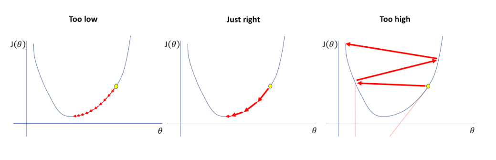

# 29 Ottobre

Tags: Momentum Optimization, Pretraining su auxiliary tasks, Saddle point, Self-supervised learning
.: Yes

## Pretraining su auxiliary tasks

L’`auxiliary-learning` è una tecnica dove si aggiungono dei task secondari durante l’addestramento per migliorare l’apprendimento del task principale. Questi task ausiliari non sono di interesse diretto per l’applicazione finale, ma servono ad aiutare la rete a imparare rappresentazioni più utili, agire come una forma di regolarizzazione e guidare l’ottimizzazione verso soluzioni migliori.

Questo si contrappone col `multitask-learning` e col `singletask-learning` dove si è interessati a massimizzare le performance considerando tutti i task o un solo task contemporaneamente.

Il `pretraining` viene avviato su dati non etichettati appartenenti ad uno stesso dominio o simile; le informazioni utilizzate per questa fase aiutano alla rete ad analizzare la distribuzione dei dati nel dominio di interesse.

## Self-supervised learning

Il self-supervised learning è una metodologia che permette di addestrare modelli senza l’utilizzo di etichette esplicite, sfruttando invece il contesto e la struttura intrinseca dei dati per generare automaticamente segnali di supervisione.

Questo approccio si avvicina al semi-supervised learning ma con alcune differenze fondamentali: mentre nel semi-supervised learning l'apprendimento inizia tipicamente con una fase non supervisionata seguita dall’uso di etichette su una piccola porzione di dati, nel self-supervised learning si sfrutta un task supervisionato ausiliare (come la predizione di parti mancanti o la ricostruzione di informazioni occluse) senza bisogno di etichette manuali.

Il self-supervised learning è considerato una forma di unsupervised learning, poiché non prevede l’utilizzo di etichette. Tuttavia, si distingue per il suo approccio orientato a “completare” i dati mancanti o predire parti dell’input, anziché individuare pattern o cluster nei dati.

L’obiettivo del self-supervised learning è infatti imparare rappresentazioni semantiche significative dai dati per compiti successivi. Questa tecnica consente di sfruttare in modo efficiente grandi volumi di dati non supervisionati, aumentando la robustezza del modello contro anomalie o attacchi adversarial e riducendo la necessità di un numero elevato di dati etichettati.

## Saddle points e punti critici

Con il gradiente si capisce la direzione per minimizzare la funzione costo quindi si conosce solo il “punto corrente”, sarebbe utile conoscere in qualche modo anche il vicinato del punto corrente.

Per fare questo si sfrutta la derivata seconda del gradiente, ottenendo la `matrice di Hessian` $H$, consiste in sostanza nelle derivate parziali del secondo ordine e rappresenta proprietà geometriche della superficie, soprattutto quando i gradienti sono pari a 0.

Tramite gli autovalori e il determinante di $H$ si ottengono indicazioni su punti critici e sulla funzione di costo.

## Gradient descent e learning rate

Supponendo di avere una funzione di costo convessa, per rendere la ricerca del gradiente che minimizza della funzione costo più efficiente si può pensare di variare il `learning-rate` $\eta$ durante l’esplorazione. 

Quello che si fa quindi è incrementare il tasso di apprendimento all’inizio della ricerca e ridurlo quando si pensa di essere vicini all’ottimo.

## Momentum optimization

$$
m\gets\beta\cdot m+\eta\nabla_{\Theta}J(\Theta)
\\ \space \\
\Theta\gets \Theta-m
$$

L’algoritmo dell’aggiornamento del gradiente viene trasformato in questo modo

Questa ottimizzazione introduce il concetto di `accelerazione` e `velocità` di esplorazione.

Si introducono:

- $m$: vettore momentum, usato per aggiornare i pesi $\Theta$.
- $\eta\cdot \nabla_{\Theta}J(\Theta)$: si interpreta questo gradiente come una accelerazione
- $\beta\cdot m$: si interpreta questa quantità la velocità corrente
- $\beta$: parametro `momentum`, cerca di evitare che la velocità cresca eccessivamente, se ha valore nullo allora si ha resistenza massima cioè si torna al caso di gradient descent normale, nel caso avesse valore unitario non si ha resistenza. Di solito assume valore vicino a 0.9

Il vantaggio di questo tipo di ottimizzazione è che rende più stabile la ricerca mediando una serie di valori, accelera l’esplorazione quando si esplorano spazi di parametri ampi ed è meno probabile di rimanere bloccati su minimi locali.