# 2 Aprile

Tags: Actions, Persistence, RDD, Spark, Transformations
.: Yes

## Apache Spark

Questo framework nasce dalle limitazioni di `map-reduce` e sono:

- svantaggi per algoritmi iterativi
- svantaggi per data mining interattivi

Ha una capacità, che non ha map-reduce, in particolare la capacità anche dati che arrivano in `stream` cioè come flusso di dati.

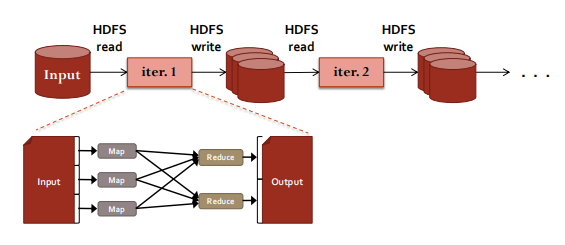

Il meccanismo di elaborazione di map-reduce è quello di prendere dati da un file in ambiente distribuito, applicare un tipo di operazione che ha una struttura fissa e poi scrivere i risultati su disco. 

Il problema che si va a creare è che per ogni `map-reduce` si va sempre a fare una scrittura su file, quindi si richiede una serie di scritture e poi letture su disco particolarmente gravose, più tutto un costo dovuto alla comunicazione tra i vari task nella fase di `shuffle` e `sort`.

L’idea è quindi utilizzare al massimo le memorie principali, cioè sostituire l’`HDD` con `SSD` per poi caricare i dati in memoria.

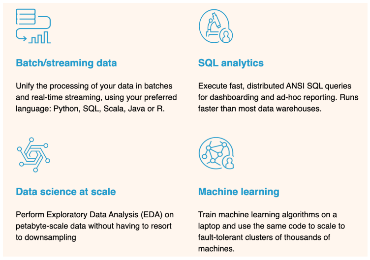

La soluzione `Spark` non è una versione modificata di `hadoop`, la quale si basa su questo meccanismo di gestione dati prevalente in memoria principale; sfrutta l’uso di un insieme di operatori molto più ricco rispetto al paradigma di map-reduce che consentono di costruire piani esecutivi molto articolati; è compatibile con le API di `hadoop-cluster` cioè può essere eseguito sopra `hadoop-cluster` attraverso `yarn`.

## Data sharing Improvements

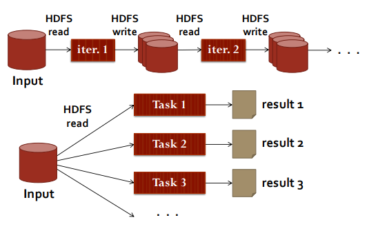

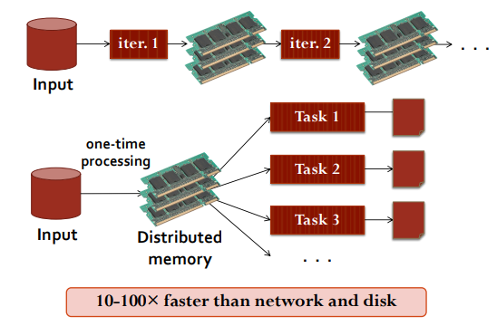

La differenza sostanziale è innanzitutto lo sfruttamento delle memorie principali il più possibile nelle varie iterazioni, poi fa uso di una struttura di dati `RDD` distribuita prevalentemente in memoria principale. Dopodiché opera similmente a quello che succede in `map-reduce` in cui si assegnano dei task ai nodi su cui opera (quindi sul cluster) prendendo dati dalla memoria principale e scriverle sempre in memoria principale.

Un grosso vantaggio è che se si va a prendere la singola iterazione non si è strettamente legato al meccanismo di `map-reduce` ma si ha un insieme ricco di operatori alla `map-reduce` che permette di definire piani di esecuzione che sono in sostanza degli alberi.

L’architettura di `spark` è mostrata in questa figura:

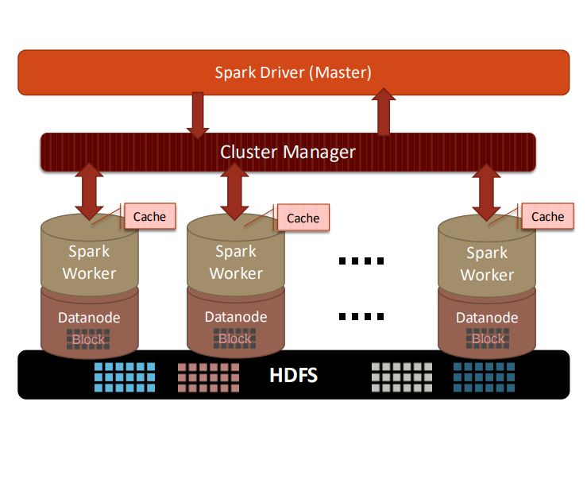

Su ciascun nodo viene lanciato un processo chiamato `spark-worker` che consente di applicare le operazioni sui dati che il nodo ha a disposizione attraverso un meccanismo di caching. Dopodiché è necessario un `cluster-manager` a cui chiedere la disponibilità dei nodi a disposizione sul cluster (yarn, etc..).

Tramite questo gestore di risorse c’è una componente master chiamata `spark-driver` che dato in input l’elaborazione del programmatore richiede risorse al `cluster-manager` per far girare il processo locale (`spark-worker`)

## Spark Programming Model

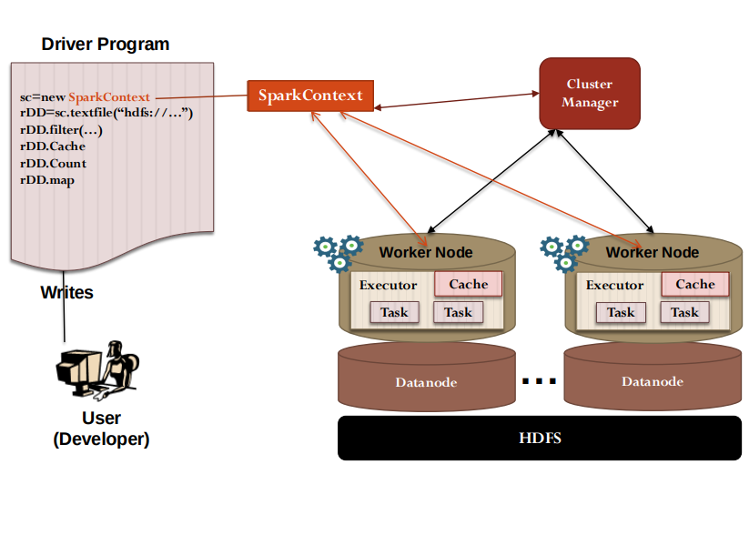

Le applicazioni vengono eseguite in gruppi di processi indipendenti nel cluster, coordinati dall’oggetto `sparkcontext` nel programma principale chiamato `driver-program`.

In sostanza è `sparkcontext` che richiede le risorse al `cluster-manager`. Ogni applicazione ottiene le risorse assegnate e il proprio processo di esecuzione rimane attivo per tutta la durata dell’applicazione ed esegue i task in più thread.

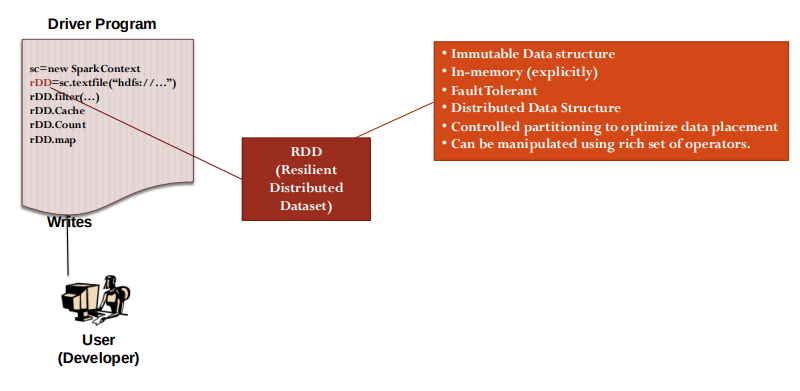

In particolare, una volta creato lo `spark-context` si costruisce una struttura di dati particolari chiamata `RDD`.

Si opera su questa struttura di dati per applicare i vari operatori.

`Resilient-Distributed-Dataset`=`RDD`

## Resilient Distributed Dataset - RDD

Il concetto principale di `apache-spark` è il `resilient-distributed-datasets` (RDDs), che è una collezione distribuita di oggetti che è prevalentemente in cache e può essere manipolata attraverso diversi operatori in parallelo (un po come avviene in map-reduce). Nel caso di guasti esiste un meccanismo per ricostruire i dati che si sono persi.

Esistono 2 tipologie di `RDD`, la più interessante è quella dove si riesce a costruire un `RDD` a partire da un file che sta su un file system distribuito (HDFS).

```python
# creazione di un dataset distribuito
distFile = sc.textFile("data.txt")

# è possibile addesso applicare le operazioni di dataset a distFile
distFile.map(lambda s: len(s)).reduce(lambda a, b: a + b)
```

## RDD operators

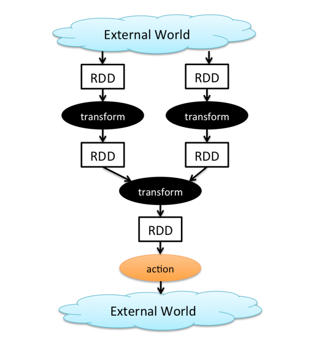

Il vantaggio rispetto a `map-reduce`, avendo a disposizione degli operatori si può costruire dei piani di esecuzione che non sono puramente iterativi e seriali ma possono essere essenzialmente rappresentati come dei `DAG` come grafi diretti aciclici.

Le operazioni prendono in input degli `RDD` e danno in output sempre degli `RDD`

Ci sono anche trasformazioni che consentono combinazioni di RDD (per esempio i join) cosa che in map reduce bisogna implementare a “mano” con map e con reduce

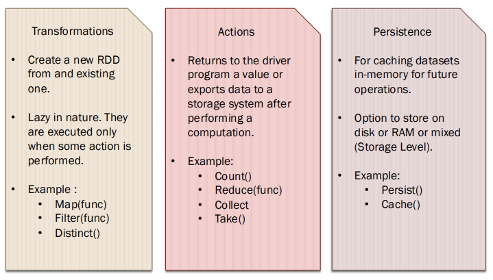

Per operare sui dati si usano 2 meccanismi che sono le `trasformations` che prendono un RDD e producono un RDD e poi le `actions` che prendono in input un RDD e producono dei valori, tipicamente questo tipo vengono applicate alla fine di una elaborazione complessa nel momento in cui si vuole restituire il risultato al programma invocante.

## Persistence operator

Le operazioni di `persistence` gestiscono in maniera esplicita la persistenza per esempio salvare su disco i risultati di una computazione intermedia. Il tipo di archiviazione è in memoria principale di default ma può essere modificato in base alle necessità.

## Transformations operator

Gli operatori di tipo `transformations` prendono `RDD` e restituiscono `RDD`. Sono `lazy` perchè non vengono eseguite immediatamente nel momento in cui vengono definite, in sostanza l’esecutore a runtime guarda tutte le trasformazioni che devono essere applicate e le lancia in maniera efficiente solamente quando trova un’azione.

Ci sono 2 tipi di trasformazione:

- `narrow`: questo tipo di trasformazione prendono una partizione RDD e producono un’altra partizione RDD (si dice partizione per l’esecuzione parallela)
- `wide`: questo tipo di trasformazione hanno in input più partizioni di RDD, da in output risultati ottenuti tramite `groupByKey` e `reduceByKey` quindi sempre una partizione RDD. Tutte le tuple che hanno la stessa chiave devono finire nella stessa partizione che viene processato dalla stessa task.

## Actions operator

Gli operatori di tipo `actions` prendono un `RDD` e producono tipicamente un valore, in queste actions è presente anche una reduce. Queste operazioni sono sincrone.

## Execution Plan

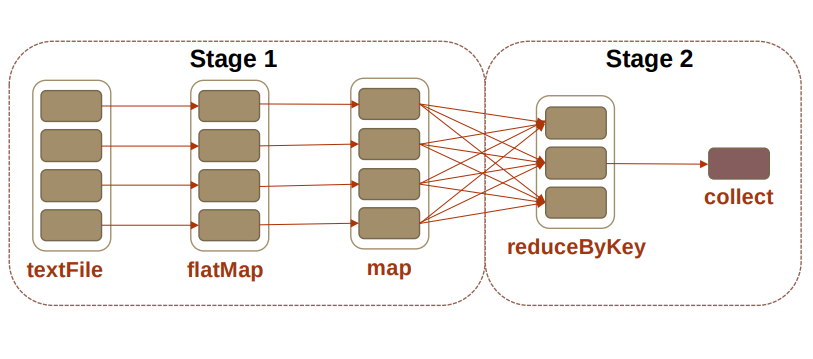

Gli `stages` sono sequenze di `RDDs` che non hanno degli `shuffle` in mezzo 

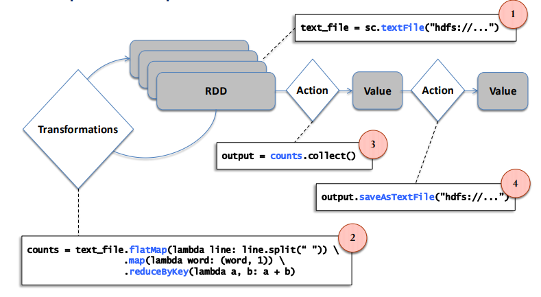

Concettualmente lo si può vedere in questo modo